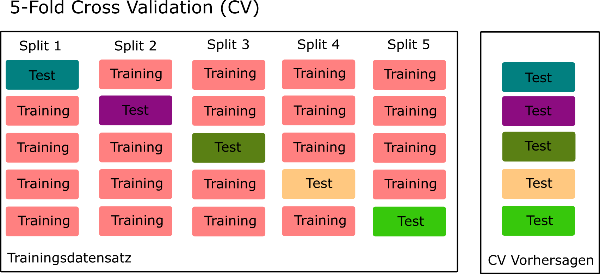
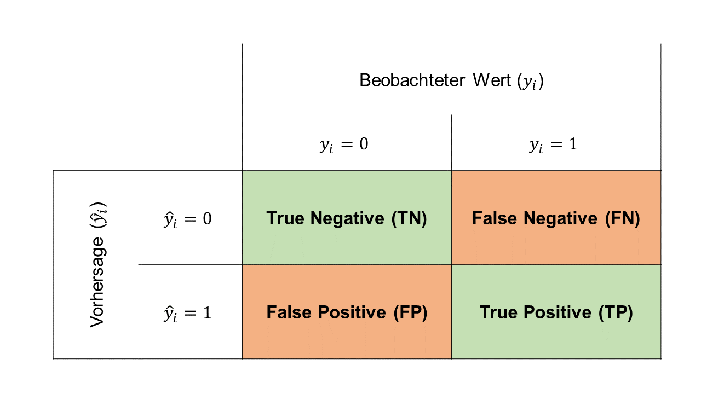
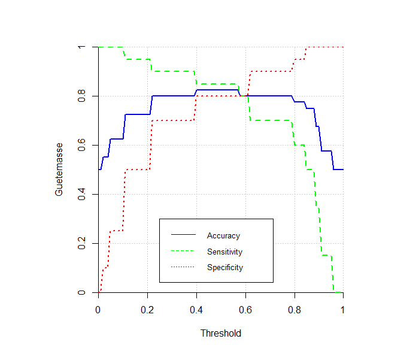
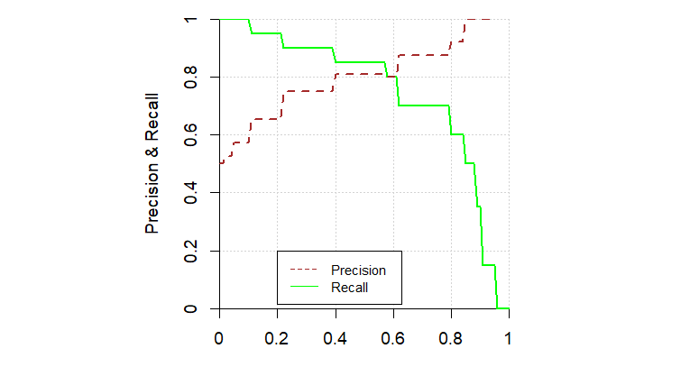

# Hyperparameter Tuning und Evaluation {#sec-eval}

In diesem Kapitel lernen wir zwei aus praktischer Sicht relevante Themen kennen. Wir beginnen damit, uns zu überlegen, wie wir die Hyperparameter eines Modells optimieren können. Dieser Prozess hat im ML einen spezifischen Namen, nämlich **Hyperparameter Tuning**. In diesem Zusammenhang werden wir auch kurz auf den Train-Test Split und Resampling Methoden eingehen. In einem zweiten Teil überlegen wir uns, wie die **Vorhersagegüte** von Modellen **evaluiert** wird. Dabei gehen wir kurz nochmal auf das Regressionsproblem ein und befassen uns dann detaillierter mit dem Klassifikationsproblem.

## Hyperparameter Tuning

Um den Hyperparameter Tuning Prozess zu illustrieren, verwende ich wiederum das konstruierte Regressionsbeispiel, das ich bereits im [Abschnitt @sec-bias-var] und im [Abschnitt @sec-reg-examp] verwendet habe.

Wir generieren hier aber nicht nur 50 Beobachtungen, sondern $n = 200$ und simulieren danach eine Situation, in der zuerst ein **Train-Test Split** gemacht werden muss.

```{r output=FALSE}
# Laden der R-Packages
library(tidyverse)
library(tidymodels)

# Seed für Reproduzierbarkeit
set.seed(123)

# Wir definieren die Anzahl Beobachtungen, die Anzahl Input-Var.
# und die Standardabweichung des Fehlerterms.
n <- 200
p <- 50
sd <- 0.2

# Nun simulieren wir die Input-Variablenwerte aus einer Normalverteilung.
X <- matrix(rnorm(n * p), nrow = n)

# Generierung der y-Werte mit normalverteiltem Noise.
y <- 2 + X[, 1] + rnorm(n, 0, sd)

# Wir fassen die Input-Variablen und den Output zu einem Dataframe zusammen.
data <- as.data.frame(X)
data$y <- y
```

Die Problemstellung sieht nun wie folgt aus: wir haben einen Datensatz mit $n = 200$ Beobachtungen und sollen damit ein lineares Regressionsmodell schätzen. Weil wir viele Input-Variablen ($p=50$) haben, macht es Sinn, hier Regularisierung zu verwenden. Dabei müssen wir uns (**i**) für die Art von Regularisierung (Ridge oder LASSO) und (**ii**) für den optimalen Hyperparameter $\lambda$ entscheiden. Wir haben also zwei Hyperparameter, die es zu optimieren gilt.

::: {.callout-note}
## Was sind Hyperparameter?

Ein Hyperparameter ist kein eigentlicher Modellparameter, denn er wird nicht während des Modelltrainings (Fitting) gelernt, sondern muss vor der Trainingsphase gesetzt werden. Mit Resampling-Methoden (siehe weiter unten) versuchen wir, einen möglichst optimalen Wert für den Hyperparameter zu finden.

Beispiel: Bei der regularisierten Regression (Ridge und LASSO) haben wir die Modellparameter $w_0, w_1, \dots, w_p$. Zusätzlich haben wir einen Hyperparameter $\lambda$, der bestimmt, wie stark regularisiert wird. Während $\lambda$ **vor dem Training** des Modells gesetzt werden muss, werden die Modellparameter **während des Trainings** gelernt bzw. optimiert.
:::

### Train-Test Split

In einem typischen ML-Problem legen wir uns in der Anfangsphase des Projekts einen Teil der Daten zur Seite (**Testdaten**). Wir werden die beiseite gelegten Daten ganz am Schluss verwenden, um die Performance unseres finalen Modells zu messen. Es ist ganz wichtig, dass wir diese Daten vor der finalen Performance-Messung nicht "anfassen", auch nicht für explorative Analysen. Warum nicht? Die Performance auf den Testdaten soll uns als "unvoreingenommene" Schätzung des Fehlers dienen, der unser Modell in einem produktiven System machen wird. Wenn wir Einsichten aus dem Testdatensatz in unser Modell einfliessen lassen (sogenanntes **Data Snooping**), dann wird der Fehler auf dem Testset den tatsächlichen Fehler unterschätzen.

Die restlichen Daten (**Trainingsdaten**) verwenden wir, um die Daten explorativ zu erforschen, um bessere Features zu entwickeln und um verschiedene Modelle darauf zu trainieren.

Wir führen nun also einen **zufälligen** Train-Test Split durch. Wichtig ist, dass wir vorher einen Seed setzen, so dass wir denselben zufälligen Split immer wieder reproduzieren können. Für den Split verwenden wir die Funktion `initial_split()` aus `tidymodels`. Mit dem Argument `prop = 3/4` bestimmen wir, dass der Trainingsdatensatz 75% der Daten enthalten soll, während die restlichen 25% der Daten in den Testdatensatz fliessen. Der effektive Split wird dann mit den Funktionen `training()` und `testing()` vollzogen.

```{r}
# Seed, um den Train-Test Split reproduzierbar zu machen
set.seed(42)

# Split (75% Training, 25% Test)
train_test_split <- initial_split(data, prop = 3/4)

train <- training(train_test_split)
test  <- testing(train_test_split)

# Kurzer Test (Resultate sollte 0.75 sein)
nrow(train) / nrow(data)
```

Für den Fall eines Klassifikationsproblems enthält die Funktion `initial_split()` ein weiteres Argument `strata`, das uns erlaubt einen **stratifizierten Split** zu machen. Wenn wir beispielsweise betrügerische Kreditkartentransaktionen vorhersagen wollen und unsere Daten nur 10% betrügerische Transaktionen enthalten, dann wollen wir mit einem stratifizierten Split sicherstellen, dass sowohl der Trainings- als auch der Testdatensatz nach dem Split ein Verhältnis von 90% zu 10% aufweist. Ist $y$ ein (R-)Faktor, dann wird dies durch `strata = y` sichergestellt.

### Resampling

Das Thema **Resampling** ist enorm wichtig im Machine Learning. Wir verwenden Resampling Methoden für zwei Aspekte während der Modellierung:

* Resampling hilft uns, das Hyperparameter Tuning durchzuführen. Wir werden im Rest dieses Unterkapitels sehen, wie das genau funktioniert.
* Mithilfe des Resamplings können wir uns aber auch **zwischen verschiedenen Modellen entscheiden**. Wenn wir zum Beispiel ein logistisches Regressionsmodell und ein Naive Bayes Modell trainiert haben, dann können wir schauen, welches der beiden Modelle die bessere (Resampling-)Performance aufweist, ohne dass wir bereits auf das Testset zurückgreifen müssen.

Die bekannteste Resampling-Methode ist **K-Fold Cross-Validation**. Die Funktionsweise dieser Methode ist in folgenden Schritten beschrieben:

1. Als erstes teilen wir den Trainingsdatensatz in $K$ (z.B. $K=5$) gleich grosse Teile (Folds) auf.
2. Dann legen wir den ersten Fold zur Seite und trainieren das Modell auf den restlichen 4 Folds.
3. Danach verwenden wir das in Schritt 2 trainierte Modell, um Vorhersagen für die Beobachtungen im ersten (Test-)Fold zu rechnen, der ja nicht für das Training verwendet wurde. Wir vergleichen die Vorhersagen mit den wahren Werten mithilfe eines Modellgütemasses (z.B. RMSE) und speichern den entsprechenden RMSE Wert.
4. Wir wiederholen die Schritte 2. und 3. und legen jeweils einen anderen Fold zur Seite für die Evaluation des Modells.
5. Wir haben am Schluss $K$ RMSE-Werte. Diese $K$ Werte können wir mitteln, um die Vorhersagegüte eines Modells zu schätzen. Mit den $K$ RMSE-Werten können wir auch eine Varianz schätzen, um die Unsicherheit unserer Schätzung zu beziffern.

Folgende Abbildung stellt 5-Fold Cross-Validation grafisch dar:

{width=80% #fig-crossval}

Sie sehen vielleicht jetzt auch, warum wir von *Resampling* sprechen. Wir samplen nämlich mehrere kleine Validierungsdatensätze (Folds) aus dem Trainingsdatensatz, um eine Schätzung für die Modellgüte zu erhalten.

Doch wie können wir nun damit den optimalen Hyperparameter (z.B. $\lambda$) finden? Wir führen **für jeden möglichen Wert**, den der Hyperparameter annehmen kann, die K-Fold Cross-Validation durch und kriegen dementsprechend für jeden möglichen Hyperparameterwert eine **Schätzung der Modellgüte**. Am Schluss wählen wir ganz einfach den Hyperparameterwert, der zur besten (geschätzten) Modellgüte führt! Wenn wir den optimalen Hyperparameterwert gefunden haben, dann trainieren wir das Modell ein letztes Mal auf dem ganzen Trainingsdatensatz, d.h. ohne Cross-Validation (mit dem optimalen Hyperparameterwert).

Mit `tidymodels` können wir die Folds für 5-Fold Cross-Validation wie folgt vorbereiten. Mit dem Argument `repeats` könnten wir das Verfahren mehrmals wiederholen, um genauere Schätzungen zu erhalten. Das Objekt `folds` wird weiter unten dem Trainingsprozess übergeben werden.

```{r}
# Seed für Reproduzierbarkeit
set.seed(15)

# 5-Fold CV
folds <- vfold_cv(train, v = 5, repeats = 1)
```

#### Validation Set

Wenn wir einen besonders grossen Datensatz haben, dann können wir auch einfach ein **Validation Set** bilden anstatt K-Fold Cross-Validation durchzuführen. D.h. wir splitten den ursprünglichen Datensatz in einen Trainings-, Validierungs- und einen Testdatensatz. Mit `tidymodels` würden wir das wie folgt machen:

```{r eval = FALSE}
# Seed, um den Train-Validation-Test Split reproduzierbar zu machen
set.seed(42)

# Split (60% Training, 20% Validierung, 20% Test)
data_split <- initial_validation_split(data, prop = c(0.6, 0.2))

train <- training(data_split)
valid <- validation(data_split)
test  <- testing(data_split)
```

Der Vorteil von einem Validation Set im Vergleich zu K-Fold Cross-Validation ist, dass es weniger rechenintensiv ist. Warum? Wenn wir 5 mögliche Hyperparameterwerte haben, dann müssen wir im Falle eines Validation Sets nur 5 Mal ein Modell rechnen und evaluieren. 

#### Frage {.unnumbered}

Wie viele Modelle müssen gerechnet und evaluiert werden im Fall von 5-Fold Cross-Validation mit 5 möglichen Hyperparameterwerten?

a. 10 Modelle
b. 25 Modelle
c. 1 Modell
d. 5 Modelle

::: {.callout-tip collapse="true"}
## Lösung

Die korrekte Antwort ist **b**. Für jeden der 5 möglichen Hyperparameterwerte wird 5-Fold Cross-Validation durchgeführt. Daraus ergibt sich, dass insgesamt $5\cdot 5=25$ Modelle gerechnet werden.
:::

**Wichtiges Takeaway**: wir evaluieren ein Modell nie einfach nur auf dem Trainingsdatensatz. Wir wenden immer eine Form von Resampling an, um die Modellgüte zu schätzen und/oder um die Hyperparameter zu optimieren. Die Vorhersagegüte auf dem Trainingsdatensatz ist oft ein zu optimistisches Resultat und sollte nie als Entscheidungsgrundlage verwendet werden.

### Tuning

Nun schauen wir uns an, wie das Hyperparameter Tuning für unser Beispiel funktioniert. In einem ersten Schritt spezifizieren wir hier nun das Modell, das wir rechnen wollen, nämlich das regularisierte lineare Regressionsmodell.

Wichtig sind im folgenden Code Block die Argumente `penalty = tune()` und `mixture = tune()`. Diese legen fest, dass wir die beiden Hyperparameter `penalty` (entspricht $\lambda$) und `mixture` (bestimmt, ob wir ein Ridge oder LASSO Modell wählen) tunen wollen.

```{r}
# Modellspezifikation für lineares Modell mit Regularisierung
lm_mod <-
  linear_reg(penalty = tune(), mixture = tune()) |> 
  set_engine("glmnet")
```

Nun setzen wir einen `tidymodels`-Worklow auf und fügen das oben spezifizierte Modell mit `add_model(lm_mod)` dem Workflow hinzu. Ausserdem spezifizieren wir das Modell in `add_formula()`:

```{r}
# Workflow aufsetzen
lm_wflow <-
  workflow() |> 
  add_model(lm_mod) |> 
  add_formula(formula = y ~ .)
```

Nun wird es spannend: wir tunen unsere zwei Hyperparameter. Mit `expand.grid()` erstellen wir einen Grid von möglichen Werten für `penalty` und `mixture`:

* Für `penalty` testen wir die Werte ${0.00001, 0.0001, 0.001, 0.01, 0.1, 1, 10, 100, 1000}$
* Für `mixture` testen wir die Werte 0 (entspricht Ridge) und 1 (entspricht LASSO).

#### Frage {.unnumbered}

Wie viele Hyperparameter-Kombinationen testen wir hier?

a. 9
b. 2
c. 18
d. 90

::: {.callout-tip collapse="true"}
## Lösung

Die korrekte Antwort ist **c**. Für jeden der 9 möglichen Werte für $\lambda$ testen wir, ob Ridge oder LASSO besser ist. Wir haben also insgesamt $9\cdot 2=18$ Kombinationen.
:::

Die Funktion `tune_grid()` führt das Tuning durch. Wir übergeben der Funktion das Objekt `folds` von oben sowie den Grid mit möglichen Hyperparameterwerten.

Mit `control = control_grid(save_pred = TRUE, save_workflow = TRUE)` sagen wir der Funktion, dass alle Resampling-Resultate (d.h. die Vorhersagen auf den Folds) sowie auch die Workflows gespeichert werden sollen. 

Schliesslich definieren wir die zu verwendenden Modellgütemasse, nämlich den RMSE und den MAE (siehe [Kapitel @sec-linreg]).

```{r}
# Grid mit möglichen Hyperparameter Werten
lm_reg_grid <- expand.grid(penalty = 10^seq(-5, 3, by = 1), mixture = c(0, 1))

# Tuning / Fitting
lm_res <-
  lm_wflow |> 
  tune_grid(resamples = folds,
            grid = lm_reg_grid,
            control = control_grid(save_pred = TRUE, save_workflow = TRUE),
            metrics = metric_set(rmse, mae))
```

Folgender Code erlaubt uns, die Resultate des Tunings (hier nur die RMSE-Werte) anzuschauen:

```{r}
# Resultate des Tunings
lm_res |> 
  collect_metrics() |> 
  filter(.metric == "rmse") |> 
  arrange(mean)
```

Wir sehe aus obigem Output, dass $\lambda = 0.01$ und `mixture = 1` (also LASSO) den kleinsten durchschnittlichen RMSE-Wert erzielen (0.208). Es handelt sich hierbei um einen über die 5 (Test-)Folds gemittelten RMSE-Wert von Modellen mit dieser optimalen Hyperparameterkombination.

Am besten plotten wir die Resultate doch auch gleich:

```{r}
# Plot der Resultate
lm_res |> 
  collect_metrics()  |> 
  ggplot(aes(x = penalty, y = mean, color = .metric, linetype = factor(mixture))) +
  geom_point() +
  geom_line() +
  labs(x = "Penalty", y = "Modellgüte") +
  scale_x_log10() +
  theme_bw()
```

Wir sehen anhand der Kurven, dass alle Modelle bis zu einem Wert von $\lambda = 0.1$ ähnlich gut sind. Grössere Werte des Regularisierungsparameters führen dann aber sofort zu einer schlechteren Performance.

Mit der Funktion `select_best()` können wir nun automatisch das beste Modell aus den Tuning Resultaten auswählen.

```{r}
# Wir wählen das beste Modell
lm_best <-
  lm_res |> 
  select_best(metric = "rmse")

lm_best
```

### Finaler Fit

Bis hierhin haben wir die Modelle immer nur auf 4 von 5 Folds gerechnet. Nun wollen wir ein finales Modell mit den optimalen Werten für die Hyperparameter auf dem ganzen Trainingsdatensatz rechnen. `tidymodels` macht diesen Schritt sehr einfach:

```{r}
# Finales Modell fitten
last_lm_fit <- fit_best(lm_res)
```

Schauen wir uns doch noch kurz die trainierten Parameter an:

```{r message=FALSE}
# Parameter Finaler Fit
last_lm_fit %>%
  extract_fit_parsnip() |> 
  tidy() |> 
  print(n = 5)
```

Wie erwartet sind die Parameterwerte abgesehen von $w_0$ und $w_1$ sehr klein oder sogar genau 0.

## Evaluation

Im **Regressionsfall** haben wir bereits gesehen, dass die Modellgüte meist mithilfe des RMSE oder des MAE evaluiert wird. Darum gehen wir im ersten Abschnitt nur noch kurz darauf ein, wie nun mit dem obigen finalen Modell die Testset-Performance gerechnet werden kann.

Im **Klassifikationsfall** ist die Evaluation der Modellgüte etwas komplexer, weshalb wir uns im zweiten Abschnitt ausführlich damit befassen.

### Regressionsproblem

Um unser Regressionsbeispiel von oben abzuschliessen, rechnen wir nun hier noch die Vorhersagegüte für die Beobachtungen im Testset aus. Mit `augment()` wenden wir in einem ersten Schritt das finale Modell auf die Testdaten an. Danach verwenden wir die Funktion `rmse()` und `mae()`, um die beiden bekannten Gütemasse für Regressionsprobleme zu rechnen.

```{r}
# Vorhersagen auf Testset rechnen
test_lm <- augment(last_lm_fit, test)

# RMSE auf Testset
test_lm |> rmse(truth = y, estimate = .pred)
```

Und hier noch der MAE:

```{r}
# MAE auf Testset
test_lm |> mae(truth = y, estimate = .pred)
```

Diese beiden Werte (berechnet auf dem Testset) sind für uns nun also ein Indikator dafür, welchen Fehler wir von diesem Modell in einem produktiven System erwarten würden.

### Klassifikationsproblem

<!-- - Multi-Class Problem -->
<!-- - Imbalance -->
<!-- - Was passiert mit anderem Threshold -->

Dieser gesamte Abschnitt bezieht sich auf das **binäre** Klassifikationsproblem. Wir werden uns die Evaluation für den Fall von mehrklassigen Klassifikationsproblemen zu einem späteren Zeitpunkt anschauen.

Die allermeisten Klassifikationsmodelle geben uns für eine Beobachtung der Input-Variablen $\mathbf{x}_i$ die Wahrscheinlichkeit, dass $y_i = 1$, also $p(y_i = 1 \mid \mathbf{x}_i)$ zurück. Doch wie kommen wir eigentlich von diesen Wahrscheinlichkeiten zu einer richtigen Vorhersage? Wir müssen zuerst einen **Threshold** wählen. Im einfachsten Fall ist der Threshold **0.5** (also 50%) und wir erstellen die Vorhersagen wie folgt:

* Wenn $p(y_i = 1 \mid \mathbf{x}_i) \geq 0.5$, dann ist unsere Vorhersage $\hat{y}_i = 1$.
* Wenn $p(y_i = 1 \mid \mathbf{x}_i) < 0.5$, dann ist unsere Vorhersage $\hat{y}_i = 0$.

Oft werden die Vorhersagen $\hat{y}_i$ *hard predictions* genannt, während die vorhergesagten Wahrscheinlichkeiten $p(y_i = 1 \mid \mathbf{x}_i)$ als *soft predictions* bezeichnet werden. Die Modellgütemasse, die wir hier kennen lernen werden, basieren entweder auf den *hard* oder den *soft predictions*.

Im folgenden Datensatz, genannt `df`, haben wir 40 Beobachtungen. Für jede Beobachtung verfügen wir über den wahren Wert der Zielvariable (`y`) sowie die vorhergesagte Wahrscheinlichkeit eines Klassifikationsmodells (`prob`):

```{r echo=FALSE}
# Ground Truth
y <- c(1, 1, 1, 1, 1, 1, 1, 1, 1, 1, 1, 1, 0, 1, 1, 0, 1, 1, 0, 0, 1, 1, 0, 0, 1, 0, 0, 0, 0, 1, 0, 0, 0, 0, 0, 0, 0, 0, 0, 0)
# Predicted Prob.
prob <- c(0.95721924, 0.95721924, 0.95721924, 0.90284298, 0.90284298, 0.90284298, 0.90284298, 0.88629832, 0.88629832, 0.88629832, 0.84579393, 0.84579393, 0.84579393, 0.79421077, 0.79421077, 0.79421077, 0.61580323, 0.61580323, 0.61580323, 0.61580323, 0.57895423, 0.39964340, 0.39964340, 0.39964340, 0.21658577, 0.21658577, 0.21658577, 0.21658577, 0.21658577, 0.10299336, 0.10299336, 0.10299336, 0.10299336, 0.10299336, 0.10299336, 0.04551533, 0.04551533, 0.04551533, 0.01941990, 0.01941990)
# Dataframe
df <- data.frame(y = y, prob = prob)
# Print dataframe
df
```

Wir werden diesen Dataframe nachfolgend zur Illustration der verschiedenen Modellgütemasse verwenden.

#### Accuracy

Das einfachste Modellgütemass für das Klassifikationsproblem ist die **Accuracy**. Bei der Accuracy zählen wir die Anzahl korrekt gemachter Vorhersagen und dividieren durch die Anzahl Beobachtungen. Wir verwenden hier also die *hard predictions*, weshalb diese in einem ersten Schritt mithilfe eines Threshold-Werts (hier 0.5) festgelegt werden müssen (Variable `pred`).

```{r}
# Threshold
thres <- 0.5

# Vorhersage basierend auf Threshold
eval <- df |> 
  mutate(y = factor(y), pred = factor(ifelse(prob >= thres, 1, 0)))

# Accuracy mit Base R
sum(eval$y == eval$pred) / nrow(eval)

# Accuracy via tidymodels
accuracy(eval, truth = y, estimate = pred)
```

Wir sehen, dass die Accuracy hier 0.825 (oder 82.5%) beträgt. Wichtig ist, dass Sie bei Verwendung der Funktion `accuracy()` aus `tidymodels` sowohl die Zielvariable als auch die Vorhersagen vorher in einen Faktor transformieren.

#### Konfusionsmatrix

Sobald wir mithilfe eines Thresholds *hard predictions* berechnet haben, können wir die Klassifikationsresultate mit einer **Konfusionsmatrix** darstellen. Die generelle Form der Konfusionsmatrix sieht wie folgt aus:

{width=80% #fig-confusionmat}

Die vier Zellen der Matrix repräsentieren die vier möglichen Outcomes:

* **True Negative (TN)**: korrekte Vorhersage einer Beobachtung mit $y_i = 0$. Beispiel: Spam Filter klassifiziert eine Ham Email *korrekt* als Ham (nicht-Spam).
* **True Positive (TP)**: korrekte Vorhersage einer Beobachtung mit $y_i = 1$. Beispiel: Spam Filter klassifiziert Spam Email *korrekt* als Spam.
* **False Negative (FN)**: inkorrekte Vorhersage einer Beobachtung mit $y_i = 1$. Beispiel: Spam Filter klassifiziert eine Spam Email *inkorrekt* als Ham (nicht-Spam).
* **False Positive (FP)**: inkorrekte Vorhersage einer Beobachtung mit $y_i = 0$. Beispiel: Spam Filter klassifiziert eine Ham Email *inkorrekt* als Spam.

#### Frage {.unnumbered}

Überlegen Sie sich kurz, welcher Fehler im Beispiel des Spam Filters schlimmer ist:

* False Negative: der Filter klassifiziert eine Spam Email als Ham.
* False Positive: der Filter klassifiziert eine Ham Email als Spam.

::: {.callout-tip collapse="true"}
## Lösung

Es gibt hier keine allgemein gültige Lösung, denn es ist auch etwas Ansichtssache, welcher Fehler schlimmer ist. Persönlich wäre mir in diesem Fall die Vermeidung von False Positives (FP) wichtiger, denn ich möchte verhindern, dass Ham Emails im Spamordner "verschwinden" und ich so unter Umständen eine wichtige Email verpasse.
:::

Mit der Funktion `table()` aus Base `R` können wir uns die Konfusionsmatrix in `R` ausgeben lassen. Damit wir genau die Anordnung wie in obiger Abbildung kriegen, übergeben wir der Funktion zuerst die Vorhersagen `eval$pred` und erst dann die wahren Werte der Zielvariable `eval$y`. Mit `dnn = c("pred", "true")` beschriften wir die Dimensionen der Tabelle.

```{r}
# Konfusionsmatrix (Base R)
table(eval$pred, eval$y, dnn = c("pred", "true"))
```

Wir sehen, dass unser Modell (mit einem Threshold von 0.5) **4 False Positive** und **3 False Negative** Fehler macht.

#### Sensitivity und Specificity

Wie oben gesehen kriegen wir mit der Accuracy den Anteil korrekter Vorhersagen. Oft möchte man die Klassifikationsresultate etwas genauer aufsplitten. Dazu werden die Gütemasse **Sensitivity** und **Specificity** verwendet:

* Die **Sensitivity** ist der Anteil korrekter Vorhersagen unter allen *positiven* Beobachtungen. Beispiel: was ist der Anteil korrekt als Spam klassifizierter Emails gemessen an allen Spam Emails? Die Formel ist wie folgt:

  $$
  \text{Sensitivity} = \frac{TP}{(TP + FN)}
  $$
Dieses Mass fokussiert also auf die rechte Spalte der Konfusionsmatrix. Die Sensitivity wird manchmal auch *True Positive Rate* oder *Recall* genannt.
* Die **Specificity** ist der Anteil korrekter Vorhersagen unter allen *negativen* Beobachtungen. Beispiel: was ist der Anteil korrekt als Ham klassifizierter Emails gemessen an allen Ham Emails? Die Formel ist wie folgt:

  $$
  \text{Specificity} = \frac{TN}{(TN + FP)}
  $$
Dieses Mass fokussiert dementsprechend auf die linke Spalte der Konfusionsmatrix. Die Specificity wird manchmal auch *True Negative Rate* genannt.

Im folgenden Code Block rechnen wir die Sensitivity und Specificity mit `R`. Wichtig: das Argument `event_level = "second"` in den Funktionen `sens()` und `spec()` definiert, dass das zweite Faktorlevel die Kategorie ist, die uns hauptsächlich interessiert (also $y_i=1$).

```{r}
# Sensitivity (tidymodels)
eval |> 
  yardstick::sens(truth = y, estimate = pred, event_level = "second")

# Specificity (tidymodels)
eval |> 
  yardstick::spec(truth = y, estimate = pred, event_level = "second")
```

#### Frage {.unnumbered}

Verwenden Sie folgenden Code, um die hier verwendeten Daten bei Ihnen lokal zu replizieren.

```{r eval=FALSE}
# Wahre Outputwerte
y <- c(1, 1, 1, 1, 1, 1, 1, 1, 1, 1, 
       1, 1, 0, 1, 1, 0, 1, 1, 0, 0, 
       1, 1, 0, 0, 1, 0, 0, 0, 0, 1, 
       0, 0, 0, 0, 0, 0, 0, 0, 0, 0)

# Vorhergesagte Wahrscheinlichkeiten
prob <- c(0.95721924, 0.95721924, 0.95721924, 0.90284298, 0.90284298, 
          0.90284298, 0.90284298, 0.88629832, 0.88629832, 0.88629832, 
          0.84579393, 0.84579393, 0.84579393, 0.79421077, 0.79421077, 
          0.79421077, 0.61580323, 0.61580323, 0.61580323, 0.61580323, 
          0.57895423, 0.39964340, 0.39964340, 0.39964340, 0.21658577, 
          0.21658577, 0.21658577, 0.21658577, 0.21658577, 0.10299336, 
          0.10299336, 0.10299336, 0.10299336, 0.10299336, 0.10299336, 
          0.04551533, 0.04551533, 0.04551533, 0.01941990, 0.01941990)

# Zu einem Dataframe zusammenfassen
df <- data.frame(y = y, prob = prob)
```

Kopieren Sie danach die obigen Code Blocks zu Accuracy, Konfusionsmatrix, Sensitivity und Specificity in ein lokals Skript und wählen Sie unterschiedliche Werte für den Threshold (z.B. 0.3 und 0.8). Was passiert mit der Accuracy, der Sensitivity und der Specificity?

Sie haben vielleicht anhand der obigen Aufgabe feststellen können, dass sich die Modellgütemasse verändern, wenn wir den Threshold verändern. Grundsätzlich gilt folgendes:

* Die Accuracy ist **maximal** für einen Threshold von **0.5**.
* Wenn wir den **Threshold senken**, dann **erhöht** sich die **Sensitivity** (allerdings auf Kosten der Specificity). Warum? Die Senkung des Thresholds führt einerseits zu mehr True Positives, aber auch zu mehr falschen Vorhersagen von $\hat{y}_i=1$, also mehr False Positives.
* Wenn wir den **Threshold erhöhen**, dann **erhöht** sich die **Specificity** (allerdings auf Kosten der Sensitivity). Warum? Die Erhöhung des Thresholds führt einerseits zu mehr True Negatives, aber auch zu mehr False Negatives. "You can't have it both ways!"

Folgende Abbildung zeigt die Accuracy, die Sensitivity und die Specificity für viele verschiedene Thresholds zwischen 0 und 1 (für unser Beispiel). Für reale Datenbeispiele sind die Kurven typischerweise glätter (engl. *smoother*).

{width=75% #fig-eval-meas}

::: {.callout-note}
## Doch wie machen wir nun da eine gute Entscheidung bezüglich des Thresholds?

In praktisch jedem Praxisproblem ist entweder die Sensitivity oder die Specificity wichtiger. Um zu entscheiden, was wichtiger ist, braucht es manchmal etwas Domain Knowledge. Wir wählen den Threshold dann so, dass wir mit dem **Tradeoff** zwischen Sensitivity und Specificity leben können.
:::

Hier ein paar Beispiele:

* Wir haben oben bereits gesehen, dass es (zumindest mir) beim Spam Filter wichtiger ist, dass ich möglichst **keinen False Positive Fehler** mache (d.h. Ham verschwindet im Spamordner). Hier ist mir also die **Specificity** wichtiger. Darum wähle ich tendenziell einen Threshold grösser als 0.5.
* Bei der Vorhersage einer Krankheit ($y_i = 1$) ist der **False Negative Fehler** wesentlich schlimmer (kranke Person wird als gesund klassifiziert). Hier ist mir also die **Sensitivity** wichtiger. Darum wähle ich tendenziell einen Threshold kleiner als 0.5 und "gehe auf Nummer sicher".

#### Frage {.unnumbered}

Überlegt euch kurz anhand folgender Beispiele, welcher Fehler schlimmer ist und wie ihr euch dementsprechend bezüglich Threshold entscheiden würdet.

* Eine Bank möchte mit einem Modell die Zahlungsfähigkeit von Kundinnen und Kunden vorhersagen.
* Die Polizei möchte mit einem Modell vorhersagen, ob eine Person in den nächsten 6 Monaten eine kriminelle Tat begeht.

::: {.callout-tip collapse="true"}
## Lösung

Auch hier sind meine Antworten subjektiv gefärbt:

* Aus Sicht der Bank gilt es zu verhindern, dass jemand der effektiv zahlungsunfähig wird ($y_i = 1$) als nicht zahlungsunfähig vorhergesagt wird ($\hat{y}_i = 0$). Es gilt also False Negative Fehler zu verhindern. Dementsprechend würde ich einen Threshold < 0.5 wählen, um eine möglichst hohe Sensitivity zu erreichen. Diese Strategie hat aber einen Nachteil: die vielen False Positives, die so entstehen, müssen eventuell von Mitarbeitenden manuell überprüft werden, was zu viel Aufwand führen kann.
* Grundsätzlich möchte die Polizei hier ebenfalls False Negatives verhindern, so dass möglichst niemand, der straffällig wird ($y_i=1$) von unserem Modell mit $\hat{y}_i=0$ vorhergesagt wird. Aus gesellschaftlicher Sicht sind jedoch auch False Positives unerwünscht, denn das heisst, dass Unschuldige als straffällig vorhergesagt werden.
:::

#### ROC Kurve

Die **ROC Kurve**, das bekannteste Konzept zur Messung der Klassifikationsgüte, wurde entwickelt, weil es unbefriedigend ist, dass die Klassifikationsgüte (z.B. Accuracy, Sensitivity oder Specificity) vom gewählten Threshold abhängt. Die ROC Kurve wurde ursprünglich in der Kommunikationstheorie entwickelt und ROC steht für *receiver operating characteristic*.

Jeder Punkt auf der ROC Kurve zeigt den Wert der Sensitivity und der Specificity für einen bestimmten Threshold, wobei der **Threshold nicht explizit in der Grafik dargestellt** wird. Ihr könnt es euch folgendermassen vorstellen:

1. Für jeden möglichen Threshold, z.B. $\{0, 0.01, 0.02, 0.03, \ldots, 0.98, 0.99, 1.0\}$, wird sowohl die Sensitivity als auch die Specificity berechnet.
2. Dann sortieren wir die Sensitivity-Specificity Paare nach aufsteigender Sensitivity.
3. Zum Schluss plotten wir die sortierten Punkte als Kurve. Damit der Plot besser interpretierbar ist, plotten wir auf der x-Achse $1 - \text{Specificity}$, was nichts anderes als die *False Positive Rate* ist.

Hier der `tidymodels` Code dazu:

```{r, out.width="60%"}
# y in einen Faktor umwandeln
eval <- df |> 
  mutate(y = factor(y))

# Werte für die ROC Kurve
roc_curve(eval, truth = y, prob, event_level = "second")

# ROC Kurve
autoplot(roc_curve(eval, truth = y, prob, event_level = "second"))
```

**Zentrale Punkte** für die Interpretation von ROC Kurven:

* Hat ein Modell eine ROC Kurve, die durch den Punkt ganz links oben geht, dann haben wir ein perfektes Modell gefunden. Warum? Für dieses Modell gibt es einen Threshold, mit dem sowohl die Sensitivity als auch die Specificity 1 sind (Achtung: wenn die Specificity 1 ist, dann ist $1 - \text{Specificity} = 0$). Das Modell macht also keine Vorhersagefehler!
* Die gestrichelte Diagonale entspricht einem Modell, dessen Vorhersagen nicht besser als ein Münzwurf sind. Unser Modell sollte sich also immer klar von der Diagonalen abheben, nur dann hat es wirklich einen Nutzen.
* Wir können die ROC Kurve auch mit einer einzigen Zahl zusammenfassen, nämlich der Fläche unter der ROC Kurve. Man nennt dieses Mass **ROC AUC** (**A**rea **U**nder **C**urve). Wenn die ROC Kurve durch den Punkt links oben geht, dann ist ROC AUC 1.0 (perfektes Modell). Wenn unser Modell aber nicht besser als ein Münzwurf performt, dann ist ROC AUC ungefähr 0.5 (Modell ab in den Kübel).
* Die ROC Kurve eignet sich gut, um Modelle zu vergleichen. Warum? Verschiedene Modelle haben unterschiedliche Thresholds mit denen sie am besten performen. Die ROC Kurven bzw. ROC AUC erlauben einen direkten Vergleich von Modellen, da der Effekt des Thresholds nicht mehr reinspielt, weil alle möglichen Thresholds berücksichtigt werden.

#### Imbalance

Es gibt beim Klassifikationsproblem eine grosse Herausforderung, welche in der Praxis oft auftritt. Nämlich das Problem einer **Imbalance** (Unausgewogenheit) in der Zielvariable $y_i$. Es kommt sehr häufig vor, dass die "positive" Klasse ($y_i=1$), also die Klasse, an der wir wirklich interessiert sind, substanziell weniger häufig vorkommt als die "negative" Klasse ($y_i=0$). Beispiel: Zahlungsunfähigkeit, Krankheit, gewaltsames Video auf YouTube, etc. In diesem Fall ist die Accuracy ein ganz schlechtes Gütemass. Warum seht ihr in folgender Aufgabe.

#### Frage {.unnumbered}

Stellen Sie sich vor, dass wir einen Datensatz mit Angaben zu 1000 Patientinnen und Patienten haben. 33 dieser 1000 Patientinnen und Patienten haben eine seltene Krankheit, die wir mit einem Modell vorhersagen möchten.

1. Stellen Sie die Konfusionsmatrix auf für ein simples Modell, das immer $\hat{y}_i=0$ (also keine Krankheit) vorhersagt.
2. Rechnen Sie die Accuracy basierend auf den Zahlen in der Konfusionsmatrix. Was fällt Ihnen auf?
3. Rechnen Sie nun die Sensitivity und Specificity basierend auf den Zahlen in der Konfusionsmatrix.

::: {.callout-tip collapse="true"}
## Lösung

Die Konfusionsmatrix für dieses simple Modell sieht wie folgt aus:

{width=70% #fig-confusionmat}

Die Accurcy lässt sich dann einfach rechnen als:

$$
\text{Accuracy} = \frac{967 + 0}{1000} = 0.967
$$
Sie sehen also, dass dieses naive Modell eine hervorragende Accuracy erreicht. Das ist jedoch nur möglich wegen der krassen Imbalance in diesem Beispiel.

Rechnen wir nun die Sensitivity:

$$
\text{Sensitivity} = \frac{TP}{(TP + FN)} = \frac{0}{0 + 33} = 0
$$
Und die Specificity:

$$
\text{Specificity} = \frac{TN}{(TN + FP)} = \frac{967}{967 + 0} = 1
$$

Zusammen geben uns Sensitivity und Specificity nun ein genaueres Bild ab. Dieses naive Modell hat zwar eine perfekte Specificity, aber gleichzeitig eine Sensitivity von 0%. 
:::

Wir sehen also, dass es im Falle einer Imbalance *nie* eine gute Idee ist, die Accuracy als Gütemass zu verwenden. 

Doch wir haben ein grundsätzlicheres Problem: unser ML-Modell kann unter Umständen zu wenig gut von den "positiven" (raren) Trainingsbeobachtungen lernen, da es einfach nicht eine genügend grosse Anzahl davon gibt. Das Modell fokussiert in diesem Fall zu stark auf die häufige Kategorie und vernachlässigt die rare Kategorie.

Um dieses Problem zu lösen gibt es zwei Arten von Lösungen:

1. **Sampling Techniken**: wir können einerseits ein **Undersampling** für die häufige Kategorie oder ein **Oversampling** für die rare Kategorie machen. Ganz einfach gesagt, entfernen wir beim Undersampling zufällig Beobachtungen, welche der häufigen Kategorie angehören bis die Imbalance weniger stark ist. Beim Oversampling generieren wir (zufällig) neue Beobachtungen für die rare Kategorie bis die Imbalance weniger stark ist.
2. **Gewichtung in Kostenfunktion**: Wir können Trainingsbeobachtungen, welche der raren Kategorie angehören, in der Berechnung der Kostenfunktion stärker gewichten.

Persönlich bevorzuge ich die zweite Variante, weil sie aus meiner Sicht eleganter ist. In praktischen Problemen lohnt es sich jedoch immer etwas auszuprobieren, was am besten funktioniert. `tidymodels` bietet für beide Strategien Implementationen.

#### Precision-Recall Kurve

Die ROC Kurve (und ROC AUC) sind die am häufigsten verwendeten Techniken, um Klassifikationsmodelle zu evaluieren. Wenn aber die "positive" Kategorie sehr selten vorkommt (also eine Imbalance vorherrscht) und/oder der False Positive Fehler für das vorliegende Problem wichtiger ist, dann gibt es eine Alternative zur ROC Kurve, nämlich die **Precision-Recall Kurve**.

Das Mass **Recall** haben wir bereits kennen gelernt, denn es ist nichts anderes als die **Sensitivity**. Zur Repetition:

$$
\text{Recall} = \frac{TP}{(TP + FN)}
$$ 
Dieses Mass bezieht sich nur auf die zweite *Spalte* der Konfusionsmatrix, berücksichtigt also nur die Beobachtungen, die tatsächlich der Kategorie 1 angehören ($y_i=1$).

Das Mass **Precision** bezieht sich auf die zweite *Zeile* der Konfusionsmatrix, berücksichtigt also nur die Beobachtungen, für die unser Modell 1 vorhersagt ($\hat{y}_i=1$). Die Formel ist wie folgt: 

$$
\text{Precision} = \frac{TP}{(TP + FP)}
$$
Auf den Spam Filter angewendet beantwortet die Precision die Frage "Wie viele unserer Spam Vorhersagen sind korrekt?".

Sie sehen, dass die beiden Masse, Precision und Recall, sich hauptsächlich mit der positiven Kategorie befassen. Die True Negatives (TN) kommen in den beiden Formeln gar nicht vor.

Wie bei der ROC Kurve bzw. Sensitivity und Specificity gibt es einen **Tradeoff** zwischen Precision und Recall. Eine höhere Precision führt in der Regel zu einem tieferen Recall. Das sieht man auch gut anhand folgender Abbildung, die Precision und Recall für verschiedene Thresholds zeigt:

{width=75% #fig-prec-rec}

Manchmal will man die Precision und Recall Werte zu einem **Score** verbinden. Dazu kann man den **harmonischen Mittelwert** rechnen, den man im ML **F1 Score** nennt:

$$
\text{F1} = \frac{2}{\frac{1}{\text{Precision}} + \frac{1}{\text{Recall}}}
$$
Warum ein harmonischer Mittelwert? Weil dieser einen tiefen Wert für Precision oder Recall stärker "bestraft" als der arithmetische Mittelwert. Das führt dazu, dass das F1 Score in der Tendenz nur dann hoch ist, wenn sowohl Precision als auch Recall hoch sind.

Hier nun der `R`-Code, um Precision und Recall zu rechnen:

```{r}
# Threshold
thres <- 0.5

# Vorhersage basierend auf Threshold
eval <- df |> 
  mutate(y = factor(y), pred = factor(ifelse(prob >= thres, 1, 0)))

# Precision (tidymodels)
eval |> 
  yardstick::precision(truth = y, estimate = pred, event_level = "second")

# Recall (= Sensitivity) (tidymodels)
eval |> 
  yardstick::recall(truth = y, estimate = pred, event_level = "second")
```

Ähnlich wie bei der ROC Kurve, kann ma Precision gegen Recall für verschiedene Thresholds plotten, ohne die Thresholds direkt in der Grafik zu zeigen. So können wie bei der ROC Kurve verschiedene Modelle einfach anhand der resultierenden Kurven verglichen werden.

```{r, out.width="60%"}
# Werte für die Precision-Recall Kurve
pr_curve(eval, truth = y, prob, event_level = "second")

# Precision-Recall Kurve
autoplot(pr_curve(eval, truth = y, prob, event_level = "second"))
```
