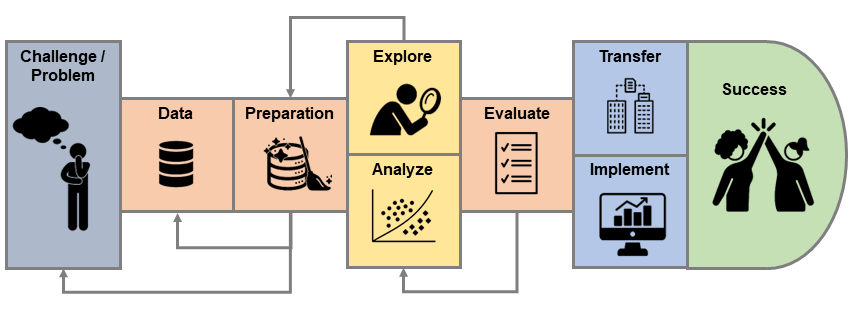

# Hyperparameter Tuning und Evaluation {#sec-eval}

@fig-pipeline zeigt, wie eine typische ML-Pipeline aussieht.^[Icons stammen von https://thenounproject.com/.]

{#fig-pipeline}

Sie starten typischerweise mit einem **Problem** oder einer Herausforderung. Ihr ganzes Projekt sollte darauf ausgelegt sein, dieses Problem zu lösen. Es ist grundsätzlich nicht ratsam, auf Biegen und Brechen eine ML Lösung zu implementieren, wenn kein klar definiertes Problem vorliegt. Nehmen Sie sich also zu Beginn eines Projekts Zeit, das Problem grundlegend zu definieren. Sprechen Sie auch mit den entsprechenden Fachexpert\*innen im Unternehmen, um genau zu verstehen, was verbessert oder effizienter gemacht werden soll und was die technischen oder ökonomischen Einschränkungen sind.


Sobald das Problemverständnis vorhanden ist, beginnen Sie, sich mit den **verfügbaren Daten** zu befassen. Auch hier müssen Sie sich wahrscheinlich mit den entsprechenden Expert\*innen im Unternehmen (z.B. Datenbankadministrator\*innen) austauschen. Es geht hier unter anderem darum abzuklären, welche Daten verfügbar sind, in welchem Format die Daten vorhanden sind wie die Datenqualität ist.

Danach beginnen Sie mit den Datenarbeiten. Häufig wird dieser Schritt **Preprocessing** oder **Data Cleaning** genannt. Oft verschlingt dieser Arbeitsschritt sehr viel Zeit und es ist nicht unüblich, dass 80\% der Projektzeit hier aufgewendet werden. Es ist auch völlig normal, wenn Sie von diesem Schritt zurück zur Problemdefinition gehen und sie verfeinern oder anpassen müssen oder zum Beispiel nochmals Fragen mit den Datenbankexpert\*innen klären müssen, weil Ihr Datenverständnis noch nicht vollständig ist.

Nachdem die Daten vorbereitet wurden, gehen Sie typischerweise zu einer **explorativen Analyse** der Daten über. Das heisst, Sie visualisieren die vorhandenen Variablen univariat (d.h. jede Variable einzeln) oder multivariat (d.h. zwei oder mehr Variablen zusammen). Ein Beispiel einer univariaten Visualisierung ist ein Histogramm einer quantitativen Variable (z.B. Quartalsumsätze). Ein Beispiel einer multivariaten Visualisierung ist ein Streudiagramm zweier quantitativer Variablen (z.B. Quartalsumsätze und Wechselkurse). Auch hier ist es üblich, dass Sie einen Schritt zurück gehen und weitere Datenbereinigungen vornehmen müssen.

Nach der explorativen Analyse der Daten sollten Sie eine erste Idee von den wichtigsten Zusammenhängen in den Daten haben. Basierend darauf können Sie Ihr erstes Modell wählen und trainieren und mit der eigentlichen **Analyse** bzw. der Lösung des Problems beginnen.

Einer der wichtigsten Schritte ist die saubere und gründliche **Evaluation** Ihrer Modelle. Dieser Schritt dient einerseits dazu das beste Modell auszuwählen und andererseits dazu die Qualität Ihrer Lösung bzw. Ihres Modells abzuschätzen. Mit diesem zweiten Schritt wollen Sie nämlich bereits während der Projektphase einschätzen können, wie gut Ihr Modell das gegebene Problem löst oder einen bestehenden Betriebsprozess verbessert oder effizienter macht. Die beiden Schritte Analyse und Evaluation werden typischerweise ein paar Mal iteriert, bis Sie das beste Modell gefunden haben.

Am Schluss geht es darum, dass Sie Ihr Wissen und Ihre Erkenntnisse an die relevanten Fachexpert\*innen weitergeben (**Wissenstransfer**) und Ihr finales Modell in einer produktiven Umgebung implementieren (oft **Deployment** genannt). Zum Beispiel können Sie Ihr Modell in einer mobilen App einbetten oder als REST API Service zur Verfügung stellen.

Ein wichtiger Aspekt beim Klassifikationsproblem ist die Frage, wie man die Modell- bzw. Vorhersagegüte korrekt **evaluiert**. Als Beispiel verwenden wir die Klassifikation von Emails in Spam und nicht-Spam ("Ham"). Der Abschnitt **Spam Filter** enthält den R Code, welcher einen Spam Filter aufsetzt und fittet. Zum Schluss werden wir den Spam Filter **deployen**.


<!-- Was muss hier noch kommen? -->

<!-- - Preprocessing steps (vielleicht anhand des Spam Filters) -->
<!-- - Multi-Class Problem -->
<!-- - Imbalance -->
<!-- - Hyperparameter Tuning -->
<!-- - Was passiert mit anderem Threshold -->
<!-- - Evaluation von Klassifikationsproblemen -->


<!-- Bevor Sie überhaupt beginnen, mit R zu arbeiten, müssen Sie das Problem, das Sie lösen sollen, wirklich verstehen (“Big Picture”). Sprechen Sie dazu mit Fachexpertinnen und -experten (sog. Domain Experts). Sie sollten unter anderem folgende Fragen klären: -->

<!-- Was sind die Business Ziele? Was ist das Problem? -->
<!-- Gab es eine bisherige Lösung? Wenn ja, was war deren Performance? -->
<!-- Was wäre der Vorteil einer ML-Lösung? -->
<!-- Welche Daten sind verfügbar? -->
<!-- Gibt es Metadaten (Dokumentation der Daten, Code Books, etc.)? -->
<!-- Wir werden die Schritte der ML-Pipeline anhand eines Beispiels erlernen. Beim Beispiel handelt es sich um eine Kaggle Challenge. Es geht darum, historische Daten von Taxi Trips in New York City zu verwenden, um die Dauer eines Taxi Trips in dieser Stadt vorherzusagen. Das Beispiel beruht zu einem grossen Teil auf folgendem (fantastischem!) Notebook. Herzlichen Dank an dieser Stellen an den/die Autor*in Heads or Tails. -->

<!-- Stellen Sie sich vor, Sie arbeiten bei einem Startup, das eine App anbietet, welche es Kundinnen und Kunden erlaubt Taxi Trips zu buchen. Die/der Chief Technology Officer (CTO) wendet sich an Sie und wünscht sich ein neues App Feature, nämlich eine Vorhersage der Trip Dauer. Sie besprechen das Problem und erfahren, dass im App bisher nur eine ganz grobe Abschätzung der Trip Dauer basierend auf der Distanz angegeben wird. Die/der CTO möchte ein genaueres Vorhersagemodell. Die Hoffnung ist, dass dieses Feature zu einer Erhöhung der Kundenzufriedenheit führt. Es steht Ihnen ein Datensatz aus dem ersten Halbjahr 2016 mit über einer Million Taxi Trips zur Verfügung. Weiter empfiehlt die/der CTO Ihnen, Wetterdaten in das Modell zu intergrieren. -->

<!-- Nun ist es an Ihnen, das ML-Problem genau zu definieren: -->

<!-- Der Datensatz, der Ihnen zur Verfügung steht, enthält für jeden Trip die Dauer des Trips (die Output Variable). Es handelt sich hier also um ein Supervised Learning Problem. -->
<!-- Die Trip Dauer ist ein numerischer Wert, den Sie vorhersagen sollen. Es handelt sich hierbei also um ein Regressionsproblem. -->
<!-- Im Falle eines Klassifikationsproblems müssten Sie nun auch noch überprüfen, ob es sich um ein balanced oder imbalanced Problem handelt. Wenn Sie beispielsweise vorhersagen sollen, ob es sich um eine betrügerische Kreditkartentransaktion handelt oder nicht, haben Sie typischerweise viel mehr Beobachtungen zu nicht-betrügerischen Transaktionen und nur wenige betrügerische Transaktionen. Ein typischer Fall eines imbalanced Problems. -->

<!-- Hier nun noch ein paar technische Vorbereitungen: -->

<!-- Erstellen Sie in Ihrem File System einen Ordner, in dem wir das ML-Projekt durchführen werden. Erstellen Sie zwei Unterordner mit den Namen daten und zwischenresultate. -->
<!-- Laden Sie die Daten von Moodle runter und speichern Sie die Daten im Unterordner daten. -->
<!-- Öffnen Sie nun RStudio und erstellen Sie ein neues R-Projekt. Erstellen Sie das Projekt im vorher erstellten Ordner. -->
<!-- Installieren Sie folgende R Packages (ich nehme an, dass Sie tidyverse bereits installiert haben): -->

<!-- Datenimport aus relationalen Datenbanken -->

<!-- In der Praxis kann es vorkommen, dass Sie die Daten direkt aus einer relationalen Datenbank bzw. einem Data Warehouse importieren, anstatt dass die Daten im CSV Format vorliegen. Das folgende Tutorial der Firma Posit (vormals RStudio) zeigt Ihnen, wie Sie direkt aus R Datenbankabfragen machen können: Tutorial. -->

<!-- Für die Abfrage von relationalen Datenbanken wird die sogenannte Structured Query Language (SQL) verwendet. SQL ist eine relativ einfach erlernbare Abfragesprache (Tutorial). -->

<!-- Ein simples Beispiel sieht folgendermassen aus: -->

<!-- SELECT id, address, balance -->
<!-- FROM Customers -->
<!-- WHERE age > 50; -->
<!-- Mit dieser Abfrage erhalten wir eine Tabelle mit den Spalten id, address und balance aus einer Datenbanktabelle mit dem Name Customers und zwar nur für die Kunden, welche älter als 50 sind. -->

<!-- Warum machen wir einen Train-Test Split? -->

<!-- In einem ML-Problem legen wir uns in der Anfangsphase des Projekts einen Teil der Daten zur Seite (Testdaten). Wir werden die beiseite gelegten Daten ganz am Schluss verwenden, um die Performance unseres finalen Modells zu messen. Es ist ganz wichtig, dass wir diese Daten vor der finalen Performance-Messung nicht “anfassen”, auch nicht für explorative Analysen. Warum nicht? Die Performance auf den Testdaten soll uns als “unvoreingenommene” Schätzung des Fehlers dienen, der unser Modell in einem produktiven System machen wird. Wenn wir Einsichten aus dem Testdatensatz in unser Modell einfliessen lassen (Data Snooping), dann wird der Fehler auf dem Testset den tatsächlichen Fehler unterschätzen. -->

<!-- Die restlichen Daten (Trainingsdaten) verwenden wir, um verschiedene Modelle zu trainieren, um die Daten explorativ zu erforschen und um bessere Features zu entwickeln. Wir werden später sehen, dass wir den Trainingsdatensatz weiter aufspalten, um das Hyperparameter Tuning durchzuführen. -->

<!-- Warum transformieren wir die Skalen der y- und/oder x-Achse von Plots? -->

<!-- Wir verwenden oft eine logarithmische Skala, um die Visualisierung von Variablen, die ganz kleine aber gleichzeitig auch ganz grosse Werte annehmen können, zu verdeutlichen. Bei einer linearen Skala ist der Abstand zwischen den ticks einer Achse konstant (z.B. immer 1). Bei einer logarithmischen Skala (zur Basis 10) entspricht der Abstand zwischen zwei ticks immer einer Multiplikation mit 10. Das ist vor allem dann nützlich, wenn Daten exponentiell verteilt sind. -->

<!-- Folgendes Beispiel zeigt, wie drei Werte einer Variable (10, 500 und 100’000) auf einer Log-Skala (zur Basis 10) dargestellt werden können: -->

<!-- BILD -->

<!-- Eine weitere mögliche Transformation ist die Quadratwurzel Transformation. Indem wir die Quadratwurzel für kleine und ganz grosse Zahlen rechnen, können die Werte auf einen kleineren Wertebereich zurückgestutzt werden. -->

<!-- Für welche Transformation würden Sie sich für unsere Output-Variable trip_duration entscheiden? -->

<!-- Im dritten Skript versuchen wir, bessere Features zu kreieren. Was heisst hier besser? Wir wollen die bestehenden Variablen modifizieren oder auf clevere Art und Weise kombinieren, so dass wir bessere Prädiktoren für die Vorhersage der Trip Dauer finden. Das ist eine anspruchsvolle Aufgabe, bei der unter anderem auch Ihre Kreativität gefragt ist. -->

<!-- Wir beginnen damit die benötigten R Packages zu laden. Ausserdem laden wir den Trainingsdatensatz aus dem Ordner zwischenresultate (den Testdatensatz benötigen wir in diesem Schritt nicht): -->

<!-- Was Sie zu Log-Log Streudiagrammen wissen sollten -->

<!-- Nehmen wir an, dass der Zusammenhang zwischen y -->
<!--  und x -->
<!--  wie folgt ist: y=a⋅xb -->
<!--  (Potenzgesetz). Nun logarithmieren wir beide Seiten der Gleichung und finden folgende Form: log(y)=log(a)+b⋅log(x) -->
<!-- . Das Potenzgesetz führt also im Log-Log Streudiagramm zu einer Geraden! -->

<!-- Nehmen wir an, dass der Zusammenhang zwischen y -->
<!--  und x -->
<!--  wie folgt ist: y=a⋅ebx -->
<!--  (Exponentialgesetz). Wenn wir hier beide Seiten logarithmieren, dann kriegen wir folgende Gleichung: log(y)=log(a)+bx⋅log(e) -->
<!-- . Wir sehen also in diesem Fall eine Gerade nur dann, wenn lediglich die y-Achse logarithmiert wird! -->

<!-- Es dürfte sich in obiger Abbildung also um einen Zusammenhang zwischen der Trip Dauer und der (direkten) Distanz handeln, der grob einem Potenzgesetz folgt. Das macht irgendwie auch Sinn. Die Tripdauer steigt nicht linear mit zunehmender Distanz, sondern erhöht sich immer stärker je grösser die Distanz. -->

<!-- Wir wollen nun eine Korrelationsmatrix aller Variablen (inkl. der Output-Variable) erstellen. Das machen wir in drei Schritten: -->

<!-- Wir entfernen nicht-relevante Variablen mit select(). -->
<!-- Wir wandeln alle Faktoren in numerische Werte um, denn Korrelationen können nur für numerische Features berechnet werden. Hier können wir die Faktoren ganz einfach mit as.integer() in numerische Werte umwandeln. -->
<!-- Wir berechnen die Korrelationen mit der Funktion cor(). Und zwar berechnen wir den Spearman Korrelationskoeffizienten, der etwas robuster ist als der Pearson Korrelationskoeffizient, den Sie sicher bereits kennen. Mit der Funktion corrplot() aus dem gleichnamigen R Package können wir die Matrix visualisieren. -->

<!-- Als erstes müssen wir alle Feature Engineering und Data Cleaning Schritte, die wir im vorangehenden Teil für den Trainingsdatensatz gemacht haben, nun auch auf dem Testdatensatz vollziehen. Der folgende (lange) Code Block macht genau das. Wir gehen hier nicht weiter ins Detail, da der Code grösstenteils identisch ist (mit der Ausnahme, dass überall, wo vorher train1 stand nun test2 steht). -->

<!-- Train- und Testset vergleichen -->
<!-- Hier machen wir einen ganz kurzen Vergleich zwischen Trainings- und Testdatensatz. Warum machen wir das? Wenn die Testdaten völlig anders verteilt sind als die Trainingsdaten, dann wird die Messung der Vorhersagegüte auf dem Testset nicht sehr aussagekräftig sein. Bei so grossen Datensätzen wie hier ist das typischerweise kein Problem. Bei kleineren Datensätzen kann es aber vorkommen, dass Trainings- und Testdaten unterschiedliche Verteilungen (insbesondere für die Ouput-Variable) aufweisen. -->

<!-- Recipes -->
<!-- Nun steigen wir so richtig in tidymodels ein. Wir haben zwar schon viel Preprocessing gemacht, doch bevor wir Modelle rechnen können, gibt es noch immer einige wichtige (kleinere) Preprocessing Schritte. Diese sind nicht für jedes Modell gleich, darum führen wir diese Schritte erst hier durch und passen sie spezifisch auf das zu rechnende Modell an. tidymodels erlaubt uns, diese Preprocessing Schritte in einem sogenannten recipe (dt. Rezept) zu definieren. Viele dieser letzten Preprocessing Schritte hängen mit den Datentypen der Variablen zusammen. Darum macht es Sinn, uns die Datentypen der Variablen nochmal zu vergegenwärtigen, z.B. mit der Funktion glimpse(): -->

<!-- One-Hot Encoding -->

<!-- Beim One-Hot Encoding geht es darum eine kategorische Variable in numerische Werte zu überführen, die ein Modell verstehen kann. Dazu wird für jede mögliche Kategorie einer kategorischen Variable eine Dummy Variable gebildet, die nur dann den Wert 1 annimmt, falls die Beobachtung der gegebenen Kategorie angehört und sonst den Wert 0 annimmt. -->

<!-- Beispiel: Die Variable wday hat 7 mögliche Kategorien (die Wochentage). D.h. ein One-Hot Encoding dieser Variable erfordert 7 Dummy-Variablen. Stellen Sie sich vor, wir haben drei Taxi-Trip Beobachtungen, zwei an einem Montag und eine an einem Donnerstag. Wie sehen diese drei Beobachtungen one-hot-encoded aus? -->

<!-- BILD -->

<!-- Sie werden weiter unten im Code sehen, dass wir one_hot = TRUE setzen in der step_dummy() Funktion. Damit stellen wir sicher, dass für jedes mögliche Level eine Dummy Variable gebildet wird. Mit one_hot = FALSE wird für ein Referenlevel jeweils keine Dummy Variable gebildet. Wer bei mir EMBA hatte, erinnert sich vielleicht noch an diese Konzepte. Wichtig: für das lineare Regressionsmodell, das wir hier anwenden werden, benötigen wir kein Referenzlevel! -->

<!-- Warum standardisieren wir numerische Variablen? -->

<!-- Der Wertebereich von numerischen Variablen kann stark unterschiedlich sein. Der Wertebereich für die Variable passenger_count reicht beispielsweise von 0 bis 6, während der Wertebereich für die Variable dist (Distanz in Meter) von 0.64 bis 173’000 reicht. Die meisten ML-Modelle bzw. deren Training funktioniert besser, wenn die Wertebereiche der numerischen Variablen ähnlich sind. Bei der regularisierten Regression ist dieser Schritt besonders wichtig, da wir die Parameter des Modells regularisieren. Wenn wir die Variablen nicht standardisieren, dann nehmen die geschätzten Parameter des Modells stark unterschiedliche Werte an und die Regularisierung funktioniert nicht korrekt. -->

<!-- Wir standardisieren die numerischen Variablen so, dass der Mittelwert jeweils 0 ist und die Standardabweichung 1. Die entsprechende Berechnung haben Sie bereits in Statistik 1/2 kennen gelernt (z-Werte oder z-Scores): -->

<!-- x′=x−x¯σx -->

<!-- Wir nehmen also die ursprünglichen Werte, ziehen den Mittelwert ab und dividieren durch die Standardabweichung. Es gibt andere Normalisierungsmethoden wie z.B. Min-Max-Normalisierung, welche alle Werte einer Variable in den Bereich [0,1] -->
<!--  “drückt”. -->

<!--  Nun erstellen wir das recipe. Der erste Schritt definiert die Modellformel, die wir dem Modell übergeben werden. trip_duration ~ . legt die Output-Variable fest und definiert, dass alle anderen Variablen (ausser die, welche im recipe entfernt oder mit einer neuen Rolle versehen werden) als Features verwendet werden sollen. -->

<!-- Resampling und Validation Set -->
<!-- Das Thema Resampling ist enorm wichtig im Machine Learning. Wir verwenden Resampling Methoden für zwei Aspekte während der Modellierung. -->

<!-- Einerseits erlaubt uns das Resampling die optimalen Hyperparameter eines Modells zu finden. Wir werden unten ein regularisiertes Regressionsmodell (LASSO) rechnen, für welches der optimale Hyperparameter λ -->
<!--  gefunden werden muss. -->

<!-- Andererseits können wir mithilfe des Resamplings zwischen verschiedenen Modellen entscheiden. Wenn wir zum Beispiel ein lineares Regressionsmodell und einen Entscheidungsbaum trainiert haben, dann können wir schauen, welches der beiden Modelle die bessere Resampling-Performance hat, ohne dass wir bereits auf das Testset zurückgreifen müssen. -->

<!-- Wir können aber auch verschiedene Preprocessing Varianten ausprobieren und schauen, welche Variante zu einer besseren Resampling-Performance führt. Wir könnten beispielsweise überprüfen, ob es besser ist die numerischen Variablen zu standardisieren oder die Min-Max-Normalisierung anzuwenden. -->

<!-- Was sind Hyperparameter? -->

<!-- Ein Hyperparameter ist kein eigentlicher Modellparameter, denn er wird nicht während der Trainingsphase (Fitting) gelernt, sondern muss vor der Trainingsphase gesetzt werden. Mit Resampling-Methoden wie etwa K-Fold Cross Validation versuchen wir, einen möglichst optimalen Wert für den Hyperparameter zu finden. -->

<!-- Beispiel: Bei der regularisierten Regression (Ridge und LASSO) haben wir die Modellparameter w0,w1,w2,… -->
<!-- . Zusätzlich haben wir einen Hyperparameter λ -->
<!-- , der bestimmt, wie stark regularisiert wird. Während λ -->
<!--  vor dem Training des Modells gesetzt werden muss, werden die Modellparameter während des Trainings gelernt bzw. optimiert. -->

<!-- Die bekannteste Resampling-Methode ist K-Fold Cross-Validation. Wie funktioniert diese Methode: -->

<!-- Wir teilen den Trainingsdatensatz in K -->
<!--  (z.B. K=5 -->
<!-- ) gleich grosse Teile (Folds) auf. -->
<!-- Wir legen den ersten Fold zur Seite und trainieren das Modell auf den restlichen 4 Folds. -->
<!-- Dann verwenden wir das in Schritt 2 trainierte Modell, um Vorhersagen für die Beobachtungen im ersten (Test-) Fold zu rechnen, der ja nicht für das Training verwendet wurde. Wir vergleichen die Vorhersagen mit den wahren Werten mithilfe eines Modellgütemasses (z.B. RMSE) und speichern den entsprechenden RMSE Wert. -->
<!-- Wir wiederholen die Schritte 2. und 3. und legen jeweils einen anderen Fold zur Seite für die Evaluation des Modells. -->
<!-- Wir haben am Schluss K -->
<!--  RMSE-Werte. Diese K -->
<!--  Werte können wir mitteln, um die Vorhersagegüte eines Modells zu schätzen. Mit den K -->
<!--  RMSE-Werten können wir auch eine Varianz schätzen, um die Unsicherheit unserer Schätzung zu beziffern. -->
<!-- Folgende Abbildung stellt 5-Fold Cross Validation grafisch dar: -->

<!-- BILD -->

<!-- Sie sehen vielleicht jetzt auch, warum wir von Resampling sprechen. Wir samplen nämlich mehrere kleine Validierungsdatensätze (Folds) aus dem Trainingsdatensatz, um eine Schätzung für die Modellgüte zu erhalten. -->

<!-- Wie können wir nun damit den optimalen Hyperparameter (z.B. λ -->
<!-- ) finden? Wir führen für jeden möglichen Wert, den der Hyperparameter annehmen kann, die K-Fold Cross-Validation durch und kriegen dementsprechend für jeden möglichen Hyperparameterwert eine Schätzung der Modellgüte. Am Schluss wählen wir ganz einfach den Hyperparameterwert, der zur besten (geschätzten) Modellgüte führt! Wenn wir den optimalen Hyperparameterwert gefunden haben, dann trainieren wir das Modell ein letztes Mal auf dem ganzen Trainingsdatensatz, d.h. ohne Cross-Validation (mit dem optimalen Hyperparameterwert). -->

<!-- Wenn wir einen besonders grossen Datensatz haben (was hier der Fall ist), dann können wir auch einfach ein Validation Set bilden anstatt K-Fold Cross-Validation durchzuführen. D.h. wir splitten den Trainingsdatensatz in ein Validation Set und in einen kleineren Trainingsdatensatz. Der Vorteil von einem Validation Set im Vergleich zu K-Fold Cross-Validation ist, dass es weniger rechenintensiv ist. Warum? Wenn wir 5 mögliche Hyperparameterwerte haben, dann müssen wir im Falle eines Validation Sets nur 5 Mal ein Modell rechnen und evaluieren. Wie sieht es im Falle der 5-Fold Cross-Validation aus? -->

<!-- Gehen wir nun zurück zu unserem Beispiel. Wir verwenden hier die Validation Set Methode und splitten darum den Trainingsdatensatz nochmals auf. 20% für das Validation Set, die restlichen 80% für das Trainieren der Modelle. Um den Split reproduzierbar zu machen, setzen wir einen Seed. -->

<!-- Wichtiges Takeaway: wir evaluieren ein Modell nie einfach nur auf dem Trainingsdatensatz. Wir wenden immer eine Form von Resampling an, um die Modellgüte zu schätzen und/oder um die Hyperparameter zu optimieren. -->

<!-- Modell rechnen und Hyperparameter Tuning -->
<!-- In einem ersten Schritt spezifizieren wir hier nun das Modell, das wir rechnen wollen. Wir haben uns für ein relativ simples lineares Regressionsmodell entschieden. Wir spezifizieren dieses Modell mit der Funktion linear_reg(). Weil wir sehr viele (potenziell stark korrelierte) Variablen haben, wollen wir aber ein regularisiertes Modell rechnen. Dies legen wir mithilfe von set_engine("glmnet") fest (so wird im Hintergrund das glmnet Package verwendet). Wichtig sind im folgenden Code Block die Argumente penalty = tune() und mixture = tune(). Diese legen fest, dass wir die beiden Hyperparameter penalty (entspricht λ -->
<!-- ) und mixture (bestimmt, ob wir ein Ridge oder LASSO Modell wählen) tunen wollen. -->

<!-- Nun wird es spannend! Wir tunen unsere zwei Hyperparameter. Mit expand.grid() erstellen wir einen Grid von möglichen Werten für penalty und mixture. Für penalty testen wir die Werte 0.00001,0.0001,0.001,0.01,0.1,1,10,100,1000 -->
<!--  und für mixture die Werte 0 (entspricht Ridge) und 1 (entspricht LASSO). -->

<!-- ## Evaluation -->

<!-- Dieser gesamte Abschnitt bezieht sich auf das **binäre** Klassifikationsproblem Wir werden uns die Modellgütemasse für den Fall einer Zielvariable mit mehr als zwei Kategorien zu einem späteren Zeitpunkt anschauen. -->

<!-- Die allermeisten Klassifikationsmodelle geben uns für eine Beobachtung $\mathbf{x}_i$ die Wahrscheinlichkeit, dass $y_i = 1$, also $p(y_i = 1 | \mathbf{x}_i)$. -->

<!-- Doch wie kommen wir eigentlich von diesen Wahrscheinlichkeiten zu einer richtigen Vorhersage? Wir müssen zuerst einen **Threshold** wählen. Im einfachsten Fall ist der Threshold **0.5** und wir erstellen die Vorhersagen wie folgt: -->

<!-- * Wenn $p(y_i = 1 | \mathbf{x}_i) \geq 0.5$, dann ist unsere Vorhersage $\hat{y}_i = 1$. -->
<!-- * Wenn $p(y_i = 1 | \mathbf{x}_i) < 0.5$, dann ist unsere Vorhersage $\hat{y}_i = 0$. -->

<!-- Im folgenden Datensatz haben wir 40 Beobachtungen. Für jede Beobachtung haben wir den wahren Wert der Zielvariable (`y`), die vorhergesagte Wahrscheinlichkeit des Klassifikationsmodells (`prob`) sowie die Vorhersagen für einen Threshold von 0.5 (`pred`): -->

<!-- ``` -->
<!-- y       prob pred -->
<!-- 1 0.95721924    1 -->
<!-- 1 0.95721924    1 -->
<!-- 1 0.95721924    1 -->
<!-- 1 0.90284298    1 -->
<!-- 1 0.90284298    1 -->
<!-- 1 0.90284298    1 -->
<!-- 1 0.90284298    1 -->
<!-- 1 0.88629832    1 -->
<!-- 1 0.88629832    1 -->
<!-- 1 0.88629832    1 -->
<!-- 1 0.84579393    1 -->
<!-- 1 0.84579393    1 -->
<!-- 0 0.84579393    1 -->
<!-- 1 0.79421077    1 -->
<!-- 1 0.79421077    1 -->
<!-- 0 0.79421077    1 -->
<!-- 1 0.61580323    1 -->
<!-- 1 0.61580323    1 -->
<!-- 0 0.61580323    1 -->
<!-- 0 0.61580323    1 -->
<!-- 1 0.57895423    1 -->
<!-- 1 0.39964340    0 -->
<!-- 0 0.39964340    0 -->
<!-- 0 0.39964340    0 -->
<!-- 1 0.21658577    0 -->
<!-- 0 0.21658577    0 -->
<!-- 0 0.21658577    0 -->
<!-- 0 0.21658577    0 -->
<!-- 0 0.21658577    0 -->
<!-- 1 0.10299336    0 -->
<!-- 0 0.10299336    0 -->
<!-- 0 0.10299336    0 -->
<!-- 0 0.10299336    0 -->
<!-- 0 0.10299336    0 -->
<!-- 0 0.10299336    0 -->
<!-- 0 0.04551533    0 -->
<!-- 0 0.04551533    0 -->
<!-- 0 0.04551533    0 -->
<!-- 0 0.01941990    0 -->
<!-- 0 0.01941990    0 -->
<!-- ``` -->

<!-- Die ersten beiden Spalten dieses Datensatzes sind als Data Frame unter dem Name `eval_data` gespeichert und werden in den folgenden Code Blocks verwendet. -->

<!-- ### Accuracy -->

<!-- Das einfachste Modellgütemass für das Klassifikationsproblem ist die **Accuracy**. Bei der Accuracy zählen wir die Anzahl korrekt gemachter Vorhersagen und dividieren durch die Anzahl Beobachtungen.  -->

<!-- ```{r acc, exercise = TRUE, exercise.lines = 16} -->
<!-- # Threshold -->
<!-- thres <- 0.5 -->

<!-- # Vorhersage basierend auf Threshold -->
<!-- eval_data <- -->
<!--   eval_data %>%  -->
<!--   mutate( -->
<!--     y = factor(y), -->
<!--     pred = factor(ifelse(prob >= thres, 1, 0)) -->
<!--     ) -->

<!-- # Accuracy mit Base R -->
<!-- sum(eval_data$y == eval_data$pred) / nrow(eval_data) -->

<!-- # Accuracy via tidymodels -->
<!-- accuracy(eval_data, y, pred) -->
<!-- ``` -->

<!-- Wir sehen, dass die Accuracy hier 0.825 (oder 82.5%) beträgt. Wichtig ist, dass Sie bei Verwendung der Funktion `accuracy()` aus `tidymodels` sowohl die Zielvariable als auch die Vorhersagen vorher in einen Faktor transformieren. -->

<!-- ### Konfusionsmatrix -->

<!-- Sobald wir mithilfe eines Thresholds **"harte" Vorhersagen** berechnet haben, können wir die Klassifikationsresultate mit einer **Konfusionsmatrix** darstellen. Die generelle Form der Konfusionsmatrix sieht wie folgt aus: -->

<!-- <center> -->
<!-- `r img(src = "www/Konfusionsmatrix.png", width = "80%")` -->
<!-- </center><br> -->

<!-- Die vier Zellen der Matrix repräsentieren die vier möglichen Outcomes: -->

<!-- * **True Negative (TN)**: korrekte Vorhersage einer Beobachtung mit $y_i = 0$. Beispiel: Spam Filter klassifiziert eine Ham Email *korrekt* als Ham (nicht-Spam). -->
<!-- * **True Positive (TP)**: korrekte Vorhersage einer Beobachtung mit $y_i = 1$. Beispiel: Spam Filter klassifiziert Spam Email *korrekt* als Spam. -->
<!-- * **False Negative (FN)**: inkorrekte Vorhersage einer Beobachtung mit $y_i = 1$. Beispiel: Spam Filter klassifiziert eine Spam Email *inkorrekt* als Ham (nicht-Spam). -->
<!-- * **False Positive (FP)**: inkorrekte Vorhersage einer Beobachtung mit $y_i = 0$. Beispiel: Spam Filter klassifiziert eine Ham Email *inkorrekt* als Spam. -->

<!-- <div style = "background-color:#fef9e7; padding:10px"> -->
<!-- **Aufgabe**: Überlegen Sie sich kurz, welcher Fehler im Beispiel des Spam Filters schlimmer ist: -->

<!-- * False Negative: der Filter klassifiziert eine Spam Email als Ham. -->
<!-- * False Positive: der Filter klassifiziert eine Ham Email als Spam. -->
<!-- </div><br> -->

<!-- Mit der Funktion `table()` aus Base R können wir uns die Konfusionsmatrix in R ausgeben lassen. Damit wir genau die Anordnung wie in obiger Abbildung kriegen, übergeben wir der Funktion zuerst die Vorhersagen `eval_pred$pred` und erst dann die wahren Werte der Zielvariable `eval_data$y`. Mit `dnn = c("pred","true")` beschriften wir die Dimensionen der Tabelle. -->

<!-- ```{r confmat, exercise = TRUE, exercise.lines = 10} -->
<!-- # Threshold -->
<!-- thres <- 0.5 -->

<!-- # Vorhersage basierend auf Threshold -->
<!-- eval_data <- -->
<!--   eval_data %>%  -->
<!--   mutate(pred = ifelse(prob >= thres, 1, 0)) -->

<!-- # Konfusionsmatrix (Base R) -->
<!-- table(eval_data$pred, eval_data$y, dnn = c("pred","true")) -->
<!-- ``` -->

<!-- Wir sehen, dass unser Modell **4 False Positive** und **3 False Negative** Fehler macht. -->

<!-- ### Sensitivity und Specificity -->

<!-- Wie oben gesehen kriegen wir mit der Accuracy den Anteil korrekter Vorhersagen. Oft möchte man die Klassifikationsresultate etwas genauer aufsplitten. Dazu werden die Gütemasse **Sensitivity** und **Specificity** verwendet: -->

<!-- * Die **Sensitivity** ist der Anteil korrekter Vorhersagen unter allen *positiven* Beobachtungen. Beispiel: was ist der Anteil korrekt als Spam klassifizierter Emails gemessen an allen Spam Emails? Die Formel ist wie folgt: $\text{Sensitivity} = \frac{TP}{(TP + FN)}$. Die Sensitivity wird manchmal auch *True Positive Rate* oder *Recall* genannt. -->
<!-- * Die **Specificity** ist der Anteil korrekter Vorhersagen unter allen *negativen* Beobachtungen. Beispiel: was ist der Anteil korrekt als Ham klassifizierter Emails gemessen an allen Ham Emails? Die Formel ist wie folgt: $\text{Specificity} = \frac{TN}{(TN + FP)}$. Die Specificity wird manchmal auch *True Negative Rate* genannt. -->

<!-- In folgendem Code Block rechnen wir die Accuracy, Sensitivity und Specificity mit R. Wichtig: das Argument `event_level = "second"` in den Funktionen `sens()` und `spec()` definiert, dass das zweite Faktorlevel die Kategorie ist, die uns hauptsächlich interessiert (also $y_i=1$). -->

<!-- ```{r sens_spec, exercise = TRUE, exercise.lines = 28} -->
<!-- # Threshold -->
<!-- thres <- 0.5 -->

<!-- # Vorhersage basierend auf Threshold -->
<!-- eval_data <- -->
<!--   eval_data %>%  -->
<!--   mutate( -->
<!--     y = factor(y), -->
<!--     pred = factor(ifelse(prob >= thres, 1, 0)) -->
<!--     ) -->

<!-- # Konfusionsmatrix (Base R) -->
<!-- table(eval_data$pred, eval_data$y, dnn = c("pred","true")) -->

<!-- # Accuracy via tidymodels -->
<!-- eval_data %>%  -->
<!--   accuracy(y, pred) -->

<!-- # Sensitivity (Base R) -->
<!-- sum(eval_data$y == 1 & eval_data$pred == 1) / sum(eval_data$y == 1) -->

<!-- # Sensitivity (tidymodels) -->
<!-- eval_data %>%  -->
<!--   yardstick::sens(y, pred, event_level = "second") -->

<!-- # Specificity (tidymodels) -->
<!-- eval_data %>%  -->
<!--   yardstick::spec(y, pred, event_level = "second") -->
<!-- ``` -->

<!-- <div style = "background-color:#fef9e7; padding:10px"> -->
<!-- **Aufgabe**: Verändern Sie in obigem Code den Threshold einmal zu 0.8 und einmal zu 0.3. Was passiert mit der Accuracy, der Sensitivity und der Specificity? -->
<!-- </div><br> -->

<!-- Wir haben mithilfe von obigem Code feststellen können, dass sich die Modellgütemasse verändern, wenn wir den Threshold verändern. Grundsätzlich gilt folgendes: -->

<!-- * Die Accuracy ist **maximal** für einen Threshold von **0.5**. -->
<!-- * Wenn wir den **Threshold senken**, dann **erhöht** sich die **Sensitivity** (allerdings auf Kosten der Specificity). Warum? Die Senkung des Thresholds führt einerseits zu mehr True Positives, aber auch zu mehr falschen Vorhersagen von $\hat{y}_i=1$, also mehr False Positives. -->
<!-- * Wenn wir den **Threshold erhöhen**, dann **erhöht** sich die **Specificity** (allerdings auf Kosten der Sensitivity). Warum? Die Erhöhung des Thresholds führt einerseits zu mehr True Negatives, aber auch zu mehr False Negatives. "You can't have it both ways!" -->

<!-- Folgende Abbildung zeigt die Accuracy, die Sensitivity und die Specificity für viele verschiedene Thresholds zwischen 0 und 1: -->

<!-- <center> -->
<!-- `r img(src = "www/eval_measures.png", width = "70%")` -->
<!-- </center><br> -->

<!-- Für reale Datenbeispiele sind die Kurven **smoother**. -->

<!-- **Doch wie machen wir nun da eine gute Entscheidung bezüglich des Thresholds?** In praktisch jedem Praxisproblem ist entweder die Sensitivity oder die Specificity wichtiger. Dazu braucht es manchmal etwas Domain Knowledge. Wir wählen den Threshold dann so, dass wir mit dem Tradeoff zwischen Sensitivity und Specificity leben können. -->

<!-- Hier ein paar Beispiele: -->

<!-- * Beim Spam Filter ist es mir wichtiger, dass ich möglichst **keinen False Positive Fehler** mache (Ham verschwindet im Spam Folder). Hier ist mir also die **Specificity** wichtiger. Darum wähle ich tendenziell einen Threshold grösser als 0.5. -->
<!-- * Bei der Vorhersage einer Krankheit ($y_i = 1$) ist der **False Negative Fehler** wesentlich schlimmer (kranke Person wird als gesund klassifiziert). Hier ist mir also die **Sensitivity** wichtiger. Darum wähle ich tendenziell einen Threshold kleiner als 0.5 und "gehe auf Nummer sicher". -->

<!-- <div style = "background-color:#fef9e7; padding:10px"> -->
<!-- **Aufgabe**: Überlegt euch kurz anhand folgender Beispiele, welcher Fehler schlimmer ist und wie ihr euch dementsprechend bezüglich Threshold entscheiden würdet. -->

<!-- * Eine Bank möchte mit einem Modell die Zahlungsfähigkeit von Kundinnen und Kunden vorhersagen. -->
<!-- * Die Polizei möchte mit einem Modell vorhersagen, ob eine Person in den nächsten 6 Monaten eine kriminelle Tat begeht. -->
<!-- </div><br> -->

<!-- ### ROC Kurve -->

<!-- Die **ROC Kurve**, das bekannteste Konzept zur Messung der Klassifikationsgüte, wurde entwickelt, weil es unbefriedigend ist, dass die Klassifikationsgüte (z.B. Accuracy, Sensitivity oder Specificity) vom gewählten Threshold abhängt. Die ROC Kurve wurde ursprünglich in der Kommunikationstheorie entwickelt und ROC steht für *receiver operating characteristic*. -->

<!-- Jeder Punkt auf der ROC Kurve zeigt den Wert der Sensitivity und der Specificity für einen bestimmten Threshold, wobei der **Threshold nicht explizit in der Grafik dargestellt** wird. Ihr könnt es euch folgendermassen vorstellen: -->

<!-- 1. Für jeden möglichen Threshold, z.B. $\{0, 0.01, 0.02, 0.03, \ldots, 0.98, 0.99, 1.0\}$, wird sowohl die Sensitivity als auch die Specificity berechnet. -->
<!-- 2. Dann sortieren wir die Sensitivity-Specificity Paare nach aufsteigender Sensitivity. -->
<!-- 3. Zum Schluss plotten wir die sortierten Punkte als Kurve. Damit der Plot besser interpretierbar ist, plotten wir auf der x-Achse $1 - \text{Specificity}$, was nichts anderes als die False Positive Rate ist. -->

<!-- Hier der `tidymodels` Code dazu: -->

<!-- ```{r roc, exercise = TRUE, exercise.lines = 10} -->
<!-- # y in einen Faktor umwandeln -->
<!-- eval_data <- -->
<!--   eval_data %>%  -->
<!--   mutate(y = factor(y)) -->

<!-- # Werte für die ROC Kurve -->
<!-- roc_curve(eval_data, y, prob, event_level = "second") -->

<!-- # ROC Kurve -->
<!-- autoplot(roc_curve(eval_data, y, prob, event_level = "second")) -->
<!-- ``` -->

<!-- **Zentrale Punkte** für die Interpretation von ROC Kurven: -->

<!-- * Hat ein Modell eine ROC Kurve, die durch den Punkt ganz links oben geht, dann haben wir ein perfektes Modell gefunden. Warum? Für dieses Modell gibt es einen Threshold, mit dem sowohl die Sensitivity als auch die Specificity 1 sind (Achtung: wenn die Specificity 1 ist, dann ist $1 - \text{Specificity} = 0$). Das Modell macht also keine Vorhersagefehler! -->
<!-- * Die gestrichelte Diagonale entspricht einem Modell, dessen Vorhersagen nicht besser als ein Münzwurf sind. Unser Modell sollte sich also immer klar von der Diagonalen abheben, nur dann hat es wirklich einen Nutzen. -->
<!-- * Wir können die ROC Kurve auch mit einer einzigen Zahl zusammenfassen, nämlich der Fläche unter der ROC Kurve. Man nennt dieses Mass **ROC AUC** (**A**rea **U**nder **C**urve). Wenn die ROC Kurve durch den Punkt links oben geht, dann ist ROC AUC 1.0 (perfektes Modell). Wenn unser Modell aber nicht besser als ein Münzwurf performt, dann ist ROC AUC ungefähr 0.5 (Modell ab in den Kübel). -->
<!-- * Die ROC Kurve eignet sich gut, um Modelle zu vergleichen. Warum? Verschiedene Modelle haben unterschiedliche Thresholds mit denen sie am besten performen. Die ROC Kurven bzw. ROC AUC erlauben einen direkten Vergleich von Modellen, da der Effekt des Thresholds nicht mehr reinspielt, weil alle Thresholds berücksichtigt werden. -->

<!-- ### Imbalance -->

<!-- Es gibt beim Klassifikationsproblem eine grosse Herausforderung, welche in der Praxis oft auftritt. Nämlich das Problem einer **Imbalance** (Unausgewogenheit) in der Zielvariable $y_i$. Es kommt sehr häufig vor, dass die "positive" Klasse ($y_i=1$), also die Klasse, an der wir wirklich interessiert sind, weniger häufig vorkommt als die "negative" Klasse ($y_i=0$). Beispiel: Zahlungsunfähigkeit, Krankheit, gewaltsames Video auf YouTube, etc. -->

<!-- In diesem Fall ist die Accuracy ein ganz schlechtes Gütemass. Warum seht ihr an folgendem Beispiel: -->

<!-- <div style = "background-color:#fef9e7; padding:10px"> -->
<!-- **Aufgabe**: Stellen Sie sich vor, dass wir einen Datensatz mit Angaben zu 1000 Patientinnen und Patienten haben. 33 dieser 1000 Patientinnen und Patienten haben eine seltene Krankheit, die wir mit einem Modell vorhersagen möchten. -->

<!-- 1. Stellen Sie die Konfusionsmatrix auf für ein simples Modell, das immer $\hat{y}_i=0$ (also keine Krankheit) vorhersagt. -->
<!-- 2. Rechnen Sie die Accuracy basierend auf den Zahlen in der Konfusionsmatrix. Was fällt Ihnen auf? -->
<!-- 3. Rechnen Sie nun die Sensitivity und Specificity basierend auf den Zahlen in der Konfusionsmatrix. -->
<!-- </div><br> -->

<!-- Wir sehen also, dass es im Falle einer Imbalance *nie* eine gute Idee ist, die Accuracy als Gütemass zu verwenden. Doch wir haben ein grundsätzlicheres Problem: unser ML-Modell kann unter Umständen zu wenig gut von den "positiven" (raren) Trainingsbeobachtungen lernen, da es einfach nicht eine genügend grosse Anzahl davon gibt. Das Modell fokussiert in diesem Fall zu stark auf die häufige Kategorie und vernachlässigt die rare Kategorie. -->

<!-- Um dieses Problem zu lösen gibt es zwei Arten von Lösungen: -->

<!-- 1. **Sampling Techniken**: wir können einerseits ein **Undersampling** für die häufige Kategorie oder ein **Oversampling** für die rare Kategorie machen. Ganz einfach gesagt, entfernen wir beim Undersampling zufällig Beobachtungen, welche der häufigen Kategorie angehören bis die Imbalance weniger stark ist. Beim Oversampling generieren wir (zufällig) neue Beobachtungen für die rare Kategorie bis die Imbalance weniger stark ist. -->
<!-- 2. **Gewichtung in Kostenfunktion**: Wir können Trainingsbeobachtungen, welche der raren Kategorie angehören, in der Berechnung der Kostenfunktion stärker gewichten. -->

<!-- Persönlich bevorzuge ich die zweite Variante, weil sie aus meiner Sicht eleganter ist. In praktischen Problemen lohnt es sich jedoch immer etwas auszuprobieren, was am besten funktioniert. -->

<!-- Weitere Ressourcen zum Thema Imbalance: -->

<!-- * [Gewichtung der Trainingsbeobachtungen](https://www.tidyverse.org/blog/2022/05/case-weights/) -->
<!-- * [Upsampling mit tidymodels](https://themis.tidymodels.org/reference/step_upsample.html) -->
<!-- * [Downsampling mit tidymodels](https://themis.tidymodels.org/reference/step_downsample.html) -->
<!-- * [Smote: Synthetic minority over-sampling technique](https://themis.tidymodels.org/reference/smote.html) -->

<!-- ### Precision-Recall Kurve -->

<!-- <div style = "background-color:#fef9e7; padding:10px"> -->
<!-- **Optional**: Die ROC Kurve (und ROC AUC) sind die am häufigsten verwendeten Techniken, um die Klassifikationsmodelle zu evaluieren. Wenn aber die "positive" Kategorie sehr selten vorkommt (also eine Imbalance vorherrscht) und/oder der False Positive Fehler für das vorliegende Problem wichtiger ist, dann gibt es eine Alternative zur ROC Kurve, nämlich die **Precision-Recall Kurve**. -->

<!-- Das Mass **Recall** haben wir bereits kennen gelernt, denn es ist nichts anderes als die **Sensitivity**. Zur Repetition: $\text{Recall} = \frac{TP}{(TP + FN)}$. Dieses Mass bezieht sich nur auf die zweite *Spalte* der Konfusionsmatrix, berücksichtigt also nur die Beobachtungen, die tatsächlich der Kategorie 1 angehören ($y_i=1$). -->

<!-- Das Mass **Precision** bezieht sich auf die zweite *Zeile* der Konfusionsmatrix, berücksichtigt also nur die Beobachtungen, für die unser Modell 1 vorhersagt ($\hat{y}_i=1$). Die Formel ist wie folgt: $\text{Precision} = \frac{TP}{(TP + FP)}$. Auf den Spam Filter angewendet beantwortet die Precision die Frage "Wie viele unserer Spam Vorhersagen sind korrekt?". -->

<!-- Sie sehen, dass die beiden Masse, Precision und Recall, sich hauptsächlich mit der positiven Kategorie befassen. Die True Negatives (TN) kommen in den beiden Formeln gar nicht vor. -->

<!-- Wichtig: wie bei der ROC Kurve bzw. Sensitivity und Specificity gibt es einen **Tradeoff** zwischen Precision und Recall. Eine höhere Precision führt in der Regel zu einem tieferen Recall. Das sieht man auch gut anhand folgender Abbildung, die Precision und Recall für verschiedene Thresholds zeigt: -->

<!-- <center> -->
<!-- `r img(src = "www/prec-rec.png", width = "70%")` -->
<!-- </center><br> -->

<!-- Manchmal will man die Precision und Recall Werte zu einem **Score** verbinden. Dazu kann man den **harmonischen Mittelwert** rechnen, den man **F1 Score** nennt: -->

<!-- $$ -->
<!-- \text{F1} = \frac{2}{\frac{1}{\text{Precision}} + \frac{1}{\text{Recall}}} -->
<!-- $$ -->
<!-- Warum ein harmonischer Mittelwert? Weil dieser einen tiefen Wert für Precision oder Recall stärker "bestraft" als der arithmetische Mittelwert. Das führt dazu, dass das F1 Score in der Tendenz nur hoch ist, wenn sowohl Precision als auch Recall hoch ist. -->

<!-- Hier nun noch der R-Code, um Precision und Recall zu rechnen: -->

<!-- ```{r prec_recall, exercise = TRUE, exercise.lines = 24} -->
<!-- # Threshold -->
<!-- thres <- 0.5 -->

<!-- # Vorhersage basierend auf Threshold -->
<!-- eval_data <- -->
<!--   eval_data %>%  -->
<!--   mutate( -->
<!--     y = factor(y), -->
<!--     pred = factor(ifelse(prob >= thres, 1, 0)) -->
<!--     ) -->

<!-- # Precision (tidymodels) -->
<!-- eval_data %>%  -->
<!--   yardstick::precision(y, pred, event_level = "second") -->

<!-- # Recall (= Sensitivity) (tidymodels) -->
<!-- eval_data %>%  -->
<!--   yardstick::recall(y, pred, event_level = "second") -->

<!-- # Werte für die Precision-Recall Kurve -->
<!-- pr_curve(eval_data, y, prob, event_level = "second") -->

<!-- # Precision-Recall Kurve -->
<!-- autoplot(pr_curve(eval_data, y, prob, event_level = "second")) -->
<!-- ``` -->

<!-- Die letzten beiden Zeilen Code zeigen, wie man (ähnlich wie bei der ROC Kurve) Precision gegen Recall plotten kann, ohne die Thresholds direkt in der Grafik zu zeigen. -->
<!-- </div><br> -->

<!-- ## Spam Filter -->

<!-- Wir haben uns die Daten, welche wir für das Training des Spam Filters verwenden werden, im ersten Abschnitt bereits angeschaut und in ein Data Frame Format umgewandelt. Ein grosser Teil der ML Pipeline ist hier nicht nötig, da der Datensatz bereits in der richtigen Form und auch bereits in einen Trainings- und Testdatensatz aufgeteilt ist. Darum steigen wir hier **direkt im Modellierungsteil** ein. -->

<!-- ### Logistische Regression -->

<!-- Als erstes splitten wir den Trainingsdatensatz in **10 Folds** (10-Fold Cross Validation), die wir für das Hyperparameter Tuning, aber auch für die Modellevaluation verwenden werden. **Wichtig**: auch hier fassen wir den Testdatensatz bis ganz am Schluss *nicht* an. Sie sehen hier zwei interessante Argumente in der `vfold_cv()` Funktion: `repeats` erlaubt Ihnen, die 10-Fold CV mehr als einmal durchzuführen, um präzisere Resultate zu erhalten. Wie bei einer klassischen Schätzung erhalten Sie so mehr Datenpunkte und können die Modellgüte genauer schätzen. Das Argument `strata = y` sagt der Funktion, dass sie die Folds **proportional** nach den Anteilen in der Variable `y` erstellen soll. Das heisst, jeder Fold wird rund 33% Spam Emails und 67% Ham Emails enthalten. Wir kriegen einen sogenannten **stratifizierten Split**. -->

<!-- ```{r eval = FALSE} -->
<!-- # Seed für Reproduzierbarkeit -->
<!-- set.seed(123) -->

<!-- # 10-fold CV -->
<!-- folds <- vfold_cv(train, v = 10, repeats = 1, strata = y) -->
<!-- ``` -->

<!-- Als nächstes setzen wir das Logistische Regressionsmodell auf. Anstelle der `linear_reg()` Funktion (siehe ML Pipeline Kapitel) verwenden wir hier nun die `logistic_reg()` Funktion und spezifizieren, dass wir hier (aus Performance Gründen - so dass das Tuning etwas schneller geht) nur `penalty` als Hyperparameter tunen wollen. Mit `mixture = 1` definieren wir bereits hier, dass ein LASSO Modell gerechnet werden soll. -->

<!-- ```{r eval = FALSE} -->
<!-- # Logistische Regression -->
<!-- lr_mod <-  -->
<!--   logistic_reg(penalty = tune(), mixture = 1) %>%  -->
<!--   set_engine("glmnet") -->
<!-- ``` -->

<!-- Wir brauchen hier **kein Recipe**, da die Daten schon im korrekten Format sind. Darum sieht der Workflow hier etwas anders aus als wir es uns gewohnt sind: wir verwenden den `add_formula()` Layer anstelle des `add_recipe()` Layers. Der `add_formula()` Layer ist nötig, weil spezifiziert werden muss, was die Zielvariable ist und welche Variablen als Input-Variablen verwendet werden sollen. Dieser Schritt war im ML Pipeline Kapitel integriert in das Recipe. Mit `y ~ .` definieren wir hier, dass `y` die Zielvariable ist und alle anderen Variablen als Input verwendet werden sollen. -->

<!-- ```{r eval = FALSE} -->
<!-- # Workflow -->
<!-- lr_workflow <-  -->
<!--   workflow() %>%  -->
<!--   add_model(lr_mod) %>%  -->
<!--   add_formula(y ~ .) -->
<!-- ``` -->

<!-- Da wir hier nur `penalty` als Hyperparameter betrachten ist der Tuning Grid eindimensional. Wir testen hier Werte zwischen 0.00001 (`1e-05`) und 10 (`1e+01`). -->

<!-- ```{r eval = TRUE} -->
<!-- # Tuning Grid -->
<!-- lr_grid <- expand.grid(penalty = 10^seq(-5, 1, by = 1)) -->

<!-- # Wie sieht Grid aus? -->
<!-- print(lr_grid) -->
<!-- ``` -->

<!-- Hier nun der wichtige Schritt des **Model Fittings**. Mit `resamples = folds` übergeben wir der `tune_grid()` Funktion die 10 (CV) Folds. `control = control_grid(save_pred = TRUE)` speichert die Vorhersagen für die verschiedenen möglichen Hyperparameterwerte. Warum speichern wir diese Vorhersagen? Weil wir sie verwenden werden für die Berechnung der Modellgüte. -->

<!-- Die folgende Abbildung zeigt nochmals das Prinzip der Cross Validation (hier mit 5 Folds) für eine gegebene Hyperparameter Spezifikation (z.B. `penalty = 0.1`). Wir haben pro Split einen Fold, der nicht für das Training verwendet wird. Die Vorhersagen auf diesem **Test Fold** speichern wir im unten stehenden Code. Aus der Abbildung ist ersichtlich, dass wir so für jede Beobachtung im Trainingsdatensatz genau eine Vorhersage kriegen. Diese Vorhersagen werden verwendet, um die Modellgüte zu berechnen. -->

<!-- <center> -->
<!-- `r img(src = "www/CV_predictions.png", width = "80%")` -->
<!-- </center><br> -->

<!-- Welche Modellgütemasse verwenden wir hier überhaupt? Wir verwenden hier die **Accuracy** und **ROC AUC** und spezifizieren das mit `metrics = metric_set(accuracy, roc_auc)`. -->

<!-- ```{r eval = FALSE} -->
<!-- # Tuning / Model Fitting -->
<!-- lr_res <-  -->
<!--   lr_workflow %>%  -->
<!--   tune_grid( -->
<!--     resamples = folds, -->
<!--     grid = lr_grid, -->
<!--     control = control_grid(save_pred = TRUE), -->
<!--     metrics = metric_set(accuracy, roc_auc)) -->
<!-- ``` -->

<!-- Nun sortieren wir den Cross-Validation Output nach dem Modellgütekriterium ROC AUC, so dass wir den besten Hyperparameterwert zuoberst sehen: -->

<!-- ```{r eval = FALSE} -->
<!-- # Wir sortieren die Hyperparameter Spezifikationen nach ROC AUC -->
<!-- lr_res %>%  -->
<!--   show_best(metric = "roc_auc", n = 7) %>%  -->
<!--   arrange(desc(mean)) -->
<!-- ``` -->

<!-- ```{r eval = TRUE, echo = FALSE} -->
<!-- tune_output -->
<!-- ``` -->

<!-- Wow! Mit `penalty = 0.001` kriegen wir eine Fläche unter der ROC-Kurve (ROC AUC) von beinahe 1.0 (siehe Spalte `mean`). Die CV-Resultate zeigen, dass unser logistisches Regressionsmodell die Emails **fast perfekt klassifiziert**. Die Werte in der Spalte `mean` sind gemittelt über die 10 Test Folds. Die Spalte `std_err` gibt zusätzlich den Standardfehler an, da es sich mit den mittleren ROC AUC Werte ja um eine Schätzung handelt. -->

<!-- Selbstverständlich können wir die Tuning Resultate auch plotten: -->

<!-- ```{r eval = FALSE} -->
<!-- # Plot der Resultate -->
<!-- lr_res %>%  -->
<!--   collect_metrics() %>%  -->
<!--   filter(.metric == "roc_auc") %>%  -->
<!--   ggplot(aes(x = penalty, y = mean)) +  -->
<!--   geom_point() +  -->
<!--   geom_line() +  -->
<!--   labs(x = "Penalty", y = "AUC ROC") + -->
<!--   scale_x_log10() + -->
<!--   theme_bw() -->
<!-- ``` -->

<!-- <center> -->
<!-- `r img(src = "www/tuning_output.png", width = "60%")` -->
<!-- </center><br> -->

<!-- Nun wählen wir das beste Modell mit der Funktion `select_best()` und speichern es im Objekt `lr_best`: -->

<!-- ```{r eval = FALSE} -->
<!-- # Wir wählen das besten Modell -->
<!-- lr_best <-  -->
<!--   lr_res %>%  -->
<!--   select_best(metric = "roc_auc") -->
<!-- ``` -->

<!-- Wir haben oben bereits gesehen, dass das ROC AUC Gütemass sehr hoch ist. Dementsprechend erwarten wir, dass die ROC Kurve mehr oder weniger direkt zur linken oberen Ecke des Diagramms verläuft. Plotten wir doch die ROC Kurve und lassen uns visuell davon überzeugen. Mit `collect_predictions()` reduzieren wir auf die Vorhersagen unseres besten Modells. Wir übergeben die Vorhersagen dann der Funktion `roc_curve()`. `y` ist ein Faktor mit den wahren Werten für die Zielvariable (Spam oder Ham) und `.pred_Spam` ist die vorhergesagte Wahrscheinlichkeit für Spam. -->

<!-- ```{r eval = FALSE} -->
<!-- # Resultate vorbereiten für ROC Kurve -->
<!-- lr_auc <-  -->
<!--   lr_res %>%  -->
<!--   collect_predictions(parameters = lr_best) %>%  -->
<!--   roc_curve(y, .pred_Spam, event_level = "second") %>%  -->
<!--   mutate(model = "Logistic Regression") -->

<!-- # ROC Kurve -->
<!-- autoplot(lr_auc) -->
<!-- ``` -->

<!-- <center> -->
<!-- `r img(src = "www/roc_lr.png", width = "60%")` -->
<!-- </center><br> -->

<!-- Ha! Tatsächlich ein fantastisches Modell. Sie sehen hier: das Spam Klassifikationsproblem gilt als grösstenteils gelöst! -->

<!-- Nun rechnen wir nur noch den letzten Fit auf dem ganzen Trainingsdatensatz und mit dem optimalen Hyperparameterwert: -->

<!-- ```{r eval = FALSE} -->
<!-- # Last Fit -->

<!-- # Last Fit Spezifikation (optimale Hyperparameter Werte) -->
<!-- last_lr_mod <- -->
<!--   logistic_reg(penalty = 0.001, mixture = 1.0) %>%  -->
<!--   set_engine("glmnet") -->

<!-- # Workflow anpassen (optimales Modell) -->
<!-- last_lr_workflow <-  -->
<!--   lr_workflow %>%  -->
<!--   update_model(last_lr_mod) -->

<!-- # Last Fit (auf ganzem Trainingsdatensatz) -->
<!-- last_lr_fit <- -->
<!--   last_lr_workflow %>%  -->
<!--   fit(data = train) -->
<!-- ``` -->

<!-- Wir können die ersten 10 Parameter des Last Fits wie folgt anschauen: -->

<!-- ```{r eval = FALSE} -->
<!-- # Parameter Last Fit -->
<!-- last_lr_fit %>%  -->
<!--   extract_fit_parsnip() %>%  -->
<!--   tidy() %>%  -->
<!--   print(n = 10) -->
<!-- ``` -->

<!-- ```{r eval = TRUE, echo = FALSE} -->
<!-- first_ten_params -->
<!-- ``` -->

<!-- Und zum Schluss möchten wir ja nun noch wissen, welche Wörter den stärksten positiven oder negativen Einfluss auf die Spam Wahrscheinlichkeit haben: -->

<!-- ```{r eval = FALSE} -->
<!-- # Variable importance -->
<!-- # Barplot der Parameter -->
<!-- last_lr_fit %>%  -->
<!--   extract_fit_parsnip() %>%  -->
<!--   tidy() %>%  -->
<!--   filter(abs(estimate) > 1.0 & term != "(Intercept)") %>%  -->
<!--   mutate(pos = estimate >= 0) %>%  -->
<!--   arrange(desc(estimate)) %>% -->
<!--   ggplot(aes(x = reorder(term, estimate, sort), y = estimate, fill = pos)) + -->
<!--   geom_bar(stat = "identity") + -->
<!--   coord_flip() + -->
<!--   labs(x = NULL, y = "Stärke des Koeffizienten") + -->
<!--   guides(fill = "none") + -->
<!--   theme_bw() -->
<!-- ``` -->

<!-- <center> -->
<!-- `r img(src = "www/var_imp_lr.png", width = "80%")` -->
<!-- </center><br> -->

<!-- ### Naive Bayes -->

<!-- Um das Naive Bayes Modell mit `tidymodels` zu rechnen, benötigen wir zwei zusätzliche R-Packages, die wir hier gleich laden (installieren Sie diese zuerst, falls Sie das nicht bereits getan haben). -->

<!-- ```{r eval = FALSE} -->
<!-- # Wir laden zwei zusätzliche R-Packages -->
<!-- library(discrim) -->
<!-- library(naivebayes) -->
<!-- ``` -->

<!-- Die Dokumentation für die `tidymodels` Implementation des Naive Bayes Modells finden Sie [hier](https://parsnip.tidymodels.org/reference/naive_Bayes.html). -->

<!-- Auch hier initialisieren wir als erstes das Modell mit der Funktion `naive_Bayes()`. Was macht das Argument `Laplace = 1.0`? Wir haben im Theorieteil gesehen, dass wir für Naive Bayes viele Randwahrscheinlichkeiten aus den Daten schätzen müssen. Doch was passiert, wenn z.B. keine einzige Spam Email das Wort "write" enthält? In dem Fall ist die Wahrscheinlichkeit $p(write_i | y_i = 1) = 0$. Wenn jetzt also eine neue Spam Email, welche das Wort "write" enthält, in Ihr Postfach reinkommt, dann wird der Spam Filter eine Spam Wahrscheinlichkeit von 0 berechnen. Mit `Laplace = 1.0` beheben wir dieses Problem, indem wir bei der Schätzung der Randwahrscheinlichkeiten überall eine 1 addieren. -->

<!-- ```{r eval = FALSE} -->
<!-- # Modell Spezifikation -->
<!-- nb_mod <-  -->
<!--   naive_Bayes(Laplace = 1.0) %>%  -->
<!--   set_engine("naivebayes") -->
<!-- ``` -->

<!-- Als nächstes erstellen wir ein kleines Recipe für das Naive Bayes Modell. Wir definieren zuerst das Modell (`y ~ .`) und transformieren danach alle Input-Daten (`all_predictors()`) in Faktoren, da die Naive Bayes Implementation in `tidymodels` das so erfordert. -->

<!-- ```{r eval = FALSE} -->
<!-- # Recipe für Naive Bayes -->
<!-- nb_recipe <-  -->
<!--   recipe(y ~ ., data = train) %>%  -->
<!--   step_mutate_at(all_predictors(), fn = factor) -->
<!-- ``` -->

<!-- Danach erstellen wir den Workflow wie wir das uns bereits gewohnt sind: -->

<!-- ```{r eval = FALSE} -->
<!-- # Workflow für Naive Bayes -->
<!-- nb_workflow <-  -->
<!--   workflow() %>%  -->
<!--   add_model(nb_mod) %>%  -->
<!--   add_recipe(nb_recipe) -->
<!-- ``` -->

<!-- Und danach können wir bereits das Modell fitten. **Wichtig**: wir müssen hier kein Hyperparameter Tuning machen, da das Naive Bayes Modell keine hat (kleine Notiz: wir könnten theoretisch den `Laplace` Hyperparameter tunen, aber hier ist das nicht zwingend nötig). -->

<!-- ```{r eval = FALSE} -->
<!-- # Model Fitting Naive Bayes -->
<!-- nb_fit <-  -->
<!--   nb_workflow %>%  -->
<!--   fit(data = train) -->
<!-- ``` -->

<!-- Schauen wir uns doch das gefittete Objekt kurz an: -->

<!-- ```{r eval = FALSE} -->
<!-- # Schauen wir uns das Fit Objekt an -->
<!-- nb_fit %>%  -->
<!--   extract_fit_parsnip() -->
<!-- ``` -->

<!-- ``` -->
<!-- parsnip model object -->

<!-- ======== Naive Bayes ======== -->

<!--  Call:  -->
<!-- naive_bayes.default(x = maybe_data_frame(x), y = y, laplace = ~1,  -->
<!--     usekernel = TRUE) -->

<!-- ------------------------------------------------------ -->

<!-- Laplace smoothing: 1 -->

<!-- ------------------------------------------------------ -->

<!--  A priori probabilities:  -->

<!--       Ham      Spam  -->
<!-- 0.6673476 0.3326524  -->

<!-- ------------------------------------------------------ -->

<!--  Tables:  -->

<!-- ------------------------------------------------------ -->
<!--  ::: number (Bernoulli)  -->
<!-- ------------------------------------------------------ -->

<!-- number        Ham       Spam -->
<!--      0 0.14525994 0.08375894 -->
<!--      1 0.85474006 0.91624106 -->

<!-- ------------------------------------------------------ -->
<!--  ::: httpaddr (Bernoulli)  -->
<!-- ------------------------------------------------------ -->

<!-- httpaddr       Ham      Spam -->
<!--        0 0.2104995 0.4902962 -->
<!--        1 0.7895005 0.5097038 -->

<!-- ------------------------------------------------------ -->
<!--  ::: list (Bernoulli)  -->
<!-- ------------------------------------------------------ -->

<!-- list       Ham      Spam -->
<!--    0 0.6019368 0.4790603 -->
<!--    1 0.3980632 0.5209397 -->

<!-- ------------------------------------------------------ -->
<!--  ::: mail (Bernoulli)  -->
<!-- ------------------------------------------------------ -->

<!-- mail       Ham      Spam -->
<!--    0 0.6162080 0.4596527 -->
<!--    1 0.3837920 0.5403473 -->

<!-- ------------------------------------------------------ -->
<!--  ::: can (Bernoulli)  -->
<!-- ------------------------------------------------------ -->

<!-- can       Ham      Spam -->
<!--   0 0.5983690 0.5566905 -->
<!--   1 0.4016310 0.4433095 -->

<!-- ------------------------------------------------------ -->

<!-- # ... and 633 more tables -->

<!-- ------------------------------------------------------ -->
<!-- ``` -->

<!-- Wir sehen in diesem Output den geschätzten Prior sowie die ersten fünf Randwahrscheinlichkeitstabellen für die ersten fünf Wörter (number, httpaddr, etc.). -->

<!-- Zum Schluss verwenden wir das gefittete Modell `nb_fit`, um die Vorhersagen sowohl auf dem Trainings- als auch auf dem Testdatensatz zu rechnen. Dazu verwenden wir die Funktion `predict()` mit dem Argument `type = "prob"`, so dass wir die vorhergesagten Spam Wahrscheinlichkeiten kriegen. -->

<!-- ```{r eval = FALSE} -->
<!-- # Wir rechnen die Vorhersagen auf Training- und Testset -->
<!-- train_pred <- predict(nb_fit, train, type = "prob") -->
<!-- test_pred <- predict(nb_fit, test, type = "prob") -->
<!-- ``` -->

<!-- Wie bei der logistischen Regression können wir hier die ROC Kurve plotten. Hier allerdings basierend auf den Trainingsdaten, da wir hier keine Cross-Validation gemacht haben und darum keine CV-Resultate haben (Achtung: die Testdaten fassen wir hier noch nicht an). -->

<!-- ```{r eval = FALSE} -->
<!-- # Resultate vorbereiten für ROC Kurve -->
<!-- nb_auc <-  -->
<!--   train_pred %>%  -->
<!--   bind_cols(train["y"]) %>%  -->
<!--   roc_curve(y, .pred_Spam, event_level = "second") %>%  -->
<!--   mutate(model = "Naive Bayes") -->

<!-- # ROC Kurve -->
<!-- autoplot(nb_auc) -->
<!-- ``` -->

<!-- <center> -->
<!-- `r img(src = "www/roc_nb.png", width = "60%")` -->
<!-- </center><br> -->

<!-- ### Vergleich der Modelle -->

<!-- Nun wollen wir die ROC Kurven unserer beiden Modelle in einem Plot darstellen. Wir verwenden `bind_rows()`, um die Resultate beider Modelle zusammenzuführen. Dannach ist es eine klassische `ggplot2` Pipe: -->

<!-- ```{r eval = FALSE} -->
<!-- # Vergleich der ROC Kurven -->
<!-- bind_rows(nb_auc, lr_auc) %>%  -->
<!--   ggplot(aes(x = 1 - specificity, y = sensitivity, col = model)) +  -->
<!--   geom_path(linewidth = 0.7, alpha = 0.8) + -->
<!--   geom_abline(lty = 3) +  -->
<!--   coord_equal() +  -->
<!--   scale_color_viridis_d(option = "plasma", end = .6) + -->
<!--   theme_bw() -->
<!-- ``` -->

<!-- <center> -->
<!-- `r img(src = "www/roc_both.png", width = "80%")` -->
<!-- </center><br> -->

<!-- Wir entscheiden uns aufgrund dieser Grafik klar für das logistische Regressionsmodell. -->

<!-- ### Testset Performance -->

<!-- Ganz am Schluss interessiert uns natürlich nun, wie die Performance auf dem Testdatensatz ist. Als erstes verwenden wir die Funktion `augment()`, welche für beide Modelle die Vorhersagen zum Testdatensatz hinzufügt. -->

<!-- ```{r eval = FALSE} -->
<!-- # Testset-Performance Last Fit (LR und NB) -->
<!-- test_lr_aug <- augment(last_lr_fit, test) -->
<!-- test_nb_aug <- augment(nb_fit, test) -->
<!-- ``` -->

<!-- Dann wenden wir die Funktion `roc_auc()` auf den vorher generierten Objekte an: -->

<!-- ```{r eval = FALSE} -->
<!-- # ROC AUC für Logistische Regression -->
<!-- test_lr_aug %>%  -->
<!--   roc_auc(truth = y, .pred_Spam, event_level = "second") -->
<!-- ``` -->

<!-- ``` -->
<!-- # A tibble: 1 × 3 -->
<!--   .metric .estimator .estimate -->
<!--   <chr>   <chr>          <dbl> -->
<!-- 1 roc_auc binary         0.996 -->
<!-- ``` -->

<!-- Auch auf dem Testdatensatz performt das logistische Regressionsmodell fantastisch! Die Fläche unter der ROC Kurve ist fast 1.0. -->

<!-- ```{r eval = FALSE} -->
<!-- # ROC AUC für Naive Bayes -->
<!-- test_nb_aug %>%  -->
<!--   roc_auc(truth = y, .pred_Spam, event_level = "second") -->
<!-- ``` -->

<!-- ``` -->
<!-- # A tibble: 1 × 3 -->
<!--   .metric .estimator .estimate -->
<!--   <chr>   <chr>          <dbl> -->
<!-- 1 roc_auc binary         0.955 -->
<!-- ``` -->

<!-- Auch das Naive Bayes Modell ist nicht schlecht. Die Fläche unter der ROC Kurve ist 0.955. -->


