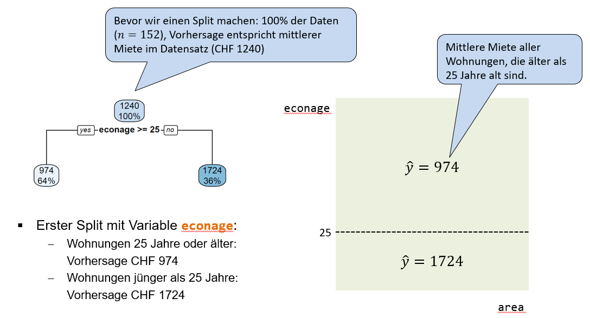
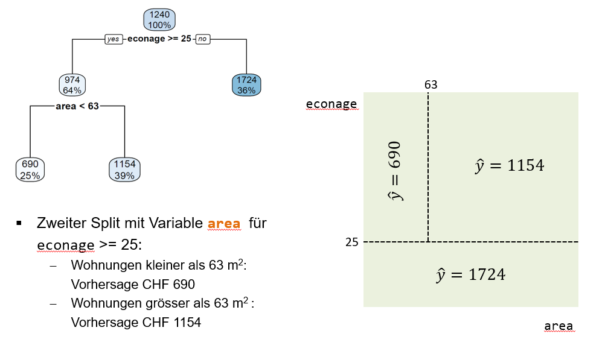
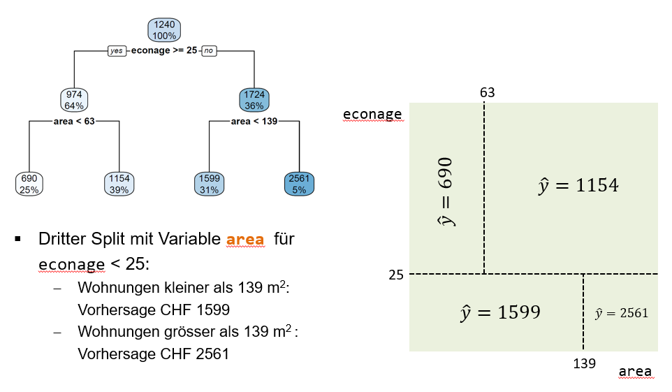
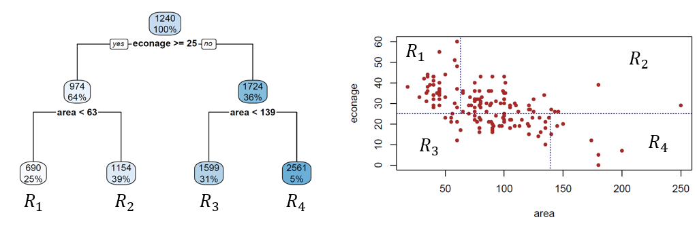

# Entscheidungsbäume {#sec-tree}

Wir lernen hier nun sogenannte Entscheidungsbäume (engl. *Decision Trees*) kennen. Entscheidungsbäume gehören zur Klasse der *nicht-parametrischen* Machine Learning Modelle (wie KNN), da die Anzahl Parameter des Modells nicht von vornherein klar ist und erst nach dem Modelltraining feststeht.

Entscheidungsbäume können sowohl für Regressions- als auch für Klassifikationsprobleme angewendet werden. Dementsprechend werden die spezifischen Modelle Regressionsbaum bzw. Klassifikationsbaum genannt. Wir werden uns hier ausführlich mit Regressionsbäumen beschäftigen und dann sehen, dass Klassifikationsbäume lediglich eine andere Kostenfunktion optimieren, aber sonst genau gleich funktionieren.

Entscheidungsbäume sind in der Praxis sehr beliebt, vorausgesetzt es geht ausschliesslich um die **Interpretierbarkeit**: wir werden sehen, dass Entscheidungsbäume sehr einfach und ansprechend visualisiert werden können. Wenn es allerdings darum geht, möglichst gute Vorhersagen zu machen, dann werden in der Praxis kaum Entscheidungsbäume angewendet, weil sie selten zu den am besten performenden Modellen gehören. Entscheidungsbäume gelten als **instabile Modelle**, d.h., sie ändern sich teilweise stark, wenn sich die Trainingsdaten verändern. Bäume haben also in der Regel hohe Varianz und wenig Bias (Bias-Variance Tradeoff). Wir werden aber in @sec-ensemble sehen, dass in der Praxis gut performende Modelle (sogenannte *Ensemble* Methoden) auf individuellen Entscheidungsbäumen aufbauen.

Um eine erste Intuition aufzubauen, schauen wir uns in folgender Abbildung den visuellen Unterschied zwischen dem Linearen Regressionsmodell (@sec-linreg) und einem Entscheidungsbaum für das **Regressionsproblem** mit einer Input-Variable $x_i$ an:

```{r tree-linreg, echo=FALSE, fig.show = 'hold', fig.cap='Links: trainierter Entscheidungsbaum für ein einfaches Regressionsproblem mit einer Input-Variable (dargestellt auf der x-Achse). Rechts: trainiertes lineares Regressionsmodell für dasselbe Regressionsproblem.', fig.width=12, fig.height=8, out.width='90%', fig.align='center', fig.alt='Baum vs. Lineare Regression.'}
library(tree)
# Setze den Seed für Reprodzierbarkeit
set.seed(123)
n <- 50
# Generiere Daten
x <- runif(n, 0, 1)
y <- 4 * (x - 0.5)^2 + rnorm(n, 0, 0.1)
# Kreiere Data Frames
train <- data.frame(y = y, x = x)
# Rechne Regressionsbaum und lin. Reg.
model_tree <- tree(y ~ x, data = train, control = tree.control(nobs = nrow(train), minsize = 10, mindev = 0.0))
model_lin <- lm(y ~ x, data = train)
# Data Frame für Zeichnen der Kurven
new <- data.frame(x = seq(0, 1, 0.001))
# Vorhersagen
pred_tree <- predict(model_tree, new)
pred_lin <- predict(model_lin, new)
# 2 plots side by side with smaller margins
par(mfrow = c(1,2), mar = c(3,3,2,1), mgp = c(2,0.7,0), pty = "s", cex = 1.4, cex.lab = 1.2, cex.axis = 1.2, cex.main = 1.3)
# Regression tree plot
plot(x, y, col = "steelblue", pch = 16, xlab = "x", ylab = "y", main = "Regression Tree")
lines(new$x, pred_tree, col = "rosybrown3", lwd = 3)
# Linear regression plot
plot(x, y, col = "steelblue", pch = 16, xlab = "x", ylab = "y", main = "Linear Regression")
lines(new$x, pred_lin, col = "rosybrown3", lwd = 3)
```

Wie den Streudiagrammen entnommen werden kann, ist der wahre Zusammenhang zwischen dem Input $x_i$ und der Outputvariable $y_i$  hier stark nicht-linear. Der Fit des linearen Regressionsmodells (rechter Plot) ist sehr schlecht, während ein Regressionsbaum zu einem relativ guten Fit führt (linker Plot). Wir können davon bereits ableiten, dass Entscheidungsbäume *flexibler* sind als das lineare Regressionsmodell. Dementsprechend wird die Gefahr des **Overfittings** bei Entscheidungsbäumen auch grösser sein als beim linearen Regressionsmodell.

Dieses Kapitel ist teilweise inspiriert durch [@islr, Kapitel 8] und [@Geron, Kapitel 6].

## Regressionsbäume

Wir widmen uns in einem ersten Schritt kurz der "Anatomie" von Entscheidungsbäumen. Danach überlegen wir uns, wie ein trainierter Entscheidungsbaum gelesen werden muss, so dass wir verstehen, wie das Modell Vorhersagen macht. In einem dritten Abschnitt befassen wir uns mit dem Modelltraining. Zu guter Letzt schauen wir uns noch kurz die mathematische Modellspezifikation an.

### Anatomie eines Entscheidungsbaums

Warum spricht man bei diesem Modell überhaupt von Bäumen? Weil die Visualisierung des Modells wie ein **umgekehrter Baum** aussieht (siehe Abbildung unten). Dementsprechend haben die verschiedenen Teile des "Baums" auch botanisch-inspirierte Namen.

Wir haben einen obersten Knoten, der **Root Node** genannt wird. Die inneren Knoten, nach denen weitere Splits folgen, werden **Internal Nodes** genannt. Die untersten Knoten, nach denen keine weiteren Splits folgen, werden **Leaf Nodes** genannt. Die Nodes sind durch sogenannte **Branches** verknüpft. Die **Tiefe** eines Baums entspricht der Anzahl von Ebenen, auf denen Splits durchgeführt werden.

{width=100% #fig-treeanatomy}

Doch was repräsentiert dieser Baum eigentlich? Der Baum repräsentiert eine Sequenz von **Splitting-Regeln** basierend auf den Input-Variablen. Wir können eine gegebene Beobachtung $\mathbf{x}_i$ vom Root Node aus durch den Baum "schicken". Bei jedem Node im Baum wird die Beobachtung basierend auf dem konkreten Input-Variablenwert entweder links oder rechts runtergeschickt. So endet die Beobachtung irgendwann in einem Leaf Node.

Etwas mathematischer ausgedrückt: der Baum repräsentiert eine **Segmentierung** des **Input Spaces** in **simple, rechteckige Regionen**. Wir werden das im nächsten Abschnitt anhand eines Beispiels demonstrieren.

### Wie liest man einen Baum?

Wir verwenden hier in der Folge den `housingrents` Datensatz, der $n = 152$ Beobachtungen zu Schweizer Wohnungen enthält. Die Outputvariable ist die Miete (`rent`). Die zwei wichtigsten Input-Variablen sind die Fläche einer Wohnung (`area`) sowie das ökonomische Alter einer Wohnung (`econage`). Eine weitere Input-Variable ist `nre`, dabei handelt es sich um eine binäre kategorische Variable, die den Wert 1 annimmt, falls eine Wohnung der Immobilienfirme NRE gehört und sonst 0. Der Datensatz ist im Dataframe `df`. Hier sind die ersten 6 Zeilen im Datensatz:

```{r, echo=FALSE}
df <- read.csv("data/housingrents.csv", sep = ";")
```

```{r}
head(df)
```

Die @fig-firstsplit (links) zeigt den Root Node sowie den ersten Split des Baums, der resultiert, wenn ein Regressionsbaum auf den `housingrents` Daten angewendet wird. Der Root Node enthält zwei Zahlen, einerseits die mittlere Miete über den ganzen Trainingsdatensatz (CHF 1240) und andererseits den Anteil von Trainingsbeobachtungen im Root Node. Dieser Anteil ist vor dem ersten Split noch 100%.

Der **erste Split** verwendet die Variable `econage` und den Splitpunkt 25. Alle Wohnungen, die min. 25 Jahre alt sind, gehen dem linken Branch entlang in den linken internen Node. Insgesamt landen so 64% der Trainingsbeobachtungen in diesem linken internen Node. Die durchschnittliche Miete für diese Beobachtungen beträgt CHF 974. Alle Wohnungen, die jünger als 25 Jahre alt sind, gehen dem rechten Branch entlang in den rechten internen Node. Das sind dementsprechend die restlichen 36% der Beobachtungen und deren mittlere Miete beträgt CHF 1724.

**Wichtig**: dieser erste Split **segmentiert** den Input Space nun in **zwei Regionen** (Rechtecke), wie im rechten Teil der Abbildung dargestellt. Das wichtigste Take-Away hier ist, dass ein Split im Baum einer Segmentierung des Input Spaces entspricht! Weil wir hier nur die Variablen `econage` und `area` betrachten, können wir diesen Input Space ohne Probleme in 2D visualisieren.

{width=100% #fig-firstsplit}

Der **zweite Split** geschieht beim linken internen Node (@fig-secondsplit). Dort splitten wir die 64% der Beobachtungen basierend auf der Input-Variable `area` in zwei Untergruppen. Der Splitpunkt liegt bei 63 Quadratmeter. Der linke Leaf Node enthält nun nur noch 25% der Beobachtungen und deren mittlere Miete beträgt CHF 690. Das macht Sinn, denn es handelt sich dabei um alte (25 Jahre oder älter) und kleine Wohnungen (kleiner als 63 Quadratmeter). Der rechte Leaf Node enthält 39% aller Beobachtungen und deren Mittelwert beträgt CHF 1154. Es handelt sich dabei um alte, aber relativ grosse Wohnungen.

Im rechten Teil der Abbildung sehen wir, dass dieser zweite Split den oberen Teil des Input Spaces weiter segmentiert in zwei Subregionen.

{width=100% #fig-secondsplit}

Der **dritte Split** geschieht im rechten internen Node und basiert ebenfalls auf der Input-Variable `area` (@fig-thirdsplit). Der Splitpunkt liegt bei 139 Quadratmeter. Dieser Split teilt also die eher neuen Wohnungen (erster Split) weiter auf in sehr grosse (grösser als 139 Quadratmeter) und weniger grosse (kleiner als 139 Quadratmeter) Wohnungen. Die mittlere Miete für die 31% der Beobachtungen im linken Leaf Node beträgt CHF 1599, während die mittlere Miete für die 5% der Beobachtungen im rechten Leaf Node CHF 2561 beträgt. Der dritte Split segmentiert das untere Reckteck im Input Space weiter.

{width=100% #fig-thirdsplit}

Der finale Baum sowie die finale Segmentierung des Input Spaces sehen wie folgt aus:

{width=100% #fig-finaltree}

Wir sehen, dass die drei Splits zu vier Leaf Nodes führen. 

::: {.callout-note}
## Decision Boundaries von Entscheidungsbäumen

Jeder Leaf Node entspricht einer Region im Input Space. Die blau gestrichelten Linien (@fig-finaltree), welche die Regionen voneinander trennen, sind die **Decision Boundaries** dieses Modells. Sie begrenzen die verschiedenen Regionen, in denen wir je unterschiedliche Vorhersagen machen.
:::

Die **Vorhersagen** unseres Baums sind nichts anderes als die **mittleren Mieten in den jeweiligen Regionen**. Überlegen wir uns das kurz anhand eines Beispiels: wir haben nun eine 15-jährige Wohnung mit einer Fläche von 110 Quadratmeter. Gemäss unserem Baum gehört diese Wohnung der Region $R_3$ an und dementsprechend wäre unsere Vorhersage für diese Wohnung CHF 1599. Dabei sehen wir gleich noch eine andere Eigenschaft von Entscheidungsbäumen: sie machen für alle Beobachtungen in derselben Region die gleiche Vorhersage. Oder in anderen Worten: **die Vorhersagen sind pro Region konstant**.

#### Fragen {.unnumbered}

* Was ist die Tiefe des nachfolgend abgebildeten Regressionsbaums?
* Was würde der abgebildete Regressionsbaum für eine Wohnung mit $econage=28$, $area=98$ und $rooms=4$ vorhersagen?
* Wie viele Entscheidungsregionen resultieren aus dem Regressionsbaum?

{width=80% #fig-treedepth}

::: {.callout-tip collapse="true"}
## Lösung

* Die Tiefe des Baums ist 4.
* Die Vorhersage für diese Wohnung wäre eine Miete von CHF 1185.
* Der Baum hat 10 Entscheidungsregionen, weil der Baum 10 Leaf Nodes hat.
:::

### Modelltraining

Nun haben wir oben bereits gesehen, wie ein fertig trainierter Entscheidungsbaum aussieht, wie er interpretiert werden muss und wie man damit Vorhersagen machen kann. Doch wie wird das Modell trainiert?

Das Ziel ist, einen Regressionsbaum zu finden, dessen Entscheidungsregionen zu einer **Minimierung** des **Mean Squared Errors** (MSE) führen. Wie bei der linearen Regression (@sec-linreg) ist also auch hier der MSE die Kostenfunktion, die es zu minimieren gilt.

Weil ein Regressionsbaum in jeder Region die gleichen Vorhersagen macht, schreiben wir die Kostenfunktion hier in einer speziellen Form auf:

$$
J = \frac{1}{n} \sum_{k=1}^K \sum_{i \in R_k} \left(y_i - \hat{y}_{R_k}\right)^2
$$

Die äussere Summe summiert über die Regionen $R_1, R_2, \dots, R_K$ und die innere Summe summiert *für jede Region* über die quadrierten Distanzen zwischen beobachteten und vorhergesagten Werten der Outputvariable. Ich hoffe, Sie sehen, dass es sich wirlich nur um den MSE handelt, einfach etwas speziell geschrieben wegen den Entscheidungsregionen des Baums.

Leider ist es hier nicht möglich dieses Minimierungsproblem genau (also analytisch) zu lösen, denn es gibt zu viele verschiedene (genauer gesagt: unendlich viele) Möglichkeiten, wie die Recktecke im Input Space angeordnet und kombiniert werden können.

Beim Training von Entscheidungsbäumen treffen wir deshalb einige vereinfachende Annahmen, um eine **Annäherung an die optimale Lösung** für das Minimum der Kostenfunktion zu finden. Der Trainingsalgorithmus wird *Recursive Binary Splitting* genannt. Dieser Algorithmus hat die Eigenschaft, dass er **greedy** ist. Doch was bedeutet all das?

* *Binary*: Jeder Split hat genau einen Splitpunkt und führt deshalb zu genau zwei "Child Nodes". Jeder Split entspricht also einer binären "entweder-oder" Entscheidung. Es gibt aus einem Split nur zwei mögliche Branches (und nicht drei, vier. oder mehr), die nach unten führen.
* *Recursive*: Jeder Split basiert auf dem vorangegangenen Split ein Level höher. Der zweite Split splittet also eine der resultierenden Regionen aus dem ersten Split. Wenn Sie nochmal zum zweiten Split beim `housingrents` Datensatz gehen, dann sehen Sie, dass der zweite Split lediglich die obere Region splittet und nicht den ganzen Input Space. Der zweite Split bezieht sich auf den ersten Split, ist also rekursiv.
* *Greedy*: wir optimieren in jedem Knoten immer nur den nächstmöglichen Split und schauen nicht weiter voraus bzw. den Baum runter. Der Algorithmus ist also in einem gewissen Sinn "geizig".

Am besten schauen wir uns diesen Trainingsalgorithmus wiederum anhand des `housingrents` Datensatzes an:

1. Wir rechnen den Wert der Kostenfunktion für jede Input-Variable und alle möglichen Splitpunkte $s$ und wählen diejenige Input-Variable mit Splitpunkt $s$, wo $J$ minimal ist. Wir sehen, dass `econage` mit $s=25$ zum kleinsten Wert für $J$ führt. Darum ist dies unser erster Split im Baum. Gleichzeitig können wir daraus ableiten, dass `econage` die wichtigste Input-Variable im Datensatz ist. Nachfolgend die Kostenfunktionswerte für ein paar mögliche Splitpunkte:  
    * `econage` mit $s=25$: $SQR = 331'686.3$  
    * `area` mit $s=63$: $SQR = 359'049$  
    * `nre` mit $s=0.5$: $SQR = 439'140.2$ (Schnittpunkt $s=0.5$ teilt die Beobachtungen in NRE und nicht-NRE)
    * Viele weitere Möglichkeiten...

2. Basierend auf den zwei Regionen aus dem ersten Split, wählen wir den zweiten Split so, dass wiederum $J$ minimiert wird. Es resultieren drei Regionen. Wir sehen, dass `area` mit $s=63$ der nächstbeste Split ist.  
    * `area` mit $s=63$: $SQR = 298'849$  
    * `nre` mit $s=0.5$: $SQR = 328'305$ 
    * Viele weitere Möglichkeiten...

3. Wir können so fortfahren bis ein **Stoppkriterium** erfüllt ist (z.B. maximale Tiefe des Baums erreicht).

Dieser Trainingsalgorithmus hat ein grosses Problem und zwar führt er zu einer krassen Form von **Overfitting**. Wenn wir den Algorithmus nicht begrenzen, dann splittet der Baum frisch fröhlich weiter bis er irgendwann so viele Leaf Nodes wie Beobachtungen hat und jeder Leaf Node genau den Wert der Trainingsbeobachtung vorhersagt. Der Baum hat dann zwar einen Kostenfunktionswert von 0 auf dem Trainingsdatensatz, würde auf einem Testdatensatz jedoch katastrophal schlechte Vorhersagen machen.

Die Lösung ist in der Praxis zum Glück einfach: wir müssen die **Komplexität** des Baums mittels eines Stoppkriteriums **beschränken** (siehe Schritt 3 im obigen Algorithmus). Folgende Kriterien zur Beschränkung sind möglich:

* Maximale Tiefe des Baums
* Minimale Anzahl Beobachtungen in einem Leaf Node
* Minimale Anzahl Beobachtungen in einem Internen Node
* Maximale Anzahl Leaf Nodes
* Viele weitere...

::: {.callout-note}
## Hyperparameter von Entscheidungsbäumen

All die oben aufgelisteten Stoppkriterien können wir als **Hyperparameter** unseres Modells interpretieren und dementsprechend können wir den optimalen Wert für ein gegebenes Stoppkriterium mittels Hyperparameter Tuning bestimmen. Eine alternative Lösung, welche in der Literatur manchmal besprochen wird, wäre **Tree Pruning**.
:::

In nachfolgender Abbildung trainieren wir einen Regressionsbaum auf einem simplen Datensatz mit einer Input-Variable. Wir beschränken den Baum mittels der **minimalen Anzahl Beobachtungen in einem internen Knoten** (`minsize` im R-Package `tree`). Wenn dieses Kriterium auf 2 gesetzt wird, dann kann der resultierende Baum die Daten perfekt abbilden.

```{r stopp-criteria, echo=FALSE, fig.show = 'hold', fig.cap='Links: Streudiagramme der Trainingsdaten mit dem Outputwert auf der y-Achse und dem Inputwert auf der x-Achse. Die rotbraunen Kurven repräsentieren die trainierten Entscheidungsbäume auf dem Datensatz. Die vertikalen Geraden splitten den Wertebereich der Input-Variable in verschiedene Entscheidungsregionen auf. Rechts: Vorhersagegüte (gemessen als RMSE) auf Trainings- und Testdaten. Für die Testdaten wurden weitere $n$ Beobachtungen generiert, die aber nicht für das Training verwendet wurden.', fig.width=12, fig.height=14, out.width='100%', fig.align='center', fig.alt='Einfluss von Stoppkriterium auf Modellfit.'}
suppressPackageStartupMessages(
  library(tree)
)

## -----------------------
## One scenario = one row
## -----------------------
run_scenario <- function(n, min_nodes) {
  # Daten
  set.seed(123)
  xtrain <- runif(n, 0, 1)
  ytrain <- 4 * (xtrain-0.5)^2 + rnorm(n, 0, 0.1)
  xtest <- runif(n, 0, 1)
  ytest <- 4 * (xtest-0.5)^2 + rnorm(n, 0, 0.1)
  train <- data.frame(y = ytrain, x = xtrain)
  test <- data.frame(y = ytest, x = xtest)
  # Rechne Regressionsbaum
  model <- tree(y ~ x, data = train, control = tree.control(nobs = n, minsize = min_nodes, mindev = 0.0))
  # Data Frame für Zeichnen der Kurven
  new <- data.frame(x = seq(0, 1, 0.001))
  # Vorhersagen
  pred_curves <- predict(model, new)
  pred_train <- predict(model, train)
  pred_test <- predict(model, test)
  # Segmentierung
  temp1 <- pred_curves[-1]
  temp2 <- pred_curves[-length(pred_curves)]
  rmse <- c(
    Train = sqrt(mean((ytrain - pred_train)^2)),
    Test  = sqrt(mean((ytest  - pred_test)^2))
  )
  ## ---- Left panel: data + fit ----
  par(mar = c(5, 4, 3, 1))
  plot(
    xtrain, ytrain,
    pch = 16, cex = 2, col = "steelblue",
    ylim = c(0, 1),
    xlab = "x", ylab = "y",
    main = paste("n =", n, ", min_nodes =", min_nodes)
  )
  lines(seq(0, 1, 0.001), pred_curves, type = "l", col = "rosybrown3", lwd = 2)
  # Decision Boundaries
  abline(v = new[which(temp1 != temp2), ], lty = 2, col = "grey")
  ## ---- Right panel: RMSE ----
  par(mar = c(5, 3, 3, 1))
  barplot(
    rmse,
    main = "RMSE",
    col = "azure2",
    ylim = c(0, 0.4)
  )
  abline(h = 0, lwd = 2)
  text(
    x = c(0.7, 1.9),
    y = 0.025,
    labels = round(rmse, 2),
    pos = 3, cex = 1.3
  )
}

## -----------------------
## Layout: 3 rows × 2 cols
## -----------------------
layout(
  matrix(1:6, nrow = 3, byrow = TRUE),
  widths = c(2, 1)
)

par(
  cex.axis = 1.4,
  cex.lab  = 1.5,
  cex.main = 1.6
)

## -----------------------
## Scenarios
## -----------------------
run_scenario(n = 50,  min_nodes = 2)
run_scenario(n = 50,  min_nodes = 10)
run_scenario(n = 50, min_nodes = 51)

layout(1)
```

#### Fragen {.unnumbered}

* Welche der obigen Abbildungen repräsentiert Overfitting?
* Welche Underfitting?

::: {.callout-tip collapse="true"}
## Lösung

* Die erste Abbildung ist ein klares Beispiel von Overfitting. Der Baum darf so lange weiter splitten, bis interne Nodes nur noch minimal zwei Beobachtungen enthalten. Weil die Beschränkung für interne Nodes gilt, heisst das, dass die danach folgenden Leaf Nodes nur noch je eine Beobachtung enthalten. Der Datensatz wurde so segmentiert, dass jede Entscheidungsregion nur noch eine Trainingsbeobachtung enthält. Dementsprechend ist der RMSE auf den Trainingsdaten 0.
* Die letzte Abbildung ist ein klares Beispiel von Underfitting. In diesem Fall müssen interne Nodes mindestens 51 Beobachtungen enthalten. Mit $n=50$ darf das Modell dementsprechend nicht mal nach dem Root Node einen ersten Split machen. Das führt zu einer einzigen Entscheidungsregion, nämlich dem ganzen Wertebereich von $x$. Und überall wird $\bar{y}$, also der Mittelwerte über die Outputwerte im Traininsdatensatz vorhergesagt.
:::

### Modellspezifikation

Wir hatten in diesem Abschnitt im Vergleich zu vorherigen Kapitel eine etwas komische Reihenfolge und kommen nun erst zum Schluss auf die Modellspezifikation zu sprechen. Auch dieses nicht-parametrische Modell kann mathematisch spezifiziert werden und zwar wie folgt:

$$
f(\mathbf{x}_i) = \sum_{k=1}^K \hat{y}_{R_k} \cdot \mathbb{1}_{\{\mathbf{x}_i \in R_k\}}
$$

Wir summieren also über die Entscheidungsregionen $R_k$. $\hat{y}_{R_k}$ ist der Durchschnitt über die Werte der Outputvariable der Trainingsbeobachtungen in Region $k$. Die Funktion $\mathbb{1}_{\{\mathbf{x}_i \in R_k\}}$ ist die sogenannte **Indikatorfunktion**, die nur genau dann den Wert 1 annimmt, wenn die Beobachtung $\mathbf{x}_i$ in Region $R_k$ liegt.

Beispiel: wir haben drei Regionen $R_1, R_2, R_3$ mit entsprechenden Mittelwerten $\hat{y}_{R_1}=500$, $\hat{y}_{R_2}=750$ und $\hat{y}_{R_3}=1000$. Nun haben wir eine neue Beobachtung $\mathbf{x}_i$, die gemäss unserem Baum der Region 2 angehört. Der Funktionswert ist dementsprechend:

$$
\hat{f}(\mathbf{x}_i) = 500 \cdot 0 + 750 \cdot 1 + 1000 \cdot 0 = 750
$$

## Klassifikationsbäume

Klassifikationsbäume funktionieren vom Prinzip her fast gleich wie Regressionsbäume. Auch hier versuchen wir den Input Space (mit rechteckigen Formen) so zu segmentieren, dass die resultierenden Regionen die kategorische Outputvariable möglichst gut klassifizieren. Es gibt jedoch **zwei zentrale Unterschiede** im Vergleich zum Regressionsproblem:

* Die **Vorhersage** in einer Region $R_k$ entspricht nicht wie beim Regressionsbaum dem Mittelwert über die Outputvariable, sondern der **am häufigsten vorkommenden Output-Kategorie** in der Entscheidungsregion $R_k$.
* Der Trainingsalgorithmus minimiert nicht den MAE, sondern den **Gini Index**. Der Gini Index ist ein Mass für die "Reinheit" in einem Leaf Node. Warum ist das ein gutes Gütekriterium? Ein perfekter Baum hat in jedem Leaf Node nur noch Beobachtungen einer Kategorie. In dem Fall ist die "Reinheit" maximal. Schauen wir uns doch kurz die Formel für die Berechnung des Gini Indexes (für die $k$-te Entscheidungsregion $R_k$) an:
  
  $$
  G_k = \sum_{l=1}^L \hat{p}_{kl} \cdot (1-\hat{p}_{kl})
  $$
  $\hat{p}_{kl}$ beschreibt hier den Anteil der $l$-ten Output-Kategorie in der $k$-ten Entscheidungsregion $R_k$. Die Gesamtkostenfunktion ist dann einfach die Summe über die Gini Indizes in den verschiedenen Regionen, also $\sum_k G_k$.

#### Fragen {.unnumbered}

* Wir haben ein binäres Klassifikationsproblem und wollen vorhersagen, ob jemand zahlungsunfähig wird oder nicht. In einer Entscheidungsregion des Baums haben wir 20 Beobachtungen, davon 15, die nicht zahlungsunfähig werden. Was ist der Wert des Gini Indexes in dieser Region?
* Welchen Wert hat der Gini Index, wenn eine Entscheidungsregion nur noch Beobachtungen einer Kategorie enthält?

::: {.callout-tip collapse="true"}
## Lösung

Die Lösung für die erste Frage rechnet sich wie folgt:

\begin{align}
G_k &= \sum_{l=1}^L \hat{p}_{kl} \cdot (1-\hat{p}_{kl})\\ 
&= \frac{5}{20} \cdot \left(1-\frac{5}{20}\right) + \frac{15}{20} \cdot \left(1-\frac{15}{20}\right)\\
&= 2 \cdot \frac{5}{20} \cdot \frac{15}{20}\\ 
&= \frac{150}{400} = 0.375
\end{align}

Wenn eine Entscheidungsregion nur noch Beobachtungen einer Kategorie enthält, dann ist deren Anteil $\hat{p}=1$. Daraus ergibt sich folgende Gini Index Berechnung: $1 \cdot (1 - 1) + 0 \cdot (1 - 0) = 0$. Das ist auch gut so, denn wir wollen den Gini Index als eine Kostenfunktion interpretieren. Wir haben nur dann Kosten von 0, wenn eine Entscheidungsregion nur noch Beobachtungen einer Output-Kategorie enthält.
:::

::: {.callout-caution collapse="true"}
## Entropie (optional)

Eine Alternative zum Gini Index als Kostenfunktion ist die **Entropie**. Für die $k$-te Entscheidungsregion $R_k$ rechnet sie sich wie folgt:

$$
H_k = - \sum_{l=1}^L \hat{p}_{kl} \cdot \log_2\,\left(\hat{p}_{kl}\right)
$$
Die Unterschiede zwischen dem Gini Index und Entropie als Kostenfunktion sind in der Praxis meist nicht von grosser Relevanz, aber es kann sich trotzdem lohnen, beide auszuprobieren und mittels Cross-Validation zu überprüfen, welche davon besser funktioniert.
:::

Drei wichtige Punkte gilt es noch zu erwähnen:

* Wie bei der logistischen Regression gesehen (@sec-linclass), geben uns die meisten Klassifkationsmodelle eine **Wahrscheinlichkeit** zurück, dass die Outputvariable $y_i$ der ersten Kategorie angehört ($y_i=1$). Das ist auch für Klassifikationsbäume möglich. Anstelle der am häufigsten vorkommenden Kategorie (*hard prediction*) können wir uns vom Baum auch die **relativen Anteile** der Kategorien in einer Entscheidungsregion (bzw. einem Leaf Node) ausgeben lassen (*soft predictions*). Diese Anteil können als Wahrscheinlichkeiten für die verschiedenen Kategorien interpretiert werden.
* Ein Klassifikationsbaum ist nicht auf eine binäre Outputvariablen limitiert und kann problemlos auf **mehrklassige Outputvariablen** angewendet werden.
* **Kategoriale Input-Variablen** sind übrigens auch problemlos in Bäumen verwendbar. Beispiel: wir haben eine Input-Variable *Augenfarbe* mit drei möglichen Kategorien "blau", "grün" und "braun". Der Trainingsalgorithmus testet in diesem Fall alle möglichen Splits, hier sind es folgende drei:
    * "blau" vs. "grün" oder "braun"
    * "grün" vs. "blau" oder "braun"
    * "braun" vs. "blau" oder "grün".

Schauen wir uns zum Schluss dieses Abschnitts an, wie ein Klassifikationsbaum unser Beispiel mit zwei Input-Variablen aus @sec-linclass segmentiert. Ich habe hier das R-Package `tree` verwendet und das Argument `minsize` auf 10 gesetzt (d.h., ein interner Knoten darf nicht weniger als 10 Beobachtungen enthalten):

```{r tree-2D, echo=FALSE, fig.show = 'hold', fig.cap='Decision Boundary für einen Threshold von 50% (bzw. 0.5) für einen Klassifikationsbaum mit `minsize = 10`.', out.width='60%', fig.asp=1, fig.align='center', fig.alt='DB für zwei Input-Variablen (Klassifikationsbaum).'}
library(latex2exp)
library(MASS)
n <- 50
thres <- 0.5
set.seed(2)
Sigma1 <- matrix(c(1,0,0,1.5), 2, 2)
Sigma2 <- matrix(c(1,0.5,0.5,1), 2, 2)
class1 <- mvrnorm(n/2, mu = c(4, 4), Sigma1)
class2 <- mvrnorm(n/2, mu = c(6, 6), Sigma2)
df <- data.frame(rbind(class1, class2))
df$y <- c(rep(0, n/2), rep(1, n/2))
cols <- c(rep(rgb(1, 0, 0, 0.4), n/2), rep(rgb(0, 0, 1, 0.4), n/2))
model <- tree(y ~ X1 + X2, data = df, control = tree.control(nobs = n, minsize = 10, mindev = 0.0))
par(oma = c(0.5, 0.5, 0.5, 0.5), pty = "s")
par(mar = c(4, 5, 0.5, 0.5))
plot(1, 1,
     axes = F, ylim = c(0, 10), xlim = c(0, 10),
     xlab = TeX(r'($x_{i2}$)'), ylab = TeX(r'($x_{i1}$)'),
     type = "n", xaxs = "i", yaxs = "i",
     cex = 2, cex.lab = 1.5, cex.axis = 1.5)
box(lwd = 1)
axis(side = 1, at = seq(0, 10, 2), labels = seq(0, 10, 2), cex.axis = 1.5)
axis(side = 2, at = seq(0, 10, 2), labels = seq(0, 10, 2), cex.axis = 1.5)
x1 <- seq(0, 10, len = 300)
x2 <- seq(0, 10, len = 300)
grid <- expand.grid(X1 = x1, X2 = x2)
z <- matrix(predict(model, grid), nrow = 300, byrow = TRUE)
image(x2, x1, z,  col = c(rgb(1,0,0,.1), rgb(0,0,1,.1)), breaks = c(0, .5, 1), add = TRUE)
contour(x2, x1, z, levels = .5, add = TRUE, drawlabels = FALSE, lwd = 2, col = "grey")
points(df$X2, df$X1, pch = 16, cex = 2, col = cols)
```

Wir sehen hier auch gleich zwei Probleme von Bäumen: 

* Die resultierende Decision Boundary ist viel zu kompliziert für dieses Beispiel (**Overfitting**).
* Die Decision Boundary ist begrenzt auf lineare Segmente, die in einem **rechten Winkel zu den Achsen** verlaufen. Das ist eine starke Limitierung dieses Modells.

Nachfolgend der gefittete Baum:

```{r tree-print, echo=FALSE}
print(model)
```

#### Frage {.unnumbered}

Versuchen Sie den obigen R-Output gut zu verstehen. Sehen Sie die Splits im Input Space oben repräsentiert. Warum fehlt der Split repräsentiert durch `6)` und  `7)`?

::: {.callout-tip collapse="true"}
## Lösung

Der **erste Split** des Baums ist im R-Output durch `2)` und  `3)` repräsentiert und bezieht sich auf die erste Input-Variable. Im Input Space entspricht der Split dem horizontalen Segment auf der Höhe 5.25.

Der **zweite und dritte Split** des Baums ist im R-Output durch `4)` und  `5)` respektive `6)` und  `7)` repräsentiert. Beide beziehen sich auf die zweite Input-Variable.

Der zweite Split ist im Input Space repräsentiert durch das vertikale Segment auf der Höhe 4.66 (im unteren, roten Teil des Input Space). 

Der dritte Split ist im Input Space **nicht** repräsentiert. Warum nicht? Wenn Sie den Split in `6)` und  `7)` genau anschauen, dann sehen Sie, dass in beiden Regionen der Anteil der blauen Beobachtungen über 0.5 liegt (0.67 und 1.0). Das bedeutet, dass dieser Split mit einem Threshold von 0.5 keinen Einfluss auf die Decision Boundary hat.

Der **vierte Split** des Baums ist im R-Output durch `10)` und  `11)` repräsentiert und bezieht sich auf die zweite Input-Variable. Im Input Space entspricht der Split dem vertikalen Segment auf der Höhe 5.92.
:::

## Entscheidungsbäume in R

Wir illustrieren die Anwendung von Entscheidungsbäumen anhand des **Heart** Datensatzes, der auch in [@islr, Kapitel 8] verwendet wird und sich sehr gut eignet. Der ursprüngliche Datensatz kann vom [UC Irvine ML Repository](https://archive.ics.uci.edu/ml/datasets/heart+disease) heruntergeladen werden. Eine vorverarbeitete Version des Datensatzes, die wir unten verwenden, kann [hier](data/heart.rds) heruntergeladen werden.

Der Datensatz enthält diverse Angaben zu 303 Patientinnen und Patienten, die mit Herzproblemen in ein Spital eingeliefert wurden. Unser Ziel ist es, aufgrund von verschiedenen Attributen vorherzusagen, ob eine Patientin oder ein Patient eine Herzerkrankung hat.

```{r, echo=FALSE}
heart <- readRDS("data/heart.rds")
```

Der Datensatz umfasst folgende Variablen:

* `age`: Alter
* `sex`: Geschlecht
* `cp`: Art der Brustkorbschmerzen, 4 Kategorien
* `trestbps`: systolischer Blutdruck
* `chol`: Cholesterin-Wert im Blut
* `fbs`: Blutzuckerwert (gemessen am Morgen auf nüchternen Magen) grösser als 120 mg/dl? (yes / no)
* `restecg`: EKG Resultate, 3 Kategorien
* `thalach`: Maximale erreichte Herzfrequenz
* `exang`: Durch Sport ausgelöstes Angina (reduzierte Blutzufuhr zum Herz)? (yes / no)
* `oldpeak`: Parameter der EKG Messung
* `slope`: Parameter der EKG Messung, 3 Kategorien
* `ca`: Anzahl Hauptarterien
* `thal`: Thallium Stress Test Resultate (wie gut fliesst Blut zum Herz?), 3 Kategorien
* `hd`: Herzerkrankung? (yes / no) - Outputvariable

Laden wir als erstes die nötigen R-Packages.

```{r, output=FALSE}
library(rpart.plot)
library(tidyverse)
library(tidymodels)
```

Als nächstes überprüfen wir kurz, ob der Dataframe fehlende Werte enthält:

```{r}
# Fehlende Werte?
sapply(heart, function(x) sum(is.na(x)))
```

Wir sehen, dass die Variable `ca` 4 fehlende Werte und die Variable `thal` zwei fehlende Werte enthält. Ein weiterer Vorteil von Entscheidungsbäumen ist, dass sie gut mit fehlenden Werten umgehen können. Was effektiv passiert, ist folgendes: wenn in einem Split eine Variable verwendet wird, welche fehlende Werte enthält, dann wird für die Beobachtungen mit fehlenden Werten eine andere Variable (sogenanntes **Surrogat**) für den Split verwendet, welche möglichst ähnliche Entscheidungen trifft wie die eigentliche Splitvariable.

Als nächstes stellen wir sicher, dass wir keine starke **Imbalance** in der Outputvariable haben:

```{r}
# Ist der Datensatz balanced?
heart |>
  count(hd) |>
  mutate(prop = n / sum(n))
```

Das sieht gut aus. Ein Verhältnis von 54% Nein (keine Herzerkrankungen) zu 46% Ja (Herzerkrankungen) in der Outputvariable ist akzeptabel.

Wir machen hier ausnahmsweise **keinen Train-Test Split**, da es hier lediglich darum geht, die Anwendung von Entscheidungsbäumen zu demonstrieren. In einem richtigen ML-Projekt würden wir allerdings spätestens hier einen Train-Test Split vollziehen.

Stattdessen erstellen wir 5 Folds, um die optimalen Hyperparameter mit 5-Fold Cross-Validation zu finden.

```{r}
# Seed für Reproduzierbarkeit
set.seed(123)

# 5-Fold CV
folds <- vfold_cv(heart, v = 5, repeats = 1, strata = hd)
```

Nun spezifizieren wir das Modell mit der Funktion `decision_tree()` aus `tidymodels`. Wir werden hier die Hyperparameter `tree_depth` (Tiefe des Baums) und `min_n` (minimale Anzahl Beobachtungen in einem Node) tunen. Den Hyperparameter `cost_complexity` setzen wir auf 0 (diesen würden wir für das Pruning eines Baums verwenden). Wir spezifizieren ausserdem, dass es sich um ein Klassifikationsproblem handelt und dass wir das R-Package `rpart` für das Fitting verwenden wollen.

```{r}
# Spezifikation des Classification Trees
dt_mod <-
  decision_tree(tree_depth = tune(), min_n = tune(), cost_complexity = 0) |>
  set_mode("classification") |>
  set_engine("rpart")
```

Im Workflow definieren wir unter anderem die Modellgleichung `hd ~ .`, d.h. die Variable `hd` ist die Outputvariable und alle anderen werden als Input-Variablen verwendet.

```{r}
# Workflow
dt_workflow <-
  workflow() |>
  add_model(dt_mod) |>
  add_formula(hd ~ .)
```

Wir erstellen einen Tuning Grid für die beiden Hyperparameter, die wir tunen wollen:

```{r}
# Tuning Grid
dt_grid <- expand.grid(tree_depth = seq(1, 10, by = 2), min_n = seq(10, 30, 5))

# Wie sieht Grid aus?
print(dt_grid)
```

Nun sind wir bereit, das Modell zu fitten und das Hyperparameter Tuning durchzuführen. Wir verwenden sowohl die Fläche unter der ROC-Kurve als auch die Accuracy, um die Modellgüte zu messen:

```{r}
# Tuning / Model Fitting
dt_res <-
  dt_workflow |>
  tune_grid(
    resamples = folds,
    grid = dt_grid,
    control = control_grid(save_pred = TRUE, save_workflow = TRUE),
    metrics = metric_set(roc_auc, accuracy))
```

Schauen wir uns doch die besten 10 Hyperparameter Werte gemäss ROC AUC Kriterium an:

```{r}
# Wir sortieren die Hyperparameter Spezifikationen nach ROC AUC
dt_res |>
  show_best(metric = "roc_auc", n = 10) |>
  arrange(desc(mean))
```

Nun fitten wir den optimalen Decision Tree (`tree_depth = 5` und `min_n = 20`) auf dem ganzen Datensatz, so dass wir den letzten optimalen Fit kriegen:

```{r}
# Last Fit (auf ganzem Trainingsdatensatz)
last_dt_fit <- fit_best(dt_res)
```

Wir können uns den Last Fit mal ausgeben lassen:

```{r}
# Last Fit
last_dt_fit
```

Hmm, etwas schwierig da den Überblick zu behalten. Mithilfe des R-Packages `rpart.plot` können wir den finalen Baum plotten, so dass er einfacher lesbar wird:

```{r, warning=FALSE}
# Plot des finalen Baums
last_dt_fit |>
  extract_fit_engine() |>
  rpart.plot()
```

Jeder Knoten im Baum enthält drei Informationen: erstens die Vorhersage, die der Baum in diesem Knoten machen würde, zweitens den relativen Anteil an Beobachtungen mit Herzerkrankung und drittens den gesamten relativen Anteil von Beobachtungen, welche in diesem Knoten landen. Anhand der Anzahl Leaf Nodes sehen wir, dass dieser Baum den Input Space in **13 Entscheidungsregionen** aufteilt.

Nun plotten wir noch die ROC-Kurve für das finale Modell:

```{r}
# ROC Kurve für finalen Baum
dt_auc <-augment(last_dt_fit, new_data = heart) |>
  roc_curve(hd, .pred_yes, event_level = "second")

# ROC Kurve
autoplot(dt_auc)
```

Mithilfe der Funktion `predict()` können wir basierend auf dem finalen Baum Vorhersagen für neue Beobachtungen machen. Hier tun wir das der Einfachheit halber für die fünfte Beobachtung im Datensatz `heart`. **Wichtig**: mit `type = "class"` kriegen wir eine *hard prediction* für die Beobachtung, während wir mit `type = "prob"` die *soft prediction* kriegen, also die Anteile von "yes" und "no" im Leaf Node (bzw. der Entscheidungsregion), in dem die fünfte Beobachtung landet.

```{r}
# Vorhersagen
predict(last_dt_fit, new_data = heart[5, ], type = "class")
predict(last_dt_fit, new_data = heart[5, ], type = "prob")
```

Wir sind uns bei dieser Person ziemlich sicher, dass **keine Herzerkrankung** vorliegt.
