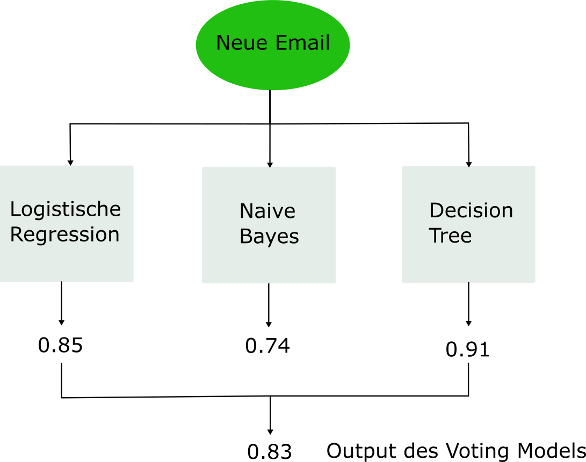

# Ensembles {#sec-ensemble}

Ein Ensemble Modell ist ein Modell, das auf vielen verschiedenen **individuellen Regressions- oder Klassifikationsmodellen** aufbaut, also ein Ensemble von individuellen Modellen. Der Grossteil der Ensemble Modelle verwendet als individuelle Modelle **Entscheidungsbäume**. Konkret heisst das, dass die Vorhersagen der individuellen Entscheidungsbäume in geeigneter Form **aggregiert** werden. Eine schöne Analogie für Ensemble Methoden ist das Konzept **Wisdom of the Crowd**: wir kombinieren das "Wissen" von vielen verschiedenen Modellen zu einem starken Ensemble.

Der Vorteil von diesem Vorgehen ist, dass Ensemble Modelle oft (viel) bessere Vorhersagen machen als ein individueller Entscheidungsbaum. Tatsächlich ist es so, dass Ensemble Modelle sogar dann gut funktionieren, wenn die individuellen Modelle des Ensembles nur leicht bessere Vorhersagen als der Zufall machen. Man spricht darum manchmal von Ensembles von **Weak Lerners**.

Ensemble Modelle sind (neben Modellen aus dem Deep Learning) die wettbewerbsfähigsten Modelle in der Praxis. Der Nachteil ist, dass wir mit Ensemble Modellen stärker in den Bereich von **Black-Box** Modellen vorrücken. Das heisst, es wird nun schwieriger, die Einflüsse der Input-Variablen auf unsere Zielvariable genau zu verstehen.

Doch warum funktionieren Ensembles so gut? Hier hilft eine Analogie zur **klassischen Statistik**, die in [@islr, Kapitel 8] gut dargelegt wird. Wir nehmen an, wir haben eine Stichprobe von $n$ Beobachtungen (z.B. Hauspreise).

* Die Standardabweichung $\hat{\sigma}$ besagt, wie stark eine einzelne Beobachtung im Schnitt vom Stichprobenmittelwert abweicht.
* Der Standardfehler des Mittelwerts $\frac{\hat{\sigma}}{\sqrt{n}}$ besagt, wie stark der Stichprobenmittelwert im Schnitt vom wahren (unbekannten) Populationsmittelwert abweicht.

Die Standardabweichung $\hat{\sigma}$ sagt also etwas über die Streuung von einzelnen Beobachtungen aus, während der Standardfehler des Mittelwerts etwas über die Streuung des Mittelwerts aussagt. Durch das **Mitteln** (Berechnung des Mittelwerts) wird die Streuung (Varianz) um den Faktor $1/\sqrt{n}$ reduziert. Bei Ensemble Modellen passiert etwas ähnliches: indem wir die Vorhersagen von vielen individuellen Modellen **mitteln**, reduziert sich die **Varianz**, während der Bias nicht wesentlich ansteigen sollte. Basierend auf dem Bias-Variance Tradeoff können wir ableiten, dass ein Ensemble Modell mit geringerer Varianz auch zu besseren Vorhersagen führen sollte.

::: {.callout-note}
## Voraussetzung für obiges Resultat

Die Formel für den Standardfehler des Mittelwerts in der klassischen Statistik gilt nur, wenn die $n$ Beobachtungen in der Stichprobe unabhängig sind.

Auch dieses Resultat lässt sich auf Ensemble Modelle übertragen: **je unabhängiger** die individuellen Modelle voneinander sind, **desto stärker** ist die Reduktion in der Varianz und desto besser die Vorhersagen des Ensembles.
:::

Eine ganz simple Form von Ensembles sind sogenannnte **Voting Modelle**. In vielen Projekten trainieren wir mehrere Modelle und entscheiden uns dann für das beste Modell. Doch warum nicht alle trainierten Modelle verwenden? Genau das ist die Idee von Voting Modellen. Die Idee könnte simpler nicht sein: wir lassen jedes unserer Modelle eine Vorhersage machen (*hard* oder *soft*) und kombinieren die individuellen Vorhersagen zu einer aggregierten Vorhersage. Das Prinzip eines solchen Modells ist in folgender Abbildung anhand des Spam Filters illustriert:

{width=60% #fig-votingclassifier}

Auch dieses Kapitel ist teilweise inspiriert durch [@islr, Kapitel 8] und [@Geron, Kapitel 7].

## Bagging

Wir haben in der Einführung bereits gelernt, dass ein Ensemble vor allem dann gut funktioniert, wenn die individuellen Modelle, über die aggregiert wird, **möglichst unabhängig** sind. Es gibt beispielsweise folgende zwei Wege, wie wir versuchen, möglichst viel Unabhängigkeit zwischen den individuellen Modellen herzustellen:

1. Wir rechnen effektiv unterschiedliche Modelle wie beim Voting Modell oben gesehen.
2. Wir rechnen jedes mal dasselbe Modell, aber stets auf einem anderen Subset des Trainingsdatensatzes.

Ein Ansatz nach zweitem Muster ist das sogenannte **Bootstrap Aggregating** (Bagging). Beim Bagging generieren wir eine grosse Anzahl $B$ **verschiedener Subsets** aus dem Trainingsdatensatz und lernen für jedes Subset einen Entscheidungsbaum. Jeder so trainierte Baum wird anders aussehen, da sie alle auf unterschiedlichen Trainingsdatensätzen trainiert wurden: nichts anderes als eine Manifestation der **hohen Varianz** individueller Bäume.

Durch das Aggregieren der Vorhersagen dieser Bäume wird die Varianz des Ensembles aber substanziell kleiner sein. Im Idealfall resultieren so massiv bessere Vorhersagen des Ensembles. Bevor wir weitermachen, müssen wir uns zuerst mal überlegen, wie wir aus einem gegebenen Traininsdatensatz Subsets generieren.

### Bootstrap

Für die Generierung von unterschiedlichen Subsets des Trainingsdatensatzes wird beim Bagging eine altbekannte Technik aus der Statistik angewendet, nämlich der **Bootstrap**.

Bootstrapping wird in der klassischen Statistik angewendet, um die Unsicherheit einer Schätzung (d.h. deren Varianz oder Standardabweichung) zu berechnen, wenn es keine analytischen Lösung gibt um die Unsicherheit zu beziffern.

::: {.callout-note}
## Wie funktioniert Bootstrapping?

Bootstrapping ist im Prinzip eine besondere Art von **Sampling**: wir ziehen zufällig $n$ Beobachtungen aus einem Datensatz der Grösse $n$ **mit Zurücklegen**. Das Zurücklegen ist der zentrale Aspekt: dadurch werden gewisse Beobachtungen mehr als einmal in unserem Bootstrap Sample landen und gewisse Beobachtungen gar nicht. Nur so kriegen wir unterschiedliche Bootstrap Samples.

Typischerweise ziehen wir insgesamt $B$ solche Bootstrap Samples (z.B. $B=1000$) und kriegen so viele **verschiedene Subsets** unseres Datensatzes. Jedes Subset hat haber gleich viele Beobachtungen ($n$) wie der Ursprungsdatensatz.
:::

Am besten lässt sich das Prinzip des Bootstrappings anhand eines einfachen Beispiels illustrieren. Wir haben folgende Stichprobe der Grösse $n=10$:

$$
\{525, 1081, 784, 556, 612, 1563, 886, 978, 648, 1025\}
$$
Sie können sich vorstellen, dass es sich hier um die Gesamtausgaben von Kund:innen bei einem Onlinehändler handelt. Es ist hier problemlos möglich, die mittleren Ausgaben sowie den Standardfehler des Mittelwerts zu berechnen. 

Der Mittelwert ist $\bar{x}=865.8$ und der Standardfehler des Mittelwerts $s_{\bar{x}}$ kann selbstverständlich analytisch berechnet werden:

$$
s_{\bar{x}}=\frac{\hat{\sigma}}{\sqrt{n}}=\frac{316.47}{\sqrt{10}}\approx 100
$$

Manchmal gibt es aber keine analytische Formel, um die Unsicherheit einer Schätzung zu beziffern. In diesen Fällen kann die Boostrap Technik enorm hilfreich sein. Die folgende Abbildung zeigt, wie wir den Standardfehler des Mittelwerts mithilfe des Bootstraps approximieren können:

{width=90% #fig-boot2}

Mit $B=1000$ kriegen wir 1000 Bootstrap Samples. Für jedes Sample rechnen wir den geschätzten Mittelwert. Der Mittelwert über alle Mittelwerte ergibt ca. 870, aber das ist nicht, was uns hier primär interessiert. Die *Standardabweichung* über die 1000 Mittelwerte, die wir basierend auf den Bootstrap Samples rechnen, gibt uns eine Schätzung für den *Standardfehler des Mittelwerts*. Unsere Bootstrap Schätzung (95) ist nicht weit entfernt von der analytischen Lösung (100)!

Das Bootstrapping ist übrigens ganz einfach in `R` umsetzbar:

```{r}
# Stichprobe
data <- c(525, 1081, 784, 556, 612, 1563, 886, 978, 648, 1025)

# B festlegen
B <- 1000

# Seed für Reprodzierbarkeit des Samplings
set.seed(123)

# Bootstrap Sampling (bs enthält die 1000 geschätzten Mittelwerte)
bs <- sapply(1:B, function(x) mean(sample(x = data, size = length(data), replace = TRUE)))

# Approximation des Standardfehlers des Mittelwerts
sd(bs)
```

### Modellspezifikation

Wir generieren also mit der Bootstrap Technik eine grosse Anzahl $B$ Subsets aus dem Trainingsdatensatz und rechnen für jedes Subset einen separaten Entscheidungsbaum. Beim Bagging beschränken wir die Bäume typischerweise *nicht* (keine max. Tiefe oder ähnliches). Jeder einzelne Baum wird darum viel Varianz, aber relativ wenig Bias haben.

Die Idee des Ensembles ist nun, dass wir die $B$ Vorhersagen, die wir von all den individuellen Entscheidungsbäumen kriegen, aggregieren.

Im Fall des **Regressionsproblems** rechnen wir ganz einfach den **Durchschnitt** über die $B$ Vorhersagen, oder mathematisch ausgedrückt:

$$
\hat{f}(\mathbf{x}_i) = \frac{1}{B} \sum_{b=1}^B \hat{f}_b(\mathbf{x}_i)
$$
wobei $\hat{f}_b(\mathbf{x}_i)$ die Vorhersage des Baums im $b$-ten Subset bezeichnet.

Im Fall des **Klassifikationsproblems** können wir zwischen einem **Soft Vote** oder einem **Hard Vote** wählen:

* Beim Soft Vote rechnen wir den Durchschnitt über die vorhergesagten Wahrscheinlichkeiten der $B$ Bäume.
* Beim Hard Vote entscheiden wir uns für die "hard prediction", die unter den $B$ Bäumen am häufigsten vorkommt.

Folgende Abbildung zeigt das Vorgehen schematisch anhand des `housingrents` Datensatzes, den Sie bereits von den Entscheidungsbäumen kennen. Es handelt sich hierbei um ein Regressionsproblem:

{width=90% #fig-bagging}

Wir aggregieren hier der Einfachheit halber nur $B=3$ Bäume zu einem Bagging Ensemble.

### Out-of-Bag Beobachtungen

Das Bootstrap Sampling führt dazu, dass jedes Sample im Schnitt nur rund 2/3 der Beobachtungen im Trainingsdatensatz enthält. Oder in anderen Worten: nur rund 2/3 der Beobachtungen werden mindestens einmal gezogen. Die für ein gegebenes Bootstrap Sample nicht gezogenen Beobachtungen nennen wir die **Out-of-Bag** (OOB) Beobachtungen.

::: {.callout-caution collapse="true"}
## Warum enthält ein Bootstrap Datensatz nur rund 2/3 der Datenpunkte? (optional)

Unser Trainingsdatensatz enthält $n$ Beobachtungen. Beim Bootstrap ziehen wir genau $n$ Beobachtungen **mit Zurücklegen** (wenn wir ohne Zurücklegen samplen würden, dann würde jedes Mal der ursprüngliche Trainingsdatensatz resultieren).

Bei jeder Ziehung hat jede Beobachtung im Trainingsdatensatz eine Wahrscheinlichkeit von $1/n$ um ins Sample zu gelangen. Dementsprechend ist die Wahrscheinlichkeit, dass eine Beobachtung während des Bootstrap nicht gezogen wird $\left(1 - \frac{1}{n}\right)^n$.

Daraus folgt, dass die Wahrscheinlichkeit einer Beobachtung mindestens einmal gezogen zu werden $1 - \left(1 - \frac{1}{n}\right)^n$ ist.

Beispiel: für einen Trainingsdatensatz der Grösse $n=100$, ergibt sich eine Wahrscheinlichkeit, dass eine Beobachtung mindestens einmal gezogen wird, von $1 - \left(1 - \frac{1}{100}\right)^{100}=0.63\approx 2/3$.
:::

Warum sind OOB Beobachtungen nützlich? Weil die jeweils rund 1/3 OOB Beobachtungen für eine Art von **Cross-Validation** genutzt werden können. Wir schauen für jede Beobachtung im Trainingsdatensatz, für welchen der $B$ Bäume sie OOB war. Dann verwenden wir diese Bäume, um für die OOB Beobachtung Vorhersagen zu rechnen. Die resultierenden Vorhersagen werden aggregiert. Wenn wir dies für jede Beobachtung im Trainingsdatensatz machen, dann kriegen wir für jede Beobachtung eine Vorhersage von Bäumen, für welche diese Beobachtung nicht im Training verwendet wurde.

Für grosse Trainingsdatensätze kann das ein sehr wertvolles Vorgehen sein, weil K-Fold Cross-Validation in diesen Fällen sehr "teuer" ist (`R` läuft sehr lange!).

### Variable Importance

Wir bewegen uns hier nun immer stärker in Richtung **Black-Box** Modelle. Darum wird das Thema **Variable Importance** (VIP) nun wichtig. Das heisst, wir müssen uns nun verstärkt überlegen, wie wir aus dem Modell lernen können, welche Input-Variablen im Modell wichtig sind.

Beim linearen und logistischen Regressionsmodell war das relativ einfach, da man die Wichtigkeit einer Input-Variable sehr gut anhand des dazugehörigen Modellparameters abschätzen kann. Auch bei Entscheidungsbäumen ist es simpel: Variablen, welche in Splits weiter oben im Baum verwendet werden, sind tendenziell wichtiger als Variablen, die in Splits weiter unten vorkommen und garantiert wichtiger als Variablen, die im Baum *nicht* verwendet werden.

Die gute Nachricht ist, dass es auch für Ensembles gute und konzeptionell einfache Methoden gibt. Bagging ist ja bekanntlich ein Modell, das über $B$ Entscheidungsbäume aggregiert. Wenn wir beispielsweise die Wichtigkeit für die Input-Variable $x_{i1}$ messen wollen, dann schauen wir in jedem der $B$ Bäume, wie gross die **Reduktion** im MSE (Regression) bzw. im Gini Index (Klassifikation) ist durch einen Split, in dem die Variable $x_{i1}$ verwendet wurde. Die VIP der Variable $x_{i1}$ ist dann einfach der Durchschnitt über die $B$ gemessenen Reduktionen in der Kostenfunktion (wenn die Variable $x_{i1}$ in einem der Bäume nicht verwendet wird, dann beträgt die Reduktion für diesen Baum 0). 

Häufig rechnet man VIP gleich für alle Input-Variablen und **normalisiert** sie, so dass der maximal mögliche Wert von VIP 1 ist. Das erreichen wir, indem wir alle (unnormalisierten) VIP Werte durch den maximalen VIP Wert teilen.

Ein Nachteil dieser Methode ist, dass wir daraus die **Richtung des Einflusses** der Input-Variable auf den Output *nicht* ablesen können.

## Random Forests

Wir haben in der Einführung gesehen, dass Ensemble Modelle vor allem dann gut funktionieren, wenn die individuellen Bäume möglichst wenig (am liebsten gar nicht) korreliert sind.

Beim Bagging sind die Bäume aber oft sehr stark korreliert. Wenn wir z.B. einen Datensatz mit einer wichtigen Input-Variable haben (z.B. `econage` im `housingrents` Datensatz), dann wird beinahe jeder Baum im Bagging Ensemble im ersten Split `econage` verwenden und dementsprechend werden alle Bäume relativ ähnlich sein.

::: {.callout-note}
## Unterschied zwischen Random Forests und Bagging

Um mehr Diversität (d.h. weniger Korrelation) unter den Bäumen herzustellen, macht die **Random Forest** Methode einen kleinen, aber cleveren Trick: für jeden individuellen Baum und jeden Split stehen nur $m$ **zufällig** ausgewählte Input-Variablen zur Verfügung (wobei $m$ kleiner ist als die Anzahl Input-Variablen $p$). So ergeben sich vielfältigere Bäume, wodurch die Reduktion der Varianz im Ensemble grösser wird.

Abgesehen davon, funktionieren Random Forests aber sonst genau gleich wie Bagging.
:::

Was heisst das konkret für das `housingrents` Beispiel? Die dominante Variable `econage` steht so nicht für jeden ersten Split zur Verfügung und so zwingen wir die Bäume zu mehr Diversität.

$m$ ist der wichtigste Hyperparameter von Random Forest Modellen, weshalb wir den optimalen Wert für $m$ typischwerweise mittels Hyperparameter Tuning suchen. Wenn die Trainingsdaten jedoch gross sind, dann kann ein solches Tuning allerdings lange dauern. In der Praxis hat sich darum $m=\sqrt{p}$ als guter Wert herausgestellt. Wenn wir also kein Hyperparameter-Tuning machen wollen, dann kann $m$ manuell auf $\sqrt{p}$ gesetzt werden. Die Anzahl Bäume $B$ kann problemlos auf einen grossen Wert gesetzt werden (z.B. $B=10'000$). Hierbei besteht keine Gefahr für Overfitting. Warum nicht? Der Hyperparameter $B$ kann hier wie die Grösse einer Stichprobe angeschaut werden und aus der klassischen Statistik wissen wir, dass unsere Schätzer mit grösseren Stichproben genauer und besser werden (und nie schlechter).

Die Tatsache, dass ein Random Forest in vielen Fällen auch ohne Hyperparameter Tuning gute Resultate liefert, ist übrigens einer der Hauptgründe, warum dieses Modell in der Praxis so beliebt ist.

Ein Nachteil von Random Forests ist, dass die Trainingsphase länger dauern kann, insbesondere wenn wir uns entscheiden, gewisse Hyperparameter doch zu tunen. Wenn wir z.B. $B=10'000$ setzen, dann heisst das, dass wir für jeden Hyperparameter Wert 10'000 Entscheidungsbäume schätzen müssen. Doch auch hier gibt es eine offensichtliche Lösung, denn die einzelnen Bäume werden unabhängig voneinander trainiert und darum ist es sehr einfach den Rechenprozess zu **parallelisieren** (z.B. auf mehrere Cores Ihres Computers).

#### Frage {.unnumbered}

Sie haben einen Datensatz und trainieren 3 Modelle: einen einfachen Klassifikationsbaum, ein Bagging Modell sowie einen Random Forest. Was erwarten Sie a-priori bezüglich der Performance dieser drei Modelle? ('>' bedeutet 'besser als')

* Klassifikationsbaum > Bagging > Random Forest
* Random Forest > Bagging > Klassifikationsbaum
* Bagging > Random Forest > Klassifikationsbaum
* Random Forest > Klassifikationsbaum > Bagging

::: {.callout-tip collapse="true"}
## Lösung

Die korrekte Antwort ist: Random Forest > Bagging > Klassifikationsbaum.

Jedes Ensemble sollte den einzelnen Klassifikationsbaum klar outperformen. Random Forests sollten zudem durch die höhere Diversität der einzelnen Bäume besser performen als Bagging.
:::

## Boosting

Wir haben gesehen, dass beim Bagging und bei Random Forests eine grosse Anzahl Entscheidungsbäume gefittet werden, die dann zusammen das Ensemble ergeben. Dabei wurden die Bäume **unabhängig** voneinander gefittet, wodurch das Modell-Training gut parallelisiert werden konnte.

Auch beim Boosting geht es darum, die Vorhersagen von vielen verschiedenen (kleinen) Entscheidungsbäumen zu kombinieren. Jedoch findet beim Boosting das Modell-Fitting bzw. das Training des Modells **sequenziell** statt. Der erste Baum wird auf dem vollen Trainingsdatensatz gefittet. Der zweite Baum versucht dann die Fehler des ersten Baums auszumerzen. Der dritte Baum versucht dann die Fehler des ersten und zweiten Baums auszumerzen, usw. So entsteht ein **iterativer** Trainingsprozess, in dem sich der $b$-te Baum darauf fokussiert die Fehler der $b-1$ vorherigen Bäume zu korrigieren.

Weil beim Boosting die Bäume sequenziell gefittet werden, ist das Training nicht mehr so einfach parallelisierbar. Deshalb ist dieser Algorithmus im Training tendenziell etwas langsamer als beispielsweise Random Forests. Oft führen Boosting Modelle aber zu den besten Vorhersagen in Praxisprojekten!

Es gibt viele verschiedene Boosting Algorithmen und Modelle. Wir werden uns hier auf den **Gradient Boosting** Algorithmus konzentrieren, da dieser Algorithmus in der Praxis am häufigsten verwendet wird. Ein weiterer bekannter Boosting Algorithmus ist **AdaBoost**, bei dem falsch klassifizierte Beobachtungen im Fitting des nächsten Baums ein höheres Gewicht im Training erhalten.

### Modelltraining

Wir schauen uns hier der Einfachheit halber an, wie der Gradient Boosting Lernalgorithmus für das **Regressionsproblem** funktioniert. Der Algorithmus für das Klassifikationsproblem ist ähnlich, aber technisch etwas komplexer.

Der **Lernalgorithmus** funktioniert wie folgt [@islr, Kapitel 8]:

1. Wir initialisieren das Boosting Modell mit $\hat{f}(\mathbf{x}_i) = 0$ und wir initialisieren die **Residuen** $r_i$ mit den Werten der Outputvariable, also $r_i=y_i$ für alle Trainingsbeobachtungen $i = 1,\dots ,n$.
2. Danach iterieren wir über $B$ Bäume, also über $b=1,2,\dots,B$:
    + Wir fitten den $b$-ten Baum $\hat{f}_b$ mit insgesamt $d$ Splits so gut wie möglich auf die aktuellen Residuen $r_i$.
    + Wir updaten das Boosting Modell mit dem im vorherigen Schritt gefitteten Baum, indem wir den neuen Baum wie folgt hinzufügen: $\hat{f}(\mathbf{x}_i) := \hat{f}(\mathbf{x}_i) + \lambda \hat{f}_b(\mathbf{x}_i)$. Wir fügen also die Vorhersage des neuen Baums zum Modell hinzu, multiplizieren die neuen Vorhersagen aber mit dem **Shrinkage** Faktor $\lambda$.
    + Nun berechnen wir die neuen Residuen zwischen den Werten der Zielvariable und den aktuellen Vorhersagen des Boosting Modells für alle Trainingsbeobachtungen: $r_i := y_i - \hat{f}(\mathbf{x}_i)$.
3. Nachdem wir über alle $B$ Bäume iteriert haben, kriegen wir unser finales Boosting Modell, nämlich $\hat{f}(\mathbf{x}_i) = \sum_{b=1}^B \lambda \hat{f}_b(\mathbf{x}_i)$.

Aus obigem Algorithmus ist ersichtlich, dass Gradient Boosting drei wichtige **Hyperparameter** hat:

* Die Anzahl Bäume $B$, die in das Ensemble einfliessen. Im Gegensatz zu Bagging und Random Forest kann es beim Boosting zu Overfitting kommen, wenn wir eine zu grosse Anzahl Bäume $B$ wählen, denn jeder Baum versucht ja die Fehler aller vorangehenden Bäume zu verbesseren oder korrigieren. Irgendwann kommen wir so in den Bereich, wo der Algorithmus nur noch den unsystematischen Teil der Information (**Noise**) zu fitten versucht.
* Der Hyperparameter $d$ bezeichnet die Anzahl Splits, die wir in den einzelnen Bäumen zulassen. Erstaunlich oft funktionieren Bäume mit einem Split, also $d=1$, gut in der Praxis. In diesem Fall handelt es sich um sogenannte Entscheidungsstümmel (engl. *Decision Stumps*).
* Der dritte wichtige Hyperparameter ist der Shrinkage Hyperparameter $\lambda \leq 1$. Wir wollen damit sicherstellen, dass das Boosting Ensemble nicht zu schnell lernt. Es hat sich in der Praxis herausgestellt, dass langsam lernende Boosting Ensembles zu einem besseren Ensemble führen. Der Shrinkage Hyperparameter kann auch als eine Form von **Regularisierung** interpretiert werden.

<!-- In diesem Fall fitten wir effektiv ein *additives Modell* (warum?). -->

<!-- <div style = "background-color:#fef9e7; padding:10px"> -->
<!-- ```{r, echo=FALSE} -->
<!-- fluidPage( -->

<!--   fluidRow( -->
<!--     withMathJax(), -->
<!--     p("In dieser Demo verwenden wir die Gradient Boosting Methode auf einem simplen  -->
<!--       Datensatz mit einer Input-Variable. Wir schauen uns an, wie sich die  -->
<!--       Hyperparameter dieser Methode (B, Shrinkage, Anzahl Splits) auf den Fit an -->
<!--       die Trainingsdaten sowie die Fehler auf Training- und Testdatensatz auswirken.  -->
<!--       Abgebildet ist immer nur der Trainingsdatensatz. Der Testdatensatz hat immer die -->
<!--       selbe Grösse wie der Trainingsdatensatz.") -->
<!--   ), -->

<!--   fluidRow( -->
<!--     column(width = 4, numericInput("n_boosting", "Anzahl Beobachtungen", 50, 1, 200, 10)) -->
<!--   ), -->

<!--   fluidRow( -->
<!--     column(width = 4, numericInput("B", "Anzahl Bäume B", 1, 1, 500, 10)), -->
<!--     column(width = 4, numericInput("shrinkage", "Shrinkage", 1, 0.01, 1, 0.01)), -->
<!--     column(width = 4, numericInput("splits", "Anzahl Splits", 1, 1, 5, 1)), -->
<!--   ), -->

<!--   fluidRow( -->
<!--     column(width = 12, plotOutput("boosting")) -->
<!--   ) -->
<!-- ) -->
<!-- ``` -->
<!-- </div><br> -->

<!-- ```{r, context = "server"} -->
<!-- output$boosting <- renderPlot({ -->

<!--   library(gbm) -->

<!--   # Setze den Seed für Reprodzierbarkeit -->
<!--   set.seed(123) -->
<!--   # Generiere Daten -->
<!--   xtrain <- runif(input$n_boosting, 0, 1) -->
<!--   ytrain <- 4 * (xtrain-0.5)^2 + rnorm(input$n_boosting, 0, 0.1) -->
<!--   xtest <- runif(input$n_boosting, 0, 1) -->
<!--   ytest <- 4 * (xtest-0.5)^2 + rnorm(input$n_boosting, 0, 0.1) -->
<!--   # Kreiere Data Frames -->
<!--   train <- data.frame(y = ytrain, x = xtrain) -->
<!--   test <- data.frame(y = ytest, x = xtest) -->
<!--   # Rechne Regressionsbaum -->
<!--   model <- reg_boost <- gbm(y ~ x, data = train, distribution = "gaussian",  -->
<!--                             n.trees = input$B, interaction.depth = input$splits,  -->
<!--                             shrinkage = input$shrinkage, n.minobsinnode = 1, bag.fraction = 1) -->
<!--   # Data Frame für Zeichnen der Kurven -->
<!--   new <- data.frame(x = seq(0, 1, 0.001)) -->
<!--   # Vorhersagen -->
<!--   pred_curves <- predict(model, new, n.trees = input$B) -->
<!--   pred_train <- predict(model, train, n.trees = input$B) -->
<!--   pred_test <- predict(model, test, n.trees = input$B) -->
<!--   # 2 Plots nebeneinander -->
<!--   par(mfrow = c(1,2)) -->
<!--   par(bg = "#fef9e7") -->
<!--   # Streuudiagramm -->
<!--   plot(xtrain, ytrain, col = "blue", pch = 16) -->
<!--   # Kurve Modell -->
<!--   lines(seq(0, 1, 0.001), pred_curves, type = "l", col = "red", lwd = 2) -->
<!--   # RMSE Train/Test -->
<!--   rmse_train <- sqrt(mean((ytrain - pred_train)^2)) -->
<!--   rmse_test <- sqrt(mean((ytest - pred_test)^2)) -->
<!--   # Barplot RMSE -->
<!--   barplot(c(rmse_train, rmse_test), main = "Root Mean Squared Error (RMSE)",  -->
<!--           ylim = c(0, 1), names.arg = c("Train", "Test")) -->
<!--   # RMSE als Text -->
<!--   text(c(0.7,1.9), y=0.5, labels = c(round(rmse_train, 2), round(rmse_test, 2))) -->

<!-- }) -->
<!-- ``` -->


<!-- <div style = "background-color:#fef9e7; padding:10px"> -->
<!-- ```{r, "boostingOverfitting", echo = FALSE} -->
<!-- question("Sie haben ein Gradient Boosting Modell verwendet, aber es hat leider zu Overfitting geführt. Welche Möglichkeiten haben Sie, um das Problem des Overfittings beim Boosting zu beheben?", -->
<!--   answer("Wir senken $\\lambda$ und machen den Lernprozess so langsamer.", correct = TRUE), -->
<!--   answer("Wir erhöhen die Anzahl Bäume $B$, die trainiert werden sollen.", correct = FALSE), -->
<!--   answer("Early Stopping: wir lernen nur so lange neue Bäume bis der Fehler auf dem Validierungsdatensatz nicht mehr runter geht.", correct = TRUE), -->
<!--   answer("Wir reduzieren die Komplexität der einzelnen Bäume, indem wir $d$ reduzieren.", correct = TRUE), -->
<!--   correct = "Richtig!", -->
<!--   incorrect = "Falsch!", -->
<!--   allow_retry = TRUE, -->
<!--   random_answer_order = TRUE -->
<!-- ) -->
<!-- ``` -->
<!-- </div><br> -->

Wir werden später im zweiten Teil des Buchs den **Gradient Descent** Algorithmus kennen lernen. In der folgenden optionalen Box lernen Sie, inwiefern Gradient Boosting mit Gradienten und Ableitungen zu tun hat.

::: {.callout-caution collapse="true"}
## Was hat der Gradient Boosting Algorithmus mit Gradient Descent zu tun? (optional)

Sie werden den **Gradient Descent** Algorithmus später kennenlernen. Der **Gradient Boosting** Algorithmus funktioniert (wie es der Name bereits verrät) ähnlich. Doch es ist vielleicht nicht ganz so offensichtlich, warum das so ist. Schauen wir es uns zusammen an!

Beim Regressionsproblem versuchen wir in den meisten Fällen den **Mean Squared Error** (MSE) als Kostenfunktion zu minimieren. Für eine einzelne Trainingsbeobachtung $i$ können die Kosten wie folgt aufgeschrieben werden:

$$
J_i(y_i, \hat{f}(\mathbf{x}_i)) = \frac{1}{2}\left(y_i - \hat{f}(\mathbf{x}_i)\right)^2
$$ 
Die Gesamtkostenfunktion ist dementsprechend die Summe über die individuellen Kosten aller Trainingsbeobachtungen. (Das Dividieren durch $n$ lassen wir hier bewusst weg, da es für die Optimierung nicht relevant ist.)

$$
J = \sum_{i = 1}^n J_i(y_i, \hat{f}(\mathbf{x}_i))
$$
Wir möchten nun unser Boosting Modell $\hat{f}(\mathbf{x}_i)$ so verbessern, dass die Kosten reduziert werden. Dazu rechnen wir die Ableitung unserer Gesamtkosten nach $\hat{f}(\mathbf{x}_i)$ (also dem Funktionswert für die $i$-te Beobachtung):

$$
\begin{split}
\frac{\partial J}{\partial \hat{f}(\mathbf{x}_i)} &= \frac{\partial \sum_i J_i(y_i, \hat{f}(\mathbf{x}_i))}{\partial \hat{f}(\mathbf{x}_i)}\\ &= \frac{\partial J_i(y_i, \hat{f}(\mathbf{x}_i))}{\partial \hat{f}(\mathbf{x}_i)}\\ &= \frac{2}{2}\left(y_i - \hat{f}(\mathbf{x}_i)\right)^{2-1}\cdot (-1)\\ &= -\left(y_i - \hat{f}(\mathbf{x}_i)\right)
\end{split}
$$

Wir sehen also, dass die Ableitung (oder eben der **Gradient**) nichts anderes als das negative **Residuum** ist.

Im zweiten Schritt des Gradient Boosting Algorithmus haben wir gesehen, dass wir einen neuen Baum jeweils wie folgt zum Ensemble hinzufügen:

$$
\hat{f}(\mathbf{x}_i) := \hat{f}(\mathbf{x}_i) + \lambda \hat{f}_b(\mathbf{x}_i)
$$

Wie im Algorithmus beschrieben wird der neue Baum jeweils so gut wie möglich auf die aktuellen Residuen gefittet. Wir können also den neuen Baum $\hat{f}_b(\mathbf{x}_i)$ als eine **Annäherung an die Residuen** (den negativen Gradient) interpretieren. In anderen Worten: der neue Baum versucht die Residuen so gut wie möglich zu beschreiben. So können wir die Update-Gleichung umschreiben als:

$$
\begin{split}
\hat{f}(\mathbf{x}_i) &:= \hat{f}(\mathbf{x}_i) + \lambda \cdot (y_i - \hat{f}(\mathbf{x}_i))\\
&:= \hat{f}(\mathbf{x}_i) - \lambda \cdot \frac{\partial J_i(y_i, \hat{f}(\mathbf{x}_i))}{\partial \hat{f}(\mathbf{x}_i)}
\end{split}
$$

Später, wenn wir den Gradient Descent kennen lernen, werden Sie diesen letzten Ausdruck als eine Art von Gradient Descent erkennen.

Quelle: [Cheng Li, A Gentle Introduction to Gradient Boosting](http://www.chengli.io/tutorials/gradient_boosting.pdf)
:::

## Ensembles in R

Zur Illustration der Ensembles in `R` verwenden wir auch hier den **Heart** Datensatz, den wir bereits in @sec-tree verwendet haben.

```{r, echo=FALSE}
heart <- readRDS("data/heart.rds")
```

Wir laden als erstes diverse R-Packages. Die Daten sind hier bereits geladen als `heart`. 

```{r, output=FALSE}
library(vip)
library(gbm)
library(ranger)
library(xgboost)
library(tidyverse)
library(tidymodels)
library(randomForest)
```

Im Vergleich zu @sec-tree entfernen wir die Beobachtungen mit fehlenden Werten in mindestens einer Spalte, weil die Modelle, die wir später anschauen werden, nicht gut mit fehlenden Werten umgehen können. Darum enthält der heart Dataframe nur noch 297 Zeilen.

```{r}
# Entferne alle Zeilen mit fehlenden Werten.
heart <- na.omit(heart)

# Wie viele Zeilen bleiben übrig?
nrow(heart)
```

Wir machen hier nun einen Train-Test Split, weil wir dann später alle Modelle auf einem Testdatensatz evaluieren wollen. Wir bilden auch schon gleich die 5 Folds für die Cross-Validation.

```{r}
# Seed, um den Train-Test Split reproduzierbar zu machen
set.seed(123)

# Split (75% Training, 25% Test)
train_test_split <- initial_split(heart, prop = 3/4, strata = hd)

train <- training(train_test_split)
test  <- testing(train_test_split)

# Seed, um 5-Fold Cross-Validation reproduzierbar zu machen
set.seed(456)

# 5-Fold CV
folds <- vfold_cv(train, v = 5, repeats = 1, strata = hd)
```

### Bagging

Wie oben schon etwas angetönt, ist es beim Bagging nicht zwingend nötig irgendwelche Hyperparameter zu tunen. Die Anzahl Bäume $B$ sollte einfach hoch genug gewählt werden und die individuellen Bäume müssen nicht beschränkt werden. Aus diesem Grund werden wir hier nicht `tidymodels` verwenden (wir sparen uns hier den ganzen Overhead von `tidymodels`). Stattdessen verwenden wir das `R` Package `randomForest`. Sie werden später sehen, dass wir dasselbe Package auch für die Random Forest Methode verwenden werden (wie es der Name natürlich bereits verrät).

Wir übergeben der `randomForest()` Funktion als erstes die Modellformel `hd ~ .` und den Trainingsdatensatz. Das Argument `mtry` wird vor allem bei den Random Forest Modellen wichtig sein. Es gibt der Funktion vor, wie viele der Input-Variablen an jedem Split eines individuellen Baums als mögliche Splitvariablen zur Verfügung stehen. Hier, beim Bagging, sollen bei jedem Split **alle Input-Variablen** zur Verfügung stehen. Darum setzen wir das Argument auf `ncol(train) - 1` (= 13), die Anzahl Input-Variablen. Das Argument `ntree = 10000` gibt der Funktion vor, dass wir $B=10'000$ Bäume schätzen wollen. Zum Schluss sagen wir noch, dass wir VIP auch gleich messen wollen.

```{r}
# Seed für Reproduzierbarkeit (Bagging basiert stark auf SAMPLING)
set.seed(44)

# Fitting eines Bagging Modells
bag_fit <- 
  randomForest(hd ~ ., 
               data = train, 
               mtry = ncol(train) - 1, 
               ntree = 10000, 
               importance = TRUE)

# Output des Modells
bag_fit
```

Sie sehen oben eine Zusammenfassung des Fit-Objekts. Insbesondere interessant ist die **Out-of-Bag (OOB) Error Rate**, die hier 22.97% beträgt. Die Error Rate ist das Gegenstück zur Accuracy: Error Rate = 1 - Accuracy.

Selbstverständlich könnten wir das gefittete Modell nun bereits verwenden, um harte oder weiche Vorhersagen zu machen, z.B. für die erste Trainingsbeobachtung:

```{r}
# Vorhersagen machen
predict(bag_fit, newdata = train[1, ], type = "prob")
predict(bag_fit, newdata = train[1, ], type = "class")
```

**Wichtig:** die `predict()` Funktion in obigem Code Block ist aus Base `R`. Bei der `predict()` Funktion aus `tidymodels` würde das Argument `newdata` anders heissen, nämlich `new_data`.

Zum Schluss können wir uns noch die Variable Importance anschauen:

```{r}
# Variable Importance
randomForest::importance(bag_fit, type = 2)
```

Wir sehen, dass die Variable `thal` klar zur stärksten durchschnittlichen Reduktion im Gini Index führt!

### Random Forests

Wir schauen uns hier zuerst an, wie man Random Forests ohne `tidymodels` rechnen kann. Dazu verwenden wir wie bereits beim Bagging die `randomForest()` Funktion. Der einzige Unterschied im Vergleich zum Bagging ist, dass wir nun für das Argument `mtry` einen Wert kleiner als die Anzahl Input-Variablen setzten. Wie oben erwähnt gilt die Faustregel, dass $m=\sqrt{p}=\sqrt{13}=3.61$. Darum setzten wir `mtry = 4`. Nun stehen bei jedem Split in jedem individuellen Baum nur **vier zufällig ausgewählte Input-Variablen** zur Verfügung. Wie gesagt: ein kleiner, aber feiner Trick!

```{r}
# Seed für Reproduzierbarkeit
set.seed(22)

# Fitting eines Random Forest Modells
rf_fit <- 
  randomForest(hd ~ ., 
               data = train, 
               mtry = 4, 
               ntree = 10000, 
               importance = TRUE)

# Output des Modells
rf_fit
```

Wir sehen, dass die OOB Error Rate nun nur 19.37% beträgt. Wir dürfen also erwarten, dass der Random Forest bessere Vorhersagen machen wird als Bagging.

Nun fitten wir den Random Forest mit `tidymodels` und der `ranger` Engine. Schauen Sie sich folgenden Code genau an. Viele Elemente kennen Sie bereits. Was ist neu? Wir verwenden das `R` Package `doParallel`, um das Tuning zu parallelisieren. Das heisst, jede Hyperparameter Kombination wird auf einem anderen Core Ihres Computers gerechnet. So verläuft der Trainingsprozess relativ schnell! Mit `grid = 30` lassen wir einfach 30 Hyperparamter Kombinationen testen; wir geben sie hier ausnahmsweise nicht explizit vor. Dadurch erstellt `tidymodels` automatisch ein **Space-filling Design**. Doch was bedeutet das? Aus allen möglichen Kombinationen von Werten für `min_n` (minimale Anzahl Beobachtungen in einem Node eines einzelnen Baums) sowie `mtry` ($m$) wählt `tidymodels` automatisch 30 Kombinationen, die Sinn machen und die den Raum (*Space*), welcher durch die zwei Hyperparameter aufgespannt wird, möglichst gut ausfüllen (*Space-filling*).

```{r}
# Spezifikation des RFs
rf_mod <- 
  rand_forest(mtry = tune(), min_n = tune(), trees = 1000) |> 
  set_engine("ranger") |> 
  set_mode("classification")

# Workflow
rf_workflow <- 
  workflow() |>  
  add_model(rf_mod) |> 
  add_formula(hd ~ .)

# Parallel Processing
doParallel::registerDoParallel()

# Seed für Reproduzierbarkeit
set.seed(22)

# Model Fitting / Tuning
rf_res <- 
  rf_workflow |> 
  tune_grid(folds,
            grid = 30,
            control = control_grid(save_pred = TRUE, save_workflow = TRUE),
            metrics = metric_set(roc_auc))

# Wir sortieren die Hyperparameter Spezifikationen nach ROC AUC
rf_res |> 
  show_best(metric = "roc_auc", n = 10) |> 
  arrange(desc(mean))
```

Interessanterweise ist für `mtry` der Wert 1 optimal. Das heisst für jeden Split steht nur eine zufällig ausgewählte Input-Variable zur Verfügung. Wir können die Tuning Resultate auch grafisch darstellen:

```{r}
# Plot Tuning Resultate
autoplot(rf_res)
```

Während das Muster für `mtry` links klar ist (je grösser `mtry`, desto schlechter ROC AUC), gibt es für `min_n` (rechts) kein klar erkennbares Muster.

Nun rechnen wir den Last Fit auf dem ganzen Trainingsdatensatz und mit optimalen Hyperparameterwerten. Mit `importance = "impurity"` sagen wir der Funktion, dass wir die VIP Werte auch gleich mitrechnen wollen.

```{r}
# Last Fit Spezifikation (optimale Hyperparameter Werte)
last_rf_mod <-
  rand_forest(mtry = 1, min_n = 12, trees = 1000) |> 
  set_mode("classification") |> 
  set_engine("ranger", importance = "impurity")

# Workflow anpassen (optimales Modell)
last_rf_workflow <- 
  rf_workflow |> 
  update_model(last_rf_mod)

# Last Fit (auf ganzem Trainingsdatensatz)
last_rf_fit <-
  last_rf_workflow |> 
  fit(data = train)
```

Schauen wir uns kurz das gefittete Objekt an:

```{r}
# Modell Output
last_rf_fit |> 
  extract_fit_parsnip()
```

Auch hier sehen wir den OOB Fehler. Er liegt bei knapp 14%. Hier handelt es sich jedoch um das sogenannte **Brier Score**, weshalb dieser Wert nicht direkt mit den vorherigen OOB Werten verglichen werden kann. Wir können die VIP Werte für die Input-Variablen plotten mit der Funktion `vip()`.

```{r}
# Variable Importance Plot
last_rf_fit |> 
  extract_fit_parsnip() |>  
  vip(num_features = 13)
```

Die Variable `thal` geht auch hier als die wichtigste Variable hervor.

### Gradient Boosting

Wir fitten hier den Gradient Boosting Algorithmus in einem ersten Schritt mit dem traditionellen `gbm` Package. Dieses Package erwartet, dass die kategorische Zielvariable 0/1 kodiert ist, weshalb ich in einem ersten Schritt eine Umkodierung vornehme.

Danach fitten wir mit der Funktion `gbm()` das Modell. In der Modellformel entferne ich die ursprüngliche Zielvariable `hd`. Mit `distribution = "bernoulli"` sagen wir der Funktion, dass es sich um ein binäres Klassifikationsproblem handelt. Die drei wichtigen Hyperparameter heissen hier etwas anders:

* $B$ &rarr; `n.trees`
* $d$ &rarr; `interaction.depth`
* $\lambda$ &rarr; `shrinkage`

Sie sehen, dass wir via dem Argument `cv.folds = 5` auch eine interne Cross-Validation betreiben. Wir wollen damit herausfinden, wie viele Trees nötig sind und ob es allenfalls weniger Bäume als `n.trees = 10000` braucht.

```{r}
# Seed für Reproduzierbarkeit
set.seed(15)

# Wir müssen Zielvariable in 0/1 umkodieren für gbm Package
train$y <- as.integer(train$hd) - 1

# Fitting eines GBM Modells
gbm_fit <- gbm(
  formula = y ~ . - hd,
  distribution = "bernoulli",
  data = train,
  n.trees = 10000,
  interaction.depth = 1,
  shrinkage = 0.001,
  cv.folds = 5,
  n.cores = NULL,
  verbose = FALSE
)

# Output
print(gbm_fit)
```

Ha, tatsächlich ist die optimale Anzahl Bäume (also das optimale $B$) tiefer als 10'000 und liegt bei 7'362 Bäumen. Der Cross-Validation Fehler ist bei dieser optimalen Anzahl Bäume am tiefsten. Dieses Resultat kann man sich auch noch grafisch ausgeben lassen:

```{r}
# Kostenfunktion für steigende Anzahl Trees
gbm.perf(gbm_fit, method = "cv")
```

Sie sehen, dass wir nach der blau gestrichelten Vertikalen in den Overfitting Bereich kommen: die Kosten auf dem Trainingsdatensatz (in schwarz) gehen weiter runter, aber die Kosten auf den CV Folds beginnen wieder leicht zu steigen (in anderen Worten: die Varianz des Modells beginnt zu steigen).

Wir fitten nun also das finale Gradient Boosting Modell mit der optimalen Anzahl Bäume. Die anderen Hyperparameter tunen wir hier der Einfachheit halber nicht. Mithilfe des Packages `vip` lassen wir uns die Wichtigkeit der verschiedenen Variablen visualisieren.

```{r}
# Finales GBM Modell
gbm_final_fit <- gbm(
  formula = y ~ . - hd,
  distribution = "bernoulli",
  data = train,
  n.trees = 7362,
  interaction.depth = 1,
  shrinkage = 0.001,
  n.cores = NULL,
  verbose = FALSE
)

# Variable Importance
vip(gbm_final_fit)
```

Wie Sie wohl bereits vermuten, ist auch hier die Variable `thal` am wichtigsten.

### Performance auf Testdaten

```{r, echo=FALSE}
# Spezifikation des Classification Trees
dt_mod <-
  decision_tree(tree_depth = tune(), min_n = tune(), cost_complexity = 0) |>
  set_mode("classification") |>
  set_engine("rpart")
# Workflow
dt_workflow <-
  workflow() |>
  add_model(dt_mod) |>
  add_formula(hd ~ .)
# Tuning Grid
dt_grid <- expand.grid(tree_depth = seq(1, 10, by = 2), min_n = seq(10, 30, 5))
# Tuning / Model Fitting
dt_res <-
  dt_workflow |>
  tune_grid(
    resamples = folds,
    grid = dt_grid,
    control = control_grid(save_pred = TRUE, save_workflow = TRUE),
    metrics = metric_set(roc_auc))
# Get best model's CV results
dt_best <- dt_res |> select_best(metric = "roc_auc")
dt_auc <- dt_res |>  
  collect_predictions(parameters = dt_best) |> 
  roc_curve(hd, .pred_yes, event_level = "second") |> 
  mutate(Modell = "Klassifikationsbaum")
# Last Fit (auf ganzem Trainingsdatensatz)
last_dt_fit <- fit_best(dt_res)
```

Nun vergleichen wir die insgesamt 5 Modelle auf dem Testdatensatz. Neben Bagging, zwei Random Forest Modellen (einmal gefittet mit `randomForest` und einmal mit `tidymodels` bzw. `ranger`) und Gradient Boosting habe ich hier nochmal einen einfachen Klassifikationsbaum (`last_dt_fit`) aus @sec-tree auf dem Trainingsdatensatz gefittet.

Bevor wir uns aber die Resultate auf dem Testdatensatz anschauen, können wir uns für die zwei mit `tidymodels` gefitteten Modelle (Random Forest und Klassifikationsbaum), die ROC Kurven basierend auf den Cross-Validation Resultaten für das jeweils beste Modell anzeigen lassen.

```{r}
# Bestes Modell
rf_best <- 
  rf_res |> 
  select_best(metric = "roc_auc")

# Resultate vorbereiten für ROC Kurve
rf_auc <- 
  rf_res |> 
  collect_predictions(parameters = rf_best) |> 
  roc_curve(hd, .pred_yes, event_level = "second") |> 
  mutate(Modell = "Random Forest")

# ROC Kurven vergleichen
bind_rows(rf_auc, dt_auc) |> 
  ggplot(aes(x = 1 - specificity, y = sensitivity, col = Modell)) + 
  geom_path(linewidth = 1, alpha = 0.8) +
  geom_abline(lty = 3) + 
  coord_equal() + 
  scale_color_viridis_d(option = "plasma", end = .6) +
  theme_bw()
```

Basierend auf dieser Visualisierung kann bereits klar gesagt werden, dass ein Ensemble wie das Random Forest Modell einen einzelnen Klassifikationsbaum klar outperformt.

Nachfolgend die Resultate auf dem Testset für die beiden Modelle, die mit `tidymodels` gefittet wurden:

```{r}
# Testset-Performance
test_dt_aug <- augment(last_dt_fit, test)
test_rf_aug <- augment(last_rf_fit, test)

# ROC AUC Klassifikationsbaum
test_dt_aug |> 
  roc_auc(truth = hd, .pred_yes, event_level = "second")
# ROC AUC Random Forest
test_rf_aug |> 
  roc_auc(truth = hd, .pred_yes, event_level = "second")

# ACCURACY Klassifikationsbaum
test_dt_aug |> 
  accuracy(truth = hd, .pred_class)
# ACCURACY Random Forest
test_rf_aug |> 
  accuracy(truth = hd, .pred_class)
```

Für die Modelle, die wir nicht mit `tidymodels` gefittet haben, müssen wir leicht anders vorgehen:

```{r}
# Performance der Modelle ohne tidymodels
pred_test_bag <- predict(bag_fit, newdata = test, type = "prob")
pred_test_rf <- predict(rf_fit, newdata = test, type = "prob")
pred_test_gbm <- predict(gbm_final_fit, n.trees = gbm_final_fit$n.trees, test, type = "response")

# Resultate in Data Frame Form
test_bag_aug <- data.frame(pred_test_bag) |> 
  bind_cols(hd = test$hd) |> 
  rename(.pred_no = no, .pred_yes = yes) |> 
  mutate(.pred_class = factor(ifelse(.pred_yes >= 0.5, "yes", "no"), levels = c("no", "yes")))
test_rfc_aug <- data.frame(pred_test_rf) |> 
  bind_cols(hd = test$hd) |> 
  rename(.pred_no = no, .pred_yes = yes) |> 
  mutate(.pred_class = factor(ifelse(.pred_yes >= 0.5, "yes", "no"), levels = c("no", "yes")))
test_gbm_aug <- data.frame(pred_test_gbm) |>
  bind_cols(hd = test$hd) |>
  rename(.pred_yes = pred_test_gbm) |>
  mutate(.pred_no = 1 - .pred_yes,
         .pred_class = factor(ifelse(.pred_yes >= 0.5, "yes", "no"), levels = c("no", "yes")))

# ROC AUC Bagging
test_bag_aug |> 
  roc_auc(truth = hd, .pred_yes, event_level = "second")
# ROC AUC Random Forest
test_rfc_aug |> 
  roc_auc(truth = hd, .pred_yes, event_level = "second")
# ROC AUC Gradient Boosting
test_gbm_aug |>
  roc_auc(truth = hd, .pred_yes, event_level = "second")

# ACCURACY Bagging
test_bag_aug |> 
  accuracy(hd, .pred_class)
# ACCURACY Random Forest
test_rfc_aug |>
  accuracy(hd, .pred_class)
# ACCURACY Gradient Boosting
test_gbm_aug |>
  accuracy(hd, .pred_class)
```

Die Resultate lassen sich wie folgt zusammenfassen:

| Modell                         | ROC AUC (Testset) | Accuracy (Testset) |
|--------------------------------|-------------------|--------------------|
| Klassifikationsbaum (`rpart`)  | 83.2%             | 77.3%              |
| Bagging (`randomForest`)       | 90.4%             | 81.3%              |
| Random Forest (`randomForest`) | 92.9%             | 86.7%              |
| Random Forest (`ranger`)       | 92.9%             | **90.7%**          |
| Gradient Boosting (`gbm`)      | **93.0%**         | 89.3%              |

Wir sehen hier zumindest für das **Heart** Problem eine fantastische Performance von Ensembles im Vergleich zu einfachen Klassifikationsbäumen.
