# Ensembles {#sec-ensemble}

Ihr habt euch vielleicht bereits gewundert, was gemeint ist mit **Ensembles**. Ein Ensemble Modell ist ein Modell, das auf vielen verschiedenen **individuellen Regressions- oder Klassifikationsmodellen** aufbaut, also ein Ensemble von individuellen Modellen.

Ein grosser Teil der Ensemble Methoden, die wir uns hier anschauen werden, kombinieren viele verschiedene **Decision Tree** Modelle zu einem Ensemble Modell. Konkret heisst das, dass die Vorhersagen der individuellen Decision Trees gemittelt werden.

Der Vorteil von diesem Vorgehen ist, dass Ensemble Modelle oft eine (viel) bessere Vorhersagegüte haben als die individuellen Decision Trees allein hätten. Tatsächlich ist es so, dass Ensemble Modelle sogar dann gut funktionieren, wenn die individuellen Modelle des Ensembles nur leicht bessere Vorhersagen als der Zufall machen. Man spricht darum manchmal von Ensembles von **Weak Lerners**.

Ensemble Methoden sind die in der Praxis oft am besten performenden Modelle (neben Deep Learning Modellen). Der Nachteil ist, dass wir mit Ensemble Methoden stärker in den Bereich von **Black-Box** Modellen vorrücken. Das heisst, es wird nun schwieriger, die Einflüsse der Input-Variablen auf unsere Zielvariable zu verstehen.

Eine schöne Analogie für Ensemble Methoden ist das Konzept **Wisdom of the Crowd**: wir kombinieren das "Wissen" von vielen verschiedenen Modellen zu einem starken Ensemble.

### Warum Ensembles?

Doch warum funktionieren Ensembles so gut? Hier hilft eine Analogie zur klassischen Statistik (ISLR, p. 340). Wir nehmen an, wir haben eine Stichprobe von $n$ Beobachtungen (z.B. Hauspreise).

* Die Standardabweichung $\sigma$ besagt, wie stark eine einzelne Beobachtung im Schnitt vom Stichprobenmittelwert abweicht.
* Der Standardfehler des Mittelwerts $\frac{\sigma}{\sqrt{n}}$ besagt, wie stark der Stichprobenmittelwert im Schnitt vom wahren (unbekannten) Populationsmittelwert abweicht.

Wir sehen, dass sich die Varianz durch das **Mitteln** um den Faktor $1/\sqrt{n}$ reduziert.

Bei Ensemble Methoden passiert etwas ähnliches: indem wir die Vorhersagen von vielen individuellen Modellen **mitteln**, reduziert sich die **Varianz**. Basierend auf dem Bias-Variance Tradeoff können wir ableiten, dass ein Ensemble Modell mit geringerer Varianz auch zu besseren Vorhersagen führen sollte.

**Wichtig**: die Formel für den Standardfehler des Mittelwerts in der klassischen Statistik gilt nur, wenn die $n$ Beobachtungen unabhängig sind. Auch dieses Resultat lässt sich auf Ensemble Methoden übertragen: **je unabhängiger** die individuellen Modelle voneinander sind, **desto besser** funktioniert ein Ensemble.

### Voting Models

In vielen Projekten trainieren wir mehrere Modelle und entscheiden uns dann für das beste Modell. Doch warum nicht alle trainierten Modelle verwenden? Genau das ist die Idee von sogenannten **Voting Models**. Die Idee könnte simpler nicht sein: wir lassen jedes unserer Modelle eine Vorhersage machen (harte Vorhersage oder Wahrscheinlichkeit) und kombinieren alle individuellen Vorhersagen zu einer aggregierten Vorhersage. Das Prinzip des Voting Models ist in folgender Abbildung anhand des Spam Filters illstriert:

{width=80% #fig-votingclassifier}

## Bagging

Wir haben in der Einführung bereits gelernt, dass ein Ensemble vor allem dann gut funktioniert, wenn die individuellen Modelle, über die gemittelt wird, möglichst unabhängig sind. Es gibt zwei Wege, wie wir versuchen, möglichst viel Unabhängigkeit zwischen den individuellen Modellen herzustellen:

1. Wir rechnen effektiv unterschiedliche Modelle wie beim **Voting Classifier** gesehen.
2. Wir rechnen jedes mal das selbe Modell, aber stets auf einem anderen Subset des Trainingsdatensatzes.

Ein Ansatz nach zweitem Muster ist das sogenannte **Bootstrap Aggregating** (Bagging). Beim Bagging generieren wir eine grosse Anzahl $B$ **verschiedener Subsets** aus dem Trainingsdatensatz und lernen für jedes Subset einen Decision Tree. Jeder Decision Tree wird viel Varianz haben (d.h. wird sehr instabil sein), aber indem wir die Resultate aller Decision Trees mitteln, wird die Varianz des Ensembles substanziell kleiner sein. Im Idealfall resultieren so massiv bessere Vorhersagen des Ensembles.

### Bootstrap

Die erste wichtige Frage ist, wie wir aus dem Trainingsdatensatz verschiedene Subsets generieren. Dazu wird beim Bagging eine altbekannte Technik aus der Statistik angewendet, nämlich der **Bootstrap**. Die beiden folgenden Abbildungen zeigen, wie der Bootstrap in der klassischen Statistik angewendet werden.

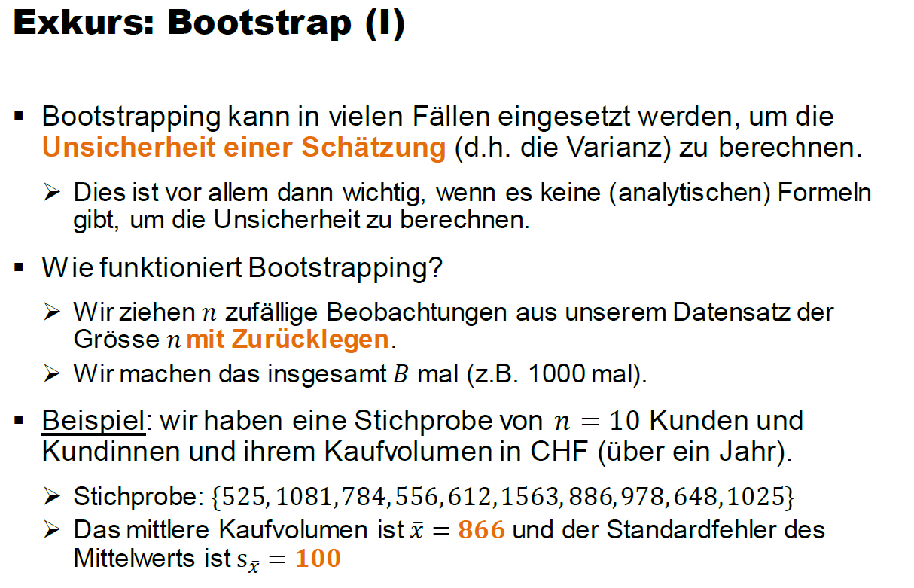{width=100% #fig-boot1}

Der zentrale Punkt, den es hier zu verstehen gilt, ist wie das Boostrap Sampling funktioniert. Wir ziehen $n$ Beobachtungen aus einer Stichprobe der Grösse $n$. Damit jedes Subset (d.h. jedes Bootstrap Sample) unterschiedlich ist, müssen wir ziehen **mit Zurücklegen**. Dadurch werden gewisse Beobachtungen mehr als einmal in unserem Bootstrap Sample landen und gewisse Beobachtungen gar nicht. Nur so kriegen wir unterschiedliche Bootstrap Samples.

In obigem Beispiel können wir den Standardfehler des Mittelwerts $s_{\bar{x}}$ selbstverständlich analytisch berechnen, nämlich mithilfe der Formel $s_{\bar{x}}=\frac{\hat{\sigma}}{\sqrt{n}}=\frac{316.47}{\sqrt{10}}\approx 100$. Manchmal gibt es aber keine analytische Formel und dann ist die Boostrap Technik enorm hilfreich. Die nächste Abbildung zeigt, wie wir den Standardfehler des Mittelwerts mithilfe des Boostraps rechnen könnten:

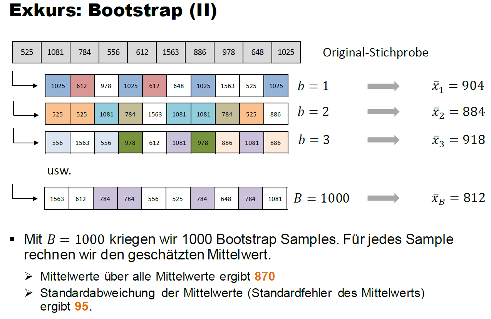{width=100% #fig-boot2}

Die *Standardabweichung* über die 1000 Mittelwerte, die wir basierend auf den Bootstrap Samples rechnen, gibt uns eine Schätzung für den *Standardfehler des Mittelwerts*. Unsere Bootstrap Schätzung (95) ist nicht weit entfernt von der analytischen Lösung (100)!

### Wie funktioniert Bagging?

Wir generieren also mit der Bootstrap Technik eine grosse Anzahl $B$ Subsets aus dem Trainingsdatensatz und rechnen für jedes Subset einen Decision Tree. Beim Bagging beschränken wir die Bäume *nicht* (keine max. Tiefe oder ähnliches). Jeder einzelne Baum wird darum viel Varianz, aber relativ wenig Bias haben.

Die Idee des Ensembles ist nun, dass wir die $B$ Vorhersagen, die wir von all den individuellen Decision Trees kriegen, mitteln. Im Fall des Regressionsproblems rechnen wir ganz einfach den **Durchschnitt über die $B$ Vorhersagen**,

$$
\hat{f}(\mathbf{x}_i) = \frac{1}{B} \sum_{b=1}^B \hat{f}^b(\mathbf{x}_i)
$$
wobei $\hat{f}^b(\mathbf{x}_i)$ die Vorhersage des Baums im $b$-ten Subset bezeichnet.

Im Fall des Klassifikationsproblems können wir zwischen einem **Soft Vote** oder einem **Hard Vote** wählen:

* Beim Soft Vote rechnen wir den **Durchschnitt über die vorhergesagten Wahrscheinlichkeiten** der $B$ Bäume.
* Beim Hard Vote entscheiden wir uns für die "harte" Vorhersage, die unter den $B$ Bäumen **am häufigsten** vorkommt.

Folgende Abbildung zeigt das Vorgehen schematisch anhand des `housingrents` Datensatzes, den Sie im Decision Tree Tutorial bereits kennen gelernt haben. Es handelt sich hierbei um ein Regressionsproblem:

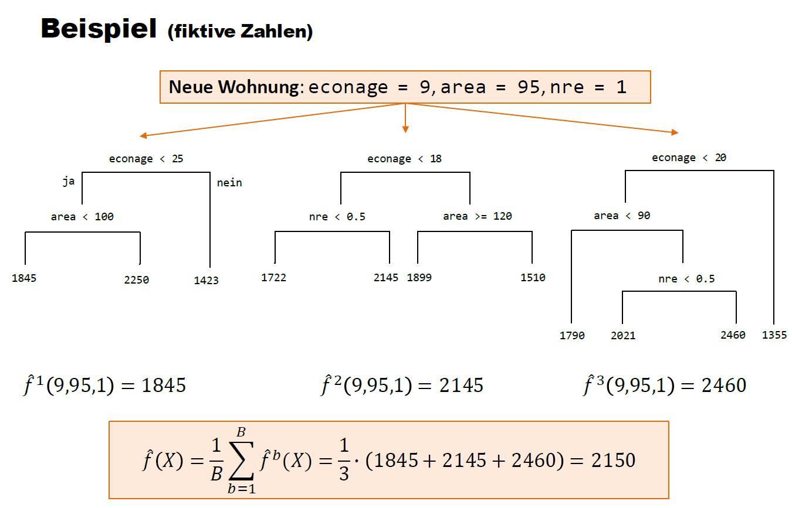{width=100% #fig-bagging}

Wir aggregieren hier $B=3$ Bäume zu einem Bagging Ensemble.

### Out-of-Bag

Das Bootstrap Sampling führt dazu, dass in jedem Subset im Schnitt nur rund 2/3 der Beobachtungen im Trainingsdatensatz sind, d.h. mindestens einmal gezogen werden. Die nicht gezogenen Beobachtungen nennen wir die **Out-of-Bag** (OOB) Beobachtungen.

<div style = "background-color:#fef9e7; padding:10px">
**Optional**: Warum enthält ein Bootstrap Datensatz nur rund 2/3 der Datenpunkte?

Unser Trainingsdatensatz enthält $n$ Beobachtungen. Beim Bootstrap ziehen wir genau $n$ Beobachtungen **mit Zurücklegen** (wenn wir ohne Zurücklegen samplen würden, dann würde jedes Mal der ganze Trainingsdatensatz resultieren).

Bei jeder Ziehung hat jede Beobachtung im Trainingsdatensatz die Wahrscheinlichkeit $1/n$ gezogen zu werden. Dementsprechend ist die Wahrscheinlichkeit, dass eine Beobachtung während des Bootstrap nicht gezogen wird $(1 - \frac{1}{n})^n$.

Aus dem folgt, dass die Wahrscheinlichkeit einer Beobachtung mindestens einmal gezogen zu werden $1 - (1 - \frac{1}{n})^n$ ist.

Beispiel: für einen Trainingsdatensatz der Grösse $n=100$, ergibt sich eine Wahrscheinlichkeit einer Beobachtung mindestens einmal gezogen zu werden von $1 - (1 - \frac{1}{100})^{100}=0.63\approx 2/3$.
</div><br>

Warum ist OOB wichtig? Weil jede Beobachtung im Trainingsdatensatz in rund 1/3 aller Subsets OOB sein wird. Das können wir für eine Art Cross-Validation nutzen. Wir schauen für jede Beobachtung, in welchen Subsets sie OOB war. Dann verwenden wir die Bäume aller dieser Subsets, um für die OOB-Beobachtung Vorhersagen zu rechnen. Die Vorhersagen werden gemittelt. Wenn wir dies für jede Beobachtung im Trainingsdatensatz machen, dann kriegen wir für jede Beobachtung eine Vorhersage von Modellen, für welche diese Beobachtung nicht im Training verwendet wurde.

Für grosse Trainingsdatensätze kann das ein sehr wertvolles Vorgehen sein, weil K-Fold Cross-Validation in diesen Fällen sehr "teuer" ist (R läuft sehr lange!).

### Variable Importance

Wir bewegen uns nun immer stärker in Richtung Black-Box Modelle. Darum wird das Thema **Variable Importance** (VIP) nun wichtiger. Das heisst, wir müssen uns nun verstärkt überlegen, wie wir aus dem Modell lernen können, welche Input-Variablen für die Vorhersagen wichtig sind.

Beim linearen und logistischen Regressionsmodell war das relativ einfach, da man die Wichtigkeit einer Input-Variable sehr gut anhand des geschätzten Koeffizienten für die Variable abschätzen kann. Auch bei Decision Trees ist es simpel: Variablen, welche in Splits weiter oben im Baum verwendet werden, sind tendenziell wichtiger als Variablen, die in Splits weiter unten vorkommen und garantiert wichtiger als Variablen, die im Baum *nicht* verwendet werden.

Die gute Nachricht ist, dass es auch für Ensembles gute und konzeptionell einfache Methoden gibt. Bagging ist ja bekanntlich ein Modell, das über eine grosse Anzahl $B$ Decision Trees aggregiert. Wenn wir beispielsweise die Wichtigkeit für die Input-Variable $x_{i1}$ messen wollen, dann schauen wir in jedem der $B$ Bäume, wie gross die Reduktion in SQR (Regression) bzw. Gini Index (Klassifikation) ist durch einen Split, in dem die Variable $x_{i1}$ verwendet wurde. Die VIP der Variable $x_{i1}$ ist dann einfach der Durchschnitt über die $B$ Reduktionen (wenn die Variable $x_{i1}$ in einem der Bäume nicht verwendet wird, dann beträgt die Reduktion für diesen Baum 0). 

Häufig rechnet man VIP gleich für alle Input-Variablen und **normalisiert** sie, so dass VIP ein Maximum von 1 annehmen kann. Das erreichen wir, indem wir alle (unnormalisierten) VIP Werte durch den maximalen VIP Wert teilen.

<!-- Weighted average? (see HOML, p.200) -->

### Bagging auf dem Heart Datensatz

Wie oben schon etwas angetönt, ist es beim Bagging nicht zwingend nötig irgendwelche Hyperparameter zu tunen. Die Anzahl Bäume $B$ sollte einfach hoch genug gewählt werden und die individuellen Bäume müssen nicht beschränkt werden. Aus diesem Grund werden wir hier nicht `tidymodels` verwenden (wir sparen uns hier den ganzen Overhead von `tidymodels`). Stattdessen verwenden wir das R Package `randomForest`. Sie werden später sehen, dass wir dasselbe Package auch für die Random Forest Methode verwenden werden (wie es der Name natürlich bereits verrät).

Wir übergeben der `randomForest()` Funktion als erstes die Modellformel `hd ~ .` und den Trainingsdatensatz. Das Argument `mtry` wird vor allem bei den Random Forest Modellen wichtig sein. Es gibt der Funktion vor, wie viele der Input-Variablen an jedem Split eines individuellen Baums als mögliche Splitvariablen zur Verfügung stehen. Hier, beim Bagging, sollen bei jedem Split **alle Input-Variablen** zur Verfügung stehen. Darum setzen wir das Argument auf `ncol(train) - 1` (13), die Anzahl Input-Variablen. Das Argument `ntree = 10000` gibt der Funktion vor, dass wir $B=10'000$ Bäume schätzen wollen. Zum Schluss sagen wir noch, dass wir die Variable Importance messen wollen.

```{r block4, eval = FALSE}
# ------------------------------------------------------
# 3. Bagging

# Seed für Reproduzierbarkeit (Bagging basiert stark auf SAMPLING)
set.seed(44)

# Fitting eines Bagging Modells
bag_fit <- 
  randomForest(hd ~ ., 
               data = train, 
               mtry = ncol(train) - 1, 
               ntree = 10000, 
               importance = TRUE)

# Output des Modells
bag_fit
```

```
Call:
 randomForest(formula = hd ~ ., data = train, mtry = ncol(train) - 1, ntree = 10000, importance = TRUE) 
               Type of random forest: classification
                     Number of trees: 10000
No. of variables tried at each split: 13

        OOB estimate of  error rate: 22.97%
Confusion matrix:
    no yes class.error
no  97  23   0.1916667
yes 28  74   0.2745098
```

Sie sehen oben eine Zusammenfassung des Fit Objekts. Insbesondere interessant ist die **Out-of-Bag (OOB) Error Rate**, die hier 22.97% beträgt und damit leicht höher ist als die CV Error Rate unseres Classification Trees (20.7%).

Selbstverständlich könnten wir das gefittete Modell nun bereits verwenden, um harte oder weiche Vorhersagen zu machen:

```{r block5, eval = FALSE}
# Vorhersagen machen
predict(bag_fit, newdata = train[1, ], type = "prob")
predict(bag_fit, newdata = train[1, ], type = "class")
```

```
## Soft (type = "prob")
      no    yes
1 0.9845 0.0155
attr(,"class")
[1] "matrix" "array"  "votes" 

## Hard (type = "class")
 1 
no 
Levels: no yes
```

**Wichtig:** die `predict()` Funktion in obigem Code Block ist aus Base R. Bei der `predict()` Funktion aus `tidymodels` würde das Argument `newdata` anders heissen, nämlich `new_data`.

Zum Schluss können wir uns noch die Variable Importance anschauen:

```{r block6, eval = FALSE}
# Variable Importance
randomForest::importance(bag_fit)
```

```
                no        yes MeanDecreaseAccuracy MeanDecreaseGini
age      17.100347   3.715216            16.177084        7.8986270
sex      31.081711   6.019096            29.483147        1.5685783
cp       40.770308  48.529442            61.272832       13.5563437
trestbps 14.167571   3.402533            13.105737        8.6907289
chol      4.071502 -15.546766            -6.707937        7.6470803
fbs      -2.062854  -6.660895            -5.817300        0.3817802
restecg  -5.875380  15.080576             7.003098        1.7126149
thalach  38.111493  19.476168            42.650182       12.2312568
exang    17.678602  10.001055            20.078778        1.8729007
oldpeak  82.348719  73.489513           107.656615       15.3368627
slope    13.423276  24.646575            27.516395        3.0001435
ca       94.181277  43.425076            95.753121       12.4442411
thal     83.619876  73.070677           102.413468       23.4377673
```

Wir sehen, dass die Variable `thal` klar zur stärksten durchschnittlichen Reduktion im Gini Index führt! Wir können diese Werte natürlich auch grafisch darstellen:

```{r block7, eval = FALSE}
# Automatischer Plot Variable Importance
varImpPlot(bag_fit, main = "Variable Importance Heart")
```

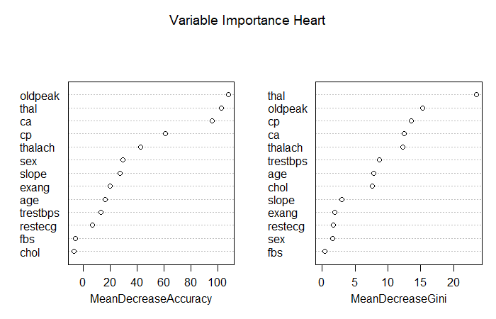{width=100% #fig-varimp-heart-bag}

## Random Forests

Wir haben in der Einführung gesehen, dass Ensemble Methoden vor allem dann gut funktionieren, wenn die individuellen Bäume möglichst wenig (am liebsten gar nicht) korreliert sind.

Beim Bagging sind die Bäume aber oft sehr stark korreliert. Wenn wir z.B. einen Datensatz mit einer wichtigen Input-Variable haben (z.B. `econage` im `housingrents` Datensatz), dann wird beinahe jeder Baum im Bagging im ersten Split `econage` verwenden und dementsprechend werden alle Bäume ähnlich sein.

### Wie funktionieren Random Forests?

Um mehr Diversität (i.e., weniger Korrelation) unter den Bäumen herzustellen, macht die **Random Forest** Methode einen kleinen, aber cleveren Trick: für jeden individuellen Baum und jeden Split stehen nur $m$ **zufällig** ausgewählte Input-Variablen zur Verfügung (wobei $m$ kleiner ist als die Anzahl Input-Variablen $p$). So ergeben sich vielfältigere Bäume und die Reduktion der Varianz ist grösser. Etwas konkreter: die dominante Variable `econage` steht so nicht für jeden ersten Split zur Verfügung und so zwingen wir die Bäume zu mehr Diversität.

Typischerweise tunen wir $m$ via Cross-Validation. In der Praxis hat sich $m=\sqrt{p}$ als guter Wert herausgestellt. Wenn wir also kein Hyperparameter-Tuning machen wollen, dann kann $m$ manuell auf $\sqrt{p}$ gesetzt werden. Die Anzahl Bäume $B$ kann problemlos auf einen grossen Wert gesetzt werden (z.B. $B=10'000$). Hierbei besteht keine Gefahr für Overfitting. Die Tatsache, dass ein Random Forest in vielen Fällen auch ohne Hyperparameter Tuning gute Resultate liefert, ist einer der Hauptgründe, warum dieses Modell in der Praxis so beliebt ist.

Ein Nachteil von Random Forests ist, dass die Trainingsphase länger dauern kann, insbesondere wenn wir uns entscheiden, gewisse Hyperparameter doch zu tunen. Wenn wir z.B. $B=1000$ setzen, dann heisst das, dass wir für jeden Hyperparameter Wert 1000 Decision Trees schätzen müssen. Doch auch hier gibt es eine Lösung, denn die einzelnen Bäume werden unabhängig voneinander trainiert und darum ist es sehr einfach den Rechenprozess zu **parallelisieren** (auf mehrere Cores Ihres Computers).

### Random Forests auf dem Heart Datensatz

Wir schauen uns hier zuerst an, wie man Random Forests ohne `tidymodels` rechnen kann. Dazu verwenden wir wie bereits beim Bagging die `randomForest()` Funktion. Der einzige Unterschied im Vergleich zum Bagging ist, dass wir nun für das Argument `mtry` einen Wert kleiner als die Anzahl Input-Variablen setzten. Wie oben erwähnt gilt die Faustregel, dass $m=\sqrt{p}=\sqrt{13}=3.61$. Darum setzten wir `mtry = 4`. Nun stehen bei jedem Split in jedem individuellen Baum nur **vier zufällig ausgewählte Input-Variablen** zur Verfügung. Wie gesagt: ein kleiner, aber feiner Trick!

```{r block8, eval = FALSE}
# ------------------------------------------------------
# 4.1 Random Forests (klassisch)

# Seed für Reproduzierbarkeit
set.seed(22)

# Fitting eines Random Forest Modells
rf_fit <- 
  randomForest(hd ~ ., 
               data = train, 
               mtry = 4, 
               ntree = 10000, 
               importance = TRUE)

# Output des Modells
rf_fit
```

```
Call:
 randomForest(formula = hd ~ ., data = train, mtry = 4, ntree = 10000, importance = TRUE) 
               Type of random forest: classification
                     Number of trees: 10000
No. of variables tried at each split: 4

        OOB estimate of  error rate: 19.37%
Confusion matrix:
     no yes class.error
no  103  17   0.1416667
yes  26  76   0.2549020
```

Wir sehen, dass die OOB Error Rate nun nur 19.37% beträgt. Wir dürfen also erwarten, dass der Random Forest bessere Vorhersagen machen wird als Bagging und der Classification Tree.

Nun fitten wir den Random Forest mit `tidymodels` und der `ranger` Engine. Schauen Sie sich folgenden Code genau an. Viele Elemente kennen Sie bereits. Was ist neu? Wir verwenden das R-Package `doParallel`, um das Tuning zu parallelisieren. Das heisst, jede Hyperparameter Kombination wird auf einem anderen Core Ihres Computers gerechnet. So verläuft der Trainingsprozess relativ schnell! Mit `grid = 30` lassen wir einfach 30 Hyperparamter Kombinationen testen; wir geben sie nicht explizit vor.

```{r block9, eval = FALSE}
# ------------------------------------------------------
# 4.2 Random Forests (tidymodels + ranger)

# Spezifikation des RFs
rf_mod <- 
  rand_forest(mtry = tune(), min_n = tune(), trees = 1000) %>% 
  set_engine("ranger") %>% 
  set_mode("classification")

# Workflow
rf_workflow <- 
  workflow() %>% 
  add_model(rf_mod) %>% 
  add_formula(hd ~ .)

# Parallel Processing
doParallel::registerDoParallel()

# Seed für Reproduzierbarkeit
set.seed(22)

# Model Fitting / Tuning
rf_res <- 
  rf_workflow %>% 
  tune_grid(folds,
            grid = 30,
            control = control_grid(save_pred = TRUE),
            metrics = metric_set(roc_auc))

# Wir sortieren die Hyperparameter Spezifikationen nach ROC AUC
rf_res %>% 
  show_best(metric = "roc_auc", n = 10) %>% 
  arrange(desc(mean))
```

```
# A tibble: 10 × 8
    mtry min_n .metric .estimator  mean     n std_err .config              
   <int> <int> <chr>   <chr>      <dbl> <int>   <dbl> <chr>                
 1     1     7 roc_auc binary     0.909     5  0.0274 Preprocessor1_Model22
 2     2     4 roc_auc binary     0.903     5  0.0278 Preprocessor1_Model25
 3     2    31 roc_auc binary     0.898     5  0.0302 Preprocessor1_Model02
 4     4    10 roc_auc binary     0.895     5  0.0264 Preprocessor1_Model16
 5     3    34 roc_auc binary     0.894     5  0.0296 Preprocessor1_Model09
 6     3    25 roc_auc binary     0.894     5  0.0301 Preprocessor1_Model23
 7     3    37 roc_auc binary     0.893     5  0.0293 Preprocessor1_Model24
 8     4    24 roc_auc binary     0.893     5  0.0280 Preprocessor1_Model27
 9     7    13 roc_auc binary     0.891     5  0.0245 Preprocessor1_Model04
10     5    18 roc_auc binary     0.889     5  0.0288 Preprocessor1_Model01
```

Interessanterweise ist für `mtry` der Wert 1 optimal. Das heisst für jeden Split steht nur eine zufällig ausgewählte Input-Variable zur Verfügung. Wir können die Tuning Resultate auch grafisch darstellen:

```{r block10, eval = FALSE}
# Plot Tuning Resultate
autoplot(rf_res)
```

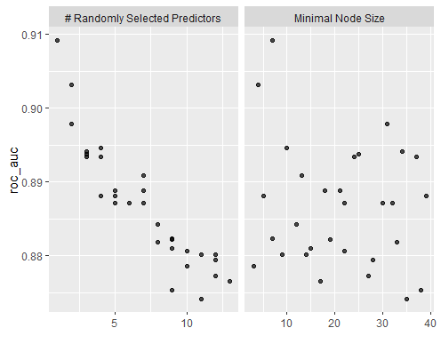{width=100% #fig-rftuning}

Nun speichern wir das beste Modell ab und vergleichen die ROC Kurven des Classification Trees und des Random Forests:

```{r block11, eval = FALSE}
# Bestes Modell
rf_best <- 
  rf_res %>% 
  select_best(metric = "roc_auc")

# Resultate vorbereiten für ROC Kurve
rf_auc <- 
  rf_res %>% 
  collect_predictions(parameters = rf_best) %>% 
  roc_curve(hd, .pred_yes, event_level = "second") %>% 
  mutate(model = "Random Forest")

# ROC Kurven vergleichen
bind_rows(rf_auc, dt_auc) %>% 
  ggplot(aes(x = 1 - specificity, y = sensitivity, col = model)) + 
  geom_path(linewidth = 1.5, alpha = 0.8) +
  geom_abline(lty = 3) + 
  coord_equal() + 
  scale_color_viridis_d(option = "plasma", end = .6) +
  theme_bw()
```

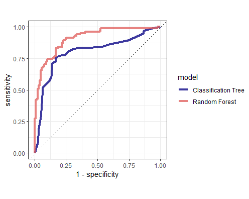{width=100% #fig-rocrfct}

Der Random Forest ist doch einigermassen klar besser. Cool! Nun erstellen wir wie gewohnt den Last Fit auf dem ganzen Trainingsdatensatz und mit optimalen Hyperparameterwerten. Mit `importance = "impurity"` sagen wir der Funktion, dass wir die Variable Importance Werte auch gleich mitrechnen wollen.

```{r block12, eval = FALSE}
# Last Fit Spezifikation (optimale Hyperparameter Werte)
last_rf_mod <-
  rand_forest(mtry = 1, min_n = 7, trees = 1000) %>% 
  set_mode("classification") %>% 
  set_engine("ranger", importance = "impurity")

# Workflow anpassen (optimales Modell)
last_rf_workflow <- 
  rf_workflow %>% 
  update_model(last_rf_mod)

# Last Fit (auf ganzem Trainingsdatensatz)
last_rf_fit <-
  last_rf_workflow %>% 
  fit(data = train)
```

Schauen wir uns kurz das gefittete Objekt an:

```{r block13, eval = FALSE}
# Modell Output
last_rf_fit %>% 
  extract_fit_parsnip()
```

```
parsnip model object

Ranger result

Call:
 ranger::ranger(x = maybe_data_frame(x), y = y, mtry = min_cols(~1, x), 
 num.trees = ~1000, min.node.size = min_rows(~7, x), importance = ~"impurity", 
 num.threads = 1, verbose = FALSE, seed = sample.int(10^5, 1), probability = TRUE) 

Type:                             Probability estimation 
Number of trees:                  1000 
Sample size:                      222 
Number of independent variables:  13 
Mtry:                             1 
Target node size:                 7 
Variable importance mode:         impurity 
Splitrule:                        gini 
OOB prediction error (Brier s.):  0.1393055
```

Auch hier sehen wir den OOB Fehler. Er liegt bei knapp 14%. Hier handelt es sich jedoch um das sogenannte Brier Score, weshalb dieser Wert nicht direkt mit den vorherigen OOB Werten verglichen werden kann. Last but not least, können wir die Variable Importance Werte für die Top-20 Input-Variablen plotten mit der Funktion `vip()`.

```{r block14, eval = FALSE}
# Variable Importance Plot
last_rf_fit %>% 
  extract_fit_parsnip() %>% 
  vip(num_features = 20)
```

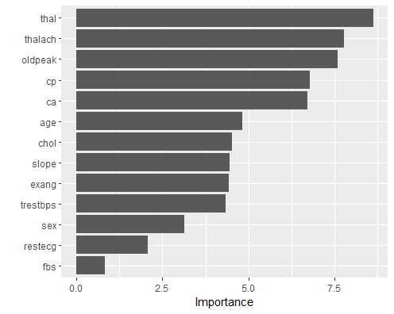{width=100% #fig-varimprf}

Die Variable `thal` ist in allen Modellen die klar wichtigste Variable.

<!-- <div style = "background-color:#fef9e7; padding:10px"> -->
<!-- ```{r, "ensemblePerformance", echo = FALSE} -->
<!-- question("Sie haben einen Datensatz und trainieren 3 Modelle: einen einfachen Decision Tree, ein Bagging Modell sowie einen Random Forest. Was erwarten Sie a-priori bezüglich der Performance dieser drei Modelle? ('>' bedeutet 'besser als')", -->
<!--   answer("Decision Tree > Bagging > Random Forest", correct = FALSE), -->
<!--   answer("Random Forest > Bagging > Decision Tree", correct = TRUE), -->
<!--   answer("Bagging > Random Forest > Decision Tree", correct = FALSE), -->
<!--   answer("Random Forest > Decision Tree > Bagging", correct = FALSE), -->
<!--   correct = "Richtig!", -->
<!--   incorrect = "Falsch!", -->
<!--   allow_retry = TRUE, -->
<!--   random_answer_order = TRUE -->
<!-- ) -->
<!-- ``` -->
<!-- </div><br> -->


## Boosting

Wir haben gesehen, dass beim Bagging und bei Random Forests eine grosse Anzahl Decision Trees gefittet werden, die dann zusammen das Ensemble ergeben. Dabei wurden die Bäume **unabhängig** voneinander gefittet, wodurch das Modell-Training gut parallelisiert werden konnte.

Auch beim Boosting geht es darum, die Vorhersagen von vielen verschiedenen (kleinen) Decision Trees zu kombinieren. Jedoch findet beim Boosting das Modell-Fitting bzw. das Training des Modells **sequenziell** statt. Der erste Baum wird auf dem vollen Trainingsdatensatz gefittet. Der zweite Baum versucht dann die Fehler des ersten Baums auszumerzen. Der dritte Baum versucht dann die Fehler des ersten und zweiten Baums auszumerzen, usw. So entsteht ein **iterativer** Trainingsprozess, in dem sich der $m$-te Baum darauf fokussiert die Fehler der $m-1$ vorherigen Bäume zu korrigieren.

Weil beim Boosting die Bäume sequenziell gefittet werden, ist das Training nicht mehr so einfach parallelisierbar. Deshalb ist dieser Algorithmus im Training tendenziell etwas langsamer als beispielsweise Random Forests. Oft führen Boosting Modelle aber zu den besten Vorhersagen in Praxisprojekten!

Es gibt viele verschiedene Boosting Algorithmen und Modelle. Wir werden uns hier auf den **Gradient Boosting** Algorithmus konzentrieren, da dieser Algorithmus in der Praxis am häufigsten verwendet wird. Ein weiterer bekannter Boosting Algorithmus ist **AdaBoost**, bei dem falsch klassifizierte Beobachtungen im Fitting des nächsten Baums ein höheres Gewicht im Training erhalten.

### Wie funktioniert Gradient Boosting?

Wir schauen uns hier der Einfachheit halber an, wie der Gradient Boosting Algorithmus für das **Regressionsproblem** funktioniert. Der Algorithmus für das Klassifikationsproblem ist ähnlich, aber technisch etwas komplexer.

<div style = "background-color:#fef9e7; padding:10px">
Der **Algorithmus** funktioniert wie folgt (ISLR, p. 347):

1. Wir initialisieren das Boosting Modell mit $\hat{f}(\mathbf{x}_i) = 0$ und wir initialisieren die **Residuen** $r_i$ mit den Werten der Zielvariable, also $r_i=y_i$ für alle Trainingsbeobachtungen.
2. Danach iterieren wir über $B$ Bäume, also über $b=1,2,\dots,B$:
    + Wir fitten den $b$-ten Baum $\hat{f}^b$ mit insgesamt $d$ Splits so gut wie möglich auf die aktuellen Residuen $r_i$.
    + Wir updaten das Boosting Modell mit dem im vorherigen Schritt gefitteten Baum, indem wir den neuen Baum wie folgt hinzufügen: $\hat{f}(\mathbf{x}_i) := \hat{f}(\mathbf{x}_i) + \lambda \hat{f}^b(\mathbf{x}_i)$. Wir fügen also die Vorhersage des neuen Baums zum Modell hinzu, multiplizieren die neuen Vorhersagen aber mit dem **Shrinkage** Faktor $\lambda$.
    + Nun berechnen wir die neuen Residuen zwischen den Werten der Zielvariable und den aktuellen Vorhersagen des Boosting Modells für alle Trainingsbeobachtungen: $r_i := y_i - \hat{f}(\mathbf{x}_i)$.
3. Nachdem wir über alle $B$ Bäume iteriert haben, kriegen wir unser finales Boosting Modell, nämlich $\hat{f}(\mathbf{x}_i) = \sum_{b=1}^B \lambda \hat{f}^b(\mathbf{x}_i)$.
</div><br>

Aus obigem Algorithmus ist ersichtlich, dass Gradient Boosting drei wichtige **Hyperparameter** hat:

* Die Anzahl Bäume $B$, die in das Ensemble einfliessen. Im Gegensatz zu Bagging und Random Forest kann es beim Boosting zu Overfitting kommen, wenn wir eine zu grosse Anzahl Bäume $B$ wählen, denn jeder Baum versucht ja die Fehler aller vorangehenden Bäume zu verbesseren oder korrigieren. Irgendwann kommen wir so in den Bereich, wo der Algorithmus nur noch den unsystematischen Teil der Information (**Noise**) zu fitten versucht.
* Der Hyperparameter $d$ bezeichnet die Anzahl Splits, die wir in den einzelnen Bäumen zulassen. Erstaunlich oft funktionieren Bäume mit einem Split, also $d=1$, gut in der Praxis. In diesem Fall handelt es sich um sogenannte **Decision Stumps** (dt. Entscheidungsstümmel). In diesem Fall fitten wir effektiv ein *additives Modell* (warum?).
* Der dritte wichtige Hyperparameter ist der Shrinkage Hyperparameter $\lambda \leq 1$. Wir wollen damit sicherstellen, dass das Boosting Ensemble nicht zu schnell lernt. Es hat sich in der Praxis herausgestellt, dass langsam lernende Boosting Ensembles zu einem besseren Modell führen. Der Shrinkage Hyperparameter kann auch als eine Form von **Regularisierung** interpretiert werden.

<!-- <div style = "background-color:#fef9e7; padding:10px"> -->
<!-- ```{r, echo=FALSE} -->
<!-- fluidPage( -->

<!--   fluidRow( -->
<!--     withMathJax(), -->
<!--     p("In dieser Demo verwenden wir die Gradient Boosting Methode auf einem simplen  -->
<!--       Datensatz mit einer Input-Variable. Wir schauen uns an, wie sich die  -->
<!--       Hyperparameter dieser Methode (B, Shrinkage, Anzahl Splits) auf den Fit an -->
<!--       die Trainingsdaten sowie die Fehler auf Training- und Testdatensatz auswirken.  -->
<!--       Abgebildet ist immer nur der Trainingsdatensatz. Der Testdatensatz hat immer die -->
<!--       selbe Grösse wie der Trainingsdatensatz.") -->
<!--   ), -->

<!--   fluidRow( -->
<!--     column(width = 4, numericInput("n_boosting", "Anzahl Beobachtungen", 50, 1, 200, 10)) -->
<!--   ), -->

<!--   fluidRow( -->
<!--     column(width = 4, numericInput("B", "Anzahl Bäume B", 1, 1, 500, 10)), -->
<!--     column(width = 4, numericInput("shrinkage", "Shrinkage", 1, 0.01, 1, 0.01)), -->
<!--     column(width = 4, numericInput("splits", "Anzahl Splits", 1, 1, 5, 1)), -->
<!--   ), -->

<!--   fluidRow( -->
<!--     column(width = 12, plotOutput("boosting")) -->
<!--   ) -->
<!-- ) -->
<!-- ``` -->
<!-- </div><br> -->

<!-- ```{r, context = "server"} -->
<!-- output$boosting <- renderPlot({ -->

<!--   library(gbm) -->

<!--   # Setze den Seed für Reprodzierbarkeit -->
<!--   set.seed(123) -->
<!--   # Generiere Daten -->
<!--   xtrain <- runif(input$n_boosting, 0, 1) -->
<!--   ytrain <- 4 * (xtrain-0.5)^2 + rnorm(input$n_boosting, 0, 0.1) -->
<!--   xtest <- runif(input$n_boosting, 0, 1) -->
<!--   ytest <- 4 * (xtest-0.5)^2 + rnorm(input$n_boosting, 0, 0.1) -->
<!--   # Kreiere Data Frames -->
<!--   train <- data.frame(y = ytrain, x = xtrain) -->
<!--   test <- data.frame(y = ytest, x = xtest) -->
<!--   # Rechne Regressionsbaum -->
<!--   model <- reg_boost <- gbm(y ~ x, data = train, distribution = "gaussian",  -->
<!--                             n.trees = input$B, interaction.depth = input$splits,  -->
<!--                             shrinkage = input$shrinkage, n.minobsinnode = 1, bag.fraction = 1) -->
<!--   # Data Frame für Zeichnen der Kurven -->
<!--   new <- data.frame(x = seq(0, 1, 0.001)) -->
<!--   # Vorhersagen -->
<!--   pred_curves <- predict(model, new, n.trees = input$B) -->
<!--   pred_train <- predict(model, train, n.trees = input$B) -->
<!--   pred_test <- predict(model, test, n.trees = input$B) -->
<!--   # 2 Plots nebeneinander -->
<!--   par(mfrow = c(1,2)) -->
<!--   par(bg = "#fef9e7") -->
<!--   # Streuudiagramm -->
<!--   plot(xtrain, ytrain, col = "blue", pch = 16) -->
<!--   # Kurve Modell -->
<!--   lines(seq(0, 1, 0.001), pred_curves, type = "l", col = "red", lwd = 2) -->
<!--   # RMSE Train/Test -->
<!--   rmse_train <- sqrt(mean((ytrain - pred_train)^2)) -->
<!--   rmse_test <- sqrt(mean((ytest - pred_test)^2)) -->
<!--   # Barplot RMSE -->
<!--   barplot(c(rmse_train, rmse_test), main = "Root Mean Squared Error (RMSE)",  -->
<!--           ylim = c(0, 1), names.arg = c("Train", "Test")) -->
<!--   # RMSE als Text -->
<!--   text(c(0.7,1.9), y=0.5, labels = c(round(rmse_train, 2), round(rmse_test, 2))) -->

<!-- }) -->
<!-- ``` -->


<!-- <div style = "background-color:#fef9e7; padding:10px"> -->
<!-- ```{r, "boostingOverfitting", echo = FALSE} -->
<!-- question("Sie haben ein Gradient Boosting Modell verwendet, aber es hat leider zu Overfitting geführt. Welche Möglichkeiten haben Sie, um das Problem des Overfittings beim Boosting zu beheben?", -->
<!--   answer("Wir senken $\\lambda$ und machen den Lernprozess so langsamer.", correct = TRUE), -->
<!--   answer("Wir erhöhen die Anzahl Bäume $B$, die trainiert werden sollen.", correct = FALSE), -->
<!--   answer("Early Stopping: wir lernen nur so lange neue Bäume bis der Fehler auf dem Validierungsdatensatz nicht mehr runter geht.", correct = TRUE), -->
<!--   answer("Wir reduzieren die Komplexität der einzelnen Bäume, indem wir $d$ reduzieren.", correct = TRUE), -->
<!--   correct = "Richtig!", -->
<!--   incorrect = "Falsch!", -->
<!--   allow_retry = TRUE, -->
<!--   random_answer_order = TRUE -->
<!-- ) -->
<!-- ``` -->
<!-- </div><br> -->

Wir werden später im Deep Learning den Gradient Descent Algorithmus kennen lernen. In der folgenden optionalen Box lernen Sie, inwiefern Gradient Boosting mit Gradienten und Ableitungen zu tun hat.

<div style = "background-color:#fef9e7; padding:10px">
**Optional**: Was hat der Gradient Boosting Algorithmus mit Gradient Descent zu tun?

Sie werden den **Gradient Descent** Algorithmus später kennenlernen. Der **Gradient Boosting** Algorithmus funktioniert (wie es der Name bereits verrät) ähnlich. Doch es ist vielleicht nicht ganz so offensichtlich, warum das so ist. Schauen wir es uns zusammen an!

Beim Regressionsproblem versuchen wir in den meisten Fällen die **Summe der quadrierten Residuen** (SQR) zu minimieren. SQR ist also unsere Kostenfunktion. Für eine einzelne Trainingsbeobachtung $i$ können die Kosten wie folgt aufgeschrieben werden:

$$
J_i(y_i, \hat{f}(\mathbf{x}_i)) = \frac{1}{2}(y_i - \hat{f}(\mathbf{x}_i))^2
$$ 

Die Gesamtkostenfunktion SQR ist dementsprechend die Summe über die individuellen Kosten aller Trainingsbeobachtungen.

Wir möchten nun unser Boosting Modell $\hat{f}(\mathbf{x}_i)$ so verbessern, dass die Kosten reduziert werden. Dazu rechnen wir die Ableitung unserer Gesamtkosten nach $\hat{f}(\mathbf{x}_i)$ (also dem Funktionswert für die $i$-te Beobachtung):

$$
\begin{split}
\frac{\partial J}{\partial \hat{f}(\mathbf{x}_i)} &= \frac{\partial \sum_i J_i(y_i, \hat{f}(\mathbf{x}_i))}{\partial \hat{f}(\mathbf{x}_i)}\\ &= \frac{\partial J_i(y_i, \hat{f}(\mathbf{x}_i))}{\partial \hat{f}(\mathbf{x}_i)}\\ &= \frac{2}{2}(y_i - \hat{f}(\mathbf{x}_i))^{2-1}\cdot (-1)\\ &= -(y_i - \hat{f}(\mathbf{x}_i))
\end{split}
$$

Wir sehen also, dass die Ableitung (oder eben der **Gradient**) nichts anderes als das negative **Residuum** ist.

Im zweiten Schritt des Gradient Boosting Algorithmus haben wir gesehen, dass wir einen neuen Baum jeweils wie folgt zum Ensemble hinzufügen:

$$
\hat{f}(\mathbf{x}_i) := \hat{f}(\mathbf{x}_i) + \lambda \hat{f}^b(\mathbf{x}_i)
$$

Wie im Algorithmus beschrieben wird der neue Baum jeweils so gut wie möglich auf die aktuellen Residuen gefittet. Wir können also den neuen Baum $\hat{f}^b(\mathbf{x}_i)$ als eine **Annäherung an die Residuen** (den negativen Gradient) interpretieren. So können wir die Update-Gleichung umschreiben als:

$$
\begin{split}
\hat{f}(\mathbf{x}_i) &:= \hat{f}(\mathbf{x}_i) + \lambda \cdot (y_i - \hat{f}(\mathbf{x}_i))\\
&:= \hat{f}(\mathbf{x}_i) - \lambda \cdot \frac{\partial J_i(y_i, \hat{f}(\mathbf{x}_i))}{\partial \hat{f}(\mathbf{x}_i)}
\end{split}
$$

Erkenne Sie darin den Gradient Descent?

Quelle: [Cheng Li, A Gentle Introduction to Gradient Boosting](http://www.chengli.io/tutorials/gradient_boosting.pdf)
</div><br>


### Gradient Boosting auf dem Heart Datensatz

Wir fitten hier den Gradient Boosting Algorithmus in einem ersten Schritt mit dem traditionellen `gbm` Package. Dieses Package erwartet, dass die kategorische Zielvariable 0-1 kodiert ist, weshalb ich in einem ersten Schritt eine Umkodierung vornehme.

Danach fitten wir mit der Funktion `gbm()` das Modell. In der Modellformel entferne ich die ursprüngliche Zielvariable `hd`. Mit `distribution = "bernoulli"` sagen wir der Funktion, dass es sich um ein binäres Klassifikationsproblem handelt. Die drei wichtigen Hyperparameter heissen hier etwas anders:

* $B$ &rarr; `n.trees`
* $d$ &rarr; `interaction.depth`
* $\lambda$ &rarr; `shrinkage`

Sie sehen, dass wir via dem Argument `cv.folds = 5` auch eine interne Cross-Validation betreiben. Wir wollen damit herausfinden, wie viele Trees nötig sind und ob es allenfalls weniger Bäume als `n.trees = 10000` braucht.

```{r block15, eval = FALSE}
# ------------------------------------------------------
# 5.1 Gradient Boosting (gbm)

# Seed für Reproduzierbarkeit
set.seed(15)

# Wir müssen Zielvariable in 0/1 umkodieren für gbm Package
train$y <- as.integer(train$hd) - 1

# Fitting eines GBM Modells
gbm_fit <- gbm(
  formula = y ~ . - hd,
  distribution = "bernoulli",
  data = train,
  n.trees = 10000,
  interaction.depth = 1,
  shrinkage = 0.001,
  cv.folds = 5,
  n.cores = NULL,
  verbose = FALSE
)

# Output
print(gbm_fit)
```

```
gbm(formula = y ~ . - hd, distribution = "bernoulli", data = train, 
    n.trees = 10000, interaction.depth = 1, shrinkage = 0.001, 
    cv.folds = 5, verbose = FALSE, n.cores = NULL)
A gradient boosted model with bernoulli loss function.
10000 iterations were performed.
The best cross-validation iteration was 7362.
There were 13 predictors of which 13 had non-zero influence.
```

Ha! Tatsächlich ist die optimale Anzahl Bäume (also das optimale $B$) tiefer als 10'000 und liegt bei 7362 Bäumen. Der Cross-Validation Fehler ist bei dieser optimalen Anzahl Bäumen am tiefsten. Dieses Resultat kann man sich auch noch grafisch ausgeben lassen:

```{r block16, eval = FALSE}
# Kostenfunktion für steigende Anzahl Trees
gbm.perf(gbm_fit, method = "cv")
```

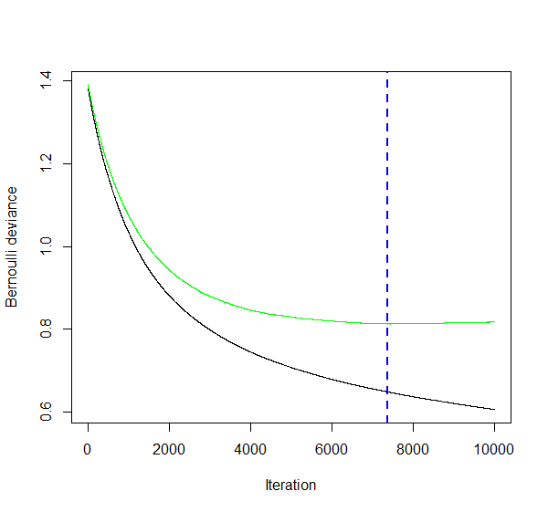{width=100% #fig-gbmcrossval}

Sie sehen, dass wir nach der blau gestrichelten Vertikalen in den Overfitting Bereich kommen: die Kosten auf dem Trainingsdatensatz (in schwarz) gehen weiter runter, aber die Kosten auf den CV Folds beginnen wieder leicht zu steigen (in anderen Worten: die Varianz des Modells beginnt zu steigen).

Wir fitten nun also das optimale Gradient Boosting Modell mit der optimalen Anzahl Bäumen. Die anderen Hyperparameter tunen wir hier der Einfachheit halber nicht. Mithilfe des Packages `vip` lassen wir uns die Wichtigkeit der verschiedenen Variablen visualisieren.

```{r block17, eval = FALSE}
# Finales GBM Modell
gbm_final_fit <- gbm(
  formula = y ~ . - hd,
  distribution = "bernoulli",
  data = train,
  n.trees = 7362,
  interaction.depth = 1,
  shrinkage = 0.001,
  n.cores = NULL,
  verbose = FALSE
)

# Variable Importance
vip(gbm_final_fit)
```

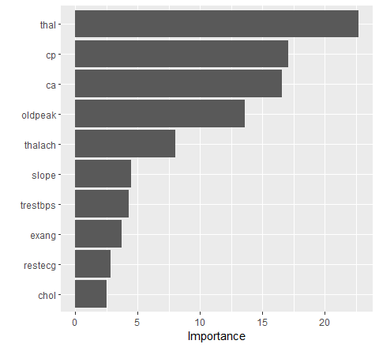{width=100% #fig-gbmvip}

Wie bereits vermutet ist auch hier die Variable `thal` am wichtigsten!

Nun werden wir uns anschauen, wie wir das Gradient Boosting Modell mit `tidymodels` und der `xgboost` Library fitten und tunen können. `xgboost` steht für **Extreme Gradient Boosting** und ist eine optimierte und enorm flexible Implementation des Gradient Boosting Algorithmus.

`xgboost` hat nicht nur die drei oben erwähnten Hyperparamter, sondern viele weitere, welche das Modell schneller und besser machen können. Eine Übersicht über die Hyperparameter finden Sie [hier](https://rdrr.io/cran/xgboost/man/xgb.train.html).

Im unten stehenden Code entfernen wir als erstes die 0/1 kodierte Zielvariable, die wir für die `gbm` Implementation benötigten. Danach spezifizieren wir in typischer `tidymodels` Manier das Modell und den Workflow. Der Einfachheit halber lassen wir nur die drei bekannten Hyperparameter `trees` ($B$), `tree_depth` ($d$) und `learn_rate` ($\lambda$) tunen. Die weiteren Hyperparameter belassen wir auf den Default Werten. Mit `nthread = 8` erlauben wir dem Modell ein sogenanntes **Parallel Processing** (eines der tollen Features der `xgboost` Implementation).

In der `tune_grid()` Funktion setzen wir `grid = 50` und spezifizieren keinen eigenen Grid mit möglichen Hyperparameterkombinationen. Dadurch erstellt `tidymodels` automatisch ein **Space-filling Design**. Doch was bedeutet das? Aus allen möglichen Kombinationen von Werten für `trees`, `tree_depth` und `learn_rate` wählt `tidymodels` automatisch 50 Kombinationen, die Sinn machen und die den Raum (*Space*), welcher durch die drei Hyperparameter aufgespannt wird, möglichst gut ausfüllen (*Space-filling*).

```{r block18, eval = FALSE}
# ------------------------------------------------------
# 5.2 Gradient Boosting (xgboost)

# Wir entfernen y wieder aus Trainingsdatensatz
train <- train[ ,-ncol(train)]

# Spezifikation des XGBoost Modells
xgb_mod <- 
  boost_tree(trees = tune(), tree_depth = tune(), learn_rate = tune()) %>% 
  set_engine("xgboost", event_level = "second", nthread = 8) %>% 
  set_mode("classification")

# Workflow
xgb_workflow <- 
  workflow() %>% 
  add_model(xgb_mod) %>% 
  add_formula(hd ~ .)

# Seed für Reproduzierbarkeit
set.seed(42)

# Model Fitting / Tuning
# So genanntes "Space-filling design": es werden 50 Hyperparameter-Kombinationen getestet, die den
# Hyperparameter-Space so gut wie möglich abdecken.
xgb_res <- 
  xgb_workflow %>% 
  tune_grid(folds,
            grid = 50,
            control = control_grid(save_pred = TRUE),
            metrics = metric_set(roc_auc))

# Wir sortieren die Hyperparameter Spezifikationen nach ROC AUC
xgb_res %>% 
  show_best(metric = "roc_auc", n = 10) %>% 
  arrange(desc(mean))
```

```
# A tibble: 10 × 9
   trees tree_depth learn_rate .metric .estimator  mean     n std_err .config              
   <int>      <int>      <dbl> <chr>   <chr>      <dbl> <int>   <dbl> <chr>                
 1  1072          3    0.00597 roc_auc binary     0.890     5  0.0278 Preprocessor1_Model08
 2  1918          3    0.00434 roc_auc binary     0.888     5  0.0285 Preprocessor1_Model06
 3  1255          5    0.0149  roc_auc binary     0.887     5  0.0230 Preprocessor1_Model15
 4   964          2    0.0301  roc_auc binary     0.886     5  0.0188 Preprocessor1_Model05
 5  1158          2    0.0132  roc_auc binary     0.885     5  0.0205 Preprocessor1_Model04
 6  1082         15    0.0228  roc_auc binary     0.884     5  0.0217 Preprocessor1_Model50
 7   562          3    0.00531 roc_auc binary     0.884     5  0.0276 Preprocessor1_Model07
 8  1633          8    0.00677 roc_auc binary     0.884     5  0.0234 Preprocessor1_Model26
 9  1779          8    0.0169  roc_auc binary     0.884     5  0.0217 Preprocessor1_Model27
10   168         13    0.108   roc_auc binary     0.884     5  0.0225 Preprocessor1_Model44
```

Wir finden so die optimalen Hyperparameterwerte `trees = 1072`, `tree_depth = 3` und `learn_rate = 0.00597`. Wir können die Tuning-Resultate auch grafisch darstellen:

```{r block19, eval = FALSE}
# Plot Tuning Resultate
autoplot(xgb_res)
```

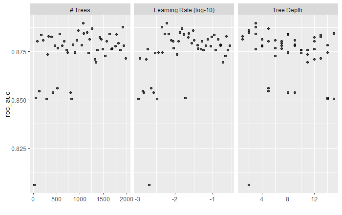{width=100% #fig-tuningxgb}

Wir speichern das beste Modell ab und verwenden die Cross-Validation Resultate für den Vergleich des XGBoost Modells mit dem Random Forest und dem Classification Tree mittels der ROC Kurven.

```{r block20, eval = FALSE}
# Bestes Modell
xgb_best <- 
  xgb_res %>% 
  select_best(metric = "roc_auc")

# Resultate vorbereiten für ROC Kurve
xgb_auc <- 
  xgb_res %>% 
  collect_predictions(parameters = xgb_best) %>% 
  roc_curve(hd, .pred_yes, event_level = "second") %>% 
  mutate(model = "XGBoost")

# ROC Kurven vergleichen
bind_rows(rf_auc, dt_auc, xgb_auc) %>% 
  ggplot(aes(x = 1 - specificity, y = sensitivity, col = model)) + 
  geom_path(linewidth = 1.5, alpha = 0.8) +
  geom_abline(lty = 3) + 
  coord_equal() + 
  scale_color_viridis_d(option = "plasma", end = .6) +
  theme_bw()
```

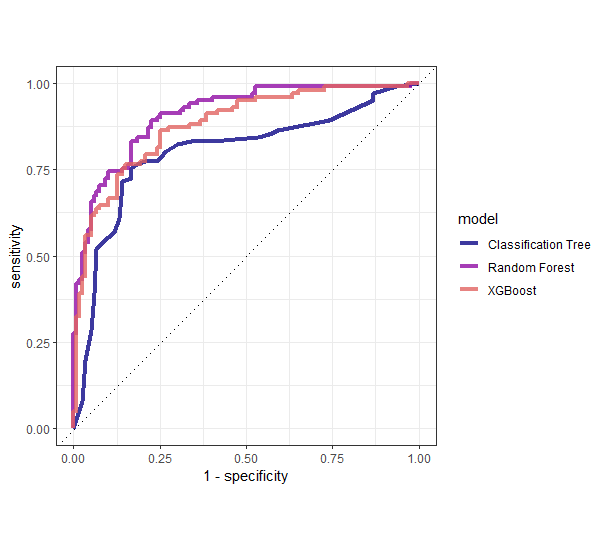{width=100% #fig-rocall}

Hier ist es tatsächlich so, dass das Random Forest Ensemble am besten funktioniert. Allerdings ist es sehr wahrscheinlich, dass wir beim Tuning des XGBoost Modells noch nicht das Maximum rausgeholt haben. In der Praxis ist typischerweise das XGBoost noch eine Spur besser als der Random Forest.

Wie gewohnt fitten wir am Schluss nun noch das optimale Modell **auf dem ganzen Trainingsdatensatz**.

```{r block21, eval = FALSE}
# Last Fit Spezifikation (optimale Hyperparameter Werte)
last_xgb_mod <-
  boost_tree(trees = 1072, tree_depth = 3, learn_rate = 0.00597) %>% 
  set_engine("xgboost", event_level = "second", nthread = 8) %>% 
  set_mode("classification")

# Workflow anpassen (optimales Modell)
last_xgb_workflow <- 
  xgb_workflow %>% 
  update_model(last_xgb_mod)

# Last Fit (auf ganzem Trainingsdatensatz)
last_xgb_fit <-
  last_xgb_workflow %>% 
  fit(data = train)

# Modell Output
last_xgb_fit %>% 
  extract_fit_parsnip()
```

```
parsnip model object

##### xgb.Booster
raw: 1.2 Mb 
call:
  xgboost::xgb.train(params = list(eta = 0.00597, max_depth = 3, 
    gamma = 0, colsample_bytree = 1, colsample_bynode = 1, min_child_weight = 1, 
    subsample = 1), data = x$data, nrounds = 1072, watchlist = x$watchlist, 
    verbose = 0, nthread = 8, objective = "binary:logistic")
params (as set within xgb.train):
  eta = "0.00597", max_depth = "3", gamma = "0", colsample_bytree = "1", colsample_bynode = "1", min_child_weight = "1", subsample = "1", nthread = "8", objective = "binary:logistic", validate_parameters = "TRUE"
xgb.attributes:
  niter
callbacks:
  cb.evaluation.log()
# of features: 25 
niter: 1072
nfeatures : 25 
evaluation_log:
    iter training_logloss
       1        0.6902110
       2        0.6873069
---                      
    1071        0.1694754
    1072        0.1693849
```

Auch für dieses Modell können wir uns mithilfe des Packages `vip` die Wichtigkeit der Variablen anzeigen lassen. Das `xgboost` Package erstellt intern ein One-Hot-Encoding, weshalb wir hier nun einzelne Ausprägungen von kategorischen Variablen als Variablen sehen. Den mit Abstand grössten Effekt hat die Ausprägung `normal` der kategorischen Variable `thal`.

```{r block22, eval = FALSE}
# Variable Importance
last_xgb_fit %>% 
  extract_fit_parsnip() %>% 
  vip(num_features = 20)
```

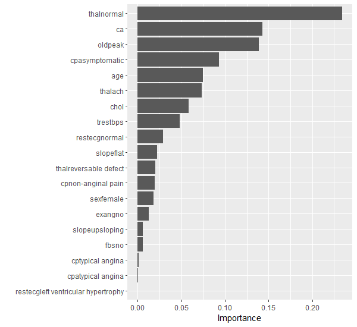{width=100% #fig-xgbvip}

Nun vergleichen wir die insgesamt 6 Modelle auf dem Testdatensatz:

```{r block23, eval = FALSE}
# ------------------------------------------------------
# 6. Testset Performance

# Testset-Performance
test_dt_aug <- augment(last_dt_fit, test)
test_rf_aug <- augment(last_rf_fit, test)
test_xgb_aug <- augment(last_xgb_fit, test)

# ROC AUC
test_dt_aug %>% 
  roc_auc(truth = hd, .pred_yes, event_level = "second")
test_rf_aug %>% 
  roc_auc(truth = hd, .pred_yes, event_level = "second")
test_xgb_aug %>% 
  roc_auc(truth = hd, .pred_yes, event_level = "second")

# ACCURACY
test_dt_aug %>% 
  accuracy(truth = hd, .pred_class)
test_rf_aug %>% 
  accuracy(truth = hd, .pred_class)
test_xgb_aug %>% 
  accuracy(truth = hd, .pred_class)
```

Für die Modelle, die wir nicht mit `tidymodels` gefittet haben, müssen wir leicht anders vorgehen:

```{r block24, eval = FALSE}
# Performance der Modelle ohne tidymodels
pred_test_bag <- predict(bag_fit, newdata = test, type = "prob")
pred_test_rf <- predict(rf_fit, newdata = test, type = "prob")
pred_test_gbm <- predict(gbm_final_fit, n.trees = gbm_final_fit$n.trees, test, type = "response")

# Resultate in Data Frame Form
test_bag_aug <- data.frame(pred_test_bag) %>% 
  bind_cols(hd = test$hd) %>% 
  rename(.pred_no = no, .pred_yes = yes) %>% 
  mutate(.pred_class = factor(ifelse(.pred_yes >= 0.5, "yes", "no"), levels = c("no", "yes")))
test_rfc_aug <- data.frame(pred_test_rf) %>% 
  bind_cols(hd = test$hd) %>% 
  rename(.pred_no = no, .pred_yes = yes) %>% 
  mutate(.pred_class = factor(ifelse(.pred_yes >= 0.5, "yes", "no"), levels = c("no", "yes")))
test_gbm_aug <- data.frame(pred_test_gbm) %>% 
  bind_cols(hd = test$hd) %>% 
  rename(.pred_yes = pred_test_gbm) %>% 
  mutate(.pred_no = 1 - .pred_yes,
         .pred_class = factor(ifelse(.pred_yes >= 0.5, "yes", "no"), levels = c("no", "yes")))

# ROC AUC
test_bag_aug %>% 
  roc_auc(truth = hd, .pred_yes, event_level = "second")
test_rfc_aug %>% 
  roc_auc(truth = hd, .pred_yes, event_level = "second")
test_gbm_aug %>% 
  roc_auc(truth = hd, .pred_yes, event_level = "second")

# ACCURACY
test_bag_aug %>% 
  accuracy(hd, .pred_class)
test_rfc_aug %>%
  accuracy(hd, .pred_class)
test_gbm_aug %>%  
  accuracy(hd, .pred_class)
```

Die Resultate sehen wie folgt aus:

| Modell                         | ROC AUC (Testset) | Accuracy (Testset) |
|--------------------------------|-------------------|--------------------|
| Classification Tree (`rpart`)  | 83.2%             | 77.3%              |
| Bagging (`randomForest`)       | 90.4%             | 81.3%              |
| Random Forest (`randomForest`) | 92.9%             | 86.7%              |
| Random Forest (`ranger`)       | **93.3%**         | **90.7%**          |
| Gradient Boosting (`gbm`)      | 93.0%             | 89.3%              |
| Gradient Boosting (`xgboost`)  | 90.2%             | 84.0%              |

