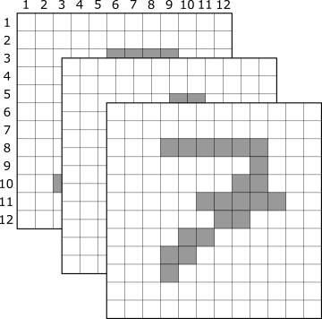
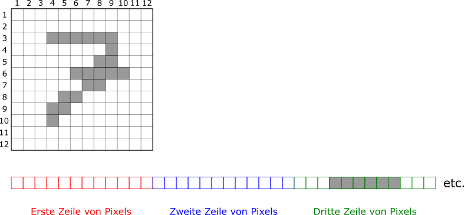
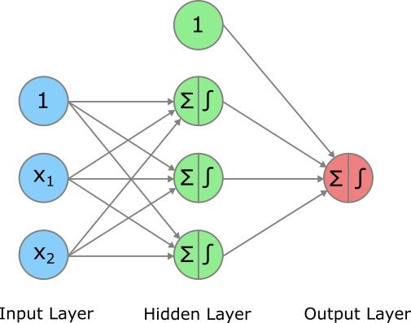
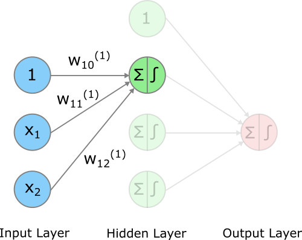
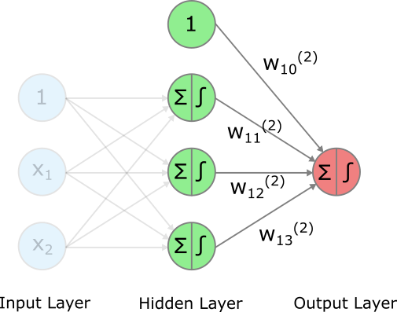
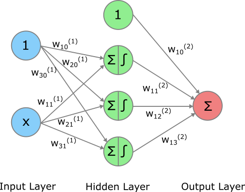
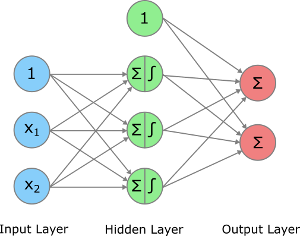
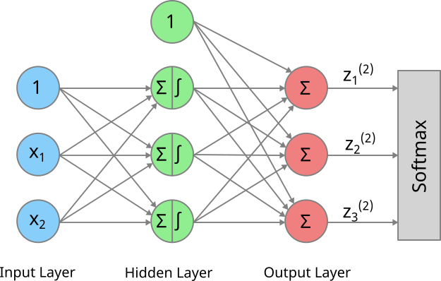

# Artificial Neural Networks {#sec-ann}

Wir beginnen hier nun mit dem zweiten Teil des Buchs, der das Thema **Deep Learning** (DL) behandelt. DL ist der Bereich des Machine Learnings, in dem am meisten geforscht wird und in den aktuell Milliarden investiert werden. Grund dafür ist hauptsächlich die fantastische Performance von DL-Applikationen in den letzten paar Jahren, in Bereichen wie Sprachübersetzung (Stichwort *DeepL*), Chatbots (Stichwort *ChatGPT* oder *Claude*) oder sonstiger generativer AI (z.B. Bildgeneratoren).

{width=50% #fig-genAI}

DL wird heutzutage grösstenteils für so genannte **unstrukturierte Daten** angewendet, d.h. für Bilder, Videos, Text und Audio. DL funktioniert aber auch für konventionelle (**strukturierte**) Daten.

Einer der grossen Vorteile von DL im Vergleich zu anderen (klassischen) Machine Learning Algorithmen, die wir kennen gelernt haben, ist, dass beim DL **kein Feature Engineering** notwendig ist. Wir müssen also nicht, wie bspw. in @sec-linreg oder @sec-linclass gesehen, die Polynome der Input-Variablen bilden und darauf hoffen, dass wir so ein besseres Modell finden. Das Modell lernt in den sogenannten *Hidden Layers* (dazu später mehr) **selbständig**, wie es die vorhandenen Input-Variablen zu neuen Features kombinieren muss, um ein möglichst gutes Modell zu lernen. 

Doch DL hat nicht nur Vorteile im Vergleich zu klassichen Modellen. Ein DL Modell benötigt oft **sehr viele Trainings-Daten** und sollte darum nur dann verwendet werden, wenn die zur Verfügung stehenden Trainings-Daten auch wirklich gross sind (mehrere 10'000 Beobachtungen oder mehr). Weiter hat ein DL Modell **viele Hyperparameter**, die getunt werden müssen. Manchmal ist es nicht einfach, die Hyperparameterkombination zu finden, die zu einem sinnvollen Modell führt. Und ausserdem braucht das Modelltraining **viele Computer Ressourcen** und dementsprechend viel Energie.

Heute sprechen wir fast ausschliesslich von Deep Learning oder AI, doch eigentlich sind DL/AI Modelle nichts anderes als künstliche neuronale Netzwerke, oder auf Englisch **Artificial Neural Networks** (ANNs). Man spricht hier von *Neural* Networks, weil die Erfinder dieser Modelle ursprünglich von der Struktur des menschlichen Gehirns inspiriert wurden. Heutige DL Modelle haben allerdings nur bedingt mit dem menschlichen Gehirn zu tun.

Wir beginnen das Kapitel mit einer Einführung in das MNIST Problem, das *Hello World* im DL. Danach beschreiben wir ausführlich die Modellspezifikation oder -architektur des ANNs. In einem weiteren Schritt widmen wir uns dem Modelltraining und schauen uns danach alles anhand eines einfachen Beispiels an, nämlich dem einfachen (nur eine Input-Variable) Regressionsbeispiel. Nach einem kurzen Abstecher in Architekturen für Multi-Output Probleme schauen wir uns zum Schluss noch die Anwendung in `R` an.

## MNIST

Der bekannte **MNIST** Datensatz ist ein Beispiel aus dem Bereich **Computer Vision**. Der Datensatz enthält Bilder von handgeschriebenen Zahlen, wie folgender Ausschnitt zeigt:

.](images/MnistExamples.png){width=70% #fig-mnistex}

Jede handgeschriebene "2" sieht anders aus, hat aber doch gewisse Ähnlichkeiten mit den anderen Bildern einer "2". Dasselbe gilt für alle anderen Zahlen. Wir werden später nach Modellen suchen, welche einem handgeschriebenen Bild die korrekte Zahl zuordnen können. Hierbei handelt es sich um ein **Klassifikationsproblem** mit einer **Outputvariable mit 10 möglichen Kategorien**, nämlich die Zahlen 0 bis 9.

Der MNIST Datensatz ist hier im Hintergrund bereits geladen und in einen Trainings- und Testdatensatz aufgeteilt. Warum ist der Datensatz bereits aufgeteilt? So arbeiten alle ML-Expert:innen auf der ganzen Welt mit demselben Trainings- und Testset und die Performances sind direkt vergleichbar. Ausserdem sind die beiden Datensätze **balanced**, d.h. die Zahlen 0-9 kommen in beiden Datensätzen etwa gleich oft vor.

```{r, echo=FALSE, message=FALSE, warning=FALSE}
library(tensorflow)
library(keras3)
mnist <- dataset_mnist()
x_train <- mnist$train$x
y_train <- mnist$train$y
x_test <- mnist$test$x
y_test <- mnist$test$y
```

### Output

Die Outputvariable in Trainings- und Testset kann als `y_train` bzw. `y_test` aufgerufen werden. Dabei handelt es sich um Vektoren, welche die wahren Zahlen enthalten. Prüfen wir als erstes kurz die Dimensionen der beiden Vektoren. Da es sich um (eindimensionale) Vektoren handelt, gibt uns die Funktion `dim()` lediglich eine Zahl zurück, die der Anzahl Elemente im Vektor entspricht.

```{r}
# Überprüfe Dimensionen der Outputvariable
dim(y_train)
dim(y_test)
```

Aus obigem Code-Output sehen wir, dass der Trainingsdatensatz 60'000 Bilder von Zahlen und der Testdatensatz 10'000 Bilder von Zahlen enthält. Als nächstes transformieren wir die beiden Vektoren in Faktoren, denn es handelt sich hier ja um ein Klassifikationsproblem und wir behandeln die 10 Zahlen als Kategorien (oder Klassen):

```{r}
# In Faktoren transformieren
y_train <- factor(y_train)
y_test <- factor(y_test)
```

### Input-Daten

Die Input-Daten sind etwas komplexer, denn es handelt sich hier ja um Bilder von handgeschriebenen Zahlen. Die Input-Daten können als `x_train` bzw. `x_test` aufgerufen werden. Schauen wir uns doch in einem ersten Schritt die Dimensionen der Input-Daten etwas genauer an, um zu verstehen, was z.B. in `x_train` drin ist:

```{r}
# Überprüfe Dimensionen der Input-Daten
dim(x_train)
dim(x_test)
```

Wir sehen, dass die Input-Daten drei Dimensionen haben, da `dim()` uns drei Zahlen ausgibt. Es handelt sich bei `x_train` und `x_test` um eine R-Datenstruktur, mit der wir nicht so häufig arbeiten, nämlich **3-dimensionale Arrays**. Es ist allerdings einfacher, wenn wir uns diese 3-D Arrays als einen Stapel von (2-dimensionalen) Matrizen vorstellen. In diesem Stapel repräsentiert jede Matrix ein Bild. Wir können uns das wie folgt vorstellen (hier der Einfachheit halber nur 3 Bilder): 

{width=50% #fig-immagesArray}

Die drei gestapelten $12 \times 12$ Matrizen entsprechen drei (ziemlich verpixelten) Bilder von handgeschriebenen Zahlen. Wie der Output der `dim()` Funktion zeigt, haben die Bilder im MNIST Datensatz eine Grösse von $28 \times 28$ Pixel. Ich habe im obigen Beispiel der Einfachheit halber nur $12 \times 12$ Pixel Bilder visualisiert.

#### Fragen {.unnumbered}

Schauen Sie sich nun den Output der `dim()` Funktion nochmals genau an. Wie viele Bilder enthält der Trainingsdatensatz?

* 10'000
* 60'000
* 70'000
* 28

Wie viele Pixel hat jedes Bild?

* 10'000
* 60'000
* 784
* 28

::: {.callout-tip collapse="true"}
## Lösung

Der Trainingsdatensatz enthält 60'000 Bilder. Das zeigt uns die erste Zahl im Output der `dim()` Funktion.

Die MNIST Bilder haben eine Grösse von $28 \times 28$ Pixel. Deshalb hat jedes Pixel insgesamt 784 Pixels.
:::

Mithilfe der eckigen Klammern (z.B. `x_train[]`) können wir indexen, d.h. wir können gewisse Elemente aus dem 3-D Array extrahieren und anschauen. Schauen wir uns doch mal die Dimensionen des ersten Bilds im Trainingsdatensatz an:

```{r}
# Dimensionen des ersten Bilds im Trainingsdatensatz
dim(x_train[1, , ])
```

Wie erwartet handelt es sich um eine $28 \times 28$ Matrix, also um eine Matrix mit 28 Zeilen und 28 Spalten. Jedes Element der Matrix repräsentiert ein Pixel im Bild. Das Element in der ersten Zeile der ersten Spalte ist das Pixel im linken oberen Ecken des Bilds. **Wichtig**: es handelt sich hier um sogenannte **Grayscale** Bilder. Das bedeutet, dass jeder Pixelwert jeweils die Dunkelheit des jeweiligen Pixels angibt.

::: {.callout-note}
## Pixelwerte und Farben

Pixels mit dem Wert 0 sind schwarz und Pixels mit dem Wert 255 sind weiss. Alle Abstufungen dazwischen sind Graustufen. Das bedeutet, dass wir oben die Bilder der Zahlen eigentlich falsch dargestellt haben, nämlich als schwarze/graue Zahlen auf weissem Hintergrund. Die Zahlen im MNIST Datensatz sind jedoch in heller Farbe auf dunklem Hintergrund gespeichert. Wir werden das weiter unten sehen, wenn wir ein Bild als Heatmap darstellen.
:::

Mit der Funktion `prmatrix()` können wir uns die Matrix (oder zumindest einen Teil davon, denn ich indexe die Zeilen 5-26 und die Spalten 5-21) mal anzeigen lassen. Sehen Sie um welche Zahl es sich handelt?

```{r}
# Matrix des ersten Trainingsbild anzeigen lassen
prmatrix(x_train[1, 5:26, 5:21], rowlab = rep("", 28), collab = rep("", 28))
```

Wir können die Matrix auch als **Heatmap** anzeigen lassen. Dazu müssen wir aber zuerst die Graustufen definieren:

```{r}
# Definiere Grauabstufungen
grays <- rgb(red = (0:255)/255, blue = (0:255)/255, green = (0:255)/255)

# Visualisiere erstes Bild
heatmap(x_train[1, , ], Rowv = NA, Colv = NA, revC = T, col = grays, scale = "none")
```

Wir haben gesehen, dass die Input-Daten als 3-D Array gespeichert sind. Um die Input-Daten in Modellen zu verwenden, wollen wir sie in ein zweidimensionales Datenformat bringen (eine Matrix oder einen Data Frame), in dem eine Zeile ein Bild ist und die Spalten die Pixelwerte bezeichnen. Wir transformieren also die Bildmatrix in lange Vektoren. Jedes Bild wird so in einen Zeilenvektor der Länge $28 \cdot 28 = 784$ transformiert. Folgende Abbildung zeigt das Vorgehen schematisch für ein Bild:

{width=90% #fig-imagesArrayTo2D}

In `R` kann man diesen Schritt sehr einfach bewerkstelligen, indem man die Dimensionen der beiden Arrays (`x_train` und `x_test`) von Hand ändert zu `c(60000, 784)` (für den Trainingsdatensatz).

```{r}
# Transformieren 3-D Array zu 2-D Matrix
dim(x_train) <- c(60000, 28 * 28)
dim(x_test) <- c(10000, 28 * 28)

# Überprüfe Dimensionen in Trainingsdatensatz
dim(x_train)
```

Ganz am Schluss skalieren wir die Input-Daten, indem wir jeden Wert durch 255 dividieren. Warum 255? Das ist die maximale Anzahl Farbabstufungen. Wenn ein Pixel den Wert 255 hat, dann ist es ein weisses Pixel. Durch die Skalierung hat jedes Pixel einen Wert zwischen 0 und 1. Durch die Skalierung der Input-Daten können wir oft die Trainingsperformance verbessern (inbesondere verkürzen wir so das Training).

```{r}
# Scaling
x_train <- x_train / 255
x_test <- x_test / 255
```


## Modellspezifikation

In diesem Abschnitt schauen wir uns an, wie ein ANN aufgebaut ist. Da ANNs in der Regel sehr komplex sind, schreiben wir oft nicht eine mathematische Formel für das Modell auf, sondern wir stellen die Architektur eines ANNs grafisch dar. In diesem Abschnitt schauen wir uns der Einfachheit halber ein sehr simples ANN an, das lediglich zwei Input-Variablen hat, nämlich $x_1$ und $x_2$. Der Einfachheit halber lasse ich hier das $i$ im Index der Input-Variablen immer weg. 

{width=60% #fig-annfull}

Das oben abgebildete ANN hat drei sogenannte **Layers**:

* Input Layer
* Hidden Layer 
* Output Layer

Später werden wir sehen, dass ein ANN mehr als einen Hidden Layer haben kann. Das ist vor allem dann nötig, wenn wir es mit sehr komplexen Problemen zu tun haben. Wenn wir mehrere Hidden Layers haben, sprechen wir von **tiefen** ANNs. Das ist übrigens der Ursprung des Ausdrucks *Deep Learning*.

Jeder Knoten (engl. *Node*) in obiger Grafik ist ein sogenanntes **Neuron** (Sie sehen an diesem Begriff eine der Analogien zu biologischen Gehirnen). Wir werden bald sehen, dass in jedem Neuron des ANNs einfache mathematische Operationen ausgeführt werden. Die Fähigkeit, komplexe Probleme zu lösen kommt erst aus dem Zusammenspiel bzw. der **Kombination dieser vielen simplen Komponenten**. Wir gehen nun auf die einzelnen Elemente dieser Architektur genauer ein.

### Input und Hidden Layer

Der Input Layer enthält drei **Input Neurons**. Das erste Neuron nimmt immer den Wert 1 an. Es hilft uns, im Modell eine **Konstante** zu integrieren (ähnlich wie bei der linearen Regression der Parameter $w_0$). Das zweite Neuron nimmt den jeweiligen Wert der ersten Input Variable $x_1$ an und das dritte Neuron den jeweiligen Wert der zweiten Input Variable $x_2$. Für eine Beobachtung $i$ mit $x_{i1}=2$ und $x_{i2}=4$ gibt der Input-Layer z.B. die Werte 1, 2 und 4 an den Hidden Layer weiter.

Wir sehen in obiger Abbildung, dass jedes Input Neuron mit jedem Neuron im Hidden Layer verbunden ist. Das heisst, jedes Input Neuron füttert seinen jeweiligen Wert jedem Neuron im Hidden Layer. Weil alle Input Neurons mit allen Neurons im Hidden Layer verbunden sind, spricht man hier in der englischsprachigen Literatur von einem **fully connected** oder **dense** Layer (in Bezug auf den Hidden Layer).

Die Input Neurons füttern also ihre jeweiligen Werte den Neurons im Hidden Layer. Doch was heisst das genau aus mathematischer Sicht? Dazu schauen wir uns nur mal einen Teil des obigen ANNs an:

{width=60% #fig-annpartial1}

Was passiert in dem ersten Neuron im Hidden Layer? In einem ersten Schritt bilden wir eine **gewichtete Summe**^[Oder alternativ: das Skalarprodukt zwischen den Input-Variablenwerten und dem Gewichtsvektor.] der Werte der Input Neurons (darum enthält jedes Neuron im Hidden Layer das Summenzeichen $\sum$). Wir bezeichnen diese gewichtete Summe als $z_1^{(1)}$. Die hochgestellte $^{(1)}$ sagt uns, dass es sich um den ersten (Hidden) Layer handelt (der Input Layer wird hier nicht gezählt). Die tiefgestellte $1$ sagt uns, dass es sich um das erste Neuron (im Hidden Layer) handelt. Die gewichtete Summe wird wie folgt gerechnet:

$$
\begin{aligned}
z_1^{(1)} &= \left(\mathbf{w}_1^{(1)}\right)' \mathbf{x}\\
&= w_{10}^{(1)}\cdot 1 + w_{11}^{(1)}\cdot x_1 + w_{12}^{(1)}\cdot x_2\\
&= w_{10}^{(1)} + w_{11}^{(1)}\cdot x_1 + w_{12}^{(1)}\cdot x_2
\end{aligned}
$$

Wir berechnen also im ersten Neuron eine gewichtete Summe bestehend aus einer Konstante $w_{10}^{(1)}$ (auch Bias genannt) sowie den Inputs multipliziert mit dem jeweiligen Gewicht.

#### Fragen {.unnumbered}

Wie wird die gewichtete Summe für das zweite Neuron $z_2^{(1)}$ im Hidden Layer gerechnet?

* $z_2^{(1)} = w_{10}^{(1)} + w_{11}^{(1)}\cdot x_1 + w_{12}^{(1)}\cdot x_2$
* $z_2^{(1)} = w_{20}^{(1)} + w_{21}^{(1)}\cdot x_1 + w_{22}^{(1)}\cdot x_2$
* $z_2^{(1)} = w_{30}^{(1)} + w_{31}^{(1)}\cdot x_1 + w_{32}^{(1)}\cdot x_2$
* $z_2^{(1)} = w_{20}^{(2)} + w_{21}^{(2)}\cdot x_1 + w_{22}^{(2)}\cdot x_2$

::: {.callout-tip collapse="true"}
## Lösung

* Falsch. Das sind die Gewichte für das erste Neuron.
* Die erste Zahl im Index der Gewichte bezieht sich auf die Nummer des Neurons. Es handelt sich hier um das zweite Neuron im ersten Layer, darum ist diese Lösung korrekt.
* Falsch. Das wären die Gewichte für das dritte Neuron.
* Fast richtig. Aber hier haben wir die Gewichte für den zweiten Layer, darum das 'hoch (2)'.
:::

Wir haben oben gesehen, dass wir für jedes Neuron im Hidden Layer drei Gewichte benötigen (je eines pro Input Neuron). Es stellt sich die Frage, wie viele Gewichte (Parameter) wir in diesem ANN für den ersten Layer, d.h. den Hidden Layer brauchen?

::: {.callout-tip collapse="true"}
## Lösung

Wir haben drei Neurons im Hidden Layer und drei Input Neurons. Insgesamt ergibt das $3\cdot 3 = 9$ Gewichte.
:::

### Aktivierungsfunktionen

In einem zweiten Schritt übergeben wir die gewichteten Summen, die wir in den Neurons des Hidden Layers berechnet haben, einer **Aktivierungsfunktion**. Wir nennen diese Funktion einfach mal allgemein $g$ (das S-förmige Symbol in den Neurons in obiger Abbildung stellt die Aktivierung symbolisch dar). Wir können die gewichtete Summe des ersten Neurons wie folgt in die Aktivierungsfunktion einsetzen:

$$
g\left(z_1^{(1)}\right) = g(w_{10}^{(1)} + w_{11}^{(1)}\cdot x_1 + w_{12}^{(1)}\cdot x_2)
$$

Doch warum braucht es eine Aktivierungsfunktion überhaupt und was macht sie genau? Eine Aktivierungsfunktion kann ein Neuron aktivieren, wie es der Name ja bereits andeutet. Ob ein Neuron aktiviert wird oder nicht, hängt von der gewichteten Summe ab. **Ist die gewichtete Summe gross, so wird das Neuron aktiviert** und es wird ein Signal an den nächsten Layer weitergeleitet. Wenn die gewichtete Summe klein ist, dann wird kein Signal oder nur ein schwaches Signal an den nächsten Layer weitergeleitet.

Welche Form nimmt diese Aktivierungsfunktion $g$ an? Historisch wurde vor allem die **Sigmoid** Aktivierungsfunktion verwendet. Wir kennen diese Funktion bereits von der logistischen Regression. Zur Erinnerung:

$$
g(z) = \frac{e^z}{1+e^z}=\frac{1}{1+e^{-z}}
$$
Für jeden reellen Wert $z$ gibt uns die Funktion $g(z)$ einen Wert zwischen 0 und 1 zurück.

Wir haben beim Perceptron (@sec-intro) ebenfalls bereits eine Form von Aktivierung kennen gelernt, die wie folgt aussah:

$$
g(z) = \begin{cases}
			-1, & z < 0\\
      +1, & z \geq 0
		\end{cases}
$$

Die Perceptron Aktivierung und die Sigmoid Funktion sind allerdings bei weitem nicht die einzigen Aktivierungsfunktionen. Heute wird für die Aktivierung der Neurons in den Hidden Layers for allem die **ReLU** Funktion verwendet. ReLU steht für *Rectified Linear Unit* und die Funktion ist wie folgt definiert:

$$
g(z) = 
\begin{cases}
 0\, ,& z < 0 \\
 z  ,& z\geq 0
 \end{cases} 
$$

Die Funktion ist eigentlich ganz simpel. Solange die gewichtete Summe negativ ist, nimmt die Funktion den Wert 0 an. Erst wenn die gewichtete Summe im positiven Bereich liegt, nimmt die Funktion andere Werte an. Sie steigt nämlich von 0 an linear mit einer Steigung von 1. Grafisch sieht das folgendermassen aus:

```{r relu, echo=FALSE, fig.show = 'hold', fig.cap='Die Form der ReLU Funktion.', out.width='60%', fig.asp=0.7, fig.align='center', fig.alt='ReLU Funktion'}
library(latex2exp)
# Specify the outer margins (in margin lines)
# - bottom, left, top, right
par(oma = c(0.5, 0.5, 0.5, 0.5))
# Inner margins
par(mar = c(4, 5, 0.5, 0.5))
# Scatterplot
plot(1, 1,
     axes = F, ylim = c(-0.05, 6), xlim = c(-6, 6),
     xlab = TeX(r'($z$)'), ylab = TeX(r'($g(z)$)'),
     type = "n", xaxs = "i", yaxs = "i",
     cex = 2, cex.lab = 1.5, cex.axis = 1.5)
# Box
box(lwd = 1)
# Custom axes
axis(side = 1, at = seq(-6, 6, 2), labels = seq(-6, 6, 2), cex.axis = 1.5)
axis(side = 2, at = seq(0, 6, 2), labels = seq(0, 6, 2), cex.axis = 1.5)
# Lines through origin
abline(v = 0, lty = 1, lwd = 1, col = "grey")
# Add relu curve
relu <- function(x) {ifelse(x < 0, 0, x)}
curve(relu, from = -6, to = 6, add = TRUE, lwd = 2.5, col = "rosybrown3")
```

#### Fragen {.unnumbered}

* Was ist der Output der ReLU Aktivierungsfunktion, wenn die gewichtete Summe 2.6 beträgt?
* Wie würden Sie die ReLU Funktion in `R` umsetzen, d.h. wie würden Sie `relu <- function(z){"IHR CODE"}` ergänzen?

::: {.callout-tip collapse="true"}
## Lösung

* Wenn die gewichtete Summe grösser als 0 ist, dann nimmt die Funktion genau den Wert des Inputs an, hier also 2.6.
* Die Funktion lässt sich in `R` einfach umsetzen: `relu <- function(z){ifelse(z < 0, 0, z)}`.
:::

::: {.callout-note}
## Nicht-lineare Aktivierungen

Wir haben nun zwei verschiedene Aktivierungsfunktionen kennen gelernt, die Sigmoid Funktion und die ReLU Funktion. Das wichtigste Merkmal einer Aktivierungsfunktion ist, dass es eine **nicht-lineare** Funktion ist (auch ReLU ist ingesamt nicht-linear, denn es ist eine Kombination aus zwei verschiedenen linearen Komponenten). Warum ist das wichtig? Weil sonst nur lineare Modelle gelernt werden können. Eine nicht-lineare Aktivierungsfunktion erlaubt dem ANN, komplexe Muster zu lernen. Wir werden das später noch anhand eines Beispiels anschauen.
:::

Wir können uns noch kurz eine andere Interpretation dieser Aktivierungen im Hidden Layer anschauen. Was passiert ist folgendes: wir generieren eine **Transformation** der Input Variablen $x_1$ und $x_2$ mithilfe der Gewichte sowie der Aktivierungsfunktion. Die Transformation ist dann in einem gewissen Sinn eine neue Variable (ein neues Feature). Das ist gemeint mit dem in der Einleitung erwähnten **automatischen Feature Engineering** Prozess. Weil jedes Neuron im Hidden Layer andere Gewichte hat, ist jede Transformation unterschiedlich, d.h. **jedes Neuron generiert ein anderes neues Feature**.

::: {.callout-caution collapse="true"}
## AND Feature (optional)

Um ein besseres Verständnis zu erhalten, wie ein Neuron im Hidden Layer Feature Engineering betreibt, können wir uns kurz überlegen, wie mithilfe der Aktivierung und sinnvoll gewählten Gewichten die **AND**-Logik umgesetzt werden kann.

Dabei nehmen wir an, dass die beiden Input-Variablen $x_1$ und $x_2$ binärer Natur sind, also nur die Werte $\{0,1\}$ annehmen können.

Wie oben beschrieben, kann die Berechnung in einem Neuron im Hidden Layer wie folgt beschrieben werden:

$$
g(w_{10}^{(1)} + w_{11}^{(1)}\cdot x_1 + w_{12}^{(1)}\cdot x_2)
$$

Nun nehmen wir an, dass die Gewichte folgende Werte haben:

* $w_{10}^{(1)} = -1.5$
* $w_{11}^{(1)} = 1$
* $w_{12}^{(1)} = 1$

Ausserdem sei $g$ die ReLU Funktion.

Nun können wir uns anschauen, was passiert, wenn beide Input-Variablen den Wert 1 annehmen:

$$
g(w_{10}^{(1)} + w_{11}^{(1)}\cdot x_1 + w_{12}^{(1)}\cdot x_2) = g(-1.5 + 1 \cdot 1 + 1 \cdot 1) = 0.5
$$
Und was passiert, wenn nur eine der Input-Variablen (z.B. $x_1$) den Wert 1 annimmt?

$$
g(w_{10}^{(1)} + w_{11}^{(1)}\cdot x_1 + w_{12}^{(1)}\cdot x_2) = g(-1.5 + 1 \cdot 1 + 1 \cdot 0) = 0
$$
Wir sehen also, dass dieses Neuron nur dann aktiviert wird (also einen Output grösser als 0 zurückgibt), wenn beide Input-Variablen "aktiv" (also 1) sind.
:::

### Output Layer

Nun ist es erstmal Zeit für eine kurze Zusammenfassung. Wir haben ein ANN mit drei Layers angeschaut. Das ANN hat einen Input Layer, einen Hidden Layer und einen Output Layer. Wir haben gesehen, dass der Input Layer die Werte der Variablen $x_1$ und $x_2$ sowie eine 1 an jedes Neuron im Hidden Layer übergibt. Diese rechnen dann eine gewichtete Summe, welche wiederum der Aktivierungsfunktion (Sigmoid oder ReLU) übergeben wird. So produziert jedes Neuron im Hidden Layer einen Output, die **Aktivierung**. Doch was passiert damit?

Die Aktivierungen der drei Neurons im Hidden Layer, also $g\left(z_1^{(1)}\right)$, $g\left(z_2^{(1)}\right)$ und $g\left(z_3^{(1)}\right)$, werden an den Output Layer übergeben. Ausserdem fügen wir erneut einen Bias Term (d.h. ein Neuron mit dem Wert 1) zum Hidden Layer hinzu. Grafisch sieht dieser Sachverhalt wie folgt aus:

{width=60% #fig-annpartial2}

Wir können die Aktivierungen und die 1 in einem Vektor zusammenfassen:

$$
\mathbf{a}^{(1)} = \begin{pmatrix} 1 \\ g\left(z_1^{(1)}\right) \\ g\left(z_2^{(1)}\right) \\ g\left(z_3^{(1)}\right) \end{pmatrix}
$$

Und nun können wir wie vorhin mit den Gewichten des Output Layers eine gewichtete Summe errechnen:

$$
\begin{aligned}
z_1^{(2)} &= \left(\mathbf{w}_1^{(2)}\right)' \mathbf{a}^{(1)}\\
&= w_{10}^{(2)}\cdot 1 + w_{11}^{(2)}\cdot g\left(z_1^{(1)}\right) + w_{12}^{(2)}\cdot g\left(z_2^{(1)}\right) + w_{13}^{(2)}\cdot g\left(z_3^{(1)}\right)\\
&= w_{10}^{(2)} + w_{11}^{(2)}\cdot g\left(z_1^{(1)}\right) + w_{12}^{(2)}\cdot g\left(z_2^{(1)}\right) + w_{13}^{(2)}\cdot g\left(z_3^{(1)}\right)
\end{aligned}
$$

Ob diese gewichtete Summe nochmals einer Aktivierungsfunktion übergeben wird, hängt vom Problem ab:

* Wenn wir das ANN verwenden, um ein **Regressionsproblem** zu lösen, dann ist die gewichtete Summe des Output Neurons das Endresultat, oder in anderen Worten der Output unseres Modells (z.B. der vorhergesagte Hauspreis). Wir bezeichnen diesen Output als $\hat{y}=z_1^{(2)}$.
* Falls wir das ANN aber verwenden, um ein **Klassifikationsproblem** zu lösen, dann verwenden wir auch im Output Neuron nochmals eine Aktivierungsfunktion, typischerweise die Sigmoid Funktion. Wir wissen ja bereits, dass die Sigmoid Funktion einen Wert zwischen 0 und 1 zurückgibt. Dieser Wert kann als Wahrscheinlichkeit interpretiert werden. Wir bezeichnen diesen Output als $\hat{y}=g\left(z_1^{(2)}\right)$.

::: {.callout-note}
## Mathematische Modellspezifikation

Der Output unseres ANNs ist sowohl für das Regressionsproblem als auch für das Klassifikationsproblem eine **komplexe Funktion** unserer Input-Variablen $x_1$ und $x_2$. Diese Funktion hängt von den Gewichten im Modell ab sowie von den verwendeten Aktivierungsfunktionen. Lassen Sie uns diese Funktion für dieses einfache Beispiel aufschreiben:

$$
\begin{align}
\hat{y}
&= g\Big(
    w_{10}^{(2)} \\
&\quad
    + w_{11}^{(2)} \, \cdot g\big( w_{10}^{(1)} + w_{11}^{(1)} x_1 + w_{12}^{(1)} x_2 \big) \\
&\quad
    + w_{12}^{(2)} \, \cdot g\big( w_{20}^{(1)} + w_{21}^{(1)} x_1 + w_{22}^{(1)} x_2 \big) \\
&\quad
    + w_{13}^{(2)} \, \cdot g\big( w_{30}^{(1)} + w_{31}^{(1)} x_1 + w_{32}^{(1)} x_2 \big)
\Big)
\end{align}
$$
:::

#### Fragen {.unnumbered}

* Wie viele Gewichte (Parameter) hat das betrachtete ANN insgesamt?
* Wie viele Neurons hat der Input Layer eines ANN?

::: {.callout-tip collapse="true"}
## Lösung

* Wir haben 9 Gewichte im ersten Layer (Hidden Layer) sowie 4 Gewichte im zweiten Layer (Output Layer). Insgesamt ergibt das also 13 Parameter.
* Die Anzahl Neurons im Input Layer hängt von der Anzahl Input-Variablen unseres Problems ab. Wir brauchen ein Neuron pro Input-Variable sowie ein weiteres Neuron mit dem Wert 1 für den Bias.
:::

Wir haben in diesem Abschnitt ein sehr einfaches ANN betrachtet, das einen Input Layer, einen Hidden Layer und einen Output Layer hat. Von nun an werden wir uns etwas komplexere ANNs anschauen, diese werden jedoch immer einen Input Layer und einen Output Layer haben. Was aber variieren kann, sind die **Anzahl Hidden Layers**. Je mehr Hidden Layers wir haben, desto tiefer ("deep") ist unser Modell. Für komplexe Probleme (z.B. Bilderkennung) braucht es sehr tiefe ANN mit vielen Hidden Layers. Es ist also im Ermessen von Ihnen als Data Scientist:in, wie viele Hidden Layers Sie ins Modell aufnehmen. Ausserdem müssen Sie für jeden Hidden Layer bestimmen, wie viele Neurons der Layer enthalten soll. Und das sind nur mal zwei Hyperparameter des Modells, es gibt noch viele weitere.

::: {.callout-caution collapse="true"}
## Wie das XOR Problem gelöst wird (optional)

Das Problem des Perceptrons ist, dass es **keinen Hidden Layer** gibt. Darum kann das einfache Perceptron keine *nicht* linear-separierbare Probleme lösen.

Das ändert sich jedoch sofort, wenn wir einen Hidden Layer mit beispielsweise zwei Neurons verwenden. Im folgenden Beispiel ist die Aktivierung eine **Heavyside Step** Funktion (die der Perceptron Aktivierung sehr ähnlich ist):

$$
g(z) = \begin{cases}
			0, & z < 0\\
      1, & z \geq 0
		\end{cases}
$$

Sie erinnern sich, dass wir beim XOR Problem zwei Input-Variablen $x_{i1}$ und $x_{i2}$ haben, die je nur die Werte $\{0,1\}$ annehmen können.

Im ersten Neuron im Hidden Layer wird folgendes gerechnet:

$$
g\left(z_1^{(1)}\right) = g(-0.5 + 1\cdot x_1 + 1\cdot x_2)
$$
Lassen Sie uns diese Berechnung für die vier möglichen Kombinationen von Input-Werten machen:

* Falls $x_{i1}=0$ und $x_{i2}=0$, dann ist $g\left(z_1^{(1)}\right) = 0$.
* Falls $x_{i1}=1$ und $x_{i2}=1$, dann ist $g\left(z_1^{(1)}\right) = 1$.
* Falls $x_{i1}=1$ und $x_{i2}=0$, dann ist $g\left(z_1^{(1)}\right) = 1$.
* Falls $x_{i1}=0$ und $x_{i2}=1$, dann ist $g\left(z_1^{(1)}\right) = 1$.

Was in diesem ersten Neuron im Hidden Layer effektiv umgesetzt wird, ist die **OR** Logik. Das Neuron wird aktiviert, wenn mindestens eine der Input-Variablen aktiviert (= 1) ist.

Was passiert im zweiten Neuron des Hidden Layers?

$$
g\left(z_2^{(1)}\right) = g(-1.5 + 1\cdot x_1 + 1\cdot x_2)
$$
Auch hier schauen wir uns die Berechnungen konkret an:

* Falls $x_{i1}=0$ und $x_{i2}=0$, dann ist $g\left(z_2^{(1)}\right) = 0$.
* Falls $x_{i1}=1$ und $x_{i2}=1$, dann ist $g\left(z_2^{(1)}\right) = 1$.
* Falls $x_{i1}=1$ und $x_{i2}=0$, dann ist $g\left(z_2^{(1)}\right) = 0$.
* Falls $x_{i1}=0$ und $x_{i2}=1$, dann ist $g\left(z_2^{(1)}\right) = 0$.

Das zweite Neuron setzt die **AND** Logik um und wird nur aktiviert, wenn beide Input-Variablen aktiviert (= 1) sind.

Im Output Neuron passiert dann folgende Berechnung:

$$
g\left(z_1^{(2)}\right) = g\left(-0.5 + 1\cdot g\left(z_1^{(1)}\right) - 1\cdot g\left(z_2^{(1)}\right)\right)
$$
Welche finalen Modelloutputs ergeben sich daraus?

* Falls $g\left(z_1^{(1)}\right) = 0$ und $g\left(z_2^{(1)}\right) = 0$, dann ist $g\left(z_1^{(2)}\right) = 0$.
* Falls $g\left(z_1^{(1)}\right) = 1$ und $g\left(z_2^{(1)}\right) = 1$, dann ist $g\left(z_1^{(2)}\right) = 0$.
* Falls $g\left(z_1^{(1)}\right) = 1$ und $g\left(z_2^{(1)}\right) = 0$, dann ist $g\left(z_1^{(2)}\right) = 1$.
* Falls $g\left(z_1^{(1)}\right) = 1$ und $g\left(z_2^{(1)}\right) = 0$, dann ist $g\left(z_1^{(2)}\right) = 1$.

Wow, unser Modell kann das XOR Problem nun perfekt lösen. Was war dafür nötig? Zwei nicht-lineare Transformationen im Hidden Layer.
:::


## Modelltraining

Wir haben nun bereits viel über ANNs und deren Architektur gelernt. Bisher haben wir aber immer angenommen, dass alle Gewichte (Parameter) eines ANNs gegeben sind. Wie bei allen anderen parametrischen Modellen müssen die optimalen Gewichte in der Praxis aber mithilfe eines Trainingsdatensatzes gelernt werden (Model Fitting).

Bevor wir in das Modelltraining einsteigen, führen wir noch ein kleines bisschen neue Notation ein. Die Modellvorhersagen bezeichnen wir nun ab hier jeweils mit $\hat{y}_i$. Im Fall von Regressionsproblemen handelt es sich bei $\hat{y}_i$ um irgendeinen numerischen Wert (z.B. den vorhergesagten Hauspreis für Beobachtung $i$). Im Fall von Klassifikationsproblemen handelt es sich bei $\hat{y}_i$ hingegen um eine Wahrscheinlichkeit. Wir bezeichnen den wahren Wert der Outputvariable wie bisher als $y_i$ (also ohne Zirkumflex).

### Kostenfunktionen

Um die bestmöglichen Parameter für unser ANN zu finden, lösen wir (wie bereits für klassiche ML Modelle gesehen) ein Optimierungsproblem und zwar wollen wir eine **Kostenfunktion minimieren**.

Wir haben die zwei zentralen Kostenfunktionen bereits kennen gelernt. Für den Regressionsfall wird auch im Deep Learning in den meisten Fällen der **Mean Squared Error** als Kostenfunktion verwendet (@sec-linreg). Für unsere leicht angepasste Notation lässt sich die Kostenfunktion wie folgt schreiben:

$$
J(\mathbf{w}) = \frac{1}{2n} \sum_{i=1}^{n} (y_i - \hat{y}_i)^2
$$
Unsere Kostenfunktion $J(\mathbf{w})$ ist eine Funktion aller Gewichte im ANN, die wir hier der Einfachheit halber als $\mathbf{w}$ bezeichnen (also ein Vektor, der alle Gewichte des ANNs enthält). Nun wundern Sie sich vielleicht, denn man sieht ja auf der rechten Seite der Gleichung gar keine Gewichte. Die sind nämlich versteckt in den vorhergesagten Werten $\hat{y}_i$. Wir wissen von oben, dass diese Outputs des Modells von den Werten der Input-Variablen $x_{i1}$, $x_{i2}$, etc. abhängen, aber eben auch von allen Gewichten im ANN. 

Auch die meistverwendete Kostenfunktion für das binäre Klassifikationsbeispiel kennen Sie bereits. Es ist nämlich die **log-loss** Funktion, die wir auch bei der logistischen Regression verwenden (@sec-linclass). Zur Erinnerung (und mit leicht angpasster Notation):

$$
J(\mathbf{w}) = -\frac{1}{n} \sum_{i=1}^{n} [y_i \cdot \mbox{log}(\hat{y}_i) + (1 - y_i) \cdot \mbox{log}(1 - \hat{y}_i)]
$$
Wie beim Regressionsproblem sind die Gewichte des Modells in obiger *log-loss* Funktion in den Modell-Outputs $\hat{y}_i$ versteckt (oder verschachtelt).

### Gradient Descent

Wir möchten nun Werte für die Gewichte finden, so dass die Kostenfunktion möglichst klein wird. Doch wie finden wir diese *optimalen* Gewichte? Dazu werden wir einen Lernalgorithmus verwenden, mit dem wir uns **iterativ** den optimalen Gewichten annähern. Der typischerweise verwendete Algorithmus ist enorm populär und erstaunlich simpel und heisst **Gradient Descent**.

Um den *Gradient Descent* Algorithmus zu verstehen, wenden wir ihn jetzt aber erst mal für ein einfaches Problem an. Anstelle der Kostenfunktion wollen wir die Funktion $f(x) = x^2$ minimieren. Oder anders gesagt, wir suchen den optimalen Wert $x^*$, so dass $f(x^*)$ minimal ist. Die Funktion sieht grafisch wie folgt aus:


```{r x-sq, echo=FALSE, fig.show = 'hold', fig.cap='Die Funktion $f(x) = x^2$.', out.width='60%', fig.asp=0.7, fig.align='center', fig.alt='x**2 Funktion'}
library(latex2exp)
xrange <- seq(-3, 3, 0.01)
quadr <- function(x){x^2}
# Specify the outer margins (in margin lines)
# - bottom, left, top, right
par(oma = c(0.5, 0.5, 0.5, 0.5))
# Inner margins
par(mar = c(4, 5, 0.5, 0.5))
# Scatterplot
plot(1, 1,
     axes = F, ylim = c(-0.05, 9.1), xlim = c(-3.05, 3.05),
     xlab = TeX(r'($x$)'), ylab = TeX(r'($f(x)$)'),
     type = "n", xaxs = "i", yaxs = "i",
     cex = 2, cex.lab = 1.5, cex.axis = 1.5)
# Box
box(lwd = 1)
# Custom axes
axis(side = 1, at = seq(-3, 3, 1), labels = seq(-3, 3, 1), cex.axis = 1.5)
axis(side = 2, at = seq(0, 9, 2), labels = seq(0, 9, 2), cex.axis = 1.5)
grid()
# Lines through origin
abline(v = 0, lty = 1, lwd = 1, col = "grey")
# Add relu curve
# lines(xrange, quadr(xrange), col = "rosybrown3", pch = 20, lty = 1)
curve(quadr, from = -3, to = 3, add = TRUE, lwd = 2.5, col = "rosybrown3")
```

#### Frage {.unnumbered}

Sie sehen an obiger Abbildung sofort, wo das Minimum der Funktion liegt, nämlich bei $x^* = 0$. Doch wie würden wir dieses Minimum analytisch finden?

::: {.callout-tip collapse="true"}
## Lösung

Wir würden in einem ersten Schritt die erste Ableitung dieser Funktion nach $x$ rechnen. Die erste Ableitung ist $f'(x) = 2x$.

Danach setzen wir die Ableitung gleich null und lösen nach $x$ auf:

$$
\begin{align}
2x &= 0 \\
x^* &= 0
\end{align}
$$
:::

#### Gradient Descent Schritt-für-Schritt

Wir haben gerade gesehen, dass sich das Minimum für die Funktion $f(x) = x^2$ analytisch finden lässt. Hier schauen wir uns nun aber anhand dieses Beispiels die grundlegenden Schritte des *Gradient Descent* Algorithmus an:

1. Wir starten mit einem zufällig gewählten Wert für $x$, z.B. $x=-2.2$.
2. Wir haben oben bereits die **erste Ableitung** dieser Funktion nach $x$ berechnet. Die Ableitung gibt uns die Steigung einer Funktion an einem Punkt $x$ an. Wir rechnen nun also die Steigung am in Schritt 1 gewählten Punkt aus: $f'(-2.2) = 2 \cdot (-2.2) = -4.4$. Man kann diese erste Ableitung auch **Gradient** nennen.
3. Nun machen wir einen Schritt in die **entgegengesetzte Richtung des Gradienten**. Dadurch nähern wir uns dem Minimum der Funktion an. Wir schwächen aber den Schritt ab, indem wir den negativen Gradienten mit einer **Lernrate** $\alpha$ multiplizieren:
$$
x := x - \alpha \cdot f'(x)
$$ 
Wenn wir annehmen, dass $\alpha=0.1$, dann machen wir folgenden Schritt: $x := -2.2 - 0.1 \cdot (-4.4) = -1.76$. Wir sind dem Minimum (am Punkt 0) also ein kleines Stück näher gekommen.
4. Nun **iterieren** wir die Schritte 2 und 3. Das heisst, wir berechnen nun den Gradient am neuen Wert $x = -1.76$ und machen erneut einen kleinen Schritt Richtung Minimum.
5. Wir stoppen den Algorithmus, wenn sich $x$ nicht mehr oder nur noch ganz wenig verändert.

```{r gd, echo=FALSE, fig.show = 'hold', fig.cap='Darstellung der Gradient Descent Schritte nachdem der Algorithmus mit $x = -2.2$ initialisiert wurde. Die Schritte mit denen wir uns dem Optimum annähern werden immer kleiner, weil der Gradient näher am Optimum flacher wird. Die Lernrate beträgt hier $\\alpha = 0.1$.', out.width='70%', fig.asp=0.7, fig.align='center', fig.alt='GD für x**2 Funktion'}
library(latex2exp)
# Functions
quadr <- function(x) x^2
gradient <- function(x) 2 * x
# Parameters
x_init <- -2.2
learn_rate <- 0.1
n_steps <- 15
# Run gradient descent
xs <- numeric(n_steps + 1)
xs[1] <- x_init
for (i in seq_len(n_steps)) {
  xs[i + 1] <- xs[i] - learn_rate * gradient(xs[i])
}
ys <- quadr(xs)
# Plot
xrange <- seq(-3, 3, 0.01)
par(oma = c(0.5, 0.5, 0.5, 0.5))
par(mar = c(4, 5, 2, 0.5))
plot(1, 1,
     axes = FALSE, ylim = c(-0.05, 9.1), xlim = c(-3.05, 3.05),
     xlab = TeX(r'($x$)'), ylab = TeX(r'($f(x)$)'),
     type = "n", xaxs = "i", yaxs = "i",
     cex = 2, cex.lab = 1.5, cex.axis = 1.5)
box(lwd = 1)
axis(side = 1, at = seq(-3, 3, 1), labels = seq(-3, 3, 1), cex.axis = 1.5)
axis(side = 2, at = seq(0, 9, 2), labels = seq(0, 9, 2), cex.axis = 1.5)
grid()
abline(v = 0, lty = 1, lwd = 1, col = "grey")
# Parabola
curve(quadr, from = -3, to = 3, add = TRUE, lwd = 2.5, col = "rosybrown3")
# Arrows between GD steps
for (i in seq_len(n_steps)) {
  if (abs(xs[i] - xs[i + 1]) > 1e-6) {
    arrows(xs[i], ys[i], xs[i + 1], ys[i + 1],
           col = "steelblue", lwd = 1.5, length = 0.12)
  }
}
# GD points
points(xs, ys, col = "steelblue", pch = 20, cex = 2)
```

#### Wichtigkeit der Lernrate $\alpha$

Die Lernrate ist enorm wichtig im *Gradient Descent* Algorithmus: wenn Sie einen zu kleinen Wert für $\alpha$ setzen, dann konvergiert der Algorithmus nur langsam zum Minimum. Wenn Sie hingegen einen zu grossen Wert für $\alpha$ festlegen, dann kann es vorkommen, dass der Algorithmus wortwörtlich über das Ziel hinausschiesst und sich dem Minimum annähert, indem er hin- und herspringt. In unserem Beispiel ist das nicht so schlimm, da der Algorithmus immer das Minimum findet (Ausnahme: $\alpha=1.0$). 

```{r gd-largealpha, echo=FALSE, fig.show = 'hold', fig.cap='Darstellung der Gradient Descent Schritte nachdem der Algorithmus mit $x = -2.2$ initialisiert wurde. Die Lernrate beträgt hier $\\alpha = 0.9$ und ist klar zu hoch. Der Algorithmus springt hin und her, findet das Minimum am Schluss aber trotzdem.', out.width='70%', fig.asp=0.7, fig.align='center', fig.alt='GD für x**2 Funktion'}
library(latex2exp)
# Functions
quadr <- function(x) x^2
gradient <- function(x) 2 * x
# Parameters
x_init <- -2.2
learn_rate <- 0.9
n_steps <- 15
# Run gradient descent
xs <- numeric(n_steps + 1)
xs[1] <- x_init
for (i in seq_len(n_steps)) {
  xs[i + 1] <- xs[i] - learn_rate * gradient(xs[i])
}
ys <- quadr(xs)
# Plot
xrange <- seq(-3, 3, 0.01)
par(oma = c(0.5, 0.5, 0.5, 0.5))
par(mar = c(4, 5, 2, 0.5))
plot(1, 1,
     axes = FALSE, ylim = c(-0.05, 9.1), xlim = c(-3.05, 3.05),
     xlab = TeX(r'($x$)'), ylab = TeX(r'($f(x)$)'),
     type = "n", xaxs = "i", yaxs = "i",
     cex = 2, cex.lab = 1.5, cex.axis = 1.5)
box(lwd = 1)
axis(side = 1, at = seq(-3, 3, 1), labels = seq(-3, 3, 1), cex.axis = 1.5)
axis(side = 2, at = seq(0, 9, 2), labels = seq(0, 9, 2), cex.axis = 1.5)
grid()
abline(v = 0, lty = 1, lwd = 1, col = "grey")
# Parabola
curve(quadr, from = -3, to = 3, add = TRUE, lwd = 2.5, col = "rosybrown3")
# Arrows between GD steps
for (i in seq_len(n_steps)) {
  if (abs(xs[i] - xs[i + 1]) > 1e-6) {
    arrows(xs[i], ys[i], xs[i + 1], ys[i + 1],
           col = "steelblue", lwd = 1.5, length = 0.12)
  }
}
# GD points
points(xs, ys, col = "steelblue", pch = 20, cex = 2)
```

Wenn Sie dann allerdings später Kostenfunktionen minimieren wollen, dann kann es vorkommen, dass der *Gradient Descent* das Optimum nie findet, wenn Sie einen zu grossen Wert für die Lernrate festgelegt haben. Wir wollen also grundsätzlich **langsam lernen**.

Im obigen Beispiel ist die zu optimierende Funktion sehr regulär (man spricht hier auch von **konvexen Funktionen**) und dementsprechend findet der *Gradient Descent* Algorithmus das Minimum sehr schnell und noch fast wichtiger: es gibt nur ein **globales Minimum** (und keine lokalen Minima). In untenstehender Abbildung sehen Sie eine (nicht-konvexe) Kostenfunktion mit einem lokalen und einem globalen Minimum. Je nach Initialisierung findet der Algorithmus das lokale oder das globale Minimum, wobei ersteres suboptimal ist. Wenn wir rechts starten, dann besteht die Gefahr, dass wir zu früh stoppen und dadurch das globale Minimum gar nicht erst finden.

```{r gd-localglobal, echo=FALSE, fig.show = 'hold', fig.cap='Darstellung der Gradient Descent Schritte nachdem der Algorithmus mit $x = 2.9$ initialisiert wurde. Die Lernrate beträgt hier $\\alpha = 0.05$. Der Algorithmus findet das lokale Minimum und endet, weil Schritt 5 des Algorithmus so erfüllt ist.', out.width='70%', fig.asp=0.7, fig.align='center', fig.alt='GD für Funktion mit lokalem Opt.', warning=FALSE}
library(latex2exp)
# Functions
f <- function(x) 0.5 * x^2 + 2 * sin(2 * x)
grad_f <- function(x) x + 4 * cos(2 * x)
# Parameters
x_init <- 2.9
learn_rate <- 0.05
n_steps <- 15
# Run gradient descent
xs <- numeric(n_steps + 1)
xs[1] <- x_init
for (i in seq_len(n_steps)) {
  xs[i + 1] <- xs[i] - learn_rate * grad_f(xs[i])
}
ys <- f(xs)
# Plot
xrange <- seq(-3, 3, 0.01)
par(oma = c(0.5, 0.5, 0.5, 0.5))
par(mar = c(4, 5, 2, 0.5))
plot(1, 1,
     axes = FALSE, ylim = c(-2.05, 6.05), xlim = c(-3.05, 3.05),
     xlab = TeX(r'($x$)'), ylab = TeX(r'($f(x)$)'),
     type = "n", xaxs = "i", yaxs = "i",
     cex = 2, cex.lab = 1.5, cex.axis = 1.5)
box(lwd = 1)
axis(side = 1, at = seq(-3, 3, 1), labels = seq(-3, 3, 1), cex.axis = 1.5)
axis(side = 2, at = seq(-2, 6, 2), labels = seq(-2, 6, 2), cex.axis = 1.5)
grid()
abline(v = 0, lty = 1, lwd = 1, col = "grey")
# Parabola
curve(f, from = -3, to = 3, add = TRUE, lwd = 2.5, col = "rosybrown3")
# Arrows between GD steps
for (i in seq_len(n_steps)) {
  if (abs(xs[i] - xs[i + 1]) > 1e-6) {
    arrows(xs[i], ys[i], xs[i + 1], ys[i + 1],
           col = "steelblue", lwd = 1.5, length = 0.12)
  }
}
# GD points
points(xs, ys, col = "steelblue", pch = 20, cex = 2)
```

### Backpropagation Algorithmus

Der **Backpropagation Algorithmus** ist der Aspekt des Deep Learnings, den viele als den komplexesten Teil beurteilen. Aber eigentlich ist die Mathematik, die hier verwendet wird, nicht schwierig (zumindest dann, wenn wir uns ein einfaches Modell anschauen). Wir werden uns anhand des einfachen ANNs aus dem vorherigen Abschnitt kurz überlegen, was der Backpropagation Algorithmus macht. Wenn Sie den *Gradient Descent* Algorithmus verstanden haben, dann ist das schon die halbe Miete.

Wir haben in einem ersten Schritt die Kostenfunktionen für das Regressions- und das Klassifikationsproblem aufgeschrieben. Wir wollen alle Gewichte des ANNs (geschrieben als $\mathbf{w}$) so setzen, dass die Kostenfunktionen so klein wie möglich wird. 

Im vorherigen Abschnitt haben wir anhand eines einfachen Beispiels ($f(x)=x^2$) gesehen, dass wir das Minimum einer Funktion mit dem *Gradient Descent* Algorithmus finden können. Die Hauptzutat dazu war die erste Ableitung der Funktion nach deren Argument $x$.

Der komplizierteste Teil ist nun, dass die (partiellen) **Ableitungen der Kostenfunktion nach den Gewichten** nicht ganz so einfach zu rechnen sind wie im Fall der einfachen Funktion $f(x)=x^2$. Erstens müssen wir für jedes Gewicht eine separate partielle Ableitung rechnen und zweitens sind die partiellen Ableitungen selber nicht ganz so einfach, weil die Modellarchitektur von ANNs ziemlich **verschachtelt** ist.

#### Backpropagation für das Regressionsproblem

Schauen wir uns doch die Kostenfunktion für das Regressionsproblem mal etwas genauer an:

$$
\begin{aligned}
J(\mathbf{w}) &= \frac{1}{2n} \sum_{i=1}^{n} (y_i - \hat{y}_i)^2\\
&= \frac{1}{2n} \sum_{i=1}^{n} \left(y_i - \left(w_{10}^{(2)} + w_{11}^{(2)}\cdot g\left(z_{i1}^{(1)}\right) + w_{12}^{(2)}\cdot g\left(z_{i2}^{(1)}\right) + w_{13}^{(2)}\cdot g\left(z_{i3}^{(1)}\right)\right)\right)^2
\end{aligned}
$$
In obiger Formel haben wir für $\hat{y}_i$ die **effektive Berechnung des Output Neurons** eingesetzt. Nun haben wir die Gewichte des zweiten Layers bereits explizit in der Kostenfunktion drin. Wir wollen nun eine Ableitung nach einem dieser Gewichte rechnen, aber bevor wir das tun können, müssen wir noch zwei wichtige Ableitungsregeln repetieren.

::: {.callout-caution collapse="true"}
## Summen- und Kettenregel

Die **Summenregel** besagt, dass die Ableitung einer Summe von Funktionen gleich die Summe der Ableitungen ist. Oder mathematisch ausgedrückt: 

$$
\left(\sum_{i=1}^{n} f_i(x)\right)'=\sum_{i=1}^{n}f'(x)
$$

Die **Kettenregel** definiert, wie verschachtelte Funktionen abgeleitet werden. Wir bilden zuerst die äussere Ableitung und multiplizieren diese mit der inneren Ableitung. Ein Beispiel: die Ableitung der Funktion $f(x)=(x^3 + 1)^2$ (nach $x$) lautet $f'(x) = 2(x^3 + 1) \cdot 3x^2 = 6x^2(x^3 + 1)$. Der erste Teil $2(x^3 + 1)$ ist die äussere Ableitung und der zweite Teil $3x^2$ ist die innere Ableitung. Die beiden Ableitungen werden multipliziert.
:::

#### Frage {.unnumbered}

Was ist die Ableitung der Funktion $f(x)=(2x+5)^3$?

* $3(2x+5)^2$
* $6(2x+5)^2$
* $3(2x+5)$
* $6x+5$

::: {.callout-tip collapse="true"}
## Lösung

Die korrekte Lösung ist $3(2x+5)^2 \cdot 2 = 6(2x+5)^2$.
:::

Nun sind wir bereit, die Ableitung der Kostenfunktion nach dem Gewicht $w_{11}^{(2)}$ anzuschauen. Die Ableitung sieht folgendermassen aus:

$$
\begin{align}
\frac{\partial J(\mathbf{w})}{\partial w_{11}^{(2)}} &= \frac{1}{2n}\sum_{i=1}^{n}2(y_i - \hat{y}_i) \cdot \left(-g\left(z_{i1}^{(1)}\right)\right)\\
&= -\frac{1}{n}\sum_{i=1}^{n} (y_i - \hat{y}_i) \cdot g\left(z_{i1}^{(1)}\right)
\end{align}
$$

Wir sehen, dass die **partielle Ableitung** der Kostenfunktion nach $w_{11}^{(2)}$ einer Summe von Ableitungen entspricht (**Summenregel**). Jeder Teil der Summe ist eine Multiplikation der äusseren Ableitung, $2(y_i - \hat{y}_i)$, und der inneren Ableitung, $-g\left(z_{i1}^{(1)}\right)$ (**Kettenregel**).

::: {.callout-note}
## Wie wird alles zusammen gesetzt?

Um die partielle Ableitung nach dem Gewicht $w_{11}^{(2)}$ zu berechnen, benötigen wir für jede Beobachtung $i$ den aktuellen Modelloutput $\hat{y}_i$ sowie die Aktivierung des ersten Neurons aus dem Hidden Layer $g\left(z_{i1}^{(1)}\right)$. Darum machen wir vor jedem Gradient Descent Schritt einen sogenannten **Forward Pass**, d.h. wir füttern unserem ANN alle Beobachtungen $i$ und rechnen mit den aktuellen Gewichten die Aktivierungen sowie den Output und speichern diese für die Berechnung der Ableitungen. Mit obiger Formel und den gespeicherten Resultaten des *Forward Pass* können wir dann konkrete Werte für die Ableitungen rechnen und dann den *Gradient Descent* Schritt machen und die Gewichte anpassen, der sogenannte **Backward Pass**. Danach folgt der nächste *Forward Pass* mit den aktualisierten Gewichten, usw.
:::

Die Ableitungen nach Gewichten aus dem **ersten Layer** sind etwas komplexer, darum lassen wir die erstmal weg. Aber vom Prinzip her würden sie gleich funktionieren. Wenn Ihr Kopf im Moment etwas brummt, dann ist das völlig normal. Wenn Sie sich eine Zeit lang mit dem Algorithmus befasst haben, werden Sie sehen, dass er eigentlich mathematisch gar nicht schwierig ist.

#### Frage {.unnumbered}

Wie sieht die Ableitung nach der Konstante $w_{10}^{(2)}$ aus?

::: {.callout-tip collapse="true"}
## Lösung

$$
\begin{align}
\frac{\partial J(\mathbf{w})}{\partial w_{10}^{(2)}} &= \frac{1}{2n}\sum_{i=1}^{n}2(y_i - \hat{y}_i) \cdot \left(-1\right)\\
&= -\frac{1}{n}\sum_{i=1}^{n} (y_i - \hat{y}_i)
\end{align}
$$
:::

#### Mini-Batch Gradient Descent

Sie sehen oben, dass jede Ableitung **eine Summe über den ganzen Datensatz** beinhaltet. Wenn Ihre Trainingsdaten gross sind (z.B. $n=10'000$), dann kann die Berechnung dieser Ableitungen viel Zeit verschlingen. Darum wird in der Praxis eine angepasste Variante des *Gradient Descents* praktiziert, nämlich **Mini-Batch** *Gradient Descent*. Die Idee ist einfach: anstatt die Ableitung mit dem ganzen Datensatz zu rechnen, rechnen wir sie mit einem Mini-Batch, d.h. mit einer kleineren Anzahl zufällig gewählter Beobachtungen.

In jedem Schritt wird die Ableitung mit einem anderen Subset aus den Trainingsdaten (d.h. einem anderen Mini-Batch) gerechnet. Wenn ein Mini-Batch 128 Beobachtungen und der Trainingsdatensatz $n=10'000$ Beobachtungen enthält, dann benötigen wir $10'000/128 \approx 78$ Gradient Descent Schritte, um jede Beobachtung im Trainingsdatensatz einmal verwendet zu haben. Nach diesen 78 Schritten haben wir eine sogenannte **Epoche** des Trainings abgeschlossen.

#### Initialisierung der Gewichte

Ganz zu Beginn des Backpropagation Algorithmus müssen alle Gewichte des ANNs mit irgendwelchen Werten **initialisiert** werden. Es gibt viele Arten, wie die Gewichte initialisiert werden können, aber die wichtigste Erkenntnis ist, dass die Gewichte zufällig mit unterschiedlichen Werten initialisiert werden (z.B. durch Ziehen aus einer Standardnormalverteilung).

Eine andere Idee könnte sein, die Gewichte alle **mit 0 zu initialisieren**. Doch warum ist das eine schlechte Idee? Das Problem ist, dass in diesem Fall die Neurons im Hidden Layer **nicht unterscheidbar** sind und sich auch nach vielen Backpropagation Iterationen nicht unterscheiden. Das ANN hat dann effektiv nur ein Neuron, auch wenn die Architektur ganz viele Neurons beinhaltet. 

#### Kurze Zusammenfassung

Zusammenfassend können wir sagen, dass der *Backpropagation* Algorithmus uns erlaubt die Gewichte bzw. Parameter eines ANNs so zu verändern, dass die Kosten kleiner werden. Wir iterieren diesen Algorithmus so lange bis wir ein Minimum erreicht haben. Wir werden später sehen, dass wir die Berechnungen des *Backpropagation* Algorithmus zum Glück nicht selber machen müssen. Dazu gibt es wunderbare Software (z.B. **TensorFlow** oder **PyTorch**).

### Vermeidung von Overfitting

Wenn wir den Backpropagation Algorithmus uneingeschränkt anwenden, dann führt das unweigerlich zu **Overfitting**, denn ANNs sind enorm flexible Modelle und die Gewichte werden sich so lange anpassen bis das ANN die Trainingsdaten fast perfekt abbildet. Wir wollen dieses Overfitting aber unbedingt vermeiden. Dazu gibt es verschiedene Methoden.

Eine ganz einfache Art, das Overfitting zu vermeiden ist das sogenannte **Early Stopping**. Die Idee ist, dass wir den Backpropagation Algorithmus nur so lange laufen lassen bis die Kosten auf einem separaten Validierungsdatensatz (Beobachtungen, die nicht für das Training verwendet werden) nicht mehr sinken. Das ist eine sehr einfache, aber effektive Art, Overfitting zu vermeiden.

Eine andere Art, Overfitting zu vermeiden haben wir bereits kennen gelernt: **Regularisierung**. Wir fügen einen Ridge oder Lasso Regularisierungsterm zur Kostenfunktion hinzu.

Eine dritte Art der Vermeidung von Overfitting ist **Dropout Learning**. Die Idee ist, dass bei jedem Gradient Descent Schritt (für jede Beobachtung $i$ separat) eine vorgegebene Anzahl zufällig ausgewählter Neurons im Hidden Layer nicht berücksichtigt werden. Dadurch vermeiden wir, dass sich die Neurons im Hidden Layer allzu stark spezialisieren und *Noise* in den Daten abbilden.

#### Frage {.unnumbered}

Welche der folgenden Methoden dienen der Vermeidung von Overfitting?

* Gradient Descent
* Early Stopping
* Dropout Learning
* Regularisierung
* Aktivierungsfunktionen

::: {.callout-tip collapse="true"}
## Lösung

Der Vermeidung von Overfitting dienen Early Stopping, Dropout Learning und Regularisierung.

Gradient Descent ist Teil des Backpropagation Algorithmus und hat per se nichts mit der Vermeidung von Overfitting zu tun.

Die Aktivierungsfunktionen sind Teil der Architektur eines ANNs und haben ebenfalls nicht direkt mit der Vermeidung von Overifitting zu tun.
:::

## Beispiel einfache Regression

In diesem Abschnitt schauen wir uns an, wie wir ein einfaches Regressionsproblem mit einem ANN modellieren können. Es ist ein *einfaches* Regressionsproblem, weil wir nur eine Input-Variable $x_i$ haben. Der wahre Zusammenhang zwischen $x_i$ und dem Output $y_i$ ist allerdings nicht linear, sondern entspricht einer Sinus-Kurve, weshalb ein einfaches lineares Regressionsmodell der Form $\hat{y}_i = w_0 + w_1 \cdot x_i$ keine gute Lösung finden würde. Wir werden aber sehen, dass ein einfaches ANN mit drei Neurons im Hidden Layer (plus Bias) eine gute Lösung findet. Folgende Abbildung zeigt die Architektur des ANNs, das wir verwenden werden:

{width=60% #fig-annexample}

In den nächsten Abbildung (oben) sind die 100 Trainingsdatenpunkte in Blau visualisiert. Die rötliche Kurve zeigt das trainierte ANN nach 100'000 Epochen mit einer Lernrate von $\alpha = 0.01$. Wir sehen, dass sich das ANN ausser rechts oben sehr gut an die Trainingsdaten angepasst hat und der wahren zugrundeliegenden Sinuskurve relativ nahe kommt.

```{r ann-linreg, echo=FALSE, fig.show = 'hold', fig.cap='Oben: 100 Trainingsdatenpunkte (in Blau) sowie der Modelloutput (in Rot). Links unten: Kostenwerte über die Epochen. Die x-Axchse ist logarithmisch transformiert. Rechts unten: Aktivierungen im Hidden Layer für jeden möglichen $x$-Wert.', out.width='95%', fig.asp=0.7, fig.align='center', fig.alt='ANN für einfaches Regressionsproblem.', warning=FALSE}
# Anzahl Epochen
epochs <- 100000
# Lernrate GD (alpha)
learning_rate <- 0.01
# 100 zufällige Trainingsdatenpunkte generieren
set.seed(42)
n <- 100
x <- runif(n, 0, 9)
y <- sin(x) + 1.5 + rnorm(n, 0, 0.1)
# Input-Daten Matrix
X <- rbind(1, x)
# Sigmoid Aktivierung
sigmoid <- function(z) {1 / (1 + exp(-z))}
# Forward-Pass
forward <- function(X, W1, w2) {
  Z  <- W1 %*% X
  A  <- sigmoid(Z)
  A1 <- rbind(1, A)
  t  <- w2 %*% A1
  list(Aktivierung = A, Aktivierung1 = A1, Output = t)
}
# Gradienten erster und zweiter Layer
gradient_first_layer <- function(n, w2, y, t, A, X) {
  -1/n * ((w2[2:length(w2)] %*% (y - t) * A * (1 - A)) %*% t(X))
}
gradient_second_layer <- function(n, y, t, A1) {
  -1/n * (y - t) %*% t(A1)
}
# Gewichte zufällig initialisieren
W1 <- matrix(rnorm(6), nrow = 3)
w2 <- rnorm(4)
# Leeren Vektor für Kostenwerte (Loss) initialisieren
loss <- vector("double", epochs)
# Iteration über Epochen
for (i in 1:epochs) {
  # Forward-Pass
  out <- forward(X, W1, w2)
  # Aktuelle Kosten
  loss[i] <- mean((out$Output - y)^2)
  # Backward-Pass
  g1 <- gradient_first_layer(n, w2, y, out$Output, out$Aktivierung, X)
  g2 <- gradient_second_layer(n, y, out$Output, out$Aktivierung1)
  # Gradient Descent Schritte
  W1 <- W1 - learning_rate * g1
  w2 <- w2 - learning_rate * g2
}
# Plot Layout
layout(mat = matrix(c(1, 1, 2, 3), nrow = 2, ncol = 2, byrow = TRUE),
       widths  = c(2, 2),
       heights = c(6, 6))
# Sequenz für Plots
x_seq  <- seq(0, 9, 0.01)
X_plot <- rbind(1, x_seq)
# ---- Plot 1: Daten & Modell ----
par(mar = c(5, 4, 0.5, 0.5))
plot(0, 0, type = "n", xlab = "x", ylab = "y",
     xlim = c(0, 9), ylim = c(0, 3),
     cex.axis = 1.3, cex.lab = 1.3)
grid()
points(x, y, col = "steelblue", pch = 20, cex = 1.5)
lines(x_seq, forward(X_plot, W1, w2)$Output, col = "rosybrown3", lwd = 3)
# ---- Plot 2: Kosten pro Epoche ----
plot(seq(1, epochs, 1), loss, type = "l", col = "rosybrown3", lwd = 3,
     xlab = "Epochen", ylab = "Kosten",
     log = "x", cex.axis = 1.3, cex.lab = 1.3)
grid()
# ---- Plot 3: Aktivierungen ----
act <- sigmoid(W1 %*% X_plot)
plot(0, 0, type = "n", yaxt = "n", xlab = "x", ylab = "Aktivierungen",
     xlim = c(0, 9), ylim = c(0, 1), cex.axis = 1.3, cex.lab = 1.3)
grid()
lines(x_seq, act[1, ], col = "rosybrown3", lwd = 2, lty = 1)
lines(x_seq, act[2, ], col = "rosybrown3", lwd = 2, lty = 2)
lines(x_seq, act[3, ], col = "rosybrown3", lwd = 2, lty = 3)
axis(2, at = seq(0, 1, 0.5), lwd = 0, lwd.ticks = 1, cex.axis = 1.3)
legend(x = "topright",
       legend = c(expression(g(z[1]^{(1)})),
                  expression(g(z[2]^{(1)})),
                  expression(g(z[3]^{(1)}))),
       lty = c(1, 2, 3),
       col = c("rosybrown3", "rosybrown3", "rosybrown3"),
       lwd = 2, cex = 1.1)
```

Im Plot links unten sehen wir, wie sich die Kosten über die 100'000 Epochen entwickeln. Rechts unten sind die Aktivierungen im Hidden Layer für jeden möglichen $x$-Wert dargestellt. 

::: {.callout-note}
## Takeaway

Die finale Modellkurve im Plot oben ist im Prinzip nichts anderes als eine **Kombination der drei Aktivierungskurven** im Plot rechts unten.

Für jeden möglichen $x$-Wert werden die entsprechenden Aktivierungen linear (und mit Konstante) zum Output des Modells kombiniert.
:::

Sie können das `R`-Skript [hier](data/simple-ann.R) herunterladen. Probieren Sie verschiedene Werte für die Anzahl Epochen und die Lernrate aus und schauen Sie, wie sich der Output verändert.

Ein Foliensatz mit weiteren Informationen zu diesem Beispiel und den genauen Herleitungen der Gradienten kann [hier](data/Backprop_ANN_Beispiel.pdf) heruntergeladen werden.


## Multi-Output Modelle

ANNs und Deep Learning im Allgemeinen sind insbesondere auch darum populär, weil es sehr klar ist, wie Modelle mit mehr als einer Outputvariable gerechnet werden können. In diesem Zusammenhang spricht man von **Multi-Output** Modellen. Wir schauen uns zuerst Multi-Output Modelle für das Regressionsproblem und danach für das Klassifikationsproblem an.

### Regressionsproblem

Wenn wir ein Regressionsproblem mit mehreren Outputvariablen mit einem ANN rechnen wollen, dann können wir einfach für jede Outputvariable ein **separates Neuron** im Output Layer hinzufügen. Hier ein Beispiel mit zwei Outputvariablen.

{width=60% #fig-annmultireg}

Wir sehen, dass beide Neurons im Output Layer mit den Aktivierungen sowie dem Bias aus dem Hidden Layer gefüttert werden. Weil wir uns hier das Regressionsproblem anschauen, wird in den Output Neurons lediglich eine gewichtete Summe gerechnet, die dann auch gleich der Output des Modells ist. Es gilt allerdings zu erwähnen, dass auch im Regressionsproblem eine Aktivierung möglich ist, z.B. dann wenn die Outputs nicht negativ sein dürfen. In dem Fall kann die ReLU Funktion verwendet werden.

Interessanterweise wirken Multi-Output Probleme **regularisierend** auf das Modell. Warum? Die Gewichte des Modells müssen sich nun während des Trainings so anpassen, dass sie gute Vorhersagen für zwei (oder mehr) Teilprobleme machen. Dadurch werden sie gezwungen, sich nicht zu stark auf ein Problem zu fokussieren.

### Klassifikationsproblem

Wir haben weiter oben bereits gelernt, dass wir ein ANN mit einem Neuron im Output Layer verwenden können, wenn ein (binäres) Klassifikationsproblem mit einer Output Variable vorliegt. In diesem Fall verwenden wir im Output Neuron die **Sigmoid** Aktivierungsfunktion, um die gewichtete Summe in eine Wahrscheinlichkeit zu überführen.

Selbstverständlich können wir auch für das Klassifikationsproblem ein **Multi-Output** Modell rechnen, das gleichzeitig mehrere separate Output Variablen vorhersagt.

Das häufigere Problem ist allerdings, dass wir ein Klassifkationsproblem lösen wollen, das mehr als zwei Klassen hat (also nicht binäre ist). Zum Beispiel wollen wir basierend auf einem Bild einer von Hand geschriebenen Zahl vorhersagen, ob es sich um eine 0, 1, 2, ... oder 9 handelt (MNIST). Dabei sind die 10 möglichen Output Werte (die Zahlen zwischen 0 und 9) nicht voneinander unabhängig. In diesem Fall spricht man von einem **Multi-Class** Problem. Die Architektur eines solchen Multi-Class Problems mit drei möglichen Klassen ist in folgender Abbildung dargestellt:

{width=60% #fig-annmulticlass}

Es gibt eine zusätzliche Komponente im Vergleich zum ANN für das Regressionsproblem, das wir oben angeschaut haben, und zwar benötigen wir einen sogenannten **Softmax** Layer. Dieser stellt sicher, dass die gewichteten Summen aus dem Output Layer in Wahrscheinlichkeiten transformiert werden und zwar so, dass die Summe über alle Wahrscheinlichkeiten 1 ergibt.

Die gewichtete Summe für das erste Output Neuron bezeichnen wir wie oben als $z_1^{(2)}$. Die Softmax Funktion für dieses erste Output Neuron sieht dann wie folgt aus:

$$
\begin{aligned}
\sigma\left(z_1^{(2)}\right) &= \frac{e^{z_1^{(2)}}}{\sum_{j=1}^{K} e^{z_j^{(2)}}}\\
&= \frac{e^{z_1^{(2)}}}{e^{z_1^{(2)}} + e^{z_2^{(2)}} + e^{z_3^{(2)}}}
\end{aligned}
$$

Sie sehen, dass alle gewichteten Summen aus dem Output Layer **exponiert** werden, z.B. $e^{z_1^{(2)}}$. Dadurch werden potenziell negative gewichtete Summen positiv gemacht. Durch das Exponieren wird die grösste gewichtete Summe zur **dominanten Komponente**. Das ist auch der Grund für den Namen Softmax: es handelt sich in einem gewissen Sinne um eine sanfte Annäherung an die Max-Funktion.

#### Frage {.unnumbered}

Die gewichteten Summen der drei Output Neurons betragen 1, 3 und 9. Was ist die Wahrscheinlichkeit der dritten Output Variable wenn Sie die Softmax Funktion anwenden?

::: {.callout-tip collapse="true"}
## Lösung

$$
\begin{aligned}
\sigma\left(z_3^{(2)}\right) &= \frac{e^{z_3^{(2)}}}{\sum_{j=1}^{K} e^{z_j^{(2)}}}\\
&= \frac{e^{9}}{e^{1} + e^{3} + e^{9}}\\
&= \frac{8103.084}{2.718 + 20.086 + 8103.084}\\
&= 0.997
\end{aligned}
$$
Der Softmax wird hier dominiert von $e^{9}=8103.084$, weshalb der Output für die dritte Klasse 99.7%.
:::

## ANNs in R

In der Praxis werden ANNs häufig mit `keras` und `tensorflow` trainiert, welche ursprünglich für Python entwickelt wurden. Glücklicherweise gibt es seit einigen Jahren `R`-Packages, welche uns eine Schnittstelle zu diesen wichtigen Softwarepackages ermöglichen. Für die notwendigen Installationen in `R` konsultieren Sie bitte die folgende [Quelle](https://tensorflow.rstudio.com/).

### Preprocessing der Daten

Wir beginnen hier damit, die notwendigen Packages zu laden. Das `keras3` Package enthält den MNIST Datensatz bereits und wir können ihn darum sehr einfach mit `dataset_mnist()` laden. Danach führen wir die Preprocessing Schritte durch, die wir bereits am Anfang dieses Kapitels besprochen haben.

```{r, message=FALSE, warning=FALSE}
# Packages laden
library(tidyverse)
library(tensorflow)
library(keras3)

# Seed
tensorflow::set_random_seed(42)

# Lade MNIST Daten direkt aus Keras
mnist <- dataset_mnist()

# Entpacke die Daten aus Liste
X_train <- mnist$train$x
y_train <- mnist$train$y
X_test <- mnist$test$x
y_test <- mnist$test$y

# Transformiere Input-Daten zu 2-D Matrix
dim(X_train) <- c(60000, 28 * 28)
dim(X_test) <- c(10000, 28 * 28)

# Skaliere Input-Daten
X_train <- X_train / 255
X_test <- X_test / 255
```

Unsere Outputvariable enthält ja bekanntlich die Zahlen 0 bis 9, es handelt sich also um ein **Multi-Class** Problem. Wir werden dem Modell die Outputvariable **one-hot-encoded** übergeben müssen. Das können wir bereits hier mit der `keras3` Funktion `to_categorical()` vorbereiten.

```{r}
# One-Hot-Encoding für Outputvariable
y_train <- to_categorical(y_train, 10)
y_test <- to_categorical(y_test, 10)

# Schauen wir uns an, wie der Output des One-Hot-Encodings ausschaut
head(y_train)
```

Sie sehen, dass jede Zeile in obigem Output einer Beobachtung entspricht. Die erste Zeile entspricht einer 5 (Achtung: es sieht aus als wäre es eine 6, aber das Indexing beginnt leider in R immer bei 1, weshalb die erste Spalte den Nullen entspricht, die zweite Spalten den Einsen, usw.).

### Erstes Modell

Nun initialisieren wir unser ANN Modell mit der Funktion `keras_model_sequential()`. Danach fügen wir die Layers des ANNs mithilfe des Pipe Operators `|>` schrittweise hinzu. 

Der erste Layer ist ein **Hidden Layer**: wir definieren, dass wir 100 Neurons wollen und für die Aktivierungsfunktion verwenden wir ReLU. Mit dem Argument `input_shape = c(784)` sagen wir dem Hidden Layer, dass der Input Layer 784 (+1) Neurons enthält. 

Der zweite Layer ist ein weiterer **Hidden Layer** mit 50 Neurons und ebenfalls einer ReLU Aktivierungsfunktion.

Der letzte Layer ist der **Output Layer**, der zwingend 10 Neurons haben muss, da wir ja 10 mögliche Kategorien in der Outputvariable haben (die Zahlen 0 - 9). Die Aktivierungsfunktion im Output Layer ist **Softmax**, da die 10 Wahrscheinlichkeiten sich auf 1 summieren sollen.

```{r}
# Wir initialisieren nun ein sequentielles Modell, in dem wir die Layers
# sequenziell hinzufügen werden.
ann1 <- keras_model_sequential()

# Hier werden die zwei Hidden Layers und der Output Layer hinzugefügt.
ann1 |> 
  layer_dense(units = 100, activation = 'relu', input_shape = c(784)) |>
  layer_dense(units = 50, activation = 'relu') |>
  layer_dense(units = 10, activation = 'softmax')
```

Mit dem `summary()` Befehl können wir uns die Architektur unseres Modells anschauen:

```{r}
# Wir überprüfen die Architektur.
summary(ann1)
```

Wir sehen, dass unser Modell zwischen dem Input Layer und dem ersten Hidden Layer insgesamt **78'500 Gewichte** trainieren wird. Wie kommt man auf diese Zahl? Wir haben 784 Neurons im Input Layer und 100 Neurons im Hidden Layer und jedes Paar von Neurons in den beiden Layers ist durch ein Gewicht verknüpft. Das heisst, wir haben schon mal $784 \cdot 100 = 78'400$ Gewichte. Die restlichen 100 Gewichte sind die Konstanten, dargestellt durch die Pfeile vom 1-Neuron im Input Layer zu allen Neurons im Hidden Layer.

#### Frage {.unnumbered}

Überlegen Sie sich, warum wir zwischen dem zweiten Hidden Layer und dem Output Layer 510 Gewichte trainieren werden.

::: {.callout-tip collapse="true"}
## Lösung

Wir haben im zweiten Hidden Layer 50 Neurons, die alle mit den 10 Output Neurons verknüpft sind. Daraus ergeben sich schon mal $50 \cdot 10 = 500$ Gewichte. Dazu kommen noch die 10 Konstanten, je eine pro Output Neuron.
:::

Nun kommt der Schritt, in dem wir das Modell **kompilieren**. Konkret heisst das, wir definieren, wie es trainiert werden soll (das Training passiert hier aber noch nicht):

* Wir definieren die **Kostenfunktion** (hier wählen wir `"categorical_crossentropy"`, eine Erweiterung des Log-Loss auf das Multi-Class Problem).
* Der **Optimieralgorithmus** heisst *Adam* und ist eine Erweiterung des Gradient Descents, den ihr bereits kennt.
* Als **Gütemass** wählen wir die *Accuracy*, da die Verteilung der 10 Zahlen im MNIST schön **balanced** ist.

```{r}
# Mit 'compile()' spezifizieren wir, wie das Modell gefittet werden soll.
ann1 |> 
  compile(
    loss = "categorical_crossentropy", 
    optimizer = "adam", 
    metrics = c("accuracy")
    )
```

Nun fitten (oder trainieren) wir unser erstes Deep Learning Modell. Dazu rufen wir die `fit()` Funktion auf und übergeben die Trainingsdaten sowie die Outputvariable (im one-hot-encoded Format). Mit `epochs = 10` definieren wir, dass der ganze Trainingsdatensatz insgesamt 10 Mal durch das Modell hindurchgeschleust wird, um die Gewichte zu optimieren. Dabei wird bei jedem Forward- und Backward-Pass über das Netzwerk nur ein sogenannter **Mini-Batch** von 32 Beobachtungen durch das Netzwerk geschickt. Mit `validation_split = 0.1` definieren wir, dass 10% des Trainingsdatensatzes nicht verwendet werden, damit wir Beobachtungen haben, um den Grad des Overfittings abzuschätzen.

```{r}
# Nun trainieren wir das Modell.
history <- ann1 |> 
  fit(X_train, y_train, epochs = 10, batch_size = 32, validation_split = 0.1)
```

#### Frage {.unnumbered}

Sie sehen im Output oben, dass wir in jeder Epoche 1688 Trainingsschritte machen. Wie kommt man auf die 1688 Trainingsschritte pro Epoche?

::: {.callout-tip collapse="true"}
## Lösung

Wir haben insgesamt 54'000 Beobachtungen, die als Trainingsdatenpunkte zur Verfügung stehen (90% des ursprünglichen Datensatzes, die restlichen 10% brauchen wir als Validierungsdaten).

Die Grösse der Mini-Batches haben wir als 32 festgelegt. Dadurch werden während jeder Epoche $54'000/32 \approx 1688$ Mini-Batches gebildet. Für jeden Mini-Batch gibt es einen Forward- und Backward-Pass, nach denen die Gewichte angepasst werden.
:::

Der Fortschritt des Modell Fitting Prozesses wird in der R Konsole (wie oben) dargestellt. Da wir den Modell Fitting Prozess auch im Objekt `history` gespeichert haben, können wir den Fortschritt plotten:

```{r}
# Plots des Lernoutputs.
plot(history, smooth = TRUE)
```

Wir sehen sowohl den Wert der Kostenfunktion (unten) als auch den Wert der Accuracy (oben) über die Trainingsepochen. Wie beurteilen wir, ob ein Overfitting stattgefunden hat?

* Wenn die rote Trainingskurve im oberen Plot weit unter der blauen Kurve oder im unteren Plot weit über der blauen Kurve liegt, dann sind wir im Overfitting Bereich.

Das ist hier klar der Fall. Auf dem Validierungsdatensatz ist relativ bald **keine klare Verbesserung** mehr ersichtlich. Wir müssen also das Modell verbessern, damit es nicht mehr zu Overfitting kommt.

::: {.callout-caution collapse="true"}
## Warum beginnen die beiden Kurven jeweils an unterschiedlichen Stellen? (optional)

Die Kosten (Loss) und die Accuracy auf dem *Validierungsdatensatz* werden jeweils **am Ende** einer Epoche gemessen.

Die Kosten (Loss) und die Accuracy auf dem *Trainingsdatensatz* werden hingegeben **während** der Epoche als laufende Mittelwerte gemessen. 
:::

### Zweites Modell

Wir werden hier zwei Techniken verwenden, um das Overfitting zu vermeiden: **Dropout Learning** und **Early Stopping**. Wir haben das Dropout Learning weiter oben bereits kennen gelernt. Sie sehen in unten stehendem Code, dass in den beiden Hidden Layers je **20%** zufällig ausgewählte Neurons während des Trainings ignoriert werden. Falls das Overfitting sehr stark ist, dann könnte hier auch eine höhere Prozentzahl gewählt werden. Ansonsten ist das Modell dasselbe wie vorher.

```{r}
# Wir initialisieren nun ein sequentielles Modell, in dem wir die Layers
# sequenziell hinzufügen werden.
ann2 <- keras_model_sequential()

# Hier werden die Hidden Layers, die Dropout Layers und der Output Layer hinzugefügt.
ann2 |> 
  layer_dense(units = 100, activation = 'relu', input_shape = c(784)) |>
  layer_dropout(0.2) |>
  layer_dense(units = 50, activation = 'relu') |>
  layer_dropout(0.2) |>
  layer_dense(units = 10, activation = 'softmax')

# Mit 'compile()' spezifizieren wir, wie das Modell gefittet werden soll.
ann2 |> 
  compile(
    loss = "categorical_crossentropy", 
    optimizer = "adam", 
    metrics = c("accuracy")
  )
```

Nun bereiten wir die zweite Technik zur Vermeidung des Overfittings vor, nämlich **Early Stopping**. Die Technik wurde von Geoffrey Hinton (einem der "Godfathers" des Deep Learnings) erfunden und er hat die Technik einmal einen *"beautiful free lunch"* genannt. Die Technik des Early Stoppings ist nämlich erstaunlich einfach: wir stoppen das Training sobald die Kosten auf dem Validierungsdatensatz nicht mehr weiter sinken, denn wenn wir nun weiter trainieren, dann kommen wir in den Overfitting-Bereich.

In der Praxis kann Early Stopping in Keras mit sogenannten **Callbacks** implementiert werden, was wir nachfolgend machen. Das Argument `patience = 5` bedeutet, dass wir sobald der Validierungsloss nicht mehr weiter sinkt, noch 5 Epochen lang Geduld haben und schauen, ob er weiter sinkt. Wenn er nach diesen 5 Epochen nicht weiter gesunken ist, dann stoppen wir das Training. Mit `restore_best_weights = TRUE` werden am Schluss nur die Gewichte des insgesamt besten Modells gespeichert.

```{r}
# Early stopping callback
early_stopping_cb <- callback_early_stopping(patience = 5, restore_best_weights = TRUE)
```

Nun trainieren wir das neue Modell. Wir setzen nun eine relativ hohe Zahl Epochen, weil wir der `fit()` Funktion eben auch den Early Stopping Callback mitgeben. Das heisst, es ist unwahrscheinlich, dass wir hier wirklich 30 Epochen lang trainieren werden.

```{r}
# Nun trainieren wir das Modell
history <- ann2 |> 
  fit(X_train, y_train, epochs = 30, batch_size = 32, validation_split = 0.1, callbacks = early_stopping_cb)
```

Wir sehen, dass das Training nach 17 Epochen gestoppt wurde.^[Es kann sein, dass das Training bei Ihnen aufgrund der zufälligen Initialisierung länger oder weniger lange dauert.] Tatsächlich war der Validierungsloss nach Epoche 12 am tiefsten (0.0722) und hat sich in den nächsten 5 Epochen nur wieder erhöht.

Schauen wir uns nochmal kurz die bekannten Kurven an:

```{r}
# Plots des Lernoutputs.
plot(history, smooth = TRUE)
```

Das sieht nun viel besser aus. Auf der Höhe von Epoche 12 sind die beiden Loss Kurven und die beiden Accuracy Kurven nun sehr nahe beieinander. Wir machen kein oder kaum Overfitting und sind nun zufrieden mit diesem Modell.

### Finales Modell evaluieren

Nachdem wir das Modell trainiert haben, können wir uns die optimalen Gewichte anschauen, indem wir sie mit `get_weights()` aus dem Modellobjekt `ann2` extrahieren. Das Objekt `trained_weights` ist eine Liste mit 6 Elementen.

```{r}
# Optimale Gewichte
trained_weights <- ann2 |> 
  get_weights()
```

Schauen wir uns doch mal die Dimensionen des ersten Objekts an:

```{r}
# Erste Gewichtsmatrix
dim(trained_weights[[1]])
```

Wir haben hier also die Gewichte zwischen dem Input Layer (784 Neurons) und dem ersten Hidden Layer (100 Neurons).

Mit `evaluate()` können wir das Modell auf dem **Testset** evaluieren.

```{r}
# Evaluation Testset Performance
ann2 |> 
  evaluate(X_test, y_test, verbose = 0)
```

Wir kriegen sowohl den Wert der Kostenfunktion (auf dem Testset) als auch die Accuracy. Ihr seht, dass wir aktuell knapp 98% aller Bilder korrekt klassifizieren - nicht schlecht.

Wir können nun die Vorhersagen für alle Beobachtungen im Testset rechnen (mit `predict()`). 

```{r}
# Vorhersagen auf Testset
pred_test <- ann2 |> 
  predict(X_test)

# Erste Zeile
head(pred_test, 1)
```

Das Modell gibt uns für jede Beobachtung (hier die erste) 10 Wahrscheinlichkeiten (Spalten) zurück, eine für jede mögliche Zahl 0 - 9. Dabei muss beachtet werden, dass die Wahrscheinlichkeiten in der ersten Spalte (mit `[,1]` bezeichnet) den Wahrscheinlichkeiten für die Zahl 0 entsprechen, etc.

Wir können aus diesen 10 Wahrscheinlichkeiten die **harten Vorhersagen** mit `apply()` ableiten. Wir rechnen am Schluss `- 1`, da wie bereits erwähnt der Index 1 der Zahl 0 entspricht, der Index 2 der Zahl 1, usw.

```{r}
# Harte Vorhersagen auf Testset
.pred_class <- apply(pred_test, 1, which.max) - 1

# Wahre Werte Testset
truth <- apply(y_test, 1, which.max) - 1
```

Nun haben wir die Zutaten, um eine Konfusionsmatrix zu rechnen. Hier bietet es sich an, die Zellen der Matrix mit `ggplot2` visuell darzustellen:

```{r}
# Konfusionsmatrix
bind_cols(.pred_class = .pred_class, truth = truth) |> 
  mutate_all(factor, levels = 0:9, labels = 0:9) |> 
  group_by(.pred_class, truth) |> 
  count() |> 
  ggplot(aes(x = truth, y = .pred_class, fill = n)) +
  geom_tile() + 
  theme_bw() + 
  coord_equal() +
  scale_fill_distiller(palette = "Greens", direction = 1) +
  guides(fill = "none") +
  geom_text(aes(label = n)) +
  theme(panel.grid.major = element_blank(), panel.grid.minor = element_blank())
```

Es kann sein, dass die Zahlen, die Sie kriegen für die Konfusionsmatrix von denjenigen in obiger Abbildung abweichen. Der Grund hierfür ist, dass ein Modell durch die zufällige Initialisierung der Gewichte jedes Mal etwas anders trainiert wird und dementsprechend auch leicht andere Vorhersagen (und Fehler) macht. In oben abgebildeter Konfusionsmatrix machen wir zum Beispiel 12 Mal den Fehler, eine 9 als eine 4 vorherzusagen. Mit unten stehendem Code können wir uns die Bilder, welche eine 9 darstellen aber als 4 klassifiziert wurden, anschauen.

```{r}
# Definiere Grauabstufungen.
grays <- rgb(red = (0:255)/255, blue = (0:255)/255, green = (0:255)/255)

# Index mit den als 4 vorhergesagten 9-Bilder.
wrong <- which(truth == 9 & .pred_class == 4)

# Anordnung der Plots
par(mfrow = c(3, 4), mar = c(0.5, 0.5, 1.5, 0.5))

# Falsche Bilder anschauen
for (x in wrong) {
  
  # Wir indexen das falsche Bild
  im <- X_test[x, ]
  
  # Transformation in eine Matrix
  dim(im) <- c(28, 28)
  
  # Bild anzeigen
  image(t(apply(im, 2, rev)), col = grays, axes = FALSE)
  
}
```

Es ist hier tatsächlich bei einigen Bildern auch von Auge schwierig zu entscheiden, ob es sich um eine 9 oder eine 4 handelt.

Am Schluss können wir unser Modell im **HDF5** Dateiformat abspeichern. Dieses Format erlaubt es Webapplikationen, das Modell zu laden und für Vorhersagen zu verwenden. Gespeichert wird die Architektur des Modells, alle Hyperparameter und selbstverständlich die optimalen Parameterwerte (Gewichte).

```{r, eval = FALSE}
# Modell speichern
save_model_hdf5(ann2, 'my_model.h5')

# Clean-up Environment
rm(list = ls())

# Modell wieder laden
ann2 <- load_model_hdf5('my_model.h5')
```

