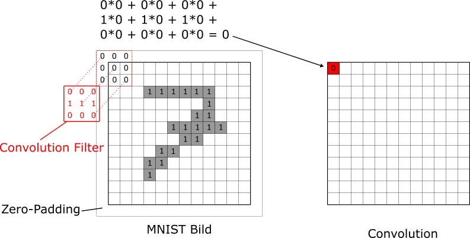
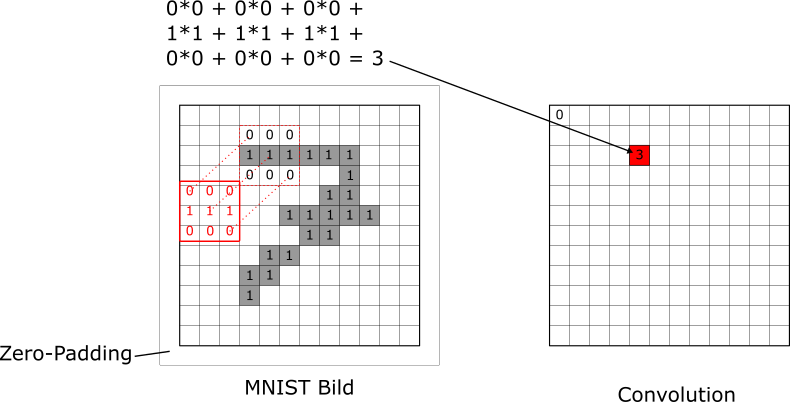
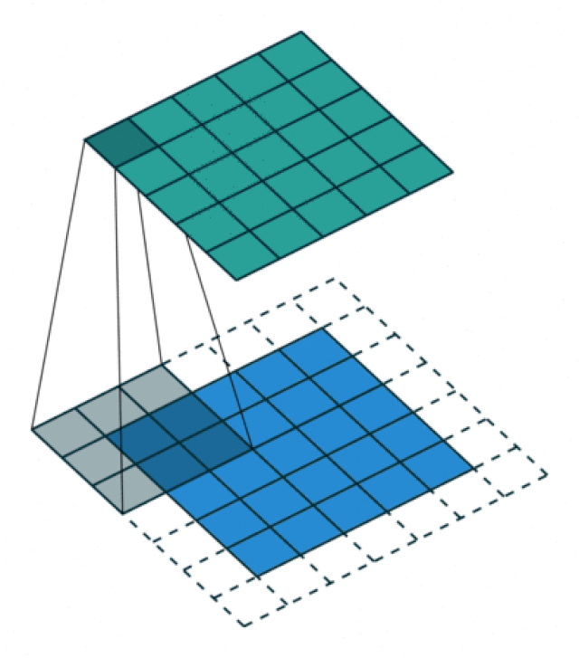
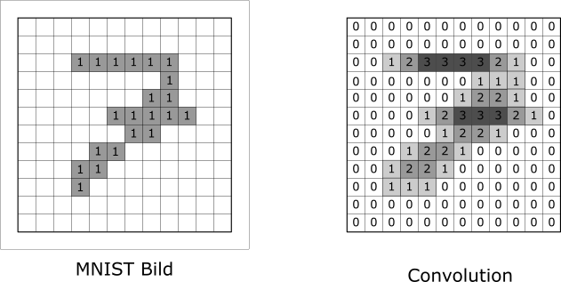
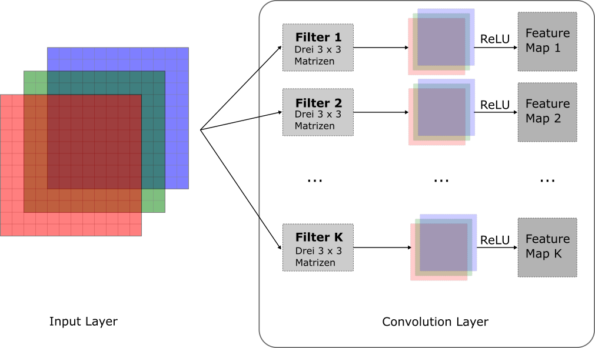
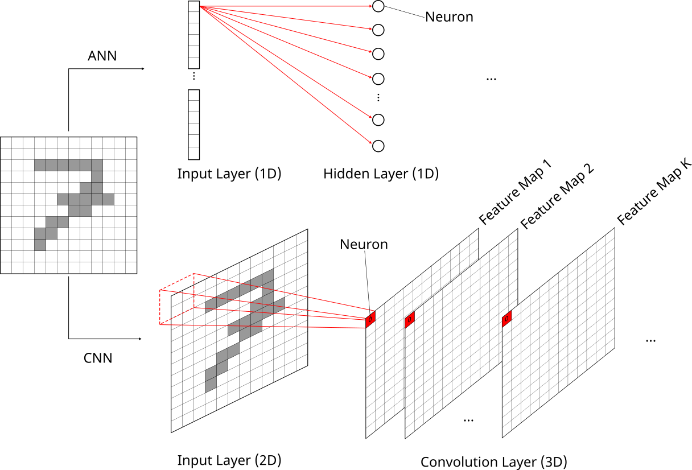
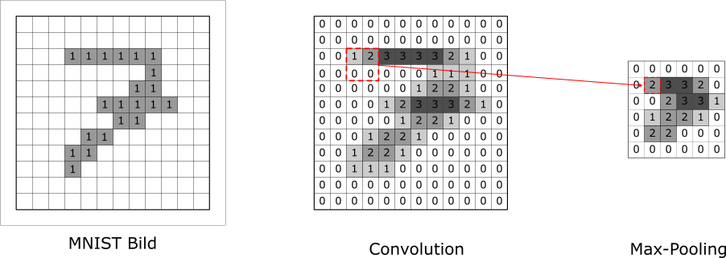
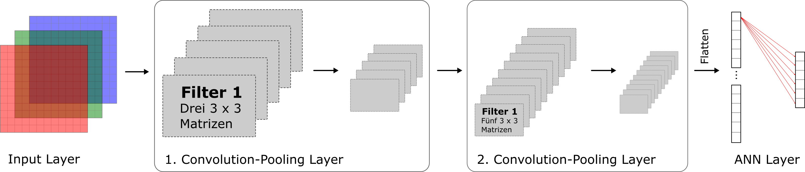
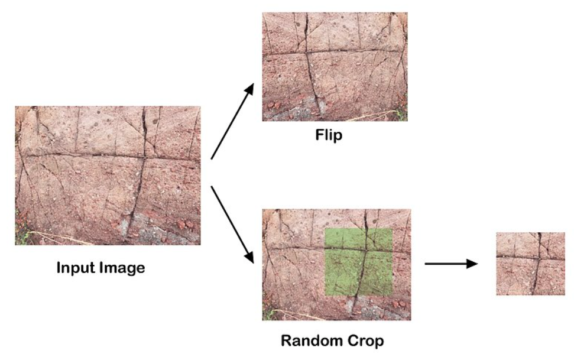

# Convolutional Neural Networks {#sec-cnn}

```{r, echo=FALSE}
library(jpeg)
# Load JPEG image
zebra <- readJPEG("images/zebra.jpg", native = FALSE)
```

Im zweiten Kapitel zum Thema Deep Learning befassen wir uns nun mit dem Thema **Computer Vision** und den dazugehörenden **Convolutional Neural Networks** (CNNs). Computer Vision heisst, wir wollen einem Computer bzw. einem Modell das "Sehen" beibringen. Das Modell soll zum Beispiel Gesichter erkennen, Bilder klassifizieren oder Objekte auf Bildern oder in Videos lokalisieren. Die ersten richtig grossen Durchbrüche von Deep Learning fanden ab 2010 im Bereich Computer Vision statt.

## Modellspezifikation

Ganz grob funktionieren CNNs so, dass sie in den ersten paar Layers nach dem Input Layer **kleine Muster** (sogenannte *low-level features*) identifizieren, z.B. horizontale oder vertikale Segmente, Halbkreise, Kreise, etc. In späteren Layers werden diese kleinen Muster zu grösseren, komplexeren Muster (sogenannte *high-level features*) kombiniert. Auch hier findet also ein autonomer (und automatischer) Feature Engineering Prozess statt. Am Schluss macht das CNN seine Vorhersagen basierend auf den abstrakten Muster und Formen, die es im Bild erkannt hat.

Vielleicht wundern Sie sich, warum wir dazu nicht die ANN Modelle aus @sec-ann verwenden. Das Problem ist, dass ANNs, wie wir sie kennen gelernt haben, nur für ganz kleine Bilder (die MNIST Bilder hatten eine ganz kleine Auflösung von $28 \times 28$ Pixels) funktionieren. Für Bilder mit einer höheren Auflösung hätte unser ANN schnell mal viel zu viele Parameter und wäre **nicht mehr trainierbar**.

#### Frage {.unnumbered}

Wie viele Parameter (ohne Bias Terms) hätte ein ANN zwischen Input Layer und Hidden Layer, wenn die Bilder eine Auflösung von $200 \times 200$ Pixels haben und wir 100 Neurons im Hidden Layer haben?

* 100
* 4 Mio.
* 40'000
* 400'000

::: {.callout-tip collapse="true"}
## Lösung

Dieses ANN hätte 40'000 Input Neurons (so viele wie das Bild Pixels hat) und dementsprechend $100 \cdot 40'000 = 4 \text{Mio.}$ Parameter.
:::

Um dieses Problem zu beheben, wurden CNNs entwickelt. Wie CNNs funktionieren und was für Arten von Layers sie enthalten, werden wir uns in diesem ersten Abschnitt zu CNNs anschauen.

### Farbbilder

Wir werden hier nun mit **farbigen Bildern** arbeiten. Im Fall von *Grayscale* Bildern (wie bei MNIST) konnte jedes Bild durch einen 2D-Array (= Matrix) dargestellt werden. Für farbige Bilder brauchen wir drei Dimensionen, denn jedes Pixel in einem Bild wird definiert durch den Anteil von Rot, Blau und Grün (RBG). Wir können uns ein farbiges Bild als drei Matrizen, welche übereinandergelegt werden, vorstellen:

{width=50% #fig-colimg}

Im folgenden Code Block können Sie beispielsweise die Dimensionen eines Farbbilds eines Zebras (Quelle: Joachim Huber, via Wikimedia Commons, CC BY-SA 2.0) anschauen. Das Bild wurde im Hintergrund bereits geladen und kann hier als `zebra` aufgerufen werden:

```{r}
# Dimensionen des Bilds
dim(zebra)
```

Das Bild ist also 1277 Pixel hoch, 1920 Pixel brei und die dritte Dimension beschreibt die drei Farbchannels.

Wir können das Bild selbstverständlich auch direkt in R plotten:

```{r}
# Leere Plot-Hülle
plot(0:1, 0:1, type = "n", ann = FALSE, axes = FALSE)

# Bild plotten
rasterImage(zebra, 0, 0, 1, 1)
```

**Wichtig**: Anders als bei den ANNs müssen wir bei einem CNN das Bild *nicht* in einen langen Input-Datenvektor umformen (bzw. *flatten*). Wir werden das Bild also in der oben schematisch dargestellten 3D Struktur in das CNN einspeisen können. Warum das so ist, werden wir weiter unten sehen.

### Convolution Layers

Um genau zu verstehen, was in einem **Convolution Layer** passiert, werden wir uns hier der Einfachheit halber wieder ein MNIST Beispiel anschauen. Im MNIST haben wir *Grayscale* Bilder und darum kann das Bild durch eine Matrix dargestellt werden und wir müssen uns vorerst nicht mit den Farbchannels herumschlagen. Die meisten CNNs sind aber für Farbbilder (mit drei Farbchannels) konzipiert.

#### Convolution anhand von MNIST

In einem Convolution Layer **schieben** wir mehrere sogenannte **Convolution Filters** über ein Bild. Diese Filter haben das Ziel kleine Muster und Formen im Bild zu erkennen. Doch wie sieht so ein Filter aus? Ein Convolution Filter kann durch eine kleine Matrix dargestellt werden. Häufig werden $3 \times 3$ Filter (also $3 \times 3$ Matrizen) verwendet. Im Beispiel weiter unten werden wir folgenden einfachen Filter verwenden:

$$
\begin{bmatrix}
0 & 0 & 0\\
1 & 1 & 1\\
0 & 0 & 0
\end{bmatrix}
$$
Wir werden sehen, dass sich dieser Convolution Filter eignet, um **horizontale Segmente** im Bild zu erkennen. Überlegen Sie sich kurz anhand der Elemente in der Matrix, warum dieser Filter dafür geeignet sein könnte.

In der folgenden Abbildung schauen wir uns wie in @sec-ann das Bild der handgeschriebenen "7" an. Der Prozess der Convolution beginnt beim Pixel links oben. Wir legen den Filter über das Bild, so dass die **Mitte des Filters** genau auf dem Pixel links oben liegt. Dann multiplizieren wir die Werte des Filters mit den darunter liegenden Pixelwerten und summieren die Werte aller Multiplikationen auf. Der resultierende Wert ist dann der Pixelwert links oben im Output (rechter Teil der Abbildung mit dem Untertitel *Convolution*). Damit das auch bei allen Pixels am Rand des Bilds funktioniert, umrahmen wir das Bild mit Nullen. Dieser Schritt wird in der Praxis **Zero-Padding** genannt. Wir sehen in untenstehender Abbildung, dass die Convolution für das Pixel links oben zu einem Wert von 0 führt:

{width=80% #fig-conv1}

Nun schieben wir den Convolution Filter über das Bild bis wir die Convolution für jedes Pixel berechnet haben. In der nächsten Abbildung schauen wir uns (als weiteres Beispiel) die Convolution für das Pixel in der dritten Zeile und fünften Spalte an. Hier ist der Output der Convolution nun 3:

{width=80% #fig-conv2}

Eine animierte Version des Convolution Prozesses sieht wie folgt aus:

{width=50% #fig-convgif}

Sobald wir den Filter über das ganze Bild geschoben haben und für jedes Pixel die Convolution berechnet haben, kriegen wir den vollständigen **Output dieses Filters** (rechts):

{width=80% #fig-conv3}

Sie sehen, dass im Output (rechts) die horizontalen Segmente hervorgehoben sind, weil sie höhere Convolution Resultate erzielten (max. den Wert 3). Der Filter hat also tatsächlich dieses Muster erkennen können. Allgemein gilt: der Filter gibt dann grosse Werte zurück, wenn das Muster in der jeweiligen $3 \times 3$ Submatrix des Bilds dem Filter ähnlich ist. Wir haben hier den Filter jeweils um ein Pixel nach rechts (oder unten) verschoben. In diesem Fall spricht man von einem **Stride** von 1. Mit einem Stride von 2 würden wir den Filter jeweils um 2 Pixel verschieben. Der Output (die Convolution) wäre dann nur halb so gross wie das Bild (hier also $6 \times 6$ Pixel).

::: {.callout-note}
## Schlüsselschritt

Und nun der Schlüsselschritt im Verständnis: im obigen Beispiel waren die Werte des Filters (bzw. der Matrix) gegeben. In einem CNN werden die **Werte des Filters jedoch automatisch via Backpropagation gelernt**. Das CNN lernt also automatisch, auf welche Muster die Filter in den Convolution Layers achten sollen bzw. welche Muster besonders wertvoll sind, um gute Vorhersagen zu machen. Aus meiner Sicht ist das die Magie von CNNs.
:::

#### Convolution für Farbbilder

Im Fall von Farbbildern ist das ganze etwas komplexer. In dem Fall hat jeder Convolution Filter **drei (Filter-)Matrizen** (mit potentiell anderen Gewichten), eine pro Farbchannel. Die Convolution findet dann für jeden Channel separat statt und am Schluss werden die drei resultierenden Convolutions wieder **übereinandergelegt** und **pixelweise summiert**, so dass jeder Convolution Filter lediglich einen zweidimensionalen Output ausgibt. Ganz am Schluss eines Convolution Layers wird auf jedem Pixel des zweidimensionalen Outputs noch die **Aktivierungsfunktion ReLU** angewendet.

Wie bereits erwähnt, hat ein Convolution Layer typischerweise **mehrere Filter**, die alle unterschiedliche Muster erkennen können. Ganz allgemein sagen wir, dass ein Convolution Layer $K$ Filter hat. Der finale Output jedes Filteres wird dann **Feature Map** genannt. Das heisst, ein Convolution Layer mit $K$ Filtern führt zu $K$ Feature Maps. Dieser Vorgang ist in folgender Abbildung dargestellt:

{width=90% #fig-convlayer}

Überlegen wir uns kurz, wie viele Parameter (Gewichte) dieser Convolution Layer hat. Jeder der $K$ Filter hat *drei* $3 \times 3$ Matrizen, d.h. jeder Filter hat insgesamt 27 Parameter^[$3^3 = 27$], plus einen Bias Term pro Filter. Daraus folgt, dass ein Convolution Layer in unserem Beispiel insgesamt $(27 + 1) \cdot K$ Parameter hat. Das sind in der Regel wesentlich weniger Parameter als wenn wir ein reguläres ANN verwenden würden, um das Problem zu lösen.

#### ANN vs. CNN

Um uns den Unterschied zwischen klassischen ANN und CNN noch klarer zu vergegenwärtigen, gehen wir kurz zum vereinfachten MNIST Beispiel zurück. Folgende Abbildung zeigt, was in einem ANN und einem CNN mit dem $12 \times 12$ Bild einer handgeschriebenen "7" passiert:

{width=90% #fig-anncnn}

Für das ANN (oberer Teil der Abbildung) werden die Pixel in einen 1D Input Layer *geflatted*. Der zentrale Punkt ist, dass danach **jedes Pixel** aus dem Input Layer mit **jedem Neuron** im Hidden Layer durch ein Gewicht verbunden ist. Für grosse Bilder (z.B. $1000 \times 1000$ Pixel) ist diese Architektur nicht mehr rechenbar.

Dieses Problem wird durch CNNs gelöst (unterer Teil der Abbildung). Das Bild wird im Originalformat (im Fall eines Grayscale Bilds ist das 2D) im Input Layer dargestellt. Jeder **Feature Map** im Convolution Layer ist dann ebenfalls zweidimensional, alle Feature Maps zusammen sind dann aber ein 3D Konstrukt (gestapelte Matrizen). Jedes Pixel in einem Feature Map ist in einem gewissen Sinn ein Neuron. Der zentrale Punkt hier ist, dass jedes Pixel (Neuron) in einem Feature Map **nur mit 9 Pixels** im Input Layer verbunden ist und darum die **Konnektivität** im Netzwerk sehr **lokal** ist. Ausserdem verwendet jedes Pixel (Neuron) in einem Feature Map denselben Filter und darum die selben Parameter. Dies wird oft als **Weight Sharing** bezeichnet. Die lokale Konnektivität und das Weight Sharing begrenzen die Anzahl Gewichte im Vergleich zu einem klassischen ANN massiv.

### Pooling Layers

Nach einem Convolutional Layer kommt in einem CNN oft ein sogenannter **Pooling Layer**. Die Funktionsweise dieser Art von Layer ist glücklicherweise viel einfacher als diejenige des Convolution Layers.

In den allermeisten Fällen wird heutzutage ein sogenanntes **Max-Pooling** angewendet. Dabei wird ganz einfach ein $2 \times 2$ Quadrat über die Outputs eines Convolution Filters (also die Feature Maps) geschoben. Für jeden nicht-überlappenden $2 \times 2$ Pixelblock wird der maximale Pixelwert in den Pooling Layer übernommen. Am besten schaut wir uns dazu das Beispiel in unten stehender Abbildung an:

{width=90% #fig-pooling}

Ganz wichtig: Indem wir Max-Pooling mit einem $2 \times 2$ Quadrat betreiben, **reduzieren** wir jeden Feature Map **in beide Richtungen** um den **Faktor 2**. Der Pooling Layer reduziert also jeden Feature Map von $12 \times 12$ zu $6 \times 6$.

Die Alternative zu Max-Pooling wäre **Mean-Pooling**, wo für jeden $2 \times 2$ Pixelblock der Mittelwert über die vier Pixel gerechnet und in den Pooling Layer übernommen wird.

Ein Pooling Layer erfüllt viele verschiedene Zwecke:

* Er reduziert die **Anzahl Berechnungen** sowie die **Auslastung des Arbeitsspeichers** (RAM). In obigem Beispiel haben wir gesehen, dass sich die Pixels bzw. Neurons in einem Feature Map um den Faktor 4 von 144 auf 36 verringern.
* Er soll (durch *Downsampling*) das **Overfitting** bekämpfen.
* Er führt zu einer sogenannten **Location Invariance**, d.h., ob zum Beispiel eine horizontale Linie in der zweiten, dritten oder vierten Zeile von Pixels liegt, soll keine Rolle spielen und dementsprechend soll ein möglichst ähnliches Signal an den nächsten Layer weiter gegeben werden.

### Architektur

Wie eine **vereinfachte Architektur** eines CNNs aussieht, zeigt folgende Abbildung, die inspiriert ist durch [@Geron, Kapitel 14]:

{width=95% #fig-archit}

Ihr seht in obiger Abbildung, dass ein CNN typischerweise mehrere Abfolgen von Convolution und Pooling Layers enthält. Wir sehen im ersten Convolution Layer **5 Feature Maps**, d.h. wir haben hier $K=5$ Filter angewendet und jeder Filter bestand aus drei kleinen Matrizen (z.B. $3\times 3$). Danach folgt bereits ein erster Pooling Layer, der die 5 Feature Maps kleiner macht. Danach kommt ein zweiter Convolution Layer, der zu **10 Feature Maps** führt, d.h. wir haben hier $K=10$ Filter angewendet. **Ganz wichtig**: jeder der 10 Filter besteht in diesem Schritt aus **5** kleinen Matrizen (z.B. $3\times 3$). Warum? Weil jeder Filter 5 Feature Maps aus dem vorherigen Layer verarbeiten muss. Danach folgt ein zweiter Pooling Layer, der die 10 Feature Maps verkleinert.

Wir können beobachten, dass die Feature Maps durch das Pooling stets etwas kleiner werden. Dafür erhöhen wir grundsätzlich die *Anzahl* Feature Maps von Layer zu Layer, indem wir in jedem Convolution Layer die Anzahl Filter $K$ erhöhen. In unserem Beispiel haben wir $K$ vom ersten zum zweiten Convolution Layer von 5 auf 10 erhöht.

Nach diesen zwei Convolution-Pooling Sequenzen wird der letzte Pooling Output *geflatted* und es folgen noch einer oder mehrere **dense (fully connected) Layers** wie wir sie aus einer klassischen ANN Architektur kennen. In obiger Abbildung führt der Output des letzten Pooling Layers der Einfachheit halber direkt in den Output Layer. Hierbei ist jeder Pooling Output mittels eines Gewichts mit einem Output Neuron verbunden (*fully connected*).

Der Output Layer hat meist eine **Softmax** Aktivierung, zumindest in Bildklassifikationsproblemen, wo wir versuchen ein Bild in eine von z.B. 6 Kategorien zu klassifizieren (z.B. Vogel, Haus, Baum, Person, etc.).

Die Architektur eines CNNs sowie die Ausgestaltung der einzelnen Layers ist enorm flexibel und es gibt **unzählige Hyperparameter**. Eine Auswahl:

* Anzahl Convolution Layers
* Anzahl Pooling Layers
* Stride
* Dimensionen der Convolution Filter
* Zero-Padding: ja oder nein
* Max- oder Mean-Pooling

## Data Augmentation

Eine praxisrelevante Technik, die CNNs massiv verbessert hat, ist **Data Augmentation**. Bei dieser Technik werden die Bilder, welche als Input-Daten dienen, während des Trainings leicht verändert. Zum Beispiel kann ein gegebenes Bild leicht verschoben oder rotiert werden, es kann ein Ausschnitt (*Crop*) daraus gewählt werden oder die Lichtbedingungen können verändert werden. 

Ein Beispiel sehen Sie in folgender Abbildung:

{width=70% #fig-dataaugment}

Data Augmentation wirkt wie **Regularisierung** und kann das Overfitting von CNNs wesentlich eindämmen. Ein weiterer toller Aspekt von Data Augmentation ist, dass die Veränderungen der Bilder **on the fly** während des Modelltrainings gemacht werden können und die veränderten Bilder nicht abgespeichert werden müssen. Mit Keras und TensorFlow können wir direkt nach dem Input Layer spezielle Layers ins Modell aufnehmen, die solche Data Augmentation Schritte für uns durchführen. Details dazu finden Sie [hier](https://tensorflow.rstudio.com/examples/image_classification_from_scratch.html#using-image-data-augmentation).


## Beispiel: ResNet

Wir schauen uns hier die Architektur des Modells **ResNet34** an, das im Jahr 2015 von Microsoft Mitarbeitenden vorgeschlagen wurde ([He et al., 2015](https://arxiv.org/abs/1512.03385)). Eine Variante dieses Modells hat 2015 die sogenannte ImageNet Challenge gewonnen (dazu später mehr).

Der Name ResNet34 ist dadurch begründet, dass **Skip Connections** verwendet werden und dadurch **Residuen (Res)** gelernt werden (ähnlich wie beim Gradient Boosting). Was Skip Connections genau sind, sehen wir etwas weiter unten. Ausserdem hat das Modell **34 Layers**, wobei die Pooling Layers nicht mitgezählt werden.

Die Architektur des ResNet34 sieht wie folgt aus:

.](images/resnet34.png){width=100% #fig-resnet34}

Schauen wir uns die einzelnen Komponenten schrittweise (von links nach rechts) an:

* Als Input erwartet das Modell Farbbilder mit einer Auflösung von $224\times 224$ Pixels (mit 3 Farbchannels).
* Im ersten Convolution Layer (orange) werden $K=64$ Filter der Grösse $7\times 7$ verwendet. Weil wir einen **Stride von 2** (in der Abbildung gekennzeichnet durch "S2") verwenden (die Filter also immer um 2 und nicht nur um 1 Pixel verschoben werden), reduzieren wir die Input Bilder um die Hälfte. Die 64 resultierenden Feature Maps haben also je eine Grösse von $112\times 112$ Pixels.
* Danach folgt ein Max. Pooling Layer, ebenfalls mit einem Stride von 2, so dass die Dimensionen der 64 Feature Maps nochmal halbiert werden auf $56\times 56$ Pixels.
* Nun folgen **6 Convolution Layers** (rot). Jeder Layer hat $K=64$ Filter der Grösse $3\times 3$ und einem Stride von 1, was bedeutet, dass die Dimensionen der resultierenden Feature Maps im Moment nicht halbiert werden. Der zentrale Aspekt dieser Architektur sind die Pfeile oberhalb der Layers. Sie stellen die **Skip Connections** dar. Der erste solche Pfeil bedeutet, dass der Output aus dem Pooling Layer nicht nur in den ersten roten Convolution Layer einfliesst, sondern auch direkt in den dritten roten Layer. Der Output des Pooling Layers kann also auch gewisse Layer überspringen (*skippen*). Solche Skip Connections haben viele Vorteile. Zum Beispiel "fliessen" die wesentlichen Informationen so schneller durch das Modell und das Training des Modells wird kürzer. Was in der Abbildung nicht dargestellt ist: in jedem Convolution Layer wird nach der Convolution, eine **Batch Normalization** (d.h. Standardizierung der Outputs) betrieben bevor die Outputs noch durch die **ReLU** Aktivierungsfunktion fliessen.
* Es folgen **8 weitere Convolution Layers** (grün), in denen jeweils $K=128$ Filter der Grösse $3\times 3$ verwendet werden. Um die Architektur ausgeglichen zu halten, wird im ersten grünen Convolution Layer ein Stride von 2 verwendet, wodurch sich die Dimensionen der Feature Maps auf $28\times 28$ Pixels reduzieren. Das stellt jedoch ein Problem für die Skip Connection dar. Der Output aus dem letzten roten Convolution Layer enthält 64 Feature Maps der Grösse $56\times 56$ und soll nun nach den ersten beiden grünen Convolution Layers hinzu addiert werden. Der dazugehörige **gestrichelte** Pfeil stellt dar, dass bei dieser Skip Connection der Output aus dem letzten roten Layer angepasst wird, so dass er ebenfalls 128 Feature Maps der Grösse $28\times 28$ entspricht.
* Nun folgen **12 weitere Convolution Layers** (blau), in denen jeweils $K=256$ Filter der Grösse $3\times 3$ verwendet werden. Auch hier haben die Filter des ersten Layers der blauen Gruppe einen Stride von 2, wodurch die Dimensionen der Feature Maps auf $14\times 14$ reduziert werden. Dadurch muss auch hier die erste Skip Connection entsprechend angepasst werden.
* Danach folgt die letzte Gruppe von **6 Convolution Layers** (pink), in denen jeweils $K=512$ Filter der Grösse $3\times 3$ verwendet werden. Durch den Stride von 2 im ersten Layer der Gruppe reduziert sich die Grösse der Feature Maps auf nur noch $7\times 7$.
* Nun kommt ein **Global Average Pooling** Layer, der für jeden der resultierenden 512 Feature Maps des letzten Convolution Layers den Mittelwert über die $7\times 7 = 49$ Pixels rechnet.
* Die resultierenden 512 Mittelwerte sind **fully connected** mit den 1000 Output Neurons. Letztere sind nötig, weil die ImageNet Challenge 1000 mögliche Kategorien hat. Die 1000 Outputs der Output Neurons werden mittels **Softmax** in Wahrscheinlichkeiten umgerechnet.

Wow, ziemlich komplex das Ganze, aber die einzelnen Komponenten sind eigentlich erstaunlich simpel.


## Verwendung von CNNs

Es gibt viele verschiedene Möglichkeiten, wie Sie aus praktischer Sicht CNNs verwenden können. Die verschiedenen Möglichkeiten unterscheiden sich im Grad der technischen Komplexität und hängen davon ab, ob eine bestehende (sog. *off-the-shelf*) Lösung Ihr konkretes Problem bereits vollumfänglich abbildet. Konkret gibt es folgende Möglichkeiten^[Siehe auch [@Geron, Kapitel 14] für detailliertere Ausführungen zu diesem Thema.]:

1. Sie verwenden ein Modell über **API-Services**, welche oft von grossen Unternehmen wie Amazon oder Google angeboten werden. Das ist sehr einfach, hat jedoch den Nachteil, dass Sie wenig Flexibilität haben und das Modell (oft) nicht verändern können. Ausserdem sind solche Dienstleistungen in den meisten Fällen kostenpflichtig.
2. Wie weiter unten demonstriert, können Sie **bestehende (trainierte) Modelle** auch direkt mit Keras herunterladen und verwenden. Dabei haben Sie vollen Einblick in das Modell und allzu schwierig ist es dank Keras auch nicht. Für mobile Applikationen enthält Keras sogar sogenannte *Lightweight Models* ([MobileNet](https://tensorflow.rstudio.com/reference/keras/application_mobilenet_v2.html)).
3. Wenn es für das Problem, das Sie lösen wollen, keine vorgefertigte Lösung gibt (zum Beispiel wenn Sie andere Kategorien als die ImageNet Kategorien vorhersagen wollen), dann können Sie ein bestehendes (CNN) Modell nehmen und nur die letzten paar Layers trainieren. Dieser Prozess wird **Transfer Learning** genannt und ist enorm hilfreich. Die Convolution Layers von grossen Modellen, die von Google, Microsoft, etc. trainiert wurden, eignen sich oft auch für andere Probleme. Eine Anleitung für das Transfer Learning finden Sie [hier](https://tensorflow.rstudio.com/guides/keras/transfer_learning.html).
4. *Last but not least* können Sie natürlich auch ein **eigenes Modell von Grund auf trainieren**. Doch dazu brauchen Sie erst einmal einen sehr grossen und vor allem **gelabelten** Datensatz. Für das Labelling greifen die Entwicklerinnen und Entwickler von DL Modellen oft auf Crowdsourcing Plattformen zurück.^[Seit der Einführungen von grossen Sprachmodellen gibt es eigens dafür grosse Unternehmen, welche die aufwendige Arbeite des manuellen Annotierens von Daten in Billiglohnländer auslagern.] Wie das Trainieren eines eigenen CNNs funktioniert, ist [hier](https://tensorflow.rstudio.com/examples/cifar10_cnn) oder in [@Geron, Kapitel 14] (für Python) beschrieben. Für realistische Modelle empfehle ich Ihnen, eine Cloud Lösung zu verwenden, denn unsere Rechner haben grundsätzlich zu wenig Processing Power und vor allem auch zu wenig Arbeitsspeicher (RAM), ausser Sie haben eine (oder mehrere) **Graphics Processing Unit** (GPU) und ganz viel RAM. Wie Sie lokal mit `R` eine GPU einbinden, ist [hier](https://tensorflow.rstudio.com/install/local_gpu) beschrieben.

### Anwenden eines bestehenden CNNs (Option 2)

Wir schauen uns hier ein bestehendes CNN an, das mit den Daten aus der [ImageNet Challenge](https://www.image-net.org/index.php) trainiert wurde. Der entsprechende Datensatz enthält über 14 Millionen Bilder, welche alle **gelabelt** sind. Jedes Bild ist in eine von 1000 Kategorien klassifiziert worden. Die möglichen Kategorien finden Sie [hier](https://gist.github.com/yrevar/942d3a0ac09ec9e5eb3a). Die Performance wird mit der **Top-5 Error Rate** gemessen, d.h. eine Vorhersage entspricht nur dann einem Fehler, wenn das wahre Label nicht unter den Top-5 Vorhersagen des Modells ist. Das aktuell beste Modell hat eine Top-5 Error Rate von etwas mehr als 2%.

Wir werden hier das **ResNet50** Modell verwenden. Eine Variante davon hat die 2015 ImageNet Challenge gewonnen mit einer Top-5 Error Rate von weniger als 3.6% [@Geron, S. 505]. Wir haben uns im vorherigen Kapitel bereits die Architektur des etwas kleineren Modells **ResNet34** angeschaut. Die Architektur von ResNet50 ist sehr ähnlich, hat aber nochmal mehr Layers (ist also *deeper*).

Als erstes laden wir das trainierte Modell mit Keras. Dazu verwenden wir die Funktion `application_resnet50()`. Wir kriegen das Modell mit den optimalen Gewichten, indem wir das Argument `weights = "imagenet"` setzen. Mit der `summary()` Funktion können wir uns die Architektur des Modells anschauen:

```{r eval = FALSE}
# Packages laden
library(tidyverse)
library(tensorflow)
library(keras3)

# Als erstes laden wir das resnet50 Model und zwar mit den optimalen Gewichten.
model <- application_resnet50(weights = "imagenet")

# Schauen wir uns die Architektur dieses Modells mal an.
summary(model)
```

```
Model: "resnet50"
__________________________________________________________________________________________________
Layer (type)                           Output Shape               Param #        Connected to                            
==================================================================================================
input_1 (InputLayer)                   [(None, 224, 224, 3)]      0                                                      
__________________________________________________________________________________________________
conv1_pad (ZeroPadding2D)              (None, 230, 230, 3)        0              input_1[0][0]                           
__________________________________________________________________________________________________
conv1_conv (Conv2D)                    (None, 112, 112, 64)       9472           conv1_pad[0][0]                         
__________________________________________________________________________________________________
conv1_bn (BatchNormalization)          (None, 112, 112, 64)       256            conv1_conv[0][0]                        
__________________________________________________________________________________________________
conv1_relu (Activation)                (None, 112, 112, 64)       0              conv1_bn[0][0]                          
__________________________________________________________________________________________________
pool1_pad (ZeroPadding2D)              (None, 114, 114, 64)       0              conv1_relu[0][0]                        
__________________________________________________________________________________________________
pool1_pool (MaxPooling2D)              (None, 56, 56, 64)         0              pool1_pad[0][0]                         
__________________________________________________________________________________________________

...

_______________________________________________________________________________________________________
avg_pool (GlobalAveragePooling2D)      (None, 2048)               0              conv5_block3_out[0][0]                  
_______________________________________________________________________________________________________
probs (Dense)                          (None, 1000)               2049000        avg_pool[0][0]                          
=======================================================================================================
Total params: 25,636,712
Trainable params: 25,583,592
Non-trainable params: 53,120
_______________________________________________________________________________________________________
```
Die Architektur des Modells ist riesig, weshalb ich sie hier verkürzt dargestellt habe. Sie sehen beim **Input Layer**, dass das Modell Farbbilder (3 Channels) mit einer Auflösung von **224 x 224 Pixels** erwartet. Nach dem Input Layer kommt der **erste Convolutional Layer** (= oranger Layer in ResNet34 Architektur). In Keras bzw. TensorFlow werden die **einzelnen Elemente** eines Convolution Layers separat dargestellt. Der erste Layer setzt sich zusammen aus:

* `conv1_pad (ZeroPadding2D)`: In einem ersten Schritt wird das Zero Padding gemacht und da brauchen wir selbstverständlich keine Gewichte dazu. 
* `conv1_conv (Conv2D)`: Dann kommen 64 ($7 \times 7$) Convolution Filters. Überlegen wir uns doch kurz, wie wir auf die insgesamt 9472 Gewichte kommen. Wir haben 64 Filter, wovon jeder drei $7 \times 7$ Matrizen enthält. Warum drei? Weil wir pro Farbchannel eine separate $7 \times 7$ Matrix haben. Das gibt uns bereits $64 \cdot 3 \cdot 7 \cdot 7 = 9408$ Gewichte. Dazu kommen noch 64 Bias Terms, was uns dann insgesamt $9408 + 64 = 9472$ Gewichte gibt.
* `conv1_bn (BatchNormalization)`: Danach kommt eine sogenannte **Batch Normalization**, was vereinfacht nichts anderes als eine Standardisierung der Outputs der Convolution Filters ist.
* `conv1_relu (Activation) `: ReLU Aktivierung der standardisierten Outputs in den 64 Feature Maps.

Danach folgt der **Max. Pooling Layer**, welcher in Keras bzw. TensorFlow ebenfalls in zwei Unterschritte aufgeteilt wird: `pool1_pad (ZeroPadding2D)` und `pool1_pool (MaxPooling2D)`. Oben nicht abgebildet sind die diversen Gruppen von Convolution Layers, welche nun folgen würden.

Der Output Layer ist **dense** und enthält 1000 Neurons, da wir die Wahrscheinlichkeiten für 1000 Kategorien rechnen wollen. Der zweitletzte **Global Average Pooling Layer** hat 2048 Neurons (in ResNet34 hatten wir hier nur 512 Neurons), wodurch der Output Layer insgesamt $(2048 + 1) \cdot 1000 = 2'049'000$ Gewichte hat. Ganz unten im Output ist ersichtlich, dass das Modell insgesamt über 25 Millionen Parameter hat, wovon die meisten trainiert werden müssten. Hier haben wir aber die bereits trainierten (optimalen) Gewichte importieren können.

Nun extrahieren wir die Gewichte aus dem Modell und schauen uns den **ersten Filter** im **ersten Convolutional Layer** an. Anhand des Indexings, `[ , , , 1]`, seht ihr, dass die Gewichte in einem 4-dimensionalen Array gespeichert sind. Die ersten beiden Dimensionen bezeichnen die Dimensionen der Filtermatrizen (also $7 \times 7$). Die dritte Dimension bezeichnet die Anzahl Feature Maps, welche der Convolutional Layer aus dem vorherigen Layer erwartet. In unserem Fall sind das 3, da wir im ersten Convolutional Layer die drei Farbchannels aus dem Input Layer erhalten. Die vierte Dimension bezeichnet die Anzahl Filter des vorliegenden Convolutional Layers. Mit der `1` spezifizieren wir, dass wir nur den ersten Filter anschauen wollen.

```{r eval = FALSE}
# Wir können auch die Gewichte extrahieren.
optimal_weights <- model |>  get_weights()

# Erster Convolution Filter im ersten Conv. Layer
optimal_weights[[1]][ , , , 1]
```

```
, , 1

             [,1]        [,2]         [,3]         [,4]        [,5]        [,6]        [,7]
[1,]  0.028252628  0.01818723  0.015884932  0.002420052 -0.05301533 -0.04735583  0.01854295
[2,]  0.007990093  0.02488567  0.076726004  0.090264283 -0.01891512 -0.07935619 -0.01536172
[3,] -0.027473288 -0.06575351  0.019992139  0.184763417  0.11552856 -0.08998038 -0.09464549
[4,] -0.009787651 -0.07923734 -0.129819512  0.095235661  0.27007112  0.09940726 -0.01493159
[5,]  0.023180470 -0.04645163 -0.183006614 -0.156041548  0.05361670  0.08349565  0.03695760
[6,]  0.042254806  0.04594706 -0.046616178 -0.127040774 -0.02102392  0.03322218  0.02505229
[7,]  0.014630316  0.03523030  0.004108737 -0.060385078 -0.01716923  0.01151425  0.00479147

, , 2

             [,1]        [,2]        [,3]        [,4]        [,5]         [,6]        [,7]
[1,]  0.005868278  0.01875543  0.03614214  0.01715494 -0.09355789 -0.124100089 -0.02680790
[2,] -0.007687946  0.02429662  0.14944476  0.21562344  0.01338885 -0.176872283 -0.12294715
[3,] -0.074660495 -0.15249401  0.06102424  0.41499856  0.33233449 -0.081507459 -0.21111147
[4,] -0.054444715 -0.25528842 -0.26442963  0.21033862  0.57014650  0.277241141 -0.02648117
[5,]  0.023048820 -0.17785294 -0.41178319 -0.26845443  0.18579270  0.250555605  0.09637067
[6,]  0.097701266  0.03894836 -0.19233614 -0.29224005 -0.03729927  0.099565394  0.10021943
[7,]  0.061221115  0.06344386 -0.02231540 -0.17049119 -0.08630268  0.007418274  0.02751930

, , 3

              [,1]        [,2]        [,3]         [,4]          [,5]        [,6]        [,7]
[1,] -0.0024409075  0.01904538  0.02179598 -0.003380956 -0.0769589692 -0.07131131  0.01439408
[2,]  0.0003704716  0.02912742  0.11718027  0.150795683 -0.0093867844 -0.13021459 -0.07923260
[3,] -0.0334048420 -0.08807442  0.08053155  0.324004412  0.2164803147 -0.09732457 -0.17507587
[4,] -0.0174925867 -0.15134996 -0.18083088  0.167103648  0.4065239429  0.16355224 -0.07702903
[5,]  0.0203978457 -0.10906302 -0.27673617 -0.172197968  0.1320384443  0.14969076  0.02951569
[6,]  0.0638262108  0.04572181 -0.11566665 -0.178826123  0.0007846743  0.06553538  0.06971015
[7,]  0.0186353922  0.03358492 -0.02011830 -0.127520546 -0.0607556999  0.00784576  0.02711843
```

Wie erwartet besteht der erste Filter aus **drei 7 x 7 Matrizen**.

Wir laden nun das Bild des Zebras mit der Funktion `image_load()` und lassen es durch die Funktion gleich in die korrekte Auflösung überführen. Wir erinnern uns, dass *ResNet50* Bilder mit einer Auflösung von $224 \times 224$ Pixels erwartet. Danach konvertieren wir das Bild in einen 3D-Array:

```{r eval = FALSE}
# Lade ein Bild mit 'image_load()'
# Wichtig: resnet50 erwartet eine Auflösung von 224 x 224 Pixels
img <- image_load("images/zebra.jpg", target_size = c(224, 224))

# Wir konvertieren das Bild in einen 3D-Array (letzte Dimension sind die drei Farbchannels)
x <- image_to_array(img)
```

Nun verändern wir die Dimensionalität des Bilds in einen 4-D Array. Warum wir das tun, ist im Code Kommentar unten beschrieben.

```{r eval = FALSE}
# Hier müssen wir noch eine vierte Dimension voranstellen.
# Diese Dimension bezeichnet die Batchgrösse. Da wir hier
# nur für ein Bild eine Vorhersage machen wollen, hat diese
# Dimension den Wert 1.
x <- array_reshape(x, c(1, dim(x)))
```

Die Funktion `imagenet_preprocess_input()` enthält alle notwendigen **Preprocessing** Schritte, welche das Modell erwartet.

```{r eval = FALSE}
# Und nun noch ein paar spezifischen Preprocessing Schritte,
# welche in der Funktion 'imagenet_preprocess_input()' def. sind.
x <- imagenet_preprocess_input(x)
```

Nun können wir die Vorhersage des Modells für unser Bild `x` rechnen und die Top-5 Vorhersagen ausgeben lassen.

```{r eval = FALSE}
# Nun rechnen wir die Vorhersage
preds <- model |> predict(x)

# Schöner Output:
imagenet_decode_predictions(preds, top = 5)[[1]]
```

```
  class_name class_description        score
1  n02391049             zebra 0.9954357743
2  n02130308           cheetah 0.0009791906
3  n02423022           gazelle 0.0004443732
4  n02422106        hartebeest 0.0004240675
5  n02129604             tiger 0.0004097163
```

Das Modell hat kein Problem, das Bild korrekt zu klassifizieren. Doch was passiert eigentlich in all diesen Convolution Layers? Der folgende [Blogpost](https://machinelearningmastery.com/how-to-visualize-filters-and-feature-maps-in-convolutional-neural-networks/) zeigt die Outputs der Convolution Layers für eine andere bekannte CNN Architektur, nämlich VGG16.

Im Bereich Computer Vision gibt es viele verschiedene Probleme. Das bekannteste Problem ist die hier betrachtete Klassifikation eines Objekts in einem Bild. Andere Probleme sind die **gleichzeitige Klassifikation und Lokalisation** eines Objekts in einem Bild, die Erkennung von **mehreren Objekten** in einem Bild oder die **Klassifikation jedes Pixels** in einem Bild. All diese Varianten des Standard Computer Vision Problems sind in [@Geron, Kapitel 14] im Detail beschrieben.
